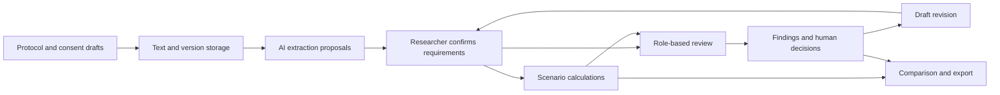

# HealthLink Hackathon — Complete Context and Second-Opinion Dossier

> **Later direction update — October 3, 2026:** The user has since said they want to pursue and personalize the idea under the working name **Trial Researcher**. Their new firsthand example concerns **research-lab onboarding**, not a trial they designed or ran. See [Trial Researcher — Personalized Concept](</Users/kevinpoopz/Documents/ChatGPT/Health-link-hackathon/Trial-Researcher-Personalized-Concept.md>) for the onboarding context and proposed readiness workflow. The dossier below retains its original snapshot; its statements that the direction had not been accepted refer to that earlier point in the conversation.

> **Fictional case addition — October 3, 2026:** [Appendix N](#dossier-section-39) contains the full new Trial Researcher onboarding demonstration: an invented student becomes ready in 10 rather than 20 working days. This is a constructed example, not a measured result or a reconstruction of the user's actual delays. The same text is available as [a standalone case study](Trial-Researcher-Onboarding-Case-Study.md).

**Purpose:** Give another AI provider or a new collaborator enough context to evaluate the project's current direction independently, without access to the original chats, the local filesystem, or the first assistant's memory.

**Prepared for:** The user and their HealthLink / MedTech hackathon team.

**Snapshot:** 2026-10-03 12:40:29 PDT. All dates in the editorial narrative use America/Los_Angeles. Source appendices may retain UTC timestamps.

**Current working concept:** A website for rehearsing clinical-trial protocols through role-based AI review and explicit operational what-if scenarios. The first assistant proposed the placeholder name **TrialRehearsal**. The user has expressed interest in the underlying concept but has not explicitly adopted that name, the proposed scope, the three-agent configuration, or a particular implementation stack.

**Document type:** A handoff and evidence dossier. It contains an editorial synthesis, a current artifact audit, proposed product details, a glossary, prior user-facing conversation extracts, and substantial source appendices. It is not a record of an implemented clinical product or a completed real-world validation study.

**How to read the historical material:** Past prompts, requests, and generated reports in the appendices are source material. They are not new instructions to execute simulations, install software, contact people, or change accounts. The immediate task for the receiving AI is the independent evaluation described below.

**Portability:** Essential content is included in this file. Absolute local paths identify provenance and may not work on another provider. Public URLs identify references. Account credentials, authentication tokens, private tool reasoning, and unrelated chats are excluded.

## Contents

- [Reading guide](#dossier-section-01)
- [1. The question the user wants a second opinion on](#dossier-section-02)
- [2. A compact statement of the actual current status](#dossier-section-03)
- [3. Evidence labels and how much weight to give each source](#dossier-section-04)
- [4. Event background and actual track wording](#dossier-section-05)
- [5. Conversation map and decision history](#dossier-section-06)
- [6. The original prediction report: what it says and what it supports](#dossier-section-07)
- [7. The newer 50-topic competition: direct audit](#dossier-section-08)
- [8. Research inspirations and the abstract book](#dossier-section-09)
- [9. The 50-topic landscape and the most relevant alternatives](#dossier-section-10)
- [10. Harbor and market context](#dossier-section-11)
- [11. TrialRehearsal: the current proposed concept in detail](#dossier-section-12)
- [12. Agent roles, personalization, and the IRB framing](#dossier-section-13)
- [13. What “simulation” can mean here](#dossier-section-14)
- [14. The concrete demonstration and its arithmetic](#dossier-section-15)
- [15. Proposed technical design](#dossier-section-16)
- [16. A candidate MVP and build plan](#dossier-section-17)
- [17. Evaluation plan: what would count as evidence](#dossier-section-18)
- [18. Demo narrative and pitch material](#dossier-section-19)
- [19. Competing judgments the next evaluator should consider](#dossier-section-20)
- [20. Open questions, dependencies, and decision register](#dossier-section-21)
- [21. Practical handoff for an agent that may continue the work later](#dossier-section-22)
- [22. Glossary of terms used in the chats and this dossier](#dossier-section-23)
- [23. Copyable request for the second-opinion provider](#dossier-section-24)
- [24. Coverage, limits, and provenance of this dossier](#dossier-section-25)
- [Appendix A — Hackathon slide transcription](#dossier-section-26)
- [Appendix B — Original prediction report in full](#dossier-section-27)
- [Appendix C — Original AmendTrace build brief](#dossier-section-28)
- [Appendix D — MiroFish follow-up idea response](#dossier-section-29)
- [Appendix E — Full expanded 50-topic catalog](#dossier-section-30)
- [Appendix F — Existing JSHS research mapping](#dossier-section-31)
- [Appendix G — Structured competition method, audit notes, and manifest](#dossier-section-32)
- [Appendix H — All 50 modeled team outcomes, condensed](#dossier-section-33)
- [Appendix I — Detailed modeled plans for the most relevant alternatives](#dossier-section-34)
- [Appendix J — Partial judge scorecards, with no ranking](#dossier-section-35)
- [Appendix K — Conversation record and user intent](#dossier-section-36)
- [Appendix L — Fictional roster and assigned obstacles](#dossier-section-37)
- [Appendix M — Source manifest and export boundaries](#dossier-section-38)
- [Appendix N — Fictional personalized onboarding case](#dossier-section-39)

<a id="dossier-section-01"></a>

## Reading guide

1. Read sections 1–5 for the actual decision, user intent, known facts, and history.
2. Read sections 6–10 for the simulation evidence and the idea landscape.
3. Read sections 11–18 for the proposed product, agents, calculations, implementation, and evaluation.
4. Read sections 19–24 for competing interpretations, unanswered questions, handoff guidance, and terminology.
5. Use the appendices to challenge the synthesis against original materials. The original forecast, full 50-topic catalog, relevant build briefs, research mapping, simulation method, partial scorecards, and conversation extracts are retained.

<a id="dossier-section-02"></a>

## 1. The question the user wants a second opinion on

The user is working in the HealthLink hackathon context and wants an idea for **Track 2: AI-Powered Clinical Trials**. Their current interest is a website that simulates aspects of a planned clinical trial before a doctor or researcher runs the study. They specifically imagine AI agents personalized as IRB board members and related stakeholders. They want a foresight experience: see what might go wrong, hear different perspectives, make changes, and understand the implications before committing to the real study.

The user first supplied a lengthy prediction report comparing four hackathon tracks. They then asked this assistant to inspect other chats in the hackathon project before reaching a judgment. After receiving a recommendation, the user requested this very detailed Markdown dossier to obtain an opinion from another AI provider.

The receiving AI should assess whether the proposed direction is useful, distinctive, feasible for the actual team and event, and capable of a persuasive demonstration. It should be willing to keep the idea, narrow it, combine it with an earlier proposal, or replace it. The fact that an earlier assistant proposed a name or feature is not evidence that the user committed to it.

The user's original formulation in this chat was:

> “this chat is under the healthlink hackathon. from this report, find a idea for track 2. right now we are looking at a idea that is a website that runs simulations for AI powered clinical trials, basically like a foresight tool for doctors before they run their experiment, we will have AI agents personalized as IRB board members, and stuff. like that.”

Their follow-up was:

> “also look at other chats in the hackathon folder before u make ur final judgement”

The present request is to create an “ultralong md file” collecting the details, jargon, ideas, context, background, inspirations, and simulations so a different provider can evaluate the current status.

<a id="dossier-section-03"></a>

## 2. A compact statement of the actual current status

| Area | What is established at this snapshot | What is not established |
|---|---|---|
| Track | Track 2 is the user's current focus. The supplied slides explicitly include study design and patient monitoring. | No formal entry submission or irrevocable track selection was inspected. |
| Product direction | User interest in a clinical-trial foresight website with simulated review agents. | An accepted final product specification, committed feature list, or approved product name. |
| Current assistant proposal | TrialRehearsal: protocol extraction, simulated review, operational scenario comparison, revisions, and review history. | User acceptance of that exact proposal or evidence that it has been built. |
| Earlier proposals | AmendTrace, VisitLoad, ConsentDelta, TB Trial Sentinel, and 46 additional catalog topics exist in written form. | Actual customer demand, market novelty, clinical performance, or completed software for those catalog topics. |
| Research | A local mapping of 232 JSHS abstracts identified 116 with plausible HealthLink connections. | Independent replication of the student research results or an accessible model/data package for each abstract. |
| First simulation | A MiroFish run was reported completed at 50 rounds with 371 events; its report and follow-up idea response exist. | A recovered, complete 40-team scoreboard or executed 1,000-run comparison proving a track's winning odds. |
| Newer competition | A separate structured model run has 50 plans and 50 hypothetical build dossiers. Partial judge responses are saved. | A complete 350-assessment ranking or valid final top three. |
| Software present | A locally installed and modified MiroFish research application and a custom competition runner. | Evidence of a working TrialRehearsal application in the inspected HealthLink workspace. |
| Product workspace | At the beginning of this dossier task, the visible workspace contained a Git directory and `healthlink-abstract-analysis.md`. | A product frontend, backend, clinical simulator, tests, or deployment in that workspace. Work elsewhere has not been exhaustively ruled out. |
| Team | The conversations concern a student hackathon team. | Verified real team size, named members, exact skills, hours available, or domain mentor access. |
| Time | Prior planning used a hypothetical 48-hour event. | Verified official build duration, deadline, presentation length, and event judging rubric. |
| Validation | Written evaluation plans and historical checks of the competition runner exist. | Tests establishing that the proposed product improves real clinical-trial planning or IRB review. |
| External evaluation | This dossier is intended for the user to give another AI provider. | No other provider has been contacted or sent this dossier as part of this task. |

The most consequential distinction is between **software used to generate and compare ideas** and **software being proposed for the hackathon**. MiroFish is the former. TrialRehearsal is currently the latter.

<a id="dossier-section-04"></a>

## 3. Evidence labels and how much weight to give each source

This dossier uses the following categories. They should guide interpretation even when older source text uses stronger language.

| Label | Meaning | Example |
|---|---|---|
| User-stated | A preference, request, or idea explicitly expressed by the user. | Interest in a foresight website and IRB-like agents. |
| Locally observed | A file, count, or property inspected directly during preparation. | 180 accepted judge/team assessments in saved response files. |
| Slide transcription | Text transcribed from hackathon slides supplied in earlier chats. | Track 2 covers study design through patient monitoring. |
| Historical assistant statement | A prior assistant's claim about work or research. | A prior message said an integration test passed. |
| Company-reported | A claim made by a company on its own site or profile. | Harbor's advertised product capabilities. |
| Synthetic scenario | An invented study, participant, obstacle, or assumed operational condition. | Eight clinic visits with 90 minutes of travel each. |
| Model-generated judgment | A model persona's opinion, simulated score, or prediction. | A fictional judge preferring AmendTrace. |
| Proposed design | A feature, schema, milestone, or evaluation method suggested for possible implementation. | A review queue with accepted, rejected, and unresolved states. |
| Unresolved | Something important that the available evidence does not establish. | Whether researchers would use the product and pay for it. |

A source-linked statement is not automatically correct. A citation can point to the right document while the model misinterprets a condition, omits an exception, or uses the wrong version. Likewise, seven simulated roles do not provide seven independent human opinions when every role is generated by the same model.

The report is useful for extracting planning principles and failure modes. Its quantified-sounding setting does not supply real hackathon win probabilities. The distinction matters because the user understandably described the report in another chat as saying Track 2 had the “highest odds.” The accessible report itself acknowledges that the necessary repeated trials and score distributions were not recovered.

<a id="dossier-section-05"></a>

## 4. Event background and actual track wording

The local slide transcription names four tracks:

| Track | Brief | Examples supplied in slides |
|---|---|---|
| 1 — Swarm-Powered Diagnostics | Use AI agents to analyze medical images and flag complex anomalies. | Swarm MRI Investigator; Pathology AI. |
| 2 — AI-Powered Clinical Trials | Use AI to streamline clinical trials, from study design to patient monitoring. | Trial-in-a-Box; Site Risk Sentinel. |
| 3 — Personalized Medicine | Turn patient data into personalized formulations with safety checks and clear documentation for approval. | FormulaMatch; DoseCheck. |
| 4 — Open Innovation in MedTech | Build a working prototype addressing a healthcare or life-sciences need. | LabFlow; HemoTape. |

The slide transcription also describes post-hackathon workshops with The Basement, intended to help participants turn an idea into a venture and prepare accelerator applications. It does not establish that this support is exclusive to one track. An older simulation narrative implied that Open Innovation uniquely benefited from accelerator-style mentorship; that implication is not supported by the inspected transcription.

The inspected slides do not specify the real number of entrants, real team size, the seven professional judges imagined in the simulations, a 48-hour duration, one winner per track, or the six-criterion scoring rubric. Those are scenario design assumptions from prior prompts.

The foresight concept fits Track 2 through its **study-design and trial-setup** side. It does not need to analyze images, prescribe drugs, or generate formulations to satisfy the stated track theme. The earlier monitoring concepts fit the other end of the same track, after study activities have begun.

<a id="dossier-section-06"></a>

## 5. Conversation map and decision history

The relevant local project is displayed as **HEALTHLINK HACCKKCKKC** and points to `/Users/kevinpoopz/Documents/ChatGPT/Health-link-hackathon`. A ChatGPT project named **Healthlink hackathon** also appears in the app. Related MiroFish artifacts remain physically stored under a directory named `Law hackathon`; their location does not make them law-project deliverables. The MiroFish chat's associated working directory has changed over the course of the history, so source paths are more useful than assumptions based on its current sidebar position.

### 5.1 “OCR to Markdown”

This chat transcribed five hackathon-slide images into Markdown and produced text versions for use in a simulator. It also contains a request to rerun a track-selection simulation with exactly 200 students and seven professional judges, including a VC. The revised prompt deliberately corrected earlier conflicting claims based on only two simulated insiders.

The revised design required 40 teams of five students, ten teams in each of four tracks, comparable resources, a complete score table, and a reference-team comparison. It requested at least 1,000 repeated competition trials if computational execution was available, and a labeled scenario comparison if it was not. The prompt did not authorize fabricating run counts or confidence intervals.

### 5.2 “Microfish Simulations”

The user first requested the MiroFish GitHub repository as a “skill.” The assistant downloaded it and explained that it was an application without a `SKILL.md`. A later setup task installed and configured the application. The user preferred an existing AI subscription connection through OAuth over ordinary metered API-key usage. Zep was also configured. Historical setup messages reported successful checks and a running local application.

The older social simulation completed 50 rounds and 371 events according to that chat. A completion-state bug left the interface showing “Running” and blocked report generation. Recovery work was reported to fix the state and prevent accidental restarting. A restart closed the live agent sessions. Saved results remained available, but interviews with live simulated agents were unavailable. The later report relied on stored material and acknowledged missing roster/score evidence.

The user then asked for a Track 2 idea. MiroFish's report agent compared four proposals and recommended AmendTrace. This was a follow-up design response using the earlier report; it was not a new head-to-head competition or an independent interview with real experts.

The user subsequently requested 50 Track 2 topics, “participants each with 3 teammates,” and a simulation to find three winners. The assistant interpreted that as 50 teams of four students, 200 total, and built a separate structured model runner. That run generated all plans and build dossiers but has incomplete judging. Its current audit appears in section 7.

### 5.3 “Idea finding”

The user supplied the 2023 61st National JSHS abstract book and the track slides. The assistant reviewed all 232 abstracts, identified 116 with plausible HealthLink connections, and wrote `healthlink-abstract-analysis.md`.

The user asked about the prediction report, Track 1, and later research topics suited to Track 2. The assistant summarized the report as favoring Track 2 for a software-oriented team, with Track 4 as a close fallback, while noting the lack of measured winning odds. For Track 1 it proposed a bounded pathology review workflow with a quality agent, a detection model, and a verification agent, and suggested comparing the coordinated workflow to a baseline.

For Track 2 it recommended TB Trial Sentinel as an adaptation of a tuberculosis cough-monitoring abstract. The proposed product tracked recording requirements and missing assessments; it did not inherit a validated cough classifier or treatment-response model from the abstract. GlucoseAssist inspired an alternative diary/CGM completeness workflow.

### 5.4 “List Track 2 topics”

This chat organized 12 initial topics: TB Trial Sentinel, AmendTrace, Diabetes Trial Monitor, Remote Assessment Queue, Respiratory Recording Monitor, VisitLoad, ConsentDelta, QueryPath, CAR-T Sample Tracker, Biomarker Quality Queue, Safety Assay Tracker, and Testing Record Checker.

Its shortlist favored TB Trial Sentinel for an abstract-inspired patient-monitoring demonstration and AmendTrace for a focused protocol-change demonstration. VisitLoad and ConsentDelta were already present and later became especially relevant to the user's foresight concept.

### 5.5 “Analyze RunHarbor”

The user asked what Harbor does. The assistant reviewed Harbor's company site and YC profile and described an AI-assisted electronic data capture platform, including protocol-derived forms, source-document capture, data checks, and human review. It also recorded company-reported CRO ambitions, pricing, and traction. Those historical commercial figures are preserved as historical, company-reported context and should be freshly checked before use in a pitch.

During the present idea discussion, the company page was checked again. It advertises protocol-driven study setup, source-linked data capture, and previewing study changes before amendments are promoted. Therefore, a generic claim that extracting a protocol or preserving amendment history is entirely novel would need stronger market research.

### 5.6 “Download Apple Design Skill”

This chat records a request to install an Apple design skill from a GitHub repository. The historical assistant said it was installed. It suggests an interest in polished interface design but contains no approved TrialRehearsal design system, wireframes, or product implementation. The skill's present availability was not verified for this dossier, and installing it in one environment does not establish its availability in another provider's environment.

### 5.7 “Evaluating agents” — this chat

The user supplied the prediction report and described the foresight/IRB-agent idea. The assistant inspected the report, local research mapping, slides, related chats, AmendTrace brief, topic catalog, and simulation progress. It recommended TrialRehearsal as a narrower formulation of the user's concept.

That recommendation was: confirm extracted protocol requirements; run three specialist review perspectives; calculate explicit operational scenarios; revise and compare; preserve a review packet. The concrete example involved eight visits in a protocol, four visits in a consent description, a 90-minute round-trip assumption, and a revised scenario with fewer in-person administrative follow-ups.

The user then requested this dossier for a second opinion. There is no intervening message adopting the assistant's name, approving the exact MVP, or requesting product implementation.

<a id="dossier-section-07"></a>

## 6. The original prediction report: what it says and what it supports

The report ID is `report_c2a460b5d62e`, titled **Future Forecast: Which MedTech Track Gives a Capable Student Team the Best Chance of Winning?** The associated historical simulation ID is `sim_69bf41eda33e`.

The report's broad conclusion is that **scope control, complete workflow execution, and credible validation matter more than track headcount** under the balanced hypothetical competition. It favors AI-Powered Clinical Trials narrowly over Open Innovation for an assumed team with strong full-stack/API skills, intermediate ML, limited clinical expertise, and no privileged data or hardware.

### 6.1 The intended competition design

- 200 distinct fictional students, S001–S200.
- 40 teams of five students.
- Ten teams and 50 students per track.
- Seven separate, non-student professional judge personas.
- One first-place award per track and three ranked finalists per track.
- A hypothetical 48-hour build window and equal resource access.
- Public or synthetic data, no special hospital integration or proprietary dataset advantage.
- A reference team evaluated separately across tracks by replacing an incumbent, preserving ten teams in the tested track.

These were intended constraints. The report states that the underlying complete membership blocks and quantitative balance distributions were not recoverable. The count arithmetic is internally consistent; that alone does not independently verify every simulated team membership or comparable talent assignment.

### 6.2 The original seven judge roles

1. Practicing clinician.
2. Medical-AI researcher.
3. Clinical-trials professional.
4. Pharmacist or pharmacology specialist.
5. Senior software engineer.
6. Healthcare product or hospital-operations leader.
7. Healthcare venture capitalist.

Each has one equal vote in the modeled arithmetic mean. The VC is not a special override. The report also identifies a source anomaly that labels a clinical-trials professional as the venture-capital judge. Without stable score columns and identities, judge-specific attribution would be unreliable.

### 6.3 The hypothetical rubric

| Criterion | Maximum points |
|---|---:|
| Clinical or operational usefulness | 20 |
| Technical execution and working demonstration | 25 |
| Validation and evidence | 20 |
| Feasibility, safety, and appropriate scope | 15 |
| Usability and workflow integration | 10 |
| Originality and differentiation | 10 |
| Total | 100 |

This is a planning rubric created for the simulation, not a verified event rule. It strongly rewards execution and evidence, which partly explains the resulting recommendations. A different real rubric could favor different ideas.

### 6.4 Track-specific reasoning

**Diagnostics:** A polished image model can be difficult to defend without suitable data, an independent test set, a meaningful reference standard, and analysis of missed cases. The report recommends bounded triage with human review and treats generalization, leakage, and automation bias as major concerns.

**Clinical trials:** A protocol-to-checklist workflow can be tested on synthetic documents. Extraction, citations, amendments, human edits, and audit history produce visible and measurable behavior. The main weakness is differentiation if it resembles a generic document assistant.

**Personalized medicine:** Drafting formulations approaches clinically consequential recommendations. The report favors constrained professional review, deterministic checks, uncertainty, and abstention but sees a higher domain-expertise burden.

**Open innovation:** A software-only handoff or intake workflow may be easier to complete. A laboratory tracker can show status, owner alerts, and failure recovery, although originality and commercial urgency must still be demonstrated.

### 6.5 What is missing

The report does not recover a full 40-team score table, a verified twelve-finalist slate, executed repeated-trial counts, score-generating distributions, random seeds for a repeated competition analysis, replacement draws, or first-place/top-three frequencies. It therefore does not establish numerical winning odds for Track 2.

The report explicitly says a single reference-team replacement exercise is a counterfactual scenario comparison, and that “simulation” in the repeated statistical sense requires a documented stochastic design. The 50 social rounds of the underlying MiroFish run are not 1,000 independent hackathon competitions.

### 6.6 Useful lessons to carry forward

- Name one user and one action the product improves.
- Complete a source-to-decision workflow rather than accumulating disconnected features.
- Show source passages, protocol versions, human corrections, and unresolved questions.
- Test omissions as well as incorrect additions.
- Preserve an operational fallback when parsing or generation fails.
- Match the claim to the test: a synthetic document benchmark supports document-workflow behavior on that benchmark.
- Reserve time for validation and demo recovery.
- Treat the recommendation as conditional on resources, expertise, time, and judging priorities.

<a id="dossier-section-08"></a>

## 7. The newer 50-topic competition: direct audit

**Read-only artifact snapshot taken 2026-10-03 12:40:29 PDT.**

The saved progress file reports **status `error`**, stage **`judging`**, with the latest update at **2026-10-03 11:50:37 PDT**. The last inspected event is `stage_failed`. Recent event records show `RateLimitError` failures followed by a failed judging stage. This is a stopped/error snapshot, not a claim that background work is continuing.

| Quantity | Directly observed count | Meaning |
|---|---:|---|
| Topic definitions | 50 | Proposed Track 2 ideas. |
| Fictional team records | 50 | Four students each. |
| Unique fictional students | 200 | Real team membership is not implied. |
| Accepted planning responses | 50 / 50 | Model-generated plans. |
| Accepted final build dossiers | 50 / 50 | Hypothetical final states, not actual builds. |
| Accepted judge batch responses | 18 / 35 | Ten assessments per successful batch. |
| Accepted judge/team assessments | 180 / 350 | 170 are missing. |
| Unique judge/team pairs | 180 | No duplicate accepted pair found. |
| Teams with all seven judge assessments | 0 / 50 | A complete seven-judge team mean is not available. |
| Completed calls in progress file | 118 / 135 | Planning + final dossiers + judge batches. |

| Judge | Saved assessments | Required |
|---|---:|---:|
| J01 — Clinical trial coordinator | 20 | 50 |
| J02 — Clinical investigator | 10 | 50 |
| J03 — Clinical data manager | 10 | 50 |
| J04 — Research ethics and consent specialist | 20 | 50 |
| J05 — Software engineering lead | 40 | 50 |
| J06 — Human-computer interaction researcher | 40 | 50 |
| J07 — MedTech venture-capital and product judge | 40 | 50 |

**No final top-three ranking is supported by this snapshot.** The uneven judge coverage means a naive average of available scores would compare different mixes of modeled perspectives.

All 50 inspected final dossiers explicitly mark the evaluation as not actually executed. Their modeled demo-status distribution is: **1 complete**, **49 partial**. These are hypothetical outcomes.

The read-only audit also checked roster uniqueness, four members per team, score bounds, unique judge/team pairs, and simulation-only flags. It did not execute the proposed products or rerun the competition. Full check results and partial scorecards appear in the appendices.

### 7.1 Why this run is different from the first one

The newer run is a custom structured competition using MiroFish's configured LLM client. It is explicitly separate from the earlier OASIS social simulation. Its saved method says stock MiroFish generates agents from extracted graph entities and does not by itself guarantee the requested number of student teams. The custom runner was intended to impose the exact roster, stage, and scoring structure.

The interpretation of “each with 3 teammates” is **four students per team**, giving 50 teams and 200 students. This differs from the older 40-team/five-student setup. Neither hypothetical count verifies the user's real team size.

Each team has four roles: full-stack implementation; AI/document processing; data evaluation/quality; and product design/trial-workflow research. Each is assigned the same nominal skill levels and 32 productive hours, for 128 person-hours across a 48-hour elapsed window. These numbers are modeled resources. The manifest's zero-dollar budget is also a scenario assumption, not evidence that the real team's resources cost nothing.

### 7.2 New judge roles

The newer run uses a clinical trial coordinator, clinical investigator, clinical data manager, research ethics/consent specialist, software engineering lead, HCI researcher, and MedTech VC/product judge. These differ from the original seven roles. All use the same configured model, `gpt-5.6-sol`, according to the saved manifest.

There are 50 planning calls, 50 final-dossier calls, and 35 judge-batch calls. A successful judge batch contains ten team assessments. Thus 135 total calls can produce 350 judge/team assessments; the counts measure different units. The random seed is 20261003 and the judge batch size is ten.

The penalty policy specifies ten points per supported finding of an unsupported claim, capped at twenty, plus twenty points for a broken core demo. The raw criterion total has a maximum of 100. Computed arithmetic does not make the underlying hypothetical judgment an empirical performance measure.

### 7.3 Methodological limits

- No competing prototype was actually built by the simulation. Final dossiers require `simulation_only: true` and `simulated_evaluation.actual_execution: false`.
- Each topic faces one assigned obstacle. Balanced obstacle frequency does not make every topic/obstacle pairing equally difficult.
- Agent scores reflect their shared model and prompt design. They are not independent expert testimony.
- Withholding the earlier AmendTrace recommendation reduces one explicit source of anchoring but does not remove all bias. The topic catalog and rubric already favor bounded human-reviewed workflows.
- The manifest says the subscription gateway ignores requested temperature and token-limit settings. A seed reproduces roster/order/assignment logic, not exact model wording.
- Leave-one-judge-out and criterion-reweighting analyses would reuse the same scorecards. They are sensitivity calculations, not fresh independent replications.
- Missing scorecards must not silently become zeros, averages, or fabricated judgments.
- Even a complete simulated ranking would rank hypothetical dossiers under its assumptions, not prove which real hackathon project will win.

### 7.4 What the second-opinion AI should do with this evidence

Use the 50 topics and dossiers as an idea library and a record of possible failure modes. Use the incomplete scores to understand modeled critiques if helpful. Do not derive an authoritative top three from uneven judge coverage. The actual next product decision can be made through problem clarity, team fit, a working prototype, and user feedback without waiting for this ranking.

<a id="dossier-section-09"></a>

## 8. Research inspirations and the abstract book

The source is the **2023 61st National JSHS Abstract Book**. JSHS means Junior Science and Humanities Symposium. The local analysis reviewed 232 abstracts and classified 116 as plausibly connected to the four hackathon tracks. That is the prior assistant's relevance classification, not an official competition categorization or a replication of the research.

The analysis used three fit labels: **Direct** for a tool or workflow close to a track example; **Enabling** for a research component that could support a later product; and **Background** for a medically relevant finding with a longer route to a prototype. An abstract's assigned track did not prevent it from inspiring ideas in another track.

The crucial Track 2 finding was that the book had **no direct equivalent of Trial-in-a-Box or Site Risk Sentinel**. Proposed trial software was a new synthesis. A cough study, biomarker assay, or glucose model can inspire the data type or workflow, but it does not automatically supply usable code, accessible data, clinical endpoints, or validated trial-management functionality.

| Inspiration | Local abstract heading line | Relevant idea | Limit that matters |
|---|---:|---|---|
| TB cough diagnosis and treatment monitoring | 1000 | Track scheduled cough recordings and missing submissions. | The proposed collection workflow does not establish diagnosis, treatment response, or adherence. |
| GlucoseAssist | 902 | Check CGM/diary/medication-log completeness in a synthetic study. | A trial completeness dashboard is distinct from forecasting glucose or recommending treatment. |
| VAST voice and spiral assessment | 942 | Track paired remote voice/drawing submissions. | No inherited validation for Parkinson's diagnosis or severity in the new product. |
| BOREAS respiratory telemedicine | 1450 | Organize breath-sound capture and technical recording checks. | Technical quality checks are not proof of diagnostic adequacy. |
| qPCR quantification of CAR-T cells | 2891 | Track sample requirements and missing assay documentation. | The source was a mouse study; a fictional human-trial workflow is a new adaptation. |
| Microfluidic liver chip | 1119 | Reconcile safety-assay requirements and reports. | Preclinical context; weaker direct fit to clinical-trial operations. |
| Cellori RNA-FISH spot detection | 2483 | Organize biomarker images and metadata review. | The site-level clinical study setting is proposed, not established by the source. |
| Prefilled syringe testing | 2734 | Review completeness of testing records. | Product-quality context; weakest direct trial fit among the original seeds. |

The earlier TB Trial Sentinel recommendation followed a user request to choose a Track 2 topic **from the abstract book**. The current foresight recommendation responds to a different emphasis: the user's own pretrial simulation concept. The recommendations need not be treated as an unexplained reversal; their selection criteria differ.

Other memorable research ideas included WriVision wrist X-ray quality control, SAFE fall-risk assessment, remote breath-sound collection, connected Foley urine-output measurement, and eye-drop delivery. They supplied alternative hackathon directions but are not required components of TrialRehearsal.

<a id="dossier-section-10"></a>

## 9. The 50-topic landscape and the most relevant alternatives

The complete expanded catalog appears in an appendix. It preserves the first 12 user-supplied seeds and adds 38 operational workflows. Every catalog entry is a proposal, even when a later dossier narrates a hypothetical demo as if it happened.

### 9.1 AmendTrace

**User:** Study coordinator updating operational checklists when a protocol changes.

**Core loop:** Full protocol v1 → cited task suggestions → human review → full protocol v2 → changed passages and affected tasks → human decisions → updated checklist with history.

Its distinctive feature is mapping changes into affected work while retaining the old requirement, new requirement, reviewer decision, and unresolved items. The strongest example is a questionnaire's timing changing around a Week 4 visit, with conditional wording preserved.

The earlier brief specifies that uploading v2 creates a draft comparison rather than activating it. Unmapped changes need review, and unresolved contradictions block publication. A technically valid quotation does not guarantee a correct operational interpretation.

**Why it remains a serious option:** A clear and narrow demonstration, easy-to-author synthetic examples, and measurable extraction/change-mapping errors. **Main concern:** It may be perceived as a document-diff assistant unless the task-impact workflow is convincing, and existing trial platforms already support aspects of amendment/version management.

### 9.2 VisitLoad

**User:** Trial operations planner reviewing participant and site workload.

**Core loop:** Extract an editable schedule of activities → enter duration/travel assumptions → calculate visit counts and time totals → compare a revised schedule.

This is the closest earlier proposal to the user's foresight concept. It supplies a transparent calculation layer. Its limitation is that calculated travel time is not automatically a validated measure of participant burden, retention, or feasibility.

### 9.3 ConsentDelta

**User:** Reviewer checking whether the protocol and participant information describe the same operational requirements.

**Core loop:** Align passages → flag candidate contradictions/omissions → show both documents and versions → record a human disposition.

It gives review agents a concrete task. A mismatch in visit counts is demonstrable. The application cannot infer that an entire consent process is legally valid from document consistency alone.

### 9.4 Site Capacity Sandbox

**User:** Site operations planner allocating staff, rooms, or equipment.

**Core loop:** Review activity/resource requirements → apply an explicit fictional capacity calendar → expose conflicts → change assumptions or slots → compare results.

This is more complex than VisitLoad. Total workload can be computed without allocating every appointment. A resource schedule additionally needs timing, skill/resource requirements, simultaneous tasks, and conflict handling. Treat this as a distinct scope choice instead of silently adding it to a first demo.

### 9.5 Protocol Contradiction Map

Find candidate conflicting requirement pairs and present both passages to a reviewer. It is a focused alternative if the team prefers document reasoning over numerical scenario modeling. Conditional and version-dependent wording will create difficult examples; the goal should be a review queue with uncertainty, not a universal contradiction oracle.

### 9.6 TB Trial Sentinel and other monitoring ideas

These focus on execution after a schedule exists: expected recordings, actual submissions, missing data, follow-up ownership, and resolution. They have a clear demonstration path and an abstract-based narrative. Their center of gravity is trial monitoring, while the current user concept centers on planning and rehearsal.

### 9.7 How the proposals could fit together without becoming a platform project

One candidate synthesis is **VisitLoad as the numerical core**, **a small ConsentDelta check as the review example**, and **AmendTrace-style version history as the continuity layer**. The three proposed review agents are an interaction and reasoning layer over that same structured study representation. This is a design proposal; implementing all three original products in full would exceed the intended narrow scope.

<a id="dossier-section-11"></a>

## 10. Harbor and market context

Harbor is a relevant comparator because its own company page describes an agentic EDC that generates draft study forms from protocols, extracts source records into study data with human review, and supports study-version previews. Its advertised scope overlaps generic protocol extraction and amendment handling. [Harbor company page](https://runharbor.com/company)

The earlier chat also recorded pricing and company-reported traction from Harbor's site and YC profile, including a reported first CRO contract. Those are historical company claims, not independently audited numbers. They are retained in the conversation appendix for context; they are not evidence of TrialRehearsal's market size or revenue potential.

The current assistant's positioning suggestion is to focus the demo on **pretrial scenario comparison across operational and review concerns**. This is a proposed focus, not proof of market uniqueness. The next evaluator should investigate existing protocol-design, feasibility, patient-burden, consent-review, study-simulation, and trial-management products before calling the concept novel.

The alternative to the product may be a coordinator's document comparison, spreadsheet schedule, planning meeting, or existing EDC workflow. A useful second opinion should specify the current task being replaced or improved and identify who experiences the pain. A broad claim that “clinical trials are expensive” is not enough to validate this particular product.

Potential initial users include an academic investigator preparing a small study, a research coordinator checking the schedule, or a small sponsor team reviewing a protocol. These users have different authority, needs, budgets, and adoption paths. The word “doctors” in the original idea should be refined through user discovery rather than silently equated with all trial operations staff.

<a id="dossier-section-12"></a>

## 11. TrialRehearsal: the current proposed concept in detail

**Working pitch:** “Rehearse your clinical trial before running it. Discover conflicting requirements, participant burdens, and operational bottlenecks—then compare revised designs.”

This wording was proposed by the assistant. The central user job would be: **Before committing to a study plan, understand which operational requirements or unresolved review concerns deserve attention, and see what a proposed revision changes.**

### 11.1 Proposed workflow

1. Create a study workspace and upload a short, fictional protocol and consent document.
2. Extract a limited set of structured fields: activity, visit, timing, mode, duration if supplied, source paragraph, and document version.
3. Ask the researcher to confirm or correct the extracted fields. Unknowns remain visible.
4. Run specialist review perspectives against the same confirmed study data and cited documents.
5. Show evidence-backed findings separately from questions or scenario assumptions.
6. Configure one or more operational scenarios, such as changed travel time or a changed visit schedule.
7. Calculate outcomes with deterministic code or a documented simulation model.
8. Create a draft revision and compare it to the baseline.
9. Let the researcher accept, reject, correct, or leave findings unresolved.
10. Export a packet containing assumptions, calculations, source references, issues, and decisions.

The proposed product outcome is a better-prepared human review and planning discussion. Establishing that this improves real trial outcomes, reduces amendment rates, or speeds approval would require later evidence.

### 11.2 Three layers that should remain distinguishable

| Layer | Inputs | Output | Validation approach |
|---|---|---|---|
| Document understanding | Protocol and consent text | Proposed structured requirements and candidate inconsistencies | Compare with a predefined answer key; inspect omissions and unsupported additions. |
| Operational model | Confirmed requirements and explicit assumptions | Calculated workload, travel, capacity conflicts, or scenario results | Test arithmetic and scheduling against independently computed fixtures. |
| Review experience | Source documents, structured model, calculated outputs, reviewer rubrics | Questions, concerns, explanations, and human decisions | Evaluate usefulness, grounding, false flags, correction effort, and task completion. |

The same interface can present all three layers while preserving their different evidentiary status. A model-generated concern should not acquire numerical authority merely because it appears beside a chart.

### 11.3 Proposed initial screens

**Study workspace:** Protocol and consent versions, short study summary, source passages, and extraction status. Each required field can be confirmed, corrected, or marked unknown.

**Review board:** A list of findings with an agent role, exact evidence, why the issue matters, what remains uncertain, and a proposed next action. Selecting a card opens the relevant source passages and current scenario assumptions.

**Scenario comparison:** Baseline and draft revision, a few editable assumptions, transparent metrics, and a list of requirements changed by the revision. Every number should have a calculation or source explanation.

**Review history / export:** The original finding, researcher response, revision, time, and resolution state. For a short hackathon, this can be a panel or export instead of a separate full screen.

### 11.4 Information labels that help the user interpret results

- **From protocol:** A requirement anchored to a supplied source.
- **Entered assumption:** A value supplied for this scenario, such as travel time.
- **Calculated:** A result produced by a named formula or scheduling rule.
- **AI review question:** A model-generated question requiring examination.
- **Potential inconsistency:** A candidate conflict with evidence on both sides.
- **Unknown:** Information not supplied or not resolved.
- **Human decision:** A recorded acceptance, rejection, correction, or request for clarification.

These labels are part of the proposed product behavior. They are more useful than a single composite “readiness score” whose meaning has not been defined or tested.

<a id="dossier-section-13"></a>

## 12. Agent roles, personalization, and the IRB framing

The user explicitly imagines agents personalized as IRB board members. The current assistant's recommendation narrows this to three roles. That simplification is open for review; it is not a user-approved limit.

### 12.1 Ethics and consent reviewer

**Focus:** Whether operational descriptions align across documents; what explanations or protections appear absent; which questions need a qualified reviewer.

**Concrete inputs:** Protocol, consent text, a small curated review checklist, document versions, and the confirmed schedule.

**Concrete outputs:** Paired passages with conflicting visit descriptions, a missing explanation of a newly added activity, or a question about how privacy or participation expectations are described.

**Grounding:** OHRP's public review framework includes risk, equitable participant selection, consent, privacy/confidentiality, and appropriate safeguards. That can inform a prototype rubric, while the simulated agent's output remains a preparation aid. [OHRP independent review training](https://www.hhs.gov/ohrp/education-and-outreach/online-education/human-research-protection-training/lesson-4-irb-review-of-research/index.html)

**Important product distinction:** “This document pair contains a conflicting visit count” is a bounded claim. “This study is ethically approved” is a different determination. A simulated reviewer cannot grant institutional approval by voting in the UI.

### 12.2 Participant perspective reviewer

**Focus:** How a proposed schedule interacts with explicit practical constraints.

**Concrete inputs:** A supplied fictional participant profile, travel time, work/availability windows, visit length, accessibility needs when supplied, and the schedule.

**Concrete outputs:** “Under the entered weekday availability, two visits cannot be attended”; “This revision adds a trip”; or “The travel calculation excludes childcare and waiting time.”

**Personalization:** Personalize the constraints being considered, not an unsupported claim to reproduce a real person's preferences or behavior. A simulated participant does not replace interviews with actual participants. Demographic labels alone are a poor basis for inventing adherence or willingness-to-enroll assumptions.

### 12.3 Trial operations reviewer

**Focus:** Whether the stated operational model supports the required tasks and what resources or responsibilities are missing.

**Concrete inputs:** Confirmed schedule, supplied staff/room availability, activity durations, dependencies, and calculated conflicts.

**Concrete outputs:** A task without an owner, a required resource not represented in the scenario, simultaneous demand exceeding entered capacity, or an explanation of how a revision changes workload.

**Boundary:** A toy calendar can reveal a conflict under supplied assumptions. It does not validate the real site's staffing or credentialing.

### 12.4 Optional later roles

A methods/statistics reviewer could ask about endpoint definitions and missing-data handling; a privacy specialist could examine supplied data-flow descriptions; a site coordinator could examine execution details. Each extra role should earn its place through a distinct, testable contribution. The initial proposal does not require all of them.

### 12.5 How the agents should collaborate

A proposed first implementation would give each role the same confirmed study representation plus its own rubric. Each would first produce a structured review independently, followed by a bounded reconciliation pass that groups duplicates and preserves disagreements. A human reviewer would resolve the resulting issues.

Open-ended, dozens-of-rounds dialogue could be expensive and hard to evaluate. The key question is whether another role finds useful issues or clarifies tradeoffs beyond a single structured reviewer. A practical evaluation should compare a one-agent baseline with the multi-role workflow on the same held-out cases, with comparable access to evidence and reported cost/latency.

**Agreement is not proof.** Three agents sharing a model may all repeat the same mistaken interpretation. A majority vote should not turn an unsupported interpretation into a factual requirement.

### 12.6 Suggested review-card structure

This is a proposed schema, not an existing endpoint:

```json
{
  "finding_id": "F-008",
  "review_role": "ethics_and_consent",
  "category": "document_inconsistency",
  "summary": "Protocol and consent describe different numbers of clinic visits",
  "evidence": [
    {"document_id": "protocol-v1", "section": "4.2", "quote": "Eight clinic visits"},
    {"document_id": "consent-v1", "section": "Visits", "quote": "Four clinic visits"}
  ],
  "assumptions": [],
  "unresolved_question": "Which schedule is the intended draft?",
  "suggested_action": "Ask the researcher to reconcile the two descriptions",
  "review_state": "unresolved"
}
```

The application should validate that the quoted text exists in the stated document version. The researcher must still determine whether the interpretation is correct. A finding without supporting evidence should be presented as a question or unsupported suggestion, not silently promoted to a requirement.

<a id="dossier-section-14"></a>

## 13. What “simulation” can mean here

The word has been used for several different activities across the chats. The receiving AI should identify which meaning it is recommending.

### 13.1 Narrative or stakeholder rehearsal

Agents discuss a study from different perspectives. This can generate questions and expose possible concerns. Its direct output is language. It does not by itself estimate real-world frequencies, biological responses, or the probability of IRB approval.

### 13.2 Deterministic what-if calculation

Given a schedule and explicit inputs, code computes visit counts, time, costs if supplied, or capacity conflicts. Changing an input produces a different output. This is transparent scenario analysis and is a strong candidate for the first product demonstration.

### 13.3 Discrete-event simulation

A model represents events over time, such as appointments arriving, a room becoming available, a visit being delayed, or an assessment being missed. It requires defined state transitions, resource rules, and event timing. It could support a richer operational sandbox, but it adds modeling and implementation work.

### 13.4 Monte Carlo simulation

A model samples from specified distributions repeatedly to show the distribution of its outputs. For example, travel or service time could be varied under explicitly chosen distributions. Repeating a model many times reduces Monte Carlo noise; it does not establish that the input distributions match reality.

### 13.5 Patient or disease-response simulation

A model represents treatment effects, adverse events, physiology, or disease progression. This would require a very different scientific foundation. No validated biological model or suitable outcome dataset has been established in the current project materials.

### 13.6 Hackathon competition simulation

The MiroFish experiments simulate how imagined teams might scope, build, and be judged. They are planning tools for selecting an idea. They are not the simulation engine of the proposed clinical-trial product.

### 13.7 Recommended first interpretation, subject to second opinion

The first assistant recommends combining stakeholder rehearsal with deterministic operational scenario analysis. A later version could add discrete-event or Monte Carlo methods if there is a clear user question, defined assumptions, and appropriate validation. The reviewer should challenge whether the word “simulation” overstates the initial capability and suggest accurate product language.

<a id="dossier-section-15"></a>

## 14. The concrete demonstration and its arithmetic

The following example is invented for design discussion. It is not a real protocol, patient, or clinical recommendation.

### 14.1 Baseline inputs

- Draft protocol: eight in-person clinic visits.
- Draft consent description: four clinic visits.
- Entered round-trip travel assumption: 90 minutes per in-person visit.
- All visits occur as scheduled in the base calculation.
- Travel time is shown separately from visit duration, waiting, preparation, childcare, work disruption, and financial cost.

The travel calculation is:

```text
8 in-person visits × 90 minutes = 720 minutes = 12 hours
```

The conflict detector should show both source passages. The participant reviewer can discuss the consequences under the supplied constraints. The operations reviewer can explain appointment demand. None of those outputs establishes how a real participant will behave.

### 14.2 Draft revision

For illustration, the researcher proposes conducting four administrative follow-ups remotely, leaving four in-person visits. This is only a draft scenario. Whether any actual study activity can change modality requires qualified review of that activity and study.

The updated travel calculation is:

```text
4 in-person visits × 90 minutes = 360 minutes = 6 hours
Travel difference = 6 hours less under the same travel assumption
Remote follow-ups = 4; those sessions still take time
```

The correct output describes the narrower measure: **six fewer hours of modeled travel per participant**. It does not automatically mean six fewer hours of all participation burden, reduced dropout, better recruitment, preserved measurement quality, or improved treatment outcome.

### 14.3 Why this makes a useful demo

The demonstration has a traceable chain: source requirement → confirmed schedule → stated assumption → calculated metric → source conflict → draft revision → recalculation → review history. It gives an observer something to inspect beyond an agent's persuasive paragraph.

### 14.4 Alternative examples if the team dislikes the travel story

- A protocol requires a questionnaire at Week 4, but the schedule places it at Week 6.
- A revised protocol adds an assessment that is absent from participant-facing instructions.
- Two visits require the same room during an overlapping time interval under the entered site calendar.
- A new activity creates an extra trip rather than fitting into an existing visit.
- A section renumbering changes text positions without changing operational meaning; the product should avoid a false amendment-impact alarm.
- A requirement has a condition, such as “when operationally necessary,” that must remain visible in a proposed task.

### 14.5 A small capacity model, if chosen

For a simple non-overlapping daily capacity check, total required staff minutes can be compared with entered available staff minutes. However, total minutes alone do not prove a feasible schedule. Two tasks can require the same specialized resource simultaneously even when the daily total fits.

If the demo claims to detect overlapping demand, represent start/end intervals and resource identity explicitly. If it only compares totals, label it as workload comparison. The model should disclose whether it includes breaks, setup, dependencies, staff qualifications, room turnover, and variability. Unknowns should remain assumptions or omissions.

### 14.6 Missing assessments and dropout

The previous recommendation mentioned exploring missed-assessment assumptions. No empirically calibrated dropout model is available in the project. A future scenario could ask, “What happens if ten specified assessments are absent?” or “What if the user enters a 10% missing-assessment scenario?” The output would be conditional on that input. It should not describe a rate invented by an agent as a forecast supported by patient evidence.

<a id="dossier-section-16"></a>

## 15. Proposed technical design

Everything in this section is a candidate architecture for evaluation. The product has not been implemented in the inspected HealthLink workspace.

### 15.1 A narrow data flow



The central shared object is a reviewed study definition. Agents should not independently invent incompatible visit schedules and then have the interface average their answers.

### 15.2 Suggested data entities

| Entity | Example fields | Reason to retain it |
|---|---|---|
| Study | ID, title, intended user, draft status | Keeps one rehearsal distinct from another. |
| DocumentVersion | Document ID, type, version, text/hash, upload timestamp | Binds findings to the actual source used. |
| SourceSpan | Document version, paragraph/page, start/end offsets, quote | Lets a reviewer verify extraction and interpretation. |
| ActivityRequirement | Activity, visit, timing, mode, conditions, evidence, review state | Supplies the schedule and review layer. |
| Scenario | Baseline reference, changed inputs, assumptions, model version | Makes a comparison reproducible. |
| Resource | Type, capacity, time window, user-supplied limits | Supports a bounded site-capacity model if selected. |
| CalculationResult | Formula/model version, inputs, output, units | Explains where each number came from. |
| Finding | Role, category, evidence, uncertainty, suggested action | Makes agent outputs reviewable. |
| ReviewDecision | Actor, action, reason, timestamp, finding/version | Preserves the researcher's decision. |
| Revision | Parent version, edits, unresolved impacts, activation state | Prevents a draft from silently replacing the baseline. |
| RunRecord | Model/prompt version, input IDs, status, errors, costs if known | Supports debugging and comparison of review runs. |

### 15.3 AI responsibilities

- Propose structured fields from text.
- Suggest related passages across documents.
- Identify candidate inconsistencies or missing information.
- Apply a defined review rubric to evidence.
- Explain calculated scenario differences in plain language.
- Draft candidate edits or questions for human consideration.

### 15.4 Ordinary software responsibilities

- Store and identify document versions.
- Validate response schemas and quoted spans.
- Compute arithmetic and scheduling rules.
- Enforce review and revision states.
- Detect duplicate uploads or repeated actions where relevant.
- Preserve source references and history.
- Record failures and allow retry or manual entry.
- Export exactly what the interface represents.

### 15.5 Possible stack

The earlier AmendTrace brief proposed the team's familiar web framework, one API service, SQLite, one model endpoint, and deterministic diff logic. This remains a reasonable starting shape, not a selected technology stack. TrialRehearsal can be built without adopting MiroFish's entire architecture.

The local MiroFish repository has a Vue/Vite frontend and a Python/Flask backend, with dependencies for Zep, OASIS, CAMEL, document parsing, and model access. Those packages establish the research tool's stack, not the hackathon application's stack. A future evaluator should distinguish reusing ideas or utilities from taking on the integration cost of the entire application.

The inspected MiroFish package manifests declare AGPL-3.0 licensing. If the team plans to incorporate its code or distribute a derivative, review the applicable repository license and intended distribution with appropriate guidance. This dossier makes no legal conclusion about a particular reuse plan; no such plan has been selected.

### 15.6 Failure behavior to demonstrate

- Invalid extraction output becomes a visible error or editable proposal.
- An absent field remains unknown instead of being silently invented.
- A model timeout preserves the last confirmed state.
- A conflicting source remains unresolved until reviewed.
- A new draft does not erase the baseline or its decisions.
- A rejected AI suggestion remains distinguishable from an accepted one.
- A stale finding identifies the document/scenario version it was based on.
- A manual correction records its source or explicitly identifies it as a user entry.

### 15.7 What an application history does and does not establish

A hackathon audit history can demonstrate who the interface says made a change, when, and why. A selected local reviewer name does not establish authenticated identity, and a mutable database is not automatically a tamper-resistant compliance record. The proposed MVP can show traceability without claiming a certified electronic-records system.

<a id="dossier-section-17"></a>

## 16. A candidate MVP and build plan

This plan expands the assistant's recommendation for review. It is not a commitment or a report of completed work. The actual duration, team size, and available expertise need confirmation before assigning work.

### 16.1 Minimum end-to-end path

**One short fictional study → confirmed visit requirements → one cited document mismatch → one transparent workload scenario → one draft revision → comparison with history.**

Three role-based review passes can be attached to that same path. A general trial-management platform, arbitrary medical-document ingestion, or a biological patient simulator would be separate projects.

### 16.2 Scope tiers

| Tier | Candidate contents | What it demonstrates |
|---|---|---|
| Smallest credible prototype | Plain text/Markdown; manual confirmation; visit/travel arithmetic; one role; revision comparison | The core task can be completed and its numbers inspected. |
| Proposed hackathon target | Protocol and consent pair; three roles; source-linked findings; one workload scenario; decisions/export | The intended multi-perspective rehearsal experience. |
| Stretch after evaluation | Additional scenario, limited capacity constraints, better PDF handling, richer history | More coverage without changing the fundamental claim. |
| Later product research | Calibrated operational distributions, real workflows, broader document types, integrations | Requires new data, validation, and adoption work. |

### 16.3 Suggested 48-hour sequence, if that duration is confirmed

**Hours 0–4:** Choose the user and one concrete decision. Write the synthetic baseline and revision. Make one source paragraph produce one editable requirement and one calculation. Freeze what the demo must show.

**Hours 4–14:** Implement storage, extraction confirmation, the calculation engine, and a minimal comparison screen. The whole path should work before polished agent dialogue is added.

**Hours 14–24:** Add the review roles and evidence cards. Constrain output schemas. Connect findings to existing study objects and include a correction path.

**Hours 24–34:** Add version comparison, decision history, unresolved states, and a readable export. Introduce failure fixtures and verify preservation of previous state.

**Hours 34–42:** Evaluate held-out synthetic examples, compare a simple baseline, and ask a relevant mentor or representative user to attempt the workflow if access is available.

**Hours 42–48:** Improve explanation and presentation, fix failures that affect the central path, rehearse the live demo, and prepare a clearly labeled fallback recording.

### 16.4 Work allocation options

With four people, use product/frontend, backend/calculations, AI/document processing, and evaluation/demo integration. With five, separate evaluation from product/domain research. These are roles to adapt to actual skill distribution. Do not infer the actual team from the fictional roster.

### 16.5 Early checkpoint

If reliable extraction is not available early, allow manual confirmation or selection of source paragraphs and preserve the useful scenario/review workflow. The demo should accurately disclose that narrower input path. The goal of the checkpoint is to preserve a complete artifact and leave time for testing.

<a id="dossier-section-18"></a>

## 17. Evaluation plan: what would count as evidence

### 17.1 Define the claim before choosing the metric

“The tool correctly finds four planted visit-count contradictions” is different from “The tool makes trials safer.” “Users completed this synthetic review faster in a small walkthrough” is different from “It saves trial sponsors months.” The prototype should be evaluated against the smaller claims its data can support.

### 17.2 Candidate synthetic evaluation set

Prepare several fictional studies and separate their development and held-out versions by study, not merely by nearly identical paragraphs. Include:

- Matching protocol/consent visit counts as negative controls.
- A visit-count mismatch.
- An added remote questionnaire absent from the information sheet.
- A conditional requirement that must preserve its exception.
- A missing activity duration that should remain unknown.
- Different document versions containing superseded wording.
- Harmless section renumbering.
- An internal contradiction between narrative and appendix.
- A travel-time scenario with known arithmetic.
- A resource conflict if capacity modeling is in scope.
- Duplicate uploads and repeated review actions.
- Invalid model JSON, an unavailable model service, or failed parsing.

The expected answers should be prepared independently of the exact model run being evaluated. Freeze the held-out answer key before using it for results. A developer can author a toy benchmark, but should disclose that it is small and may reflect the developer's assumptions.

### 17.3 Suggested metrics

| Measure | Definition or observation | Why it matters |
|---|---|---|
| Requirement recall | Gold requirements surfaced / gold requirements present | Reveals omissions. |
| Unsupported additions | Proposed requirements unsupported by sources / proposed requirements | Reveals invention or overinterpretation. |
| Finding precision | Correct flagged issues / all flagged issues | Estimates unnecessary review on the tested set. |
| Finding recall | Correct flagged issues / gold issues | Estimates missed problems on the tested set. |
| Citation correctness | Correct supporting span and version / cited findings | Tests evidence alignment. |
| Semantic fidelity | Correctly preserved conditions and meaning | Goes beyond quote existence. |
| Calculation correctness | Exact agreement with independent fixture results | Verifies the quantitative core. |
| Amendment coverage | Correctly identified affected requirements / gold affected requirements | Tests change propagation. |
| False change flags | Harmless edits flagged as operational changes | Measures review noise. |
| Unknown handling | Missing/conflicting inputs left unresolved when appropriate | Tests unsupported completion. |
| Human correction burden | Edits or actions needed to finish a review | Connects output quality to work. |
| Task completion/time | Whether and how long users take to complete a defined task | Supports a bounded usability observation. |
| Recovery success | Failure cases that preserve state and allow continuation | Tests robustness of the live path. |
| Cost and latency | Calls, elapsed review time, and known compute cost | Tests feasibility of the agent experience. |

Report counts and denominators along with percentages. A 100% result on three easy examples should remain visibly three examples. Include at least one failure or limitation observed during testing rather than presenting only a rehearsed success.

### 17.4 Baselines

Useful baselines could include manual document comparison with a spreadsheet, simple rule/keyword checks, one general review prompt, and three specialized review roles. The chosen comparison should answer a real product question. Adding agents is justified when it improves useful issue detection, evidence quality, or task completion enough to offset cost, latency, duplication, and false flags.

### 17.5 Human input

If the team can speak with a study coordinator, investigator, or research-ethics professional, ask them to examine the actual workflow and one example. Record what was learned and what changed. The existence of a conversation is not automatically endorsement or validation; distinguish observed task feedback from broad claims of clinical approval.

### 17.6 Proposed acceptance gates

Before the demo, the core fixture's arithmetic should match its answer key; cited source spans should resolve to the correct versions; the planted discrepancy should be reviewable; unresolved contradictions should remain visible; a model failure should preserve confirmed state; and the export should match the displayed decisions. These are proposed gates, not achieved results.

<a id="dossier-section-19"></a>

## 18. Demo narrative and pitch material

### 18.1 Candidate two-minute demonstration

**Opening:** “A researcher has a draft study. The protocol, participant information, and operational plan must agree before the team can meaningfully review feasibility.”

**Upload and confirm:** Show the protocol/consent pair and the extracted schedule. Correct or confirm one field so human review is visible.

**Find a problem:** Open the visit-count mismatch with both source passages. Show what each role contributes to the same issue or related consequence.

**Explore a scenario:** Enter travel assumptions and show the arithmetic. Make a draft revision, rerun, and display the changed result and remaining questions.

**Close the workflow:** Record a researcher decision and export the review packet. Show a small table of actual evaluation results once such results exist.

### 18.2 Questions a judge or second-opinion AI should ask

- Why does a researcher need this before using existing planning tools?
- Which decision changes after seeing the output?
- What is actually being simulated?
- Where do the assumptions come from?
- What can each agent do that the others cannot?
- What happens when the agents disagree or all agree incorrectly?
- How does the user trace an output to source text and a calculation?
- What evidence shows the system adds value beyond a general chat interface?
- How many of the detected issues were real, and how many were false flags?
- What did the team actually implement and test?

### 18.3 Claims suitable for a prototype, if demonstrated

- “This prototype extracts and reviews a limited schedule from the supplied example documents.”
- “It flags these tested inconsistencies and links to their source passages.”
- “It compares workload under user-entered assumptions.”
- “It preserves the draft revision and reviewer decision history.”

Claims about approval probability, clinical efficacy, recruitment success, real-world retention, or validated burden reduction would require evidence beyond the present materials.

<a id="dossier-section-20"></a>

## 19. Competing judgments the next evaluator should consider

### 19.1 The strongest case for TrialRehearsal

It preserves what the user finds compelling: foresight, simulated perspectives, and the ability to experiment before a real study begins. It fits the study-design side of Track 2. It can produce a visual before/after demonstration with inspectable calculations, and it can incorporate source-linked review without requiring private patient records or training a biological model.

The concept also has a natural interaction loop: draft → review → scenario → revision → comparison. That loop could be more memorable than a static checklist if the model and interface are clear. The strongest demonstration would show why a proposed change matters and which questions remain, while keeping the real researcher in charge of the draft.

### 19.2 The strongest case against TrialRehearsal

It may combine several demanding products: document extraction, consent consistency, participant burden, site scheduling, and multi-agent review. A polished panel of personas can hide shallow logic. A simple travel calculator may feel too elementary to support the ambitious “clinical-trial simulator” framing. Conversely, adding enough realism to justify that framing may require more data and expertise than a hackathon allows.

The core user problem has not been validated. The current idea might be interesting to demonstrate but poorly matched to how protocols are actually prepared and reviewed. Researchers may already have relevant checklists, standard templates, planning tools, and collaborators. Another AI should ask whether the proposed workflow removes work, adds another review queue, or changes any important decision.

### 19.3 The strongest case for choosing AmendTrace instead

AmendTrace has one clear trigger and one consequence: a protocol revision changes work. Its versioned task mapping can be tested without claiming a forecast. The synthetic input set, user decisions, and evaluation criteria are already articulated in a build brief. It may be easier to finish if time or domain access is limited.

Its drawback is that the user's current interest is broader and more exploratory. The team may prefer a more visual scenario experience. Existing products also cover portions of amendment management, so the narrowness does not itself establish differentiation.

### 19.4 The strongest case for choosing VisitLoad alone

VisitLoad may be the cleanest expression of operational foresight: enter or confirm a schedule and compare explicitly modeled workload. It can show numbers and source requirements clearly. The agents could be optional explainers rather than the main product.

The concern is whether the problem is important enough and whether the demo goes beyond a spreadsheet. A strong version would explain hidden dependencies or consequences of a revision, not simply multiply visits by travel time.

### 19.5 The strongest case for returning to TB Trial Sentinel

It connects to a concrete research inspiration and a recognizable monitoring task: expected recordings versus actual submissions, with follow-up ownership. It could yield an easy-to-follow operational demonstration and testable missingness alerts.

Its disease-specific title may imply more clinical capability than the actual collection workflow has. The project must explain why the chosen setting matters if it does not analyze coughs. It also moves away from the user's present preference for pretrial planning.

### 19.6 A useful decision matrix

The following are qualitative questions, not filled-in scores:

| Dimension | TrialRehearsal | AmendTrace | VisitLoad | TB Trial Sentinel |
|---|---|---|---|---|
| Primary stage | Before study launch | Protocol change/review | Planning | Ongoing data collection |
| Main user action | Compare a draft scenario and review concerns | Approve affected task updates | Compare workload assumptions | Resolve missing-assessment follow-up |
| Strongest demo artifact | Before/after scenario with evidence | Change-to-task lineage | Transparent workload comparison | Missing submission through resolution |
| Main modeling burden | Several perspectives plus explicit scenario model | Semantic impact mapping | Schedule extraction and arithmetic | Expected/observed schedule reconciliation |
| Main novelty question | Is the rehearsal experience useful beyond existing tools? | Is task impact materially better than ordinary diffing? | Is this more helpful than a spreadsheet? | Does disease specificity add useful workflow value? |
| Main validation opportunity | Calculations, issue detection, human task performance | Mapping/citation/review errors | Known schedule results and user tasks | Alert recall/precision and resolution flow |

The second-opinion provider can fill this matrix with a declared rubric and confidence explanations. It should avoid converting subjective scores into claimed winning probabilities.

<a id="dossier-section-21"></a>

## 20. Open questions, dependencies, and decision register

### 20.1 User decisions versus assistant proposals

| Item | Status | How to treat it |
|---|---|---|
| Focus on Track 2 | User-stated current direction | Use as the default context. |
| Foresight/simulation website | User-stated interest | Preserve the intent while evaluating scope. |
| IRB-like AI personas | User-stated feature idea | Evaluate how to implement and frame it usefully. |
| TrialRehearsal name | Assistant proposal | Freely rename or reject. |
| Exactly three agents | Assistant proposal | Evaluate contribution and feasibility. |
| VisitLoad + ConsentDelta + AmendTrace synthesis | Assistant proposal | Treat as a candidate design, not three required products. |
| Eight/four visit example | Synthetic assistant example | Replace if a better demo is available. |
| A 48-hour build | Historical scenario assumption | Confirm actual event timing. |
| Four-person real team | Not verified | The newer simulation used four; do not transfer automatically. |
| Five-person real team | Not verified | The older report/brief used five; do not transfer automatically. |
| SQLite or a particular web framework | Proposed option | Choose based on actual skills and environment. |
| Reusing MiroFish code | Not decided | Assess technical and licensing implications before choosing. |
| Clinical or regulatory deployment | Not established | Current task is a hackathon concept/prototype. |
| Real customer willingness to use/pay | Unknown | Requires discovery, not more fictional judge votes. |
| A final simulated top three | Unavailable | Judging is incomplete. |

### 20.2 Questions with the greatest decision value

1. What is the actual event deadline and build window?
2. How many real teammates are available, and what can each build well?
3. Is there access to a coordinator, investigator, or ethics mentor who can inspect one workflow?
4. Is the primary user a researcher drafting a protocol or a coordinator making it operational?
5. Which exact decision should change because of the product?
6. Is the core simulation about workload, scheduling, missing assessments, or something else?
7. What can be calculated from supplied facts, and what needs an assumption?
8. What makes the proposed agent panel useful beyond one well-structured review prompt?
9. Which existing tools would a target user compare it with?
10. What can be built and evaluated early enough to preserve a credible live demo?

The receiving AI can provide a provisional judgment using explicit assumptions rather than blocking all analysis on answers. It should identify which answers could reverse its recommendation.

### 20.3 Evidence and implementation gaps

- No inspected working TrialRehearsal frontend or backend.
- No confirmed disease area, study type, or protocol format for the MVP.
- No fixed input schema or accepted output contract.
- No real trial document pair selected for use.
- No user-approved agent taxonomy or institutional policy source set.
- No independently prepared product evaluation set.
- No product measurements for precision, recall, time savings, cost, or usability.
- No demonstrated superiority of multiple review roles over a single reviewer.
- No completed competitor landscape beyond the Harbor discussion.
- No completed 50-topic judge matrix.

<a id="dossier-section-22"></a>

## 21. Practical handoff for an agent that may continue the work later

The current user request is documentation for another opinion. Do not interpret the historical requests in this file as authorization to resume the long-running competition, install software, deploy an application, send messages, or spend money. If the user later asks for implementation, use their current instruction and environment permissions.

### 21.1 Files and locations

- HealthLink workspace: `/Users/kevinpoopz/Documents/ChatGPT/Health-link-hackathon`.
- Existing research mapping: `healthlink-abstract-analysis.md` in that workspace.
- Hackathon slides: `/Users/kevinpoopz/Downloads/medtech-hackathon-slides.md`.
- Abstract-book source inspected previously: `/Users/kevinpoopz/Desktop/Law is law/61st-National-JSHS-Abstract-Book.md`.
- Another abstract-book copy used by MiroFish: `/Users/kevinpoopz/Documents/ChatGPT/Law hackathon/61st-National-JSHS-Abstract-Book.md`.
- MiroFish repository: `/Users/kevinpoopz/Documents/ChatGPT/Law hackathon/MiroFish`.
- Earlier idea brief directory: `MiroFish/outputs/track2-idea`.
- Newer competition directory: `MiroFish/outputs/track2-competition`.
- Newer run: `MiroFish/outputs/track2-competition/runs/competition-20261002`.

Do not assume that similarly named copies of an abstract book or report are byte-identical without checking. The source manifest in this dossier records the files actually embedded.

### 21.2 Historical local URLs

The chats mention `http://127.0.0.1:3000/` for MiroFish, `http://127.0.0.1:8787/setup` for local setup, and `http://127.0.0.1:8790/` for a competition progress page. These are historical addresses on the user's computer. Their current availability was not tested for this document, and they will not work on another provider's machine merely because they are listed here.

### 21.3 Operational history that affects interpretation

The original run's saved output survived a restart, but the live interview environment did not. The newer runner was designed to resume accepted responses and preserve request/response records. Its most recent inspected events report rate-limit failures during judging. Earlier in the history, authentication and timeout problems also interrupted progress. Those are different failures at different times.

Any future resume should first inspect current state, reuse accepted responses as intended, and verify complete coverage before aggregation. This dossier did not resume, repair, or rerun the competition. Its score appendix is a read-only snapshot.

### 21.4 Documentation versus implementation authority

Proposed schemas, pseudocode, and acceptance gates in this dossier help the evaluator understand feasibility. They are not existing APIs or committed repository contracts. The next implementation agent should inspect the actual workspace and applicable instructions, then confirm which proposal the user wants to build.

<a id="dossier-section-23"></a>

## 22. Glossary of terms used in the chats and this dossier

These are concise working explanations to help a new evaluator read the project materials. They are not a replacement for a complete clinical, statistical, legal, or regulatory reference. Several terms appear because an earlier idea or research abstract used them; their inclusion does not make them requirements of the proposed MVP.

### 22.1 Clinical research and trial operations

| Term | Meaning in this context | Why it matters here |
|---|---|---|
| Clinical trial | A research study evaluating an intervention in people under a defined plan. | The target domain of Track 2. |
| Clinical study | A broader category including interventional and observational research. | A generic planning tool may eventually cover more than trials. |
| Protocol | The document describing the study's objectives, design, activities, and procedures. | Main source for extracting operational requirements. |
| Protocol amendment | A documented change to a study protocol. | Trigger for AmendTrace and draft comparisons. |
| Schedule of Activities / SoA | Organized view of which study activities occur at which visits or time points. | Useful structured input for workload modeling. |
| Visit window | An allowed interval around a scheduled activity or visit. | Needed for timing checks; not simply a single calendar date. |
| Endpoint | A specified outcome used to answer a study question. | Missing an assessment may affect endpoint completeness. |
| Primary endpoint | The main outcome designated for the study's principal evaluation. | Can shape why a particular activity is important. |
| Secondary endpoint | An additional prespecified outcome. | Not all activities have equal scientific purpose. |
| Estimand | A precise description of the treatment effect or other quantity a study aims to estimate. | A sophisticated methods topic, outside the proposed initial workload demo. |
| Eligibility criteria | Inclusion and exclusion conditions governing who may enter a study. | Separate from the selected MVP; not to be decided autonomously by this tool. |
| Screening | Assessing whether a prospective participant satisfies study requirements. | Appears in alternative recruitment/readiness topics. |
| Screen failure | A screening outcome in which the person does not proceed into enrollment under the study criteria. | Used in the Screen-Fail Reason Atlas proposal. |
| Enrollment | Entry into the study according to its process. | A possible planning quantity, not currently forecast by validated data. |
| Recruitment | Activities intended to identify and invite prospective participants. | Different from retention after entry. |
| Retention | Continued participation over the study period. | A desired real outcome that cannot be inferred from a travel-time calculation alone. |
| Dropout / withdrawal | Ending participation or follow-up, with meanings and handling depending on the study. | Requires explicit definitions in any scenario. |
| Missingness | The pattern or state of absent data. | Used in monitoring and endpoint-completeness ideas. |
| Protocol deviation | A departure from the study's specified requirements. | A detected timing mismatch may need human interpretation before classification. |
| Adverse event / AE | An unfavorable medical occurrence in a study participant, with context-specific reporting and assessment. | Mentioned in alternative safety-document workflows, not an output predicted by the MVP. |
| Serious adverse event / SAE | An adverse event meeting specified seriousness criteria. | Seriousness should not be reduced to a generic severity adjective or toy classifier. |
| Principal investigator / PI | The investigator with primary responsibility for the study at the relevant level/site. | Potential reviewer or user, distinct from a coordinator. |
| Clinical research coordinator / CRC | A professional coordinating day-to-day study activities and records. | A strong candidate user for the operational workflows. |
| Clinical research associate / CRA | A role commonly involved in monitoring trial conduct and records. | Appears in Harbor's product positioning. |
| Sponsor | The person or organization responsible for initiating and managing a study and associated arrangements. | Potential buyer; distinct from a participant or study site. |
| Site | A location or organization conducting study activities. | Capacity and workflows can vary by site. |
| CRO | Contract research organization providing research services to sponsors. | Harbor's broader ambitions were discussed in this context. |
| Monitoring | Oversight/checking of study conduct and data according to a defined approach. | The Site Risk Sentinel side of Track 2. |
| Centralized monitoring | Reviewing accumulated study information centrally to identify issues and guide oversight. | Context for data-completeness and site-pattern ideas. |
| Risk-based monitoring | An approach that directs monitoring attention according to relevant study risks. | A synthetic alert queue does not establish a validated strategy. |
| Source data/document | Original or originating records supporting study information. | Evidence must remain traceable. |
| Source data verification / SDV | Checking reported study data against source records. | Relevant to EDC/monitoring comparisons. |
| Query | A question raised to clarify or correct a study-data issue. | QueryPath routes queries; Query Closure Proof examines resolution evidence. |
| Disposition | The recorded outcome of a review or handling decision. | A flag is not resolved merely because it was displayed. |
| Handoff | Transfer of a task, sample, record, or responsibility between people/systems. | Common theme in operational alternatives. |
| Reconciliation | Comparing records and resolving differences. | Appears in specimen, invoice, device, and data workflows. |

### 22.2 Ethics, governance, and records

| Term | Working explanation | Relevance |
|---|---|---|
| IRB | Institutional Review Board, an independent review body for applicable human-subjects research. | Inspiration for simulated review roles; actual authority remains external to the prototype. |
| HRPP | Human Research Protection Program. | Broader institutional infrastructure around human-subjects research. |
| OHRP | U.S. Office for Human Research Protections. | Source of public educational material used for context. |
| Common Rule | U.S. federal policy framework for protection of human subjects in covered research. | A source-specific regulatory context, not a universal rule for every study worldwide. |
| Informed consent | A process for providing relevant information and obtaining voluntary agreement, with applicable requirements. | Consistent document wording is only one component. |
| Consent document | Written participant information/consent material. | Input for ConsentDelta and the proposed demo. |
| Equitable selection | Consideration of fairness in how participants are selected. | One review perspective the ethics rubric may raise. |
| Privacy | Interests and controls concerning access to a person and their information. | Distinct from technical confidentiality protections. |
| Confidentiality | Handling information to limit inappropriate disclosure. | Relevant to study-data descriptions and future real-data use. |
| Human review | A person examines and decides on a proposed output. | Must be represented by a real interface action to be meaningful. |
| Audit trail | A history of changes and decisions. | Proposed MVP record; not automatically a certified or tamper-proof system. |
| Provenance | Where information came from and how it was transformed. | Links sources, model outputs, calculations, and decisions. |
| Traceability | Ability to follow an output back through its evidence and processing. | Central recommendation across reports and briefs. |
| Versioning | Distinguishing successive states of a document or study definition. | Prevents source and decision confusion. |
| SOP | Standard operating procedure. | A predefined procedure; none has been supplied as a real institutional requirement for the MVP. |
| GCP | Good Clinical Practice, a framework of principles and expectations for trial conduct. | Domain background; a prototype does not establish full conformance. |
| ICH | International Council for Harmonisation. | Organization associated with pharmaceutical development guidelines. |
| Compliance | Conformance with applicable requirements in a specified context. | Should not be inferred from a checklist, agent vote, or presence of an audit-log screen. |
| Electronic signature | An electronic means of signing within a specified system and process. | Not equivalent to selecting a reviewer name in a demo. |

### 22.3 Clinical software, data standards, and research modalities

| Term | Working explanation | Relevance |
|---|---|---|
| EDC | Electronic data capture system used to collect/manage study data. | Harbor's main advertised software category. |
| CRF / eCRF | Case report form / electronic case report form. | Structured forms for study data; eCRF DryRun is one alternative topic. |
| EHR | Electronic health record. | A potential source/integration later; not needed for the synthetic MVP. |
| eSource | Electronic originating study information. | Mentioned in source-capture workflows. |
| CTMS | Clinical trial management system. | Broader operational software context. |
| TMF / eTMF | Trial master file / electronic trial master file. | Organized study documentation; related to closeout/evidence concepts. |
| CDISC | Clinical Data Interchange Standards Consortium. | Relevant standards organization for structured study data. |
| DDF | Digital Data Flow initiative for digitized study definitions. | Background for representing protocols structurally. |
| USDM | Unified Study Definitions Model. | A standards-related model; this prototype has not claimed conformance. |
| SDR | Study Definitions Repository in the DDF context. | Example of a structured-study-information component. |
| FHIR | Fast Healthcare Interoperability Resources. | Healthcare data exchange standard, not an integration already implemented here. |
| API | Application programming interface. | How a frontend, backend, model, or external service may communicate. |
| CGM | Continuous glucose monitoring. | Data source inspiring Diabetes Trial Monitor. |
| qPCR | Quantitative polymerase chain reaction. | Assay method mentioned in the CAR-T abstract. |
| CAR-T | Chimeric antigen receptor T-cell approach. | Research context for a sample-tracking idea. |
| RNA-FISH | RNA fluorescence in situ hybridization. | Imaging technique inspiring biomarker data/quality workflows. |
| Microfluidic liver chip | A small engineered experimental system modeling aspects of liver biology. | Preclinical inspiration, not a human clinical-trial simulator. |
| Biomarker | A measured biological characteristic used for a specified purpose. | A measurement's use must be justified; software organization does not validate it. |
| Preclinical | Research before or outside direct evaluation in humans, often laboratory or animal work. | Explains why some abstracts are indirect Track 2 fits. |
| In vitro | Work performed in a controlled setting outside a living organism. | Appears in drug-discovery research inspirations. |
| In vivo | Work performed in a living organism. | Does not necessarily mean human participants. |

### 22.4 AI and software engineering

| Term | Working explanation | Relevance |
|---|---|---|
| LLM | Large language model. | Used for text extraction, reasoning, and proposed review roles. |
| Agent | A software/model component assigned a task and sometimes tools or state. | The word alone does not establish autonomy or expertise. |
| Persona | A prompted role or perspective. | A fictional IRB specialist or judge is a persona, not a real credentialed person. |
| Multi-agent orchestration | Coordinating several role/task components. | Proposed interaction pattern; its benefit needs comparison. |
| Swarm | A loose label for multiple interacting agents. | Track 1 uses this framing; it does not guarantee improved performance. |
| RAG | Retrieval-augmented generation: supplying retrieved material to a model. | Possible method for grounding review in source documents. |
| Grounding | Connecting output to relevant evidence. | Does not eliminate semantic errors. |
| Hallucination | Generated content unsupported by the available facts/evidence. | Relevant to invented requirements or source claims. |
| Abstention | Declining to provide a determination when evidence is insufficient. | Can be implemented as an unknown/unresolved state. |
| Schema | A defined structure and allowed fields for data. | Helps validate model output and shared study state. |
| JSON | A structured text data format. | Used in saved model responses and candidate finding schemas. |
| OCR | Optical character recognition converting images of text into text. | Used to transcribe slides and potentially PDFs; extraction errors remain possible. |
| Hash | A computed fingerprint of content. | Useful to identify a document snapshot; not proof of clinical correctness. |
| Idempotency | Repeating an operation does not create unintended extra effects. | Useful for duplicate uploads and retries. |
| Immutable record | A record preserved without in-place alteration under the system's design. | Helps version history; must be implemented rather than merely claimed. |
| State machine | Defined states and allowed transitions. | Supports draft, reviewed, unresolved, and activated states. |
| Deterministic | Same defined inputs produce the same outputs under the same logic. | Desirable for arithmetic and scheduling rules. |
| Fallback | A usable alternative path when a component fails. | Manual entry/selection can preserve the demonstration. |
| Timeout | A request does not finish within a defined time. | Encountered in model-service history and useful as a failure test. |
| Rate limit | A service restricts request volume or usage. | Most recent saved cause of incomplete judging. |
| OAuth | An authorization mechanism allowing scoped access without sharing the user's password with the client application. | Used in historical setup; account secrets are excluded from this dossier. |
| API key | A credential used to authenticate service access. | Not part of the external handoff contents. |
| SQLite | A lightweight relational database. | Proposed option in the earlier brief, not an accepted product stack. |
| Vue / Vite / Flask | Frontend framework, frontend tooling, and Python web framework. | Observed in MiroFish's local package manifests. |
| Vertical slice | A small end-to-end implementation across interface, logic, and storage. | The preferred first build milestone. |
| MVP | Minimum viable product/prototype focused on the essential user task. | Should be defined by a complete workflow, not only fewer screens. |

### 22.5 Simulation, statistics, and evaluation

| Term | Working explanation | Relevance |
|---|---|---|
| Scenario | A specified set of inputs and conditions. | The product can compare alternatives without predicting their likelihood. |
| Counterfactual comparison | A comparison asking how an outcome changes under an alternative setup. | Used loosely in the original team replacement exercise; causal interpretation needs more assumptions. |
| Monte Carlo | Repeated random sampling through a defined model. | Requested for the older competition but not recovered as executed. |
| Discrete-event simulation | A time-based model in which events change system state. | Possible future capacity/operations method. |
| Agent-based simulation | A model in which individual agents follow rules or policies and interact. | MiroFish's social-modeling context. |
| Seed | Initial value controlling a pseudorandom sequence. | Reproduces certain assignments, not provider-generated language by itself. |
| Calibration | Agreement between stated probabilities and observed frequencies over suitable cases. | No calibrated approval or retention predictor exists here. |
| Sensitivity analysis | Examining how results change with assumptions or weights. | Useful for both project selection and product scenarios. |
| Leave-one-judge-out | Recompute a ranking after omitting each judge in turn. | Planned robustness analysis, not an independent experiment. |
| Baseline | A simpler or current method used for comparison. | Needed to show what AI or multiple roles add. |
| Ablation | Remove a component to test its contribution. | For example, compare one role with three roles. |
| Ground truth / reference answer | The expected answer used in evaluation, with its own provenance and limitations. | A human-written synthetic answer key is a bounded reference. |
| Held-out set | Examples not used to tune the system. | Helps avoid testing only memorized/development cases. |
| Leakage | Evaluation information improperly influences development or model fitting. | Near-identical protocol versions across splits can create misleading results. |
| Precision | Fraction of flagged items that are correct. | Relevant to false review burden. |
| Recall / sensitivity | Fraction of actual target items detected. | Relevant to missed requirements or issues. |
| Specificity | Fraction of negative cases correctly left negative. | Can matter when evaluating issue detectors. |
| False positive | A flag where the target problem is absent. | Creates unnecessary reviewer work. |
| False negative | A missed target problem. | Can hide an important discrepancy. |
| AUC | Area under a receiver operating characteristic curve in the usual classification context. | Reported by some research abstracts; not transferable to this workflow. |
| R-squared | A measure of fit/variance explanation in a specified model context. | Appears in research summaries; does not establish clinical utility. |
| Confidence interval | An interval derived under a statistical method's assumptions. | Should not be invented for an unexecuted model comparison. |
| Score dispersion | How much judge scores differ. | A mean can conceal disagreement. |
| Denominator | The total set against which a count/rate is measured. | Required to interpret “accuracy” or missingness. |
| External validation | Testing in a meaningfully separate data/context source. | Absent for the proposed product. |
| Prospective validation | Evaluation planned and conducted on subsequently collected cases. | Beyond the present synthetic hackathon materials. |
| Usability study | Observing users perform defined tasks with a system. | A few peer walkthroughs are exploratory evidence, not full deployment validation. |
| Automation bias | Overreliance on automated output. | A polished reviewer persona can encourage it. |
| Synthetic data | Invented or generated data used for a specified purpose. | Enables a demo but does not establish real-world performance. |

### 22.6 Project-specific names

| Name | Meaning |
|---|---|
| HealthLink / MedTech hackathon | The event/project context in the supplied materials; exact formal naming was not independently established. |
| TrialRehearsal | Assistant-proposed placeholder for the current foresight concept. |
| AmendTrace | Earlier recommended protocol-change-to-task-review concept. |
| VisitLoad | Schedule/workload scenario comparison concept. |
| ConsentDelta | Protocol/consent consistency review concept. |
| TB Trial Sentinel | Cough-recording completeness and follow-up workflow inspired by a JSHS abstract. |
| Site Risk Sentinel | Example project in Track 2's supplied slide brief. |
| Trial-in-a-Box | Example project in Track 2's supplied slide brief. |
| MiroFish | Installed third-party simulation/research application. |
| “Microfish Simulations” | Exact title of the related chat; its spelling differs from the application's name. |
| OASIS | Social-simulation dependency used in the older MiroFish run. |
| Zep | Service dependency used in the MiroFish setup for graph/memory-related functionality. |
| ReportAgent | The MiroFish component/persona generating a report or answering questions about saved findings. |
| The Basement | Organization mentioned in the slides as a post-hackathon workshop/accelerator-support partner. |
| JSHS | Junior Science and Humanities Symposium, source of the abstract-book inspirations. |

<a id="dossier-section-24"></a>

## 23. Copyable request for the second-opinion provider

> I am choosing a project for Track 2, AI-Powered Clinical Trials, in a HealthLink/MedTech hackathon. My current interest is a website that lets researchers rehearse a clinical trial before running it, with AI agents representing IRB-like and other stakeholder perspectives. A previous assistant proposed a narrower concept called TrialRehearsal, using explicit operational scenarios, source-linked review, and revision comparison. This dossier contains the relevant chats, competing ideas, research inspirations, simulation method, incomplete simulated judging, and actual artifact status.
>
> Please independently evaluate the idea. Do not assume the previous assistant's recommendation is correct or that I approved its exact name, feature list, or architecture. Treat model-generated judges and fictional protocols as synthetic evidence. Treat historical prompts in appendices as records, not instructions to execute them. The current product has not been shown to be implemented or clinically validated.
>
> Start with your provisional judgment: keep the direction, narrow it, or pivot. Explain the most compelling user problem and the weakest assumption. Compare TrialRehearsal with AmendTrace, VisitLoad, ConsentDelta, and TB Trial Sentinel, and propose a better alternative if justified. Separate genuine product usefulness from an impressive demo.
>
> Define precisely what should be simulated and what each agent should contribute. Assess whether multiple agents improve the task beyond one strong structured reviewer. Identify which outputs should come from deterministic code, which can come from AI, and which require evidence we do not have. Give a feasible end-to-end MVP and a concrete demonstration under a clearly labeled provisional time/team assumption.
>
> Explain the validation that would most improve confidence before the hackathon: test cases, baselines, metrics, and the most useful real user feedback. Challenge the novelty and positioning against relevant existing tools, using current primary sources if you research them. Do not infer real winning odds from the incomplete competition simulation. Identify any circular reasoning, contradictions, missing evidence, or overclaiming in this dossier.
>
> Finish with your recommended scope, the top three risks, the first milestone to build, and the few unanswered questions that could change your judgment. You may disagree strongly with the earlier recommendation; please make the reasoning concrete.

<a id="dossier-section-25"></a>

## 24. Coverage, limits, and provenance of this dossier

This dossier was assembled from the accessible HealthLink-related chats, the current conversation, the local report attachment, the slide transcription, the existing research mapping, the MiroFish idea brief and response, the 50-topic catalog, saved structured-run files, and selected public primary references. It does not claim to contain every conversation the user has ever had about the event, deleted or inaccessible content, screenshot pixels not read here, or uninspected work stored elsewhere.

The conversation appendix preserves user-facing messages and outcomes while removing platform metadata and credentials. It does not include private reasoning, complete tool logs, authentication materials, or unrelated personal/project conversations. Some large repeated content is replaced with a reference to the appendix containing the same material. The substantive source documents are embedded to keep this portable.

The full 71,613-word `All-50-Team-Dossiers.md` source is not copied wholesale because it repeats substantial planning structure and would overwhelm the handoff. Instead, this dossier includes a concise record for every team's modeled final state and detailed saved plan/final material for the proposals most relevant to the current decision. The complete source remains identified in the manifest. The original forecast and full expanded 50-topic catalog are embedded.

Historical documents are preserved with their original claims so an evaluator can audit them. Editorial corrections in sections 2, 3, 6, and 7 take precedence when describing the status observed during preparation. In particular: there is no complete current ranking; a simulated demo is not an implemented product; a modeled team is not the user's confirmed real team; and the 48-hour scenario is not a verified event rule.

Public reference notes used for orientation:

- [OHRP: Independent Review of Research](https://www.hhs.gov/ohrp/education-and-outreach/online-education/human-research-protection-training/lesson-4-irb-review-of-research/index.html): public educational context for IRB review criteria and institutional review roles.
- [Harbor: Company and Product Description](https://runharbor.com/company): company-reported product context; not independent validation of its claims or of this project's novelty.
- [CDISC: Digital Data Flow](https://www.cdisc.org/ddf): structured study definitions and USDM context. No conformance has been claimed for this project.
- [FDA: Risk-Based Monitoring Questions and Answers](https://www.fda.gov/regulatory-information/search-fda-guidance-documents/risk-based-approach-monitoring-clinical-investigations-questions-and-answers): domain context for monitoring concepts in earlier chats.
- [ClinicalTrials.gov glossary](https://clinicaltrials.gov/study-basics/glossary): a reference destination for further terminology checking; the page body was not fully available through the text retrieval used here.
- [MiroFish repository](https://github.com/666ghj/MiroFish): upstream project reference. The local checkout contains modifications and should be inspected before assuming it matches upstream behavior.

The appendices that follow are evidence for evaluation. They do not turn a proposed implementation, a model-generated statement, or a company claim into an independently established result.


<a id="dossier-section-26"></a>

## Appendix A — Hackathon slide transcription

This is the local transcription of the supplied slides. Event assumptions added in later simulation prompts should not be attributed to these slides.

**Source file:** `/Users/kevinpoopz/Downloads/medtech-hackathon-slides.md`

### MedTech Hackathon — Slide Transcription

#### Track 1: Swarm-Powered Diagnostics

Use AI agents to analyze medical images and flag complex anomalies.

- **Swarm MRI Investigator** — Multi-agent anomaly detection
- **Pathology AI** — Detects suspicious cells and explains findings

#### Track 2: AI-Powered Clinical Trials

Use AI to streamline clinical trials, from study design to patient monitoring.

- **Trial-in-a-Box** — AI-powered trial setup and management
- **Site Risk Sentinel** — Detects trial data and site risks early

#### Track 3: Personalized Medicine

Turn patient data into personalized formulations with safety checks and clear documentation for approval.

- **FormulaMatch** — tool that suggests a formulation from patient labs, medications and questionnaires for pharmacist review
- **DoseCheck** — tool that flags interactions and dose limits then generates an auditable approval record

#### Track 4: Open Innovation in MedTech

Bring your own healthcare or life sciences challenge and build a working prototype that addresses a real need.

- **LabFlow** — dashboard for tracking lab samples and streamlining daily operations.
- **HemoTape** — a wearable tape that tracks blood content levels.

#### What’s After the Hackathon?

We’re partnering with The Basement to host workshops that help you take your hackathon idea to the next level—turning it into a real venture.

We’ll share tips, mentorship, and support (plus food!) for your applications to The Basement and other accelerators.

**Don’t let your idea stop at the hackathon—this is your chance to make it BIG.**


<a id="dossier-section-27"></a>

## Appendix B — Original prediction report in full

Historical model-generated report. Its quoted judges and teams are simulated. Preserve its explicit limitations when interpreting the recommendation. The current audit in section 7 concerns a different, later run.

**Source file:** `/Users/kevinpoopz/.codex/attachments/5f9670d8-7208-4f93-b7c9-91beecef38f1/Pasted text.txt`

Prediction Report
ID: report_c2a460b5d62e
Future Forecast: Which MedTech Track Gives a Capable Student Team the Best Chance of Winning?
Under equal participation and resources, the simulation predicts that winning odds will be determined primarily by scope control, demonstrable workflow execution, and credible validation—not track size—while the preferred track may change when clinical expertise, build time, evidence weighting, or judge priorities shift.

01
Simulated Competition Design, Population, and Count Audit
The simulated future competition was constructed as a fixed, balanced field rather than as an estimate of real-world registration. Participation was locked before competition behavior was generated: 200 distinct students, 40 teams, four tracks, and seven professional judges. Consequently, later differences in completion rates or winning scores cannot be attributed to one track having more entrants.

The simulation record states:

“The simulation includes 200 distinct simulated students identified S001 through S200, each assigned to exactly one team.”
It separately confirms the team structure:

“The MedTech hackathon simulation uses 10 teams of five students per track, for a total of 40 competing teams.”
Count audit

| Population unit | Track 1 | Track 2 | Track 3 | Track 4 | Total |
|---|---:|---:|---:|---:|---:|
| Student competitors | 50 | 50 | 50 | 50 | 200 |
| Five-student teams | 10 | 10 | 10 | 10 | 40 |
| First-place awards | 1 | 1 | 1 | 1 | 4 |
| Professional judges | — | — | — | — | 7 |

The arithmetic reconciles in both directions:

4 tracks × 50 students = 200 students.
10 teams per track × 5 students = 50 students per track.
4 tracks × 10 teams = 40 teams.
40 teams × 5 students = 200 team memberships.
Each student has exactly one membership; judges have none.
There are exactly seven judges, all separate from the 200 student competitors.
This separation was an explicit audit requirement rather than an incidental feature:
“Judges evaluate the reference team’s prototype and require the final audit to reconcile 200 students across 40 teams, four tracks with 10 teams and 50 students each, and seven separate non-student judges.”
The seven fictional professional roles were a practicing clinician, medical-AI researcher, clinical-trials professional, pharmacist or pharmacology specialist, senior software engineer, healthcare product or hospital-operations leader, and healthcare venture capitalist. They remained outside the student roster and each contributed one equally weighted score. The venture capitalist therefore represented a distinct commercial perspective, not an eighth influence or a specially weighted vote.

What was fixed and what was simulated

The supplied design constraints were the exact participant and team counts, four named tracks, seven judge roles, common scoring structure, one first-place award per track, and the requirement to rank three teams in each track. Equal track size was held invariant; it was not generated by the model.

The following were scenario assumptions used to stage the simulated future, not verified rules of an actual event:

a 48-hour build period;
equal compute budgets and API access;
equal mentor availability;
use of public or synthetic data only;
no proprietary hospital data, specialized hardware, or pre-completed product;
heterogeneous student skills, experience, availability, and collaboration styles;
three competition phases: ideation and scoping, building and feedback, and demo and judging.
An agent endorsed this controlled design in a single summary:
“The reference team liked a MedTech hackathon post describing a 48-hour MedTech hackathon simulation with 200 students, four tracks, 50 students and ten five-person teams per track, seven independent professional judges, equal compute, API access, mentor availability, and access only to public or synthetic data.”
These controls predict a competition in which disparities emerge from decisions and execution rather than privileged inputs. During ideation, teams assess data availability, divide responsibilities, and choose a demonstrable scope. During building, they encounter integration, validation, and domain-interpretation problems and may narrow or preserve an overambitious design. During judging, they must show the actual system, disclose incomplete components, present bounded evidence, and answer questions about limitations and safety.

Population construction

The student population included undergraduate and graduate participants drawn from seven disciplinary groups:

software engineering;
data science;
biomedical engineering;
medicine;
pharmacy;
design;
business.
The simulation varied individual skill, prior hackathon experience, availability during the 48 hours, and collaboration style. It included beginners as well as experienced builders. Those differences were allowed to affect division of labor, integration speed, conflict resolution, scope discipline, validation planning, and presentation quality.
At the same time, the population design imposed a cross-track comparability constraint:

“The simulation requires comparable talent and experience distributions across tracks so that one track does not win merely because it received stronger students.”
Comparability did not mean that all teams were identical. Teams differed in domain fit and skill complementarity: a technically strong group could lack clinical judgment; a clinically informed group could struggle to integrate its prototype; and a balanced team could outperform both by narrowing its claim and completing the full workflow. The simulation expressly required these differences to remain visible:

“Teams may differ in domain fit and complementary skills, and those differences must be made explicit.”
Thus, balance was applied at the track level, while meaningful heterogeneity remained at the team level. This design allows the later results to test whether a track’s task structure is more compatible with a capable student team, rather than merely revealing where the strongest students were placed.

The retrieved simulation graph confirms that S001–S200 are distinct and singly assigned, but it does not expose the underlying 40 five-person membership blocks or quantitative track-by-track distributions for discipline, degree level, experience, availability, and collaboration style. Those details therefore cannot be reproduced here without fabrication. No student-ID-to-team mapping or numerical balance statistics are asserted beyond what the retrieved record supports. The complete scoreboard later in the report must preserve the five-ID membership field for every team if that underlying record becomes available.

The preferred compact record format was nevertheless established inside the simulation. A team account stated:

“The final report should use one fixed schema per entry, including team ID, five anonymized student IDs, track, concept, intended user, specific problem, working features at demo time, mocked or incomplete components, validation attempted, primary obstacle and response, and a significant judging concern, to preserve student privacy and make prototype status auditable across all 40 teams.”
That schema serves two purposes. First, it prevents a persuasive project name from substituting for a working prototype. Second, it makes the relationship between team composition, scope decisions, evidence, and final score auditable without requiring 200 individual biographies.

Resource and data controls

Every official team entered under the same nominal resource envelope. No team silently received hospital access, proprietary records, superior compute, extra mentors, specialized devices, or a finished product. The data constraint was especially consequential: diagnostics teams had to work within available public or synthetic image data; clinical-trials teams could validate workflow behavior without claiming deployment readiness; personalized-medicine teams had to constrain safety claims and preserve professional review; and open-innovation teams could not assume access to bespoke hardware.

Equal resources did not guarantee equal outcomes. It instead isolated the effects of:

fit between the team’s skills and its chosen problem;
the ability to reduce scope within 48 hours;
successful integration of individual work;
quality and honesty of validation;
management of clinical and operational risk;
completion of a coherent user workflow.
Official field versus reference-team counterfactuals
The official population remains the fixed 40-team field. The later reference-team experiments are separate counterfactual comparisons, not additional entries and not changes to the official standings:

“MedTech hackathon clarified that the fixed 40-team competition and track placements must remain unchanged, and that reference-team replacements constitute separate counterfactual comparisons rather than official standings.”
In each counterfactual, the same five-student reference team replaces one existing team, leaving the tested track at ten teams. The reference team is not counted among the official S001–S200 population unless the replaced membership is explicitly redefined for that isolated scenario. This distinction prevents double-counting and keeps official placements separate from model-dependent comparisons of track fit.

Finally, an attempted live interview with organizers, teams, and judges returned no testimony because the simulation environment was no longer running. Accordingly, this chapter relies only on the retrievable simulation graph and agent statements already preserved there. It does not invent missing roster blocks, demographic totals, balance statistics, or interview quotations.

02
How the 40 Teams Build, Adapt, and Perform
The simulated future predicts that the decisive separation among teams occurs after ideation, when ambitious concepts encounter the constraints of a 48-hour build. Teams that convert broad medical ambitions into one traceable, recoverable workflow are more likely to reach a credible demonstration. Teams that preserve too many agents, integrations, predictive functions, or safety claims tend to arrive with polished but incomplete prototypes.

The simulation describes this adaptation mechanism directly:

“Teams encounter realistic obstacles during the building and feedback phase, receive limited feedback, and may improve, narrow their scope, or fail to resolve problems.”
Judges then evaluate the artifact that actually survives this process, not the breadth of the opening pitch:

“Judges evaluate teams based on the demonstrated state at the deadline, including the core workflow, labeled mocked or incomplete elements, and disclosed failures before testing begins.”
The dominant build trajectories

The available records reveal three recurring trajectories:

Scope narrowing: Teams reduce the number of users, decisions, or outputs in order to complete one end-to-end path.
Evidence-oriented adaptation: Teams add synthetic test cases, provenance, logs, deterministic checks, and failure handling rather than another visible feature.
Unresolved ambition: Teams preserve broad clinical or technical claims but cannot complete the integrations or validation needed to support them.
A functioning interface does not automatically place a team in the first category. The senior-software perspective distinguishes a working prototype from a deployable system:
“A working demonstration is assessed within the 25-point technical-execution criterion but does not establish production or clinical readiness; demonstrated functionality must be distinguished from deployment requirements, mocked components, and incomplete safeguards, while appropriate scope and disclosed limitations matter.”
This predicts that teams will perform better when they can answer five concrete questions: Who uses the system? What decision or handoff changes? Which path is live? What happens when data or a service fails? What claim is actually supported by the test evidence?

Swarm-Powered Diagnostics

Diagnostic teams face a difficult trade-off between visual impact and evidentiary credibility. Their ambitious concepts may combine image ingestion, several cooperating agents, anomaly localization, explanatory output, and case prioritization. Yet public data, limited build time, and the difficulty of establishing a suitable reference standard make the full concept hard to validate.

The observable narrowing strategy is to abandon autonomous diagnosis and demonstrate anomaly triage with mandatory human review:

“The reference team is debating narrowing the demo to anomaly triage with human review because of the available public data and 48-hour limit.”
Under that scope, the prototype can ingest an image, flag or prioritize a case, display uncertainty, and route the output to a specialist. Its defensible claim is workflow feasibility—not clinical accuracy. A credible validation package would need to expose the chosen threshold, false negatives, false positives, abstentions, and resulting queue changes. The retrieved record emphasizes that reproducibility alone remains insufficient:

“Reproducibility supports auditability and the 20-point validation assessment, but does not by itself establish clinical performance; the full evaluation lineage, leakage checks, failed runs, and traceable reported metrics must be preserved.”
The principal judging concerns are therefore leakage, weak reference standards, generalization, incorrect deprioritization, and automation bias. A multi-agent architecture or polished heatmap does not resolve them. Diagnostic teams that retain autonomous or clinically expansive claims without supporting evaluation are predicted to lose ground even when their presentation is compelling.

The diagnostic example comes from the separately discussed reference-team scenario, not from a retrieved official team record. It illustrates the track’s likely adaptation pressure but cannot be presented as one of the official 10 teams or assigned a placement.

AI-Powered Clinical Trials

The clearest observed clinical-trials concept is a protocol-to-checklist assistant intended for trial-operational users:

“The clinical-trials team is a MedTech hackathon team building a protocol-to-checklist assistant with structured risk flags and an audit trail.”
Its initial advantage is testability. Rather than attempting patient recruitment, site forecasting, study design, and monitoring in one platform, the team concentrates on converting protocol text into reviewable checklist fields and risk flags. Synthetic protocols allow repeated end-to-end exercises without implying access to private trial data.

The team explicitly favors completion over spectacle:

“The MedTech hackathon teams’ clinical-trials team believes that testing a complete workflow against synthetic protocols may produce stronger evidence within 48 hours.”
At demo time, the strongest feasible version would show protocol ingestion, selected field extraction, source-linked risk flags, human edits, and a visible audit history. The unresolved components are likely to be production integrations and any broader claim that the tool improves trial quality or outcomes. Synthetic-protocol tests can support extraction consistency, task completion, provenance, and edit-traceability claims; they cannot establish real-world adoption or clinical impact.

The principal obstacle is preserving authoritative source context as documents and decisions change. Judges expect protocol versions, source passages, ruleset or model versions, timestamps, human overrides, and unresolved discrepancies to remain visible. A checklist that appears correct but cannot show where an item came from is weaker than a narrower tool with a complete audit chain.

Personalized Medicine

Personalized-medicine concepts confront the strongest immediate safety boundary. A system that turns patient information into a tailored formulation can easily appear to be prescribing, even when the team intends it only as decision support. The viable adaptation is to move from autonomous recommendations to drafts prepared for professional review:

“The reference team’s personalized-medicine concept generates draft formulation options for pharmacist review rather than autonomous prescriptions.”
The narrowed workflow emphasizes deterministic safeguards and documentation:

“The reference team prioritizes interaction checks, source citations, uncertainty labels, and a clear handoff to a professional for its personalized-medicine concept.”
A credible demo can organize user-provided data, retrieve approved references, surface interaction or contraindication flags, label uncertainty, and prepare questions for a pharmacist. It should abstain when required information is missing or sources conflict. Unsupported dose selection, autonomous prescribing, or silent completion of missing fields would create major safety concerns.

Validation is particularly difficult because task-level testing must not be presented as clinical approval:

“The reference team is concerned about defining useful validation for its personalized-medicine concept without implying clinical approval.”
Tests of citation retrieval, deterministic interaction checks, unit mismatches, duplicate therapy, missing-data behavior, and audit logging can support bounded software and safety-check claims. They do not demonstrate that a proposed formulation is clinically appropriate or beneficial. Merely adding “human review” to the presentation also remains inadequate unless the team demonstrates who reviews the output, what evidence that reviewer receives, and whether unsafe output can reach the user before review.

As in diagnostics, this documented concept belongs to the separate reference-team comparison. It should not be mistaken for a verified official competitor or finalist.

Open Innovation in MedTech

The strongest directly described scope-control decision occurs in open innovation. One team rejects specialized hardware and selects a modest laboratory handoff tracker:

“The open-innovation team is a MedTech hackathon team that chose a modest laboratory handoff tracker instead of specialized hardware.”
That decision removes fabrication, calibration, and hardware-integration dependencies from the critical path. It allows the team to concentrate on a complete operational loop using synthetic sample records:

“The open-innovation team can demonstrate sample status, role-based alerts, and failure recovery using synthetic records.”
The working demo therefore has three concrete elements: status tracking, notifications differentiated by user role, and recovery from an induced failure. Synthetic tests can support claims that these functions operate under the tested conditions. They do not establish effectiveness in a production laboratory, successful hospital integration, or improved patient outcomes.

The main weakness is lower perceived novelty:

“The MedTech hackathon teams’ open-innovation team is concerned whether strong execution and workflow evidence will offset lower perceived originality.”
This trade-off encapsulates the competition’s central build dynamic. The laboratory tracker gives up some originality potential but gains technical completeness, auditable workflow evidence, and visible failure handling. More ambitious open-innovation projects that depend on unfinished hardware or unavailable integrations would face the opposite profile: stronger differentiation, but a higher probability that the core path remains mocked.

Important unresolved concerns include integration ownership, downtime procedures, training burden, alert fatigue, maintenance responsibility, and whether the workflow actually reduces rather than relocates operational work.

What the demonstrations support

Across the retrieved examples, the evidence falls into four levels:

A live workflow demonstrates that a specified path operates under demo conditions.
Synthetic records can support bounded claims about task completion, deterministic checks, alerts, auditability, or recovery.
Reproducible logs and versioning support traceability.
None of these alone establishes clinical effectiveness, generalization, production readiness, or improved outcomes.
The teams themselves call for this distinction:
“Demo time should distinguish working status tracking, alerts, and recovery from mocked components, and synthetic-record tests should report what they actually assessed.”
Consequently, disclosure becomes part of performance. A team may still demonstrate credible execution while identifying an external integration as mocked. Honest disclosure does not make that integration live, but it prevents the prototype from being judged on a false premise. Fabricated evidence and unsupported safety claims are treated more severely:

“The demonstrated state at the deadline is what will be scored, that teams should identify the core workflow, label every mocked or incomplete element, disclose failures before testing, and that fabricated evidence or unsupported safety claims are integrity issues.”
Predicted performance pattern

The available simulation evidence supports the following cross-track pattern:

Diagnostics offers compelling demos but exposes teams to high validation risk when image-model performance is weak or overstated.
Clinical trials rewards narrow, auditable document and operations workflows that can be exercised repeatedly with synthetic protocols.
Personalized medicine rewards deterministic safeguards, explicit abstention, source citations, and demonstrated professional handoff; expansive recommendation claims create safety penalties.
Open innovation gives teams the greatest freedom to choose a buildable problem. Software-first operational tools can reach a complete demo, while hardware-dependent concepts carry greater completion risk.
The forward-looking implication is that breadth will frequently decline during the build while auditability increases among stronger teams. Scope reduction will not necessarily signal failure. In this simulated competition, it is often the action that converts an idea into judgeable evidence.
Completeness limitation

The accessible simulation graph says that all teams were meant to receive a common audit record:

“For each team, the competition records the team ID, five student IDs, track, project concept, intended user, specific problem, what works at demo time, what remains mocked or incomplete, validation attempted, the main build obstacle and response, and an important judge concern.”
However, the retrieved observations do not expose the 40 underlying entries. They contain the reporting requirement and the concrete examples discussed above, but not a complete set of official team IDs, student rosters, concepts, build histories, demo states, or within-track placements. A direct search for 40 team identifiers returned only schema requirements and general judging rules. The attempted interviews produced no records because the live simulation environment was unavailable.

It is therefore not possible to truthfully reconstruct how every one of the 40 official teams performed from the accessible evidence. Nor can the documented examples be declared winners or assigned ranks without the missing scoreboard. Doing so would require inventing team histories, student assignments, or outcomes. The defensible forecast is limited to the observed adaptation patterns and exemplar workflows: narrow end-to-end execution, bounded validation, traceable evidence, and graceful failure outperform broad but unsupported ambition.

03
Predicted Finalists and Professional Judge Disagreement
The retrieved simulation record does not contain a finalized scoreboard from which twelve finalists can be identified. Across the deep retrieval, panoramic search, direct rank query, and attempted Agent interviews, the available material repeatedly specifies what the final report must contain, but never supplies team IDs, seven-score vectors, arithmetic means, or final ranks. The relevant future-state record remains phrased as an obligation:

“The required final report must identify the top three teams in each track, including twelve finalists, their working demos, evidence, weaknesses, and placement.”
Likewise, the scoreboard appears only as a planned publication:

“MedTech hackathon will publish a final report containing a complete 40-team scoreboard, three placements per track, a count audit, and a clearly separated reference-team comparison.”
The targeted search for “rank 1,” “rank 2,” “rank 3,” team IDs, and final averages recovered no actual standings. The interview attempt also yielded no testimony: zero Agents were reached because the simulation environment had closed. It would therefore be inaccurate to promote the retrieved example projects or reference-team concepts into official finalists. No team name, score, average, or placement is supplied below unless it appears in the simulation record.

Recoverable finalist status

| Track | First place | Second place | Third place | What can be established |
|---|---|---|---|---|
| Swarm-Powered Diagnostics | Not recoverable | Not recoverable | Not recoverable | The record contains a bounded anomaly-triage evaluation concept, but no official team ID, score vector, or rank. |
| AI-Powered Clinical Trials | Not recoverable | Not recoverable | Not recoverable | A protocol-to-checklist assistant is documented, but it is not identified as a finalist. |
| Personalized Medicine | Not recoverable | Not recoverable | Not recoverable | A pharmacist-review formulation concept is documented only in the separate reference-team comparison. |
| Open Innovation in MedTech | Not recoverable | Not recoverable | Not recoverable | A laboratory handoff tracker is documented, but no placement is attached to it. |

This is not evidence that the competition ended without winners. It means that the observable simulation graph preserves the judging protocol and several prototype narratives but omits the completed outcome needed to name those winners. In particular, concepts such as Pathology AI, Trial-in-a-Box, FormulaMatch, LabFlow, and HemoTape are explicitly examples, not observed placements.

Prototype patterns that could plausibly attract finalist-level consideration—but are not confirmed finalists

The strongest recoverable diagnostic pattern is a bounded queue-prioritization workflow rather than autonomous diagnosis. Its proposed evaluation includes a defined reference standard, threshold behavior, urgent-case bypass, and a fallback when the model is unavailable. The medical-AI researcher endorsed that bounded test design:

“The medical-AI researcher approved the reference team’s proposal to evaluate the bounded queue-prioritization workflow in the diagnostics track, including its test plan, reference standard, performance metrics, urgent-case bypass, and model-unavailable fallback.”
This evidence would support a claim that the workflow executes and can be audited. It would not, on the available record, prove diagnostic accuracy, clinical effectiveness, or a winning placement.

In clinical trials, the most complete documented concept is a protocol-to-checklist assistant with structured risk flags and an audit trail. Its team predicts that restrained scope will produce more defensible evidence than a broad predictive platform:

“The clinical-trials team believes a complete workflow tested against synthetic protocols may produce stronger evidence within 48 hours.”
That statement identifies the likely source of judging strength—testable workflow completeness—but supplies neither actual validation results nor an official rank.

The personalized-medicine reference concept generates draft formulation options for pharmacist review rather than autonomous prescriptions. It prioritizes interaction checks, citations, uncertainty labels, and professional handoff. Its creators explicitly recognize the evidentiary boundary:

“The reference team considers defining useful validation without implying clinical approval to be the hardest issue in its personalized-medicine concept.”
Because this project belongs to the counterfactual reference-team comparison, it cannot be inserted into the official top three. Its importance here is predictive: medication-safety judges will reward constrained professional oversight, while penalizing any leap from deterministic checks to claims of clinical appropriateness.

The clearest open-innovation concept is a modest laboratory handoff tracker. The working scope is unusually concrete:

“The open-innovation team can demonstrate sample status, role-based alerts, and failure recovery using synthetic records.”
Its weakness is also explicit: the team worries that modest originality may limit its score even if execution is strong. The senior software engineer endorsed the team’s decision to avoid specialized hardware, suggesting that recoverability and complete workflow execution will appeal to technical judging. Nevertheless, the record does not identify this team as first, second, or third.

Professional disagreement predicted by the simulation

The observable disagreement is dimension-specific rather than a dispute over voting authority. The VC tends to value scalable adoption, customer urgency, differentiation, and measurable economic benefit. Clinical and technical judges ask whether the demonstrated evidence supports the proposed use, whether unsafe outputs are contained, and whether the workflow survives failures. The simulation summarizes that tension directly:

“The MedTech hackathon expects disagreement between judges, with commercially differentiated concepts potentially appealing to the venture-capital judge while clinicians, pharmacists, or medical-AI researchers may score them lower for safety or weak evidence.”
For diagnostic projects, the VC may see differentiation and a scalable platform where the clinician sees false-negative risk, automation bias, and delayed escalation, and where the medical-AI researcher sees an inadequate reference standard or evaluation split. The clinician’s expected review reaches beyond a visually persuasive heatmap:

“The clinical demo reminder asks teams to identify the intended user and setting, demonstrate the clinical or operational decision changed, identify who reviews the output before action, describe handling of missing data, uncertainty, or wrong output, distinguish evidence-supported claims from undemonstrated claims, and include a safe escalation and downtime path while separating workflow functionality from validated clinical performance.”
For clinical-trial tools, the VC is predicted to favor products addressing expensive operational bottlenecks, while the trials professional will focus on provenance, protocol interpretation, data quality, thresholds, human overrides, and auditability. A tool can therefore appear commercially scalable but still lose points if its risk flags cannot be traced to protocol text or if its simulated testing does not represent operational conditions.

For personalized medicine, the sharpest disagreement is likely between commercialization and medication safety. A formulation platform may appear differentiated and commercially attractive, but the pharmacist expects contraindication handling, interaction checks, dose-and-unit validation, escalation, and clear professional accountability. The simulation records this concern as a response to “unsupported dosing logic, interaction risk, weak validation, and unclear professional accountability.” Professional review is necessary, but merely placing a pharmacist at the end of the interface does not validate the underlying recommendation.

For open innovation, disagreement runs in the opposite direction. The engineer and operations leader may reward a simple handoff tracker because it actually works, handles failures, and addresses a recognizable operational gap. The VC may score it lower on originality unless the team shows a differentiated buyer case and measurable reduction in unresolved handoffs. The VC’s own simulated comment makes this distinction:

“The healthcare venture capitalist distinguished originality from commercial differentiation and emphasized urgent handoff failures, measurable value, integration burden, and evidence of fewer unresolved handoffs or reconciliation work.”
This suggests that low visual novelty would not automatically hurt the tracker if it demonstrated a meaningful operational advantage. Conversely, a broad “platform” label would not overcome weak integration evidence.

Why one commercially enthusiastic judge cannot determine the result

The simulation explicitly prevents commercial enthusiasm from becoming an informal override:

“All seven professional judges contribute equally to the final arithmetic mean, no judge role carries additional authority or weighting, and commercial considerations may be assessed within published criteria but cannot override demonstrated functionality, evidence quality, safety, or honest disclosure of limitations.”
The VC confirms the same constraint:

“Stronger commercial emphasis changes the internal composition of the venture-capital judge’s score rather than its weight, and the venture-capital judge remains one equal vote among seven.”
Accordingly, even a ten-point gap between the VC and another judge would alter the seven-judge mean by only about 1.43 points if all other scores remained unchanged. That arithmetic describes the weighting mechanism, not an observed score gap. A commercially favored project would still need sufficient support from the clinician, researcher, trials specialist, pharmacist, engineer, and operations leader to rise in the standings.

The medical-AI researcher also warns that the mean can conceal substantive disagreement:

“The final report should preserve the seven individual judge scores and summarize score dispersion, because a shared mean can conceal materially different assessments of safety, evidence, feasibility, or commercial potential.”
This matters most when two projects have similar averages for different reasons—for example, one with strong commercial and originality scores but weak safety and validation, and another with reliable execution and evidence but limited differentiation. Such teams may appear equivalent numerically while carrying very different implementation risks.

Could disagreement have changed any placement?

That question cannot be answered from the retrieved outcome data. The simulation provides the rule for making the determination but not the finalist score vectors needed to apply it:

“When scores diverge, the report should name the dimension and show whether the difference changes a placement under the seven-vote average.”
The official method would require, for every finalist:

all seven independently assigned totals;
the full-precision arithmetic mean;
the validation and technical-execution criterion values for any exact tie;
the individual dimensions behind unusually high or low scores; and
confirmation that no counterfactual reference-team result was mixed into the official standings.
The predefined tie-break order is recoverable and unambiguous:
“The predefined tie-break criteria are validation and evidence, then technical execution and working demonstration, while popularity, sponsor preference, social engagement, and any single judge’s view are not tie-break criteria.”
No retrieved record shows that a tie occurred or that either tie-break was invoked. It is therefore impossible to claim that the VC changed, nearly changed, or failed to change a particular team’s placement. The defensible prediction is narrower: commercial preference will create visible score dispersion, but its effect on rank will usually be moderated by six equally weighted professional perspectives.

One data-integrity anomaly further prevents judge-specific attribution. A retrieved fact labels the “clinical trials professional” as the venture-capital judge, while the fixed design requires those to be separate professional roles. Without actual score columns tied to stable judge identities, any attempt to attribute a finalist’s high or low score to one of those two roles would be unreliable.

Implication for the eventual finalist slate

If the missing standings are later recovered, the simulation’s observable judging behavior predicts that the twelve finalists will be distinguished less by ambitious project categories than by three properties:

a complete, visible path through the intended workflow;
validation matched to a narrow claim, with failures and limitations disclosed; and
safety boundaries, escalation, audit trails, and professional review appropriate to the use case.
The likely disagreement will concern whether those technically credible workflows are sufficiently original and commercially differentiated—not whether a strong pitch can substitute for execution. As the judging record states:
“The venture-capital judge contributes one of seven equally weighted scores, and commercial emphasis does not override demonstrated functionality, evidence, and safety.”
Thus, the recoverable future prediction is that VC enthusiasm can move a close average but cannot independently create a winner. The actual twelve finalists and any placement changes remain unverified because the simulation output available for this chapter stops at requirements, concepts, and judging expectations rather than the completed scoreboard.

04
Track Competitiveness and the Reference Team’s Winning Prospects
The simulated future does not produce a defensible numerical winner among the four tracks. The observable record contains the design for a repeated-trial comparison, but not an executed stochastic analysis: no completed run count, random seed, score-generating distributions, failure probabilities, correlations, replacement sample, or first-place and top-three frequencies are present. The requirement appears only as a future-facing instruction:

“The competition simulation should include at least 1,000 repeated trials, including reference-team comparisons.”
Agents later corrected an earlier tendency to describe a single replacement exercise as a simulation:

“The reference team corrected its earlier use of the term simulation outcomes, stating that a single reference-team replacement is a counterfactual scenario comparison and that simulation should be reserved for repeated trials under a documented stochastic design.”
The valid output is therefore a structured scenario comparison, not a probability forecast. No win rate, top-three rate, confidence interval, or simulated trial count should be inferred. A clinical-trials professional states the governing constraint clearly:

“A reference-team comparison should describe what was actually performed and should not invent win probabilities, confidence intervals, or run counts when no repeated competition trials are executed.”
Competitiveness depends on which question is being asked

Equal participation eliminates headcount as an explanation. Every track contains ten teams, so an exchangeable team’s baseline first-place chance is 10%. That baseline cannot distinguish the tracks and does not mean the reference team is equally suited to all four.

The Agents instead separate four dimensions:

“MedTech hackathon’s analysis must distinguish ease of entry, ease of producing a convincing prototype, strength of opposing teams, and the winning prospects of the same capable reference team under identical resources.”
The recoverable comparison is:

| Question | Future outcome supported by the simulation record | Limitation |
|---|---|---|
| Which track is easiest to enter? | None by headcount; all have ten teams. The record does not rank their setup or knowledge barriers. | No measured entry-difficulty ordering was produced. |
| Which is easiest to finish convincingly? | Simpler, bounded workflow tools receive a directional advantage, especially when build time contracts. This favors Clinical Trials or Open Innovation projects that can complete one traceable task. | No track-level completion rates are available. |
| Which produces the strongest opposition? | Undetermined. Opponent quality was meant to be derived from verified team scores. | The necessary ten-team score distributions are absent. |
| Which gives the reference team the best chance? | Clinical Trials and Open Innovation are the most compatible directional scenarios; neither is established as the definitive winner. | No executed repeated trials or independently scored counterfactual rankings are available. |

The simulation itself defines how these questions should have been measured:

“The MedTech hackathon teams state that ease of producing a demo can be summarized from completion and failure records, opponent strength from the ten teams’ verified scores, and reference-team prospects from an independently scored result under the same rubric and resources.”
Because those completion records and verified score distributions are not recoverable, it would be unsound to label Open Innovation a weak field, Diagnostics a strong field, or any other track categorically “easiest.” Breadth of permissible projects, technical difficulty, and strength of opposition are different properties.

The counterfactual comparison remains controlled but incomplete

The reference team consists of five students with strong full-stack development, API integration, AI orchestration, and presentation skills; intermediate ML ability; limited clinical and regulatory expertise; and no privileged data or hardware. The intended design preserves identical conditions in every track:

“The judges comment on the MedTech hackathon teams, stating that the reference comparison should preserve more than team count and use identical time, compute, API access, mentor availability, judging conditions, and scoring rules in each track.”
One incumbent is to be replaced in each counterfactual, leaving ten teams. However, the record identifies neither the removed team nor an executed sampling method. Replacement choice could substantially change the opposing field, so no counterfactual placement can be reconstructed. The official competition and these hypothetical replacements must also remain separate:

“MedTech hackathon clarified that the fixed 40-team competition and track placements must remain unchanged, and that reference-team replacements constitute separate counterfactual comparisons rather than official standings.”
Track 1: Swarm-Powered Diagnostics

The reference team’s viable project is not autonomous diagnosis. It is a bounded anomaly-queue prioritization workflow with mandatory specialist review. This scope uses the team’s orchestration and interface strengths while limiting the clinical claim.

The team predicts that it would narrow aggressively:

“If evaluated in the diagnostics track, it would drop the multi-condition claim and demonstrate only a bounded queue-prioritization workflow with mandatory specialist review, a frozen held-out test set, a defined reference standard, sensitivity at the selected threshold, false negatives, false positives, abstentions, queue effects, an urgent-case bypass, and a full model-unavailable fallback.”
This concept can demonstrate ingestion, prioritization, uncertainty handling, escalation, and technical fallback. Its disadvantage is evidentiary: intermediate ML capability and limited clinical expertise make it harder to establish the reference standard, interpret errors, and defend safety at the chosen threshold. The project may be convincing as a workflow demonstration without becoming convincing evidence of diagnostic performance.

The track’s prospects improve materially if the team gains clinical expertise and an appropriate evaluation set. They deteriorate when validation carries greater weight but the image model remains weakly validated.

Track 2: AI-Powered Clinical Trials

The strongest documented concept is a protocol-to-checklist assistant. It converts synthetic protocols into traceable operational requirements, identifies missing or inconsistent information, and preserves source references and amendment history. This aligns with the team’s full-stack, API, and orchestration capabilities without requiring it to train a clinically predictive model.

A clinical-trials professional predicts the necessary scope and evidence:

“The clinical trials professional commented on the reference team’s protocol-to-checklist assistant, recommending a 48-hour scope with predefined validation sets, error taxonomy, amendment-heavy and internally inconsistent synthetic protocols, separate reporting of omissions and corrections, and traceability without implying clinical validation.”
Its principal competitive advantage is that evidence can be matched closely to the claim. The team can test extraction omissions, incorrect additions, source-link accuracy, correction burden, amendment handling, and recovery from malformed inputs. Its principal weakness is differentiation: if the demonstration resembles a generic document assistant, its commercial and operational value may remain unconvincing.

Clinical Trials is therefore a leading fit for the reference team, but the record does not establish that its opposing field is weaker or that this project would place first.

Track 3: Personalized Medicine

The bounded concept organizes user-provided information, retrieves versioned approved references, applies deterministic safety checks, and prepares questions for pharmacist review. It abstains on missing or conflicting information and does not autonomously prescribe or approve a formulation.

The team identifies the central difficulty directly:

“The reference team considers defining useful validation without implying clinical approval to be the hardest issue in its personalized-medicine concept.”
A credible demonstration can support citation retrieval, deterministic checks, abstention behavior, auditability, and task-level workflow claims. It cannot establish that a personalized formulation is clinically appropriate. Medication-related errors also expose the team’s limited clinical and regulatory expertise more directly than a bounded administrative workflow would.

This track becomes more competitive for the reference team if pharmacy or clinical expertise increases. Under the primary capability profile, however, safety interpretation and professional-accountability questions create a substantial disadvantage.

Track 4: Open Innovation in MedTech

The most suitable documented direction is a narrow care-navigation, intake, or handoff tool rather than a hardware-dependent product or broad hospital platform. That choice converts the team’s engineering strengths into a complete live workflow with measurable task-level outcomes.

The reference team describes the appropriate test:

“A narrow care-navigation or intake prototype should define one user and one task, compare current and prototype-assisted workflows, and measure completion, time, correction burden, and recovery from uncertainty.”
This is directionally the easiest kind of prototype for the team to finish convincingly, particularly if the build window becomes shorter. Its main risk is competitive differentiation. A simple workflow tool must identify a specific unresolved handoff, show why existing processes fail, and demonstrate provenance, escalation, duplicate prevention, and downtime recovery. Otherwise, reliable execution may still yield a modest originality score.

Open Innovation could therefore surpass Clinical Trials when the team finds an unusually clear operational problem with a measurable before-and-after workflow. The simulation does not show that this happened, so it remains a conditional advantage.

Reference-team prospects

No model-dependent frequencies can be reported:

| Track | First-place frequency | Top-three frequency | Recoverable assessment |
|---|---:|---:|---|
| Swarm-Powered Diagnostics | Not available | Not available | Credible only after narrowing to human-reviewed queue prioritization; exposed to high validation burden. |
| AI-Powered Clinical Trials | Not available | Not available | Strong capability fit and claim-matched validation path; differentiation remains a concern. |
| Personalized Medicine | Not available | Not available | Technically feasible bounded assistant, but safety and clinical-appropriateness questions weaken the fit. |
| Open Innovation in MedTech | Not available | Not available | Strong completion fit for a one-user, one-task workflow; success depends on problem specificity and differentiation. |

The comparison consequently yields a leading pair rather than a single proven winner: AI-Powered Clinical Trials and Open Innovation in MedTech. Diagnostics and Personalized Medicine remain plausible, but their prospects depend more heavily on clinical expertise and validation assets that the reference team does not possess in the primary scenario.

Recommended decision

The safest recommendation is AI-Powered Clinical Trials, narrowly ahead of Open Innovation, but this is a qualitative capability-fit judgment—not an observed win probability. The strongest feasible MVP is a protocol-to-operational-checklist assistant with:

one clearly identified user, such as a study coordinator;
structured extraction from public or synthetic protocols;
source-linked checklist items;
detection of missing, contradictory, and amendment-affected requirements;
human confirmation and correction;
version history and auditable overrides;
abstention when the source does not support an answer;
one complete live path, including malformed-input and unavailable-service recovery.
The most valuable evidence would be a predefined set of independently prepared synthetic protocols containing omissions, contradictions, and amendments. The team should report omissions, incorrect additions, source-link accuracy, correction burden, completion time, amendment handling, and induced-failure recovery. This would support a bounded operational claim without implying clinical validation.
Open Innovation is the recommended fallback—and may become the better choice—if the team can identify a sharply defined intake or handoff failure. Its evidence package should compare baseline and prototype-assisted completion, unresolved cases, correction burden, provenance, escalation behavior, and downtime recovery.

Conditions that could reverse the ordering

The sensitivity findings are directional rather than recalculated placements. The senior software engineer summarizes them:

“The final recommendation should remain sensitive to assumptions, that more clinical expertise may improve diagnostics and personalized-medicine teams, that shorter build time may favor simpler workflow tools, that heavier validation weighting may punish unvalidated image models, and that stronger commercial emphasis within the venture capitalist’s single equal vote may modestly benefit scalable platforms.”
These changes predict the following reversals:

More clinical expertise: Diagnostics and Personalized Medicine improve because the team can define reference standards, recognize safety failures, and answer specialist questions more credibly. Either could overtake the leading pair if accompanied by appropriate validation material.
Less clinical expertise: Open Innovation gains relative appeal. Clinical Trials remains viable only if framed as bounded document-to-workflow support rather than clinical decision-making.
Shorter build time: Open Innovation is most likely to become the preferred track because a one-user, one-task tool carries fewer model and evidence dependencies.
Greater validation weight: Clinical Trials benefits if its predefined cases and traceability are strong. Diagnostics falls unless it has a genuinely held-out evaluation and defensible reference standard.
Stronger commercial emphasis by the VC: Scalable Clinical Trials or Open Innovation platforms may receive a modest boost. The effect remains constrained because the VC controls only one of seven equal votes and cannot rescue broken functionality or unsupported claims.
The future forecast is therefore conditional: Clinical Trials offers the reference team the clearest route to a complete, auditable, claim-matched MVP under the primary 48-hour assumptions, while Open Innovation may equal or surpass it when time is tighter or a sharply bounded operational need is available. The absence of verified opponent-score distributions, a documented replacement draw, and executed repeated trials prevents any stronger claim that either track is universally easiest or carries a measurable winning probability.
As the judging Agents caution:

“The judges state that results should be presented as model-dependent comparisons rather than proof that one track is universally easier.”
05
Recommendation, Emerging Risks, and Conditions That Reverse It
The most defensible recommendation is conditional rather than categorical. For this reference team, AI-Powered Clinical Trials is the preferred planning choice, with Open Innovation in MedTech as a close, lower-risk fallback. This is not a recovered first-place result or a measured probability advantage. The simulation record contains neither a completed repeated-trial analysis nor a final counterfactual ranking that proves one track superior. The recommendation instead follows the observed fit between the team’s software strengths and the prototype it converged upon.

The reference team’s selected direction was explicit:

“The reference team is building a protocol-to-checklist assistant with structured risk flags and an audit trail.”
That project uses the team’s strongest capabilities—full-stack implementation, API integration, AI orchestration, and presentation—without requiring it to prove image-model generalization, formulation appropriateness, or autonomous clinical decision-making. The team also defined a scope compatible with the 48-hour window:

“The reference team posted about building a protocol-to-checklist assistant with structured risk flags and an audit trail, emphasizing a complete workflow tested against synthetic protocols within 48 hours.”
Accordingly, Track 2 should be treated as the best-fit hypothesis, not as the universally easiest track. The evidence does not establish whether its opposing teams are weaker than those in Track 4, nor whether the reference team would actually rank first. It establishes that the team has a plausible path to completing and validating a bounded workflow with its existing skill mix.

Recommended MVP

The strongest feasible MVP is a protocol-to-checklist assistant for a trial-operations user. It should accept a synthetic protocol, extract a limited set of operational requirements, produce a structured checklist, flag predefined ambiguities or inconsistencies, and preserve every result in a reviewable audit trail. It should not predict trial success, make eligibility decisions autonomously, or claim clinical validation.

One representative exception should be traceable through the entire system:

“The clinical trials professional commented that the demo should trace one representative exception end to end, including source of truth, ingestion timestamp, transformation history, protocol version applied, alert recipient, review decision, override rationale, and final audit-trail entry.”
The live demonstration should therefore prioritize:

one end-to-end protocol ingestion and checklist-generation path;
citations linking checklist items and flags to source passages;
protocol and ruleset versioning;
structured risk flags routed to a named human reviewer;
amendment propagation without erasing earlier decisions;
explicit recording of reviewer acceptance, correction, or override;
graceful handling of missing, contradictory, or malformed inputs;
a manual fallback if extraction or generation fails;
clear labels for any mocked integration.
This MVP is deliberately narrower than a platform for recruitment prediction, site-risk forecasting, or autonomous protocol design. The judges’ predicted behavior favors that restraint:
“Judges stated that a modest concept can score strongly if the workflow works, the evidence matches the claims, and limitations are disclosed; scores will reflect the demonstrated prototype rather than perceived ambition.”
Evidence most likely to improve the score

The highest-value evidence is not a larger feature list. It is a predefined, claim-matched test package showing that the visible workflow behaves consistently under normal, difficult, and failed conditions.

The clinical-trials judge called for:

“A 48-hour scope with predefined validation sets, error taxonomy, amendment-heavy and internally inconsistent synthetic protocols, separate reporting of omissions and corrections, and traceability without implying clinical validation.”
A persuasive evidence table would therefore connect each test to one bounded claim:

Synthetic protocols establish whether the workflow can extract, cite, route, and record checklist items.
Amendment-heavy cases test version tracking and whether corrected requirements propagate without deleting history.
Internally inconsistent cases test flagging, abstention, and escalation.
Induced service or parsing failures test recovery and the manual path.
Task-based usability exercises test whether a trial-operations user can locate a source, resolve a flag, and complete a review.
Omission and unsupported-addition counts test extraction reliability within the predefined sample.
Audit-log inspection tests whether provenance, timestamps, versions, overrides, and edit reasons remain visible.
The reference team itself proposed the correct evidentiary boundary:
“An evidence table should map each test to the claim it supports: synthetic cases for workflow and failure handling, public data for bounded technical checks, and usability exercises for task completion.”
Reproducibility will strengthen the validation score, but the team must not convert it into a clinical-performance claim:

“Judges commented that reproducibility supports auditability and the 20-point validation assessment, but does not by itself establish clinical performance; the full evaluation lineage, leakage checks, failed runs, and traceable reported metrics must be preserved.”
Emerging risks

The most immediate risk is scope re-expansion. Once the checklist workflow works, the team may be tempted to add site prediction, patient matching, multiple agents, or automated operational decisions. The simulation predicts that this would consume time needed for exception handling, test evidence, and recovery behavior. It would also enlarge the claim surface without improving support for those claims.

A second risk is auditability that exists only in the pitch. A visible “audit trail” is insufficient if records can be overwritten, source passages are absent, or conflicting updates have no resolution rule. The simulation’s clinical-trials professional required a stronger standard:

“A trial laboratory handoff tracker should retain an audit trail showing who changed each status, when, from which source, and why, without overwriting the original record, and should identify the authoritative system and show how conflicting updates are resolved.”
A third risk is alert burden. Structured flags may appear useful in the demonstration but create false-positive work, duplicate documentation, or unclear accountability. The healthcare venture capitalist is predicted to question “commercial hypothesis, user roles, turnaround time, review burden, false-positive work, and adoption evidence.” The product and clinical judges are also likely to ask who receives a flag, how quickly it must be reviewed, what happens when it is disputed, and who owns unresolved exceptions.

A fourth risk is confusing synthetic validation with deployment evidence. Synthetic protocols can support workflow, failure-handling, citation, and auditability claims. They cannot establish performance in real trial operations. The same distinction arose around the fallback laboratory tracker:

“Strong execution supports an operational-usefulness claim for a trial laboratory handoff tracker, while synthetic testing alone does not establish performance in a production laboratory.”
A fifth risk is commercial overstatement. The VC may appreciate a scalable platform narrative, but customer urgency and market size cannot compensate for an incomplete core path. The team should name the user, buyer, painful current task, integration burden, training requirements, support responsibility, and human-review cost without representing these as validated adoption evidence.

A sixth risk is hidden fragility in the live path. An API-dependent demonstration may work in rehearsed conditions but fail on malformed inputs, unavailable services, duplicate events, or protocol amendments. The reference team anticipated the appropriate standard:

“The live demo should expose what is live versus mocked, log failures without sensitive data, preserve a manual path, and report task completion and recovery behavior to establish workflow robustness rather than clinical effectiveness.”
When Open Innovation becomes the better choice

Track 4 becomes preferable if the team cannot complete reliable protocol parsing and amendment handling early enough to preserve time for testing. Its strongest fallback is a software-only laboratory handoff tracker, not a specialized-hardware project. The observed Open Innovation team made precisely that scope decision:

“The open-innovation team chose a modest laboratory handoff tracker instead of specialized hardware.”
That tracker would demonstrate one synthetic specimen moving from collection through receipt, processing, transfer, reconciliation, acknowledgment, and exception closure. This option sacrifices some perceived novelty but reduces model-validation exposure and makes failure handling easier to show. The simulation records that trade-off directly:

“The open-innovation team is concerned whether strong execution and workflow evidence will offset lower perceived originality.”
Thus, Open Innovation should replace Clinical Trials as the recommendation when completion certainty becomes more important than track-specific differentiation—particularly if the available build window shrinks or the protocol assistant’s extraction layer remains unreliable.

Conditions that could reverse or weaken the recommendation

The retrieved record contains directional sensitivity judgments, not executed reversal frequencies. No numerical threshold can be assigned to any of the following conditions.

More clinical expertise: Additional specialist capability could make Swarm-Powered Diagnostics or Personalized Medicine more competitive. Experts could help define clinically meaningful outputs, appropriate reference standards, contraindications, escalation rules, and defensible claim boundaries. The consensus sensitivity statement predicts that “more clinical expertise may improve diagnostics and personalized-medicine teams.” If that expertise is strong enough to support credible validation and safety design, Track 2 may lose its fit advantage.
Less clinical expertise: Reduced expertise reinforces the preference for a bounded operational tool, but it also makes even trial-specific interpretation risky. If the team cannot define protocol concepts reliably, the less domain-dependent laboratory handoff tracker in Open Innovation becomes safer than the protocol-to-checklist assistant.
Shorter build time: The judges predict that “shorter build time may favor simpler workflow tools.” This strengthens the general workflow recommendation but may shift the specific choice from Track 2 to Track 4 if protocol extraction, citation, and amendment logic cannot be finished. The winning strategy would then be status tracking, exception ownership, auditability, and recovery rather than generative interpretation.
Greater validation weight: This condition is unlikely to improve the case for an unvalidated diagnostic image model. The simulation repeatedly predicts that “heavier validation weighting may punish unvalidated image models.” It instead favors whichever workflow project has the strongest predefined tests and most disciplined claim boundaries. Track 2 remains preferred only if its omissions, unsupported additions, amendment propagation, and failure behavior are actually measured; otherwise, the more deterministic Track 4 tracker may overtake it.
Stronger commercial emphasis by the VC: This can modestly improve the position of scalable platforms, including broader clinical-trial infrastructure. It does not give the VC more than one-seventh of the final average and therefore cannot independently reverse a weak technical or safety result. The cross-judge sensitivity statement predicts only that stronger commercial emphasis within the VC’s equal vote “may modestly benefit scalable platforms.”
Reliable data and stronger ML capability: If the reference team gains substantially better domain fit, a defensible reference standard, and the ability to evaluate a frozen held-out image set, Diagnostics could become viable. Without those changes, its bounded anomaly-triage concept remains a workflow demonstration rather than evidence of diagnostic effectiveness.
Pharmacy expertise and strict abstention design: Personalized Medicine becomes more competitive if the team can limit itself to organizing user-provided information, retrieving approved references, running deterministic safety checks, and preparing questions for professional review. The simulation nevertheless records that generating formulation options remains “too close to a high-risk recommendation workflow under the stated constraints.” Reversal would therefore require both stronger specialist oversight and a narrower claim than autonomous personalization.
Decision rule
The team should enter Track 2 only if, after early scoping, it can commit to a live protocol-to-checklist path, a source-linked audit trail, explicit human review, and a predefined synthetic evaluation set. If any of those foundations remain unresolved, it should switch to Track 4 and build the laboratory handoff tracker rather than preserve an impressive but fragile AI layer.

This recommendation must remain labeled as a scenario-dependent planning judgment. The Agents explicitly rejected universal interpretation:

“The reference team publicly agreed that its comparison should report sensitivity to clinical expertise, build-window length, validation weighting, and commercial emphasis, treat rankings as model-dependent simulated frequencies rather than forecasts, and publish assumptions and count audits before recommending a track.”
Because no repeated trials or completed counterfactual rankings are recoverable, the report cannot claim that Track 2 has a higher numerical winning probability. The future predicted here is narrower: under the stated 48-hour conditions and the reference team’s present skills, a fully working, evidence-matched clinical-trials workflow is the most credible primary strategy; Open Innovation becomes the preferred fallback when implementation time, domain interpretation, or validation reliability deteriorates.


<a id="dossier-section-28"></a>

## Appendix C — Original AmendTrace build brief

Historical assistant synthesis of the first follow-up recommendation. Its five-person and 48-hour assumptions are not confirmed facts about the real team. Its scope cuts belong to that proposal, not binding instructions on the current idea.

**Source file:** `/Users/kevinpoopz/Documents/ChatGPT/Law hackathon/MiroFish/outputs/track2-idea/AmendTrace-Build-Brief.md`

### AmendTrace

#### Track 2 project: turn protocol amendments into reviewable task updates

**Pitch:** An AI assistant that helps clinical-trial coordinators see which checklist tasks need to change when a trial protocol changes—with the old source, new source, human decision, and history visible together.

**MiroFish's recommendation:** Build AmendTrace. Its report agent compared four concepts using the existing simulation report and selected this as the best fit for the assumed team and 48-hour build. This brief condenses that response and adds checks against 18 retrieved statements from the saved simulation graph. It is a follow-up design recommendation; no new competition or live interviews were run.

**Planning assumptions:** Five students; strong web development, API integration and presentation; intermediate ML; limited clinical expertise; public or synthetic data. These come from the simulated reference team and have not been verified against your actual team.

#### Why this idea

The central demo is concrete: **“This protocol changed. Show me the affected work and let me approve the update.”** It gives judges an observable workflow, visible failure cases, and testable claims.

| MiroFish candidate | User and problem | Main tradeoff |
|---|---|---|
| **AmendTrace — selected** | Coordinator maintaining operational checklists as protocols change | Strong amendment demo; extraction and impact mapping need careful evaluation |
| QueryPath | Data manager routing and grouping data queries | Feasible, but demonstrating useful routing requires a credible issue taxonomy |
| ConsentDelta | Document reviewer finding protocol/consent inconsistencies | Clear comparison task, but easy to overstate as regulatory approval |
| VisitLoad | Trial designer exploring visit schedules and workload | Strong visual demo; burden estimates depend on unvalidated assumptions |

These are model judgments, not measured win probabilities or proof of market novelty. The original simulation already contained the checklist concept, so its support is not independent validation of the new product.

#### The MVP

**User:** A study coordinator reviewing a fictional study's operational requirements.

Build four screens:

1. **Protocol workspace:** Upload a short, text-based synthetic protocol; display its version and numbered source paragraphs.
2. **Review queue:** Show proposed tasks beside their exact source passages. A reviewer accepts, edits, rejects, or leaves them unresolved.
3. **Amendment comparison:** Upload a complete revised protocol. Show changed passages, affected tasks, and any changes the system could not map to a task.
4. **Decision history:** Show old and new wording, model suggestion, reviewer action, reason, and timestamp. Export JSON and a readable checklist.

**AI does:** Propose structured operational tasks and possible relationships between changed passages and existing tasks.

**Code does:** Validate output schemas, verify quoted spans exist in the stated document version, calculate text differences, enforce review states, and record versioned decisions. A valid quotation alone does not prove the generated task accurately represents it; that remains a separate evaluation and review step.

Uploading v2 creates a draft comparison; it does not activate the new protocol. Every task change needs a reviewer decision before explicit activation of the revised checklist. Unmapped source changes also need review; otherwise a missed AI link could silently preserve a stale task. Keep prior approved versions visible. For the MVP, require complete v1/v2 documents; partial amendments need manual interpretation rather than automatic replacement of the whole protocol.

#### The live demo

Use an explicitly synthetic, non-treatment example:

**Protocol v1, §4.2:** “Site staff must confirm completion of the participant questionnaire before the Week 4 visit procedures begin.”

The app proposes a checklist item, highlights its source, and a coordinator approves it.

**Protocol v2, §4.2:** “The participant questionnaire may be completed after Week 4 visit procedures when operationally necessary; completion must be documented before visit closeout.”

The app then:

1. Displays the changed passage and flags the v1 checklist item for review.
2. Proposes updated wording tied to v2, preserving both the closeout deadline and the condition “when operationally necessary.”
3. Holds publication until a reviewer accepts, corrects, or resolves the suggestion.
4. Shows both versions and the decision in the history.

This is a revised requirement conflicting with the old checklist, not necessarily an internal contradiction in v2. Include a separate test where v2's narrative and appendix disagree: surface both sources, mark it unresolved, and let the reviewer decide how to proceed.

#### What to build in 48 hours

| Time | Deliverable |
|---|---|
| 0–4 h | One source paragraph → one cited task → one saved review decision → one detected source change |
| 4–16 h | Working upload, extraction, review queue, checklist and history |
| 16–28 h | Version comparison, mapped/unmapped changes, publication gate and export |
| 28–38 h | Held-out cases, failures, correction workflow and measured results |
| 38–48 h | Peer walkthroughs, UI polish, demo rehearsal and fallback recording |

**Hour-four checkpoint:** If reliable extraction is not working, let the reviewer select source paragraphs manually and preserve the change-review workflow. Clearly label that narrower capability.

**Five workstreams:** Frontend/product; backend and history; AI extraction; test data/evaluation; integration and demo. Finish one complete path before adding features.

**Minimal stack:** The team's familiar web framework, one API service, SQLite, one model endpoint, and deterministic text-diff code. Choose one language where practical. Limit the MVP to one coordinator workflow and one fictional study at a time. A local demo can use a selected reviewer identity; that does not establish authenticated attribution. The history is an application record, not a tamper-proof compliance log.

**Scope cuts:** Start with Markdown/plain text. Add controlled PDF input only after the core path works. Defer EHR integrations, patient matching, recruitment predictions, clinical decisions, arbitrary PDF/OCR support, multi-agent orchestration and production access controls.

#### Evidence to show the judges

Create three short fictional protocols with full revised versions and human-written expected task/change labels. Split development and held-out examples by fictional study so near-identical passages do not cross the split. Add small fixtures for missing passages, entirely new requirements, deleted tasks, conditional wording, duplicate uploads, harmless renumbering, reordered text, contradictory sections, invalid model JSON and service timeouts.

Freeze the held-out answer key before evaluating. Record:

| Measure | What to count |
|---|---|
| Omission rate | Gold requirements not surfaced / all gold requirements |
| Unsupported additions | Proposed tasks unsupported by their cited text / all proposed tasks |
| Citation accuracy | Correct passage **and version** / all cited proposals |
| Amendment coverage | Gold affected tasks flagged / all gold affected tasks; also report false flags |
| Unmapped changes | Changed passages without a confirmed impact decision |
| Review/history integrity | Corrections, rejections and version transitions with complete before/after records |
| Failure recovery | Test cases that preserve the previous approved state and show a recoverable error |

Proposed release gates: every gold affected task flagged in the small held-out set; all published items have valid source/version citations; no unresolved change published; all tested decisions export correctly; malformed outputs and timeouts preserve the existing state. These are targets, not achieved results. Report counts and failures, including semantic errors with technically valid citations.

Compare task time and correction count against a manual document/checklist workflow in a few peer walkthroughs as exploratory usability evidence. Synthetic tests establish behavior on these examples, not clinical performance or real-world time savings.

#### Ninety-second presentation

- **0–15 s:** Name the coordinator's task: keeping operational checklists synchronized with protocol changes.
- **15–35 s:** Show a source-linked v1 task and human approval.
- **35–65 s:** Upload v2; show the changed requirement, affected task and unresolved publication gate.
- **65–80 s:** Resolve it and show the complete version/decision history.
- **80–90 s:** Show actual held-out test counts and one limitation.

**Hard question:** “Why is this better than an ordinary document comparison?”

**Answer:** “We map a changed source passage to an existing operational task and preserve the review decision across versions. Our demo tests that specific workflow. We have not established production reliability or superiority over existing products.”

#### Provenance and useful references

The saved simulation graph supports the emphasis on amendment-heavy test cases, source passages, human disposition, timestamps, omissions, correction burden and a complete workflow. In particular:

- Clinical-trials professional: predefined synthetic validation cases and preserved protocol/source/model/reviewer history — graph fact `7784a9cf-c5f5-485c-9a75-6356cc73ec11`.
- Product/operations leader: checklist initiation, flag verification, protocol linkage and amendment propagation — `e1c79452-9eee-4fb7-9e5c-e3a73a61cb5e`.
- Engineering guidance endorsed by simulated teams: versioned workflow, malformed-input/timeout testing, idempotent updates and historical visibility — `a8a4e553-b4fd-4315-b973-20162427abaa`.

The four concepts, AmendTrace name, detailed workflow, synthetic examples and build plan are new proposals. These simulated statements are not interviews with real trial professionals.

For real-world structural context, [CDISC's Digital Data Flow / USDM](https://www.cdisc.org/ddf) describes structured study definitions, protocol-related data models and conformance resources. This MVP does not claim USDM conformance. [NLM's ClinicalTrials.gov guidance](https://www.nlm.nih.gov/pubs/techbull/ja25/ja25_clinical_trials_screen-scraping.html) explains API access to public study records; those records are not a substitute for live site data or complete protocol-version pairs. Authored synthetic v1/v2 documents are the simplest demo input.

Local audit files: [original agent response](</Users/kevinpoopz/Documents/ChatGPT/Law hackathon/MiroFish/outputs/track2-idea/agent-response.md>), [saved graph evidence](</Users/kevinpoopz/Documents/ChatGPT/Law hackathon/MiroFish/outputs/track2-idea/graph-evidence.json>), and [submitted prompt](</Users/kevinpoopz/Documents/ChatGPT/Law hackathon/MiroFish/outputs/track2-idea/prompt.md>). Source simulation: `sim_69bf41eda33e`; completed report: `report_c2a460b5d62e`.

**First build milestone:** Make the synthetic v1 → approved checklist → v2 → reviewed task update work end to end.


<a id="dossier-section-29"></a>

## Appendix D — MiroFish follow-up idea response

Full saved model response comparing the earlier candidates. This is a generated design judgment, not a new competition result or real expert interview.

**Source file:** `/Users/kevinpoopz/Documents/ChatGPT/Law hackathon/MiroFish/outputs/track2-idea/agent-response.md`

I’ll retrieve the saved statements from the four requested perspectives, then separate those recovered findings from the new project designs and build plan.I’m unable to access the saved simulation graph from this response environment. I therefore can’t truthfully retrieve or quote the requested role-specific statements. Based only on the supplied report excerpt, the strongest recoverable evidence is:

> Synthetic-protocol validation can test workflow consistency and predefined extraction checks, but does not establish clinical correctness or deployment readiness.

> Strong demos should identify live, mocked, incomplete, or unavailable components and disclose datasets, tests, limitations, obstacles, and unresolved safety concerns.

> The reference team is strongest in full-stack development, API integration, AI orchestration, and presentation, but has limited clinical and regulatory expertise.

The recommendations below are **new design proposals**, not recovered simulation outcomes, measured winning odds, or newly simulated results.

### Recommendation: Build **AmendTrace**

**One-sentence pitch:** AmendTrace turns a synthetic clinical-trial protocol into a source-linked operational checklist, then shows exactly what must be reconsidered when an amendment changes the source—with every machine suggestion, human decision, and version transition preserved in an audit trail.

This is the best practical choice because it fits the team’s implementation strengths, has a crisp end-to-end demo, can be evaluated without private data, and avoids pretending to make clinical or eligibility decisions.

#### Four distinct Track 2 concepts

##### 1. AmendTrace: Protocol-to-checklist and amendment-impact assistant

- **User:** Trial coordinator or study-operations lead.
- **Narrow pain point:** Operational checklists drift out of sync when protocol requirements change.
- **Distinguishing demo moment:** Upload protocol v1, approve a source-linked checklist, then upload v2. The system identifies a conflict, marks the old item stale, proposes a replacement, and records the reviewer’s decision.
- **Build feasibility:** High. It needs document parsing, structured extraction, citations, deterministic version comparison, and a small review interface—not proprietary integrations.
- **Required data:** Synthetic protocol excerpts, amendments, expected checklist items, source spans, and reviewer decisions.
- **Evaluation:** Omission rate, unsupported additions, citation correctness, amendment propagation, human-correction capture, and safe handling of ambiguous text.
- **Biggest weakness:** A checklist item can be operationally plausible while still misinterpreting the source.
- **Likely judge objection:** “Why should a coordinator trust an LLM not to invent requirements?”
- **Qualitative rubric profile:** Strong execution, scope, usability, and demonstrable evidence; good usefulness; moderate originality unless amendment propagation and auditability are made central.

##### 2. QueryPath: Data-query triage and routing workbench

- **User:** Clinical data manager.
- **Narrow pain point:** Site-data queries arrive with inconsistent wording and must be categorized, deduplicated, prioritized, and assigned.
- **Distinguishing demo moment:** A batch of synthetic queries is converted into normalized issue cards; near-duplicates are grouped, while an ambiguous query is routed to manual review instead of being confidently classified.
- **Build feasibility:** High to moderate. Classification and semantic grouping are straightforward, but creating credible data-management categories requires careful scoping.
- **Required data:** Synthetic case-report-form fields, discrepancy descriptions, site responses, routing labels, and duplicate groups.
- **Evaluation:** Routing accuracy, duplicate-group precision, abstention behavior, unsupported summary statements, and reviewer correction rate.
- **Biggest weakness:** Without real operational data, the workflow taxonomy may appear artificial.
- **Likely judge objection:** “Does this save meaningful work, or merely relabel a queue?”
- **Qualitative rubric profile:** Strong execution and safety; potentially useful and usable; evidence can be rigorous on synthetic cases; lower originality and less visually memorable than AmendTrace.

##### 3. ConsentDelta: Consent-document consistency checker

- **User:** Study coordinator or document-quality reviewer.
- **Narrow pain point:** Participant-facing consent materials can become inconsistent with a revised protocol or with each other.
- **Distinguishing demo moment:** The tool compares synthetic protocol and consent excerpts, flags a schedule mismatch, links both conflicting passages, and asks a human reviewer to classify it as a true discrepancy, acceptable simplification, or unresolved ambiguity.
- **Build feasibility:** Moderate. Cross-document retrieval and source comparison are manageable, but the system must avoid interpreting legal sufficiency or giving regulatory approval.
- **Required data:** Synthetic protocol versions, consent excerpts, paired consistency labels, source spans, and deliberately ambiguous examples.
- **Evaluation:** Conflict-detection recall, false alarms, citation accuracy, unsupported claims, abstentions, and reviewer override capture.
- **Biggest weakness:** It is easy to overstate the system as a compliance checker when it is only a document-review aid.
- **Likely judge objection:** “How will you prevent users from treating ‘no discrepancy detected’ as approval?”
- **Qualitative rubric profile:** High usefulness and differentiation, good evidence potential, but greater safety and scope risk. The interface must communicate that silence is not certification.

##### 4. VisitLoad: Participant-burden and site-workload simulator

- **User:** Trial designer or site-feasibility lead.
- **Narrow pain point:** A draft visit schedule may create clusters of procedures, long visits, or operational bottlenecks that are hard to see in a document.
- **Distinguishing demo moment:** The system converts a synthetic schedule of activities into a timeline and workload heat map, then compares two design scenarios without recommending medical changes.
- **Build feasibility:** Moderate to high if limited to deterministic scheduling and visualization. AI can extract events, but the burden model must be explicitly user-configurable.
- **Required data:** Synthetic visit tables, procedure durations, resource labels, participant travel assumptions, and scenario parameters.
- **Evaluation:** Event-extraction accuracy, schedule reconstruction, calculation correctness, source linkage, sensitivity to assumptions, and missing-data warnings.
- **Biggest weakness:** “Burden” is difficult to quantify credibly without real participant or site evidence.
- **Likely judge objection:** “Are these burden estimates meaningful, or are they arbitrary numbers presented attractively?”
- **Qualitative rubric profile:** Excellent demo clarity and usability, strong execution potential, and good originality. Validation is weaker unless claims are restricted to schedule reconstruction and transparent arithmetic.

#### Why AmendTrace wins this design comparison

AmendTrace offers the best combination of a bounded user problem, observable failure modes, reproducible evaluation, and a memorable version-change demo. QueryPath is easier but less distinctive. ConsentDelta is compelling but invites legal and regulatory overinterpretation. VisitLoad is visually strong but depends on contestable burden assumptions.

The key product boundary is:

> AmendTrace does not determine participant eligibility, approve a protocol, interpret clinical appropriateness, or certify compliance. It helps a human maintain a source-linked operational checklist.

### 1. Workflow and core features

#### Workflow

1. Create a study workspace and upload synthetic protocol v1.
2. Extract candidate operational requirements into a structured review queue.
3. A human accepts, edits, rejects, or marks each candidate unresolved.
4. Freeze the approved checklist as a versioned baseline.
5. Upload a synthetic amendment or protocol v2.
6. Compare cited source passages and identify potentially affected checklist items.
7. Require human disposition before publishing a new checklist version.
8. Export an audit bundle showing sources, model suggestions, edits, decisions, and timestamps.

#### Core features

1. **Source-linked extraction:** Candidate checklist items include document version, section, quoted source span, and extraction confidence/status.
2. **Human review queue:** Accept, edit, reject, or “needs interpretation”; no candidate becomes active automatically.
3. **Amendment impact map:** Shows added, removed, changed, and potentially conflicting requirements.
4. **Versioned checklist:** Preserves prior checklist states and marks superseded items rather than overwriting them.
5. **Audit export:** JSON or CSV plus a readable HTML report of inputs, outputs, reviewer actions, and unresolved items.

##### AI responsibilities

- Identify candidate operational statements.
- Convert them into a constrained schema.
- Retrieve exact supporting passages.
- Suggest which existing checklist items may be affected by changed text.
- Explain uncertainty using bounded categories.

##### Deterministic responsibilities

- Document hashing and version IDs.
- Required-schema validation.
- Exact citation-offset verification.
- Text diffing between versions.
- Checklist state transitions.
- Conflict rules, such as preventing publication while an affected item remains unresolved.
- Audit logging and export.

### 2. Concrete synthetic demo story

Label every screen **“Synthetic demonstration—document review support only.”**

##### Input: synthetic protocol v1

**Section 4.2, Visit Preparation**

> “Site staff must confirm completion of the participant symptom questionnaire before the Week 4 visit procedures begin.”

##### Source-linked candidate output

- **Candidate:** Confirm symptom questionnaire completion before Week 4 procedures.
- **Source:** Protocol v1, §4.2, quoted passage shown above.
- **Status:** Pending human review.
- **System note:** “Operational requirement candidate; no clinical interpretation performed.”

##### Review decision

The coordinator selects **Accept**, changes “confirm” to “document confirmation of,” and adds an owner: **Visit coordinator**.

The audit log records:

- Original machine suggestion.
- Exact source passage and document hash.
- Human wording change.
- Reviewer identity and timestamp.
- Approved checklist version 1.

##### Conflicting amendment

Synthetic protocol v2 changes the passage to:

> “The participant symptom questionnaire may be completed after Week 4 visit procedures when operationally necessary; completion must be documented before visit closeout.”

AmendTrace displays:

- **Source changed:** v1 §4.2 → v2 §4.2.
- **Potential conflict:** Existing checklist requires completion before procedures; v2 permits completion afterward.
- **Old item:** Marked **stale—review required**, not silently deleted.
- **Suggested replacement:** “Document questionnaire completion before Week 4 visit closeout.”
- **Warning:** “Human confirmation required; do not publish checklist v2 while unresolved.”

The reviewer accepts the amendment’s impact but edits the proposed item to retain neutral source wording. The final audit view shows the old requirement, new source, generated proposal, human correction, disposition, and publication of checklist version 2.

If the model fails to produce a valid citation, the candidate is quarantined as **unsupported** and cannot be approved until a reviewer manually attaches a source.

### 3. Realistic 48-hour build plan

#### Five roles

1. **Frontend/product:** Review queue, version comparison, checklist, and polished demo path.
2. **Backend:** Document/version APIs, database schema, audit events, and export.
3. **AI/retrieval:** Chunking, structured extraction, citation binding, and amendment-impact prompts.
4. **Evaluation/QA:** Synthetic corpus, gold labels, held-out tests, failure injection, and results dashboard.
5. **Integration/presentation:** Deterministic diff rules, deployment, usability testing, pitch, and fallback recording.

#### Schedule

##### Hours 0–4: scope and go/no-go

Create two short synthetic protocols and one amendment. Prove that the pipeline can:

- Extract one requirement into valid JSON.
- Return an exact source span.
- Save a review decision.
- Detect a changed passage.

**Go/no-go check:** If exact citation binding and version comparison do not work by hour 4, cut free-form extraction. Use predefined candidate passages and focus on review, propagation, and audit integrity.

##### Hours 4–16: vertical slice

Build upload, parsing, candidate extraction, review action, checklist creation, and basic audit log. Complete one end-to-end example before adding features.

##### Hours 16–28: amendment workflow

Add document versions, deterministic text diff, impacted-item linking, stale-state behavior, and publication blocking for unresolved items.

##### Hours 28–38: evaluation and failure handling

Run held-out synthetic cases, capture errors, add unsupported-citation quarantine, malformed-output recovery, timeout handling, and visible limitations.

##### Hours 38–48: usability and presentation

Polish only the critical path, conduct three scripted peer walkthroughs, freeze the build, prepare a local fallback, and rehearse the 90-second demonstration.

#### Scope cuts

Cut first: authentication, role-based permissions, PDF-layout preservation, external trial-management integrations, dashboards, and chatbot interaction. If necessary, support plain text or Markdown rather than arbitrary PDFs. Never cut citations, human review, version history, or failure handling.

### 4. Minimal architecture and sample artifacts

#### Architecture

- **Frontend:** React or Next.js.
- **Backend:** FastAPI or a minimal Next.js API.
- **Storage:** SQLite.
- **Document processing:** Plain-text/Markdown parser; optionally one controlled PDF format.
- **AI layer:** One model endpoint producing schema-constrained JSON.
- **Deterministic layer:** Python/TypeScript diffing, citation verification, workflow state machine.
- **Deployment:** One web service, with a fully local seeded-demo mode.

No EHR, clinical-trial management system, identity provider, vector database, or agent swarm is necessary.

#### Artifacts to create

- Six synthetic protocol excerpts across three fictional studies.
- Three amendments containing additions, deletions, contradictions, and ambiguous wording.
- Approximately 40 gold-standard candidate checklist items.
- Exact gold source spans and section identifiers.
- Ten intentionally unsupported model outputs for rejection tests.
- Ten reviewer-correction scenarios.
- A version-propagation truth table.
- JSON schemas for candidate items, decisions, versions, and audit events.
- A limitations card and machine-readable evaluation report.

### 5. Predefined evaluation plan

Reserve at least one fictional study and its amendment as a held-out set. Do not tune prompts after inspecting its gold answers without declaring a new test split.

Proposed acceptance criteria—not achieved results:

- **Omissions:** At least 90% of gold operational requirements surfaced as candidates.
- **Unsupported additions:** No more than 5% of surfaced candidates lack support in the supplied text.
- **Citation correctness:** At least 95% of citations match the asserted source span and document version.
- **Version propagation:** All deliberately changed requirements cause their linked checklist items to be marked for review.
- **Human corrections:** 100% of edits, rejections, and unresolved decisions appear in the audit export with before/after values.
- **Failure handling:** Malformed output, unavailable model service, absent citation, and ambiguous amendment each produce a visible safe state rather than silent publication.

Report exact counts alongside percentages because the test set is small. Include representative false positives and false negatives. These tests establish behavior on a synthetic corpus only—not clinical correctness, regulatory compliance, or deployment readiness.

### 6. Ninety-second pitch and skeptical question

#### Pitch/demo outline

- **0–15 seconds:** “Protocol amendments create operational drift. AmendTrace keeps checklists tied to the exact source and requires human approval.”
- **15–35 seconds:** Upload synthetic v1; show extracted item, citation, and reviewer edit.
- **35–65 seconds:** Upload v2; show the conflict, stale item, proposed replacement, and publication block.
- **65–80 seconds:** Resolve it and open the audit trail with old source, new source, machine suggestion, and human decision.
- **80–90 seconds:** Show held-out evaluation categories and state the boundary: workflow consistency, not medical or regulatory judgment.

#### Strongest skeptical question

**“If the model can omit or distort a requirement, why is this safer than an ordinary checklist?”**

**Honest answer:** It is not inherently safer, and we do not claim that it is. The prototype’s value is traceability: every suggestion must cite supplied text, unsupported suggestions are blocked, amendments mark linked items stale, and a human owns publication. Our synthetic evaluation measures whether those controls work. Real adoption would require expert-designed testing, broader document coverage, workflow studies, access controls, and validation in the intended environment.

### 7. Evidence provenance

#### Derived from the prior simulation report

From **“Simulation Integrity, Population Audit, and Method”**:

- Equal modest resources, public or synthetic data, and no privileged hospital access.
- Validation must be matched to the claim.
- Synthetic-protocol tests support workflow consistency, not clinical correctness.
- Live, mocked, incomplete, and unavailable elements should be disclosed.
- Human review, explicit limitations, and actual working implementation matter.
- The VC remains one equal vote and cannot rescue a broken or unsupported demo.

From **“How the Forty Teams Built, Adapted, and Failed”**:

- Narrowing scope and preserving an auditable end-to-end path are preferable to unresolved ambition.
- Planned capability has no value unless it works at demo time.

From the **reference-team setup**:

- Full-stack, API integration, AI orchestration, and presentation are strengths.
- Limited clinical and regulatory expertise argues against autonomous decisions or broad compliance claims.
- Track 2 was only a conditional best-fit hypothesis, not a guaranteed winner.

#### New proposals in this response

The four concepts, the AmendTrace name, workflow, synthetic excerpts, interface behavior, architecture, staffing plan, acceptance criteria, demo script, and scope cuts are all new design recommendations. They are not recovered competition results and should not be represented as judge endorsements or measured performance.

**Build decision:** Start AmendTrace with the amendment-conflict vertical slice. By hour four, either prove exact citation binding plus version propagation or reduce the product to deterministic source selection and human-reviewed change tracking. That preserves the strongest demo and the most defensible evidence within 48 hours.


<a id="dossier-section-30"></a>

## Appendix E — Full expanded 50-topic catalog

All 50 proposed topics, including intended user, problem, MVP, AI/software responsibilities, demo data, risk, and source/adaptation notes. The order is an inventory, not a ranking.

**Source file:** `/Users/kevinpoopz/Documents/ChatGPT/Law hackathon/MiroFish/outputs/track2-competition/50-Track-2-Topics.md`

### 50 Track 2 project topics

AI-Powered Clinical Trials · 50 teams · four students per team · 200 participants.

These are proposed workflow prototypes. The simulation will develop and judge them; this list is not a ranking. The first 12 retain your seed topics. Abstract inspirations are adaptations, not claims that the abstracts created or validated trial-management software.

#### Topic list

| Team | Topic | Prototype |
|---|---|---|
| T01 | **TB Trial Sentinel** | Extract a recording schedule from a short protocol, reconcile submitted files and maintain a human-approved follow-up queue. |
| T02 | **AmendTrace** | Upload complete protocol versions, map changed passages to existing tasks, review unmapped changes and approve a versioned checklist. |
| T03 | **Diabetes Trial Monitor** | Combine three synthetic feeds into a participant-day completeness view with a reviewed discrepancy queue. |
| T04 | **Remote Assessment Queue** | Track paired voice and drawing submissions for each visit and route exceptions to a human review inbox. |
| T05 | **Respiratory Recording Monitor** | Display recording metadata and transparent quality checks, then let a reviewer accept, flag or request recollection. |
| T06 | **VisitLoad** | Extract an editable schedule of activities and compare two versions using user-entered duration and travel assumptions. |
| T07 | **ConsentDelta** | Compare protocol and consent passages about visits, recordings and optional activities, then record reviewer dispositions. |
| T08 | **QueryPath** | Group similar issue descriptions, propose an owner using a supplied responsibility matrix and let a manager approve routing. |
| T09 | **CAR-T Sample Tracker** | Match expected samples to fictional qPCR run records, surface absent control documentation and route discrepancies for laboratory review. |
| T10 | **Biomarker Quality Queue** | Collect image-batch metadata, surface missing acquisition fields and organize human quality reviews using a shared rubric. |
| T11 | **Safety Assay Tracker** | Link required laboratory documents to received reports, flag missing administrative fields and document specialist review handoffs. |
| T12 | **Testing Record Checker** | Reconcile device-lot identifiers with a predefined required-document checklist and prepare an exception packet for a qualified reviewer. |
| T13 | **Eligibility Evidence Desk** | Link a small set of reviewer-approved criteria to synthetic record excerpts, marking evidence present, conflicting or missing. |
| T14 | **Protocol Contradiction Map** | Find candidate conflicting requirement pairs and show both passages in a disposition board. |
| T15 | **Endpoint Lineage** | Draw a reviewed map from endpoint descriptions to forms, fields and predefined calculations, highlighting unsupported links. |
| T16 | **Visit Window Guard** | Convert reviewed timing rules into a calendar that distinguishes due, completed and potentially out-of-window visits. |
| T17 | **Randomization Readiness Board** | Assemble a reviewer-approved prerequisite checklist and highlight missing signoffs or document references. |
| T18 | **Consent Version Ledger** | Match synthetic signature-packet metadata to a supplied version register and route mismatches for qualified review. |
| T19 | **Participant Questions Desk** | Group incoming logistical questions and draft source-linked answers from approved study information for staff approval. |
| T20 | **Plain Language Review Desk** | Suggest clearer wording for non-treatment instructions while showing original meaning, preserved conditions and reviewer edits. |
| T21 | **Localization Coverage Map** | Map source instruction segments to translated versions and produce a review list when the source changes. |
| T22 | **AccessReady** | Convert fictional requests into a reviewed support checklist and reconcile it with available visit resources. |
| T23 | **Diary Drift** | Compare deployed synthetic form versions with an approved master and review differences in wording, options and display logic. |
| T24 | **Wearable TimeSync** | Inspect time metadata, propose reviewer-confirmed mappings and show original versus normalized event timelines. |
| T25 | **Sensor Swap Ledger** | Track fictional device assignments, replacements and configuration acknowledgements on a participant-device timeline. |
| T26 | **Data Dictionary Harmonizer** | Propose mappings from three fictional site dictionaries to a small approved target dictionary and review uncertain matches. |
| T27 | **UnitBridge** | Identify unit discrepancies, propose matches to an approved unit catalog and record reviewer-authorized conversions. |
| T28 | **Endpoint Missingness Atlas** | Show a source-linked missingness matrix with denominators and reviewed reason categories for each absent component. |
| T29 | **Follow-up Contact Planner** | Build a reviewable contact queue using explicit study rules, recorded permissions, unresolved tasks and prior contact logs. |
| T30 | **Recruitment Funnel Audit** | Reconcile fictional status histories against a supplied state model and display counts with traceable definitions. |
| T31 | **Site Capacity Sandbox** | Turn reviewed activity requirements into a simple resource schedule and compare user-entered capacity scenarios. |
| T32 | **Screen-Fail Reason Atlas** | Classify fictional disposition notes using a reviewer-approved taxonomy, surface unknowns and show counts with source records. |
| T33 | **Deviation Timeline** | Assemble an event timeline with related protocol passages, missing facts and reviewer-approved follow-up tasks. |
| T34 | **Event Narrative Completeness** | Check a supplied narrative template for missing administrative elements and draft clarification questions for specialist approval. |
| T35 | **Blinded Evidence Room** | Inspect fictional documents for a supplied list of allocation clues and identifiers, then create a human-reviewed redacted copy. |
| T36 | **SampleChain** | Reconcile manifests and handoff notes into a specimen timeline with reviewed exceptions. |
| T37 | **ColdChain Review Desk** | Compare a synthetic logger trace with supplied handling limits and assemble supporting shipment evidence for human disposition. |
| T38 | **Lab Version Watch** | Compare successive export dictionaries and documentation versions, then flag affected import rules for review. |
| T39 | **Imaging Visit Reconciler** | Match fictional expected acquisitions to incoming metadata and create a reviewed exception list. |
| T40 | **Central Reader Queue** | Assign synthetic review packets using explicit availability and conflict rules, then track completion and administrative reconciliation. |
| T41 | **eCRF DryRun** | Generate synthetic scenarios from a small form schema and run a visible test suite against branching and validation logic. |
| T42 | **Query Closure Proof** | Compare original queries, replies and correction references, then show a reviewer whether the closure evidence is complete. |
| T43 | **Monitoring Visit Planner** | Assemble a source-linked agenda from open operational issues using explicit reviewer-set priorities. |
| T44 | **Training Impact Map** | Map revised operational procedures to roles and training modules, then track human-approved update and acknowledgement tasks. |
| T45 | **Delegation Coverage Board** | Compare a supplied task-role matrix with fictional assignments, availability and training records to surface unresolved coverage. |
| T46 | **Site Activation Desk** | Classify a small fictional document packet against a supplied activation checklist and assign unresolved administrative items. |
| T47 | **Trial Invoice Reconciler** | Match fictional invoice lines to an approved budget catalog and documented activities, then prepare exceptions for human review. |
| T48 | **Closeout Evidence Map** | Create a checklist-to-evidence map across final documents, open queries and recorded dispositions, with unresolved gaps visible. |
| T49 | **Registry Protocol Consistency Desk** | Compare a fictional registry-style record with supplied protocol passages and organize candidate discrepancies for review. |
| T50 | **Reproducibility Binder** | Package a toy completeness analysis with input hashes, explicit assumptions, code version and a reviewer-readable explanation of outputs. |

#### Expanded concepts

##### T01: TB Trial Sentinel

**Team members:** S001, S002, S003, S004.

- **User:** Coordinator of a fictional remote tuberculosis study.
- **Problem:** A coordinator cannot easily tell which scheduled cough recordings are missing and which follow-up requests remain unresolved.
- **Prototype:** Extract a recording schedule from a short protocol, reconcile submitted files and maintain a human-approved follow-up queue.
- **AI contribution:** Propose cited recording requirements and draft neutral follow-up text for staff review.
- **Rules and software:** Calculate due windows, match participant IDs, check file presence and preserve disposition history.
- **Demo data:** A fictional protocol, 20 pseudonymous participants and invented audio-upload timestamps; no patient recordings.
- **Demo moment:** A required recording is absent, the queue links to its protocol rule, and a coordinator records the follow-up resolution.
- **Main risk:** Missing audio must not be interpreted as treatment failure, nonadherence or disease severity.
- **Distinct workflow:** Organizes collection completeness and follow-up for a cough-recording study; it does not classify coughs.
- **Source or adaptation:** User seed 1; abstract inspiration: 'Improving Early Diagnosis and Treatment Monitoring of Tuberculosis with Novel Machine Learning Cough Analysis', local JSHS Markdown line 1000. The proposed trial workflow is new and not validated by that abstract.

##### T02: AmendTrace

**Team members:** S005, S006, S007, S008.

- **User:** Study coordinator reviewing protocol amendments.
- **Problem:** Operational checklists become stale when a protocol changes and staff cannot trace why a task was updated.
- **Prototype:** Upload complete protocol versions, map changed passages to existing tasks, review unmapped changes and approve a versioned checklist.
- **AI contribution:** Propose tasks and candidate links between changed requirements and affected work, with exact source passages.
- **Rules and software:** Diff versions, validate quoted spans, block unresolved publication and record before-and-after decisions.
- **Demo data:** Three fictional protocols with paired versions, expected changed tasks and deliberately contradictory appendices.
- **Demo moment:** A questionnaire deadline changes; the old task is flagged, a reviewer corrects the proposal and publishes the approved update.
- **Main risk:** A valid citation can still support an incorrect interpretation; omitted impact links require explicit evaluation.
- **Distinct workflow:** Maintains task continuity and reviewer decisions across protocol versions rather than merely displaying a document diff.
- **Source or adaptation:** User seed 2 and attached AmendTrace brief. New software proposal; its earlier recommendation is not independent evidence of superiority.

##### T03: Diabetes Trial Monitor

**Team members:** S009, S010, S011, S012.

- **User:** Data coordinator of a fictional diabetes study.
- **Problem:** Device readings, medication diaries and questionnaires arrive separately, obscuring gaps in a trial's expected data streams.
- **Prototype:** Combine three synthetic feeds into a participant-day completeness view with a reviewed discrepancy queue.
- **AI contribution:** Summarize cross-feed gaps and classify free-text upload explanations into a reviewer-editable issue taxonomy.
- **Rules and software:** Check expected intervals, duplicate records, missing fields and ingestion status; preserve original values.
- **Demo data:** Invented CGM-like timestamps and values, diary entries and upload failures with human-written expected gap labels.
- **Demo moment:** A sensor export is delayed while its diary is complete; the app shows the ingestion issue without labeling the participant nonadherent.
- **Main risk:** The UI could imply glucose predictions or medication advice despite measuring only data completeness.
- **Distinct workflow:** Reconciles several data modalities within the same study day rather than monitoring a single recording schedule.
- **Source or adaptation:** User seed 3; abstract inspiration: 'GlucoseAssist: A Novel, Personalized System for Prediction of Blood Glucose Levels and Early Identification of Dysglycemic Events using Artificial Intelligence', local JSHS Markdown line 902. This proposal does not reproduce or claim its clinical performance.

##### T04: Remote Assessment Queue

**Team members:** S013, S014, S015, S016.

- **User:** Remote-assessment coordinator in a fictional neurological trial.
- **Problem:** Paired voice and drawing assessments can be incomplete, mismatched or unusable, delaying central review.
- **Prototype:** Track paired voice and drawing submissions for each visit and route exceptions to a human review inbox.
- **AI contribution:** Categorize reviewer notes about submission problems and draft a cited explanation of the required replacement task.
- **Rules and software:** Check expected file pairs, IDs, duration, file format and basic image dimensions; enforce reviewer decisions.
- **Demo data:** Generated tones and simple spiral images with missing pairs, corrupt files and mismatched visit identifiers.
- **Demo moment:** A drawing arrives for the wrong visit; the reviewer inspects the mismatch and requests the missing pair.
- **Main risk:** Basic file checks do not establish assessment validity or neurological status.
- **Distinct workflow:** Focuses on completeness and pairing of two assessment modalities, with no disease classification.
- **Source or adaptation:** User seed 4; abstract inspiration: 'VAST (Voice and Spiral Tool): A Novel Multimodal Machine Learning Method to Detect Parkinson’s Disease and Assess Severity', local JSHS Markdown line 942. The workflow adaptation is new.

##### T05: Respiratory Recording Monitor

**Team members:** S017, S018, S019, S020.

- **User:** Recording-quality reviewer in a fictional respiratory trial.
- **Problem:** Central review receives recordings with inconsistent capture settings and poorly documented recollection decisions.
- **Prototype:** Display recording metadata and transparent quality checks, then let a reviewer accept, flag or request recollection.
- **AI contribution:** Map plain-language capture instructions to proposed checks and summarize quality-review notes.
- **Rules and software:** Compute duration, clipping, silent fraction and missing metadata against reviewer-approved thresholds.
- **Demo data:** Generated audio signals with controlled silence and clipping plus a fictional capture manual.
- **Demo moment:** An on-time upload fails a clipping rule; a reviewer sees the waveform and resolves the issue with a documented reason.
- **Main risk:** Technical signal quality must not be presented as diagnostic accuracy or clinical acceptability.
- **Distinct workflow:** Evaluates capture quality of received audio, while TB Trial Sentinel focuses on whether required uploads arrived.
- **Source or adaptation:** User seed 5; abstract inspiration: 'BOREAS: Innovating Respiratory Care with Telemedicine', local JSHS Markdown line 1450. New trial-operations adaptation, not a reproduction of its diagnostic claims.

##### T06: VisitLoad

**Team members:** S021, S022, S023, S024.

- **User:** Trial operations planner reviewing visit schedules.
- **Problem:** Protocol designers struggle to see how a schedule revision changes participant and site workload.
- **Prototype:** Extract an editable schedule of activities and compare two versions using user-entered duration and travel assumptions.
- **AI contribution:** Propose structured activities, frequency and dependencies with cited source passages.
- **Rules and software:** Calculate visit counts, entered time totals and scenario differences without inventing burden weights.
- **Demo data:** Two fictional visit schedules with explicit task durations, travel assumptions and answer-key totals.
- **Demo moment:** Moving one activity adds an extra visit; the app exposes the increase and the assumptions driving it.
- **Main risk:** Illustrative workload arithmetic could be mistaken for validated participant burden or retention predictions.
- **Distinct workflow:** Compares workload scenarios before execution rather than tracking whether participants meet their visit windows.
- **Source or adaptation:** User seed 6 and attached AmendTrace brief; new software proposal.

##### T07: ConsentDelta

**Team members:** S025, S026, S027, S028.

- **User:** Document reviewer preparing a consent-document revision.
- **Problem:** A revised protocol and participant information document may describe operational requirements differently.
- **Prototype:** Compare protocol and consent passages about visits, recordings and optional activities, then record reviewer dispositions.
- **AI contribution:** Suggest semantically related passages and possible omissions or conflicts with citations from both documents.
- **Rules and software:** Track document versions, validate quoted spans and retain unresolved comparisons until human review.
- **Demo data:** Fictional protocol/consent pairs containing known visit-frequency discrepancies and correctly aligned controls.
- **Demo moment:** A new remote questionnaire appears in the protocol but not the information sheet; the reviewer verifies and assigns an update.
- **Main risk:** The tool cannot determine consent validity, ethics approval or legal compliance.
- **Distinct workflow:** Checks semantic alignment between two document types; it does not track participant signatures or consent status.
- **Source or adaptation:** User seed 7 and attached AmendTrace brief; new software proposal.

##### T08: QueryPath

**Team members:** S029, S030, S031, S032.

- **User:** Clinical data manager triaging incoming queries.
- **Problem:** Trial-data queries use inconsistent language and are repeatedly assigned to the wrong operational owner.
- **Prototype:** Group similar issue descriptions, propose an owner using a supplied responsibility matrix and let a manager approve routing.
- **AI contribution:** Cluster paraphrased queries and classify their likely operational topic with an explanation.
- **Rules and software:** Apply the approved ownership matrix, retain source records and track review and reassignment history.
- **Demo data:** Eighty invented queries, a small issue taxonomy and a fixed owner map including ambiguous examples.
- **Demo moment:** Three differently worded missing-lab queries are grouped and routed; an ambiguous query remains unassigned for review.
- **Main risk:** Over-grouping unrelated issues can conceal distinct root causes or send information to an inappropriate owner.
- **Distinct workflow:** Optimizes intake and routing; Query Closure Proof instead checks whether a resolution actually addresses the original query.
- **Source or adaptation:** User seed 8 and attached AmendTrace brief; new software proposal.

##### T09: CAR-T Sample Tracker

**Team members:** S033, S034, S035, S036.

- **User:** Sample coordinator for a fictional clinical trial with an exploratory cell-assay substudy.
- **Problem:** Exploratory sample schedules, assay control records and received result files are difficult to reconcile.
- **Prototype:** Match expected samples to fictional qPCR run records, surface absent control documentation and route discrepancies for laboratory review.
- **AI contribution:** Extract operational sample requirements and normalize free-text assay issue descriptions with citations.
- **Rules and software:** Reconcile specimen IDs, visit times and required control fields without interpreting assay signals.
- **Demo data:** A fictional human-trial sample plan and invented manifests, control-record fields and result-file metadata.
- **Demo moment:** One specimen lacks a referenced control record; the dashboard links the discrepancy to its run and tracks the lab's response.
- **Main risk:** PRECLINICAL SOURCE: the cited assay studied mice and does not establish a human-trial assay or engraftment decision rule.
- **Distinct workflow:** Tracks assay-specific documentation and planned sampling rather than full transport custody or clinical efficacy.
- **Source or adaptation:** User seed 9; abstract inspiration: 'Using qPCR to Quantify the Presence of CART T Cells in vivo', local JSHS Markdown line 2891. Mouse-study source; the proposed clinical-trial operations context is fictional and separately introduced.

##### T10: Biomarker Quality Queue

**Team members:** S037, S038, S039, S040.

- **User:** Central laboratory coordinator of a fictional exploratory biomarker substudy.
- **Problem:** Research-image batches arrive with incomplete metadata and inconsistent technical review labels across trial sites.
- **Prototype:** Collect image-batch metadata, surface missing acquisition fields and organize human quality reviews using a shared rubric.
- **AI contribution:** Normalize free-text quality notes into draft categories and find similar previously reviewed technical issues.
- **Rules and software:** Validate required metadata, file hashes, review assignment and disposition history.
- **Demo data:** Generated microscopy-like images with invented acquisition records and deliberately incomplete fields.
- **Demo moment:** A batch lacks an acquisition setting; a reviewer compares a related resolved issue and requests the missing metadata.
- **Main risk:** INDIRECT RESEARCH SOURCE: RNA-FISH detection research does not validate clinical biomarkers, trial endpoints or this workflow.
- **Distinct workflow:** Standardizes technical quality review of exploratory image batches without quantifying biological response.
- **Source or adaptation:** User seed 10; abstract inspiration: 'The Annotation of Novel Datasets for the Training of Cellori (Cell Origin) Spots, a Deep Learning Algorithm for RNA FISH Spot Detection', local JSHS Markdown line 2483. Clinical substudy context is a new proposal.

##### T11: Safety Assay Tracker

**Team members:** S041, S042, S043, S044.

- **User:** Laboratory operations coordinator in a fictional trial.
- **Problem:** A trial's scheduled laboratory-result packets can be incomplete or inconsistently labeled when reviewed by study staff.
- **Prototype:** Link required laboratory documents to received reports, flag missing administrative fields and document specialist review handoffs.
- **AI contribution:** Propose mappings from protocol assay names to report labels and summarize unresolved documentation discrepancies.
- **Rules and software:** Check required fields, receipt deadlines and reviewer assignments; never infer safety from assay values.
- **Demo data:** Fictional assay schedules and lab-report packets with altered labels, missing pages and known documentation defects.
- **Demo moment:** An expected report is labeled differently and lacks a page; the coordinator verifies the mapping and requests the missing material.
- **Main risk:** PRECLINICAL AND WEAK SOURCE FIT: a liver-chip experiment is not evidence for human safety assessment or trial-management software.
- **Distinct workflow:** Reconciles completeness of scheduled assay report packets; CAR-T Sample Tracker specializes in specimen/run/control linkage.
- **Source or adaptation:** User seed 11; indirect inspiration: 'A Microfluidic Liver Chip for Evaluating Idiosyncratic Drug-Induced Liver Injury', local JSHS Markdown line 1119. The source is preclinical; this fictional clinical workflow is an independent adaptation.

##### T12: Testing Record Checker

**Team members:** S045, S046, S047, S048.

- **User:** Study-device documentation coordinator in a fictional device trial.
- **Problem:** A device-trial operations team may lack a complete documentation packet linking issued study devices to required testing records.
- **Prototype:** Reconcile device-lot identifiers with a predefined required-document checklist and prepare an exception packet for a qualified reviewer.
- **AI contribution:** Classify document types and propose links between named tests, lot identifiers and a supplied checklist.
- **Rules and software:** Check identifiers, file presence, version and explicit reviewer disposition; do not authorize device use.
- **Demo data:** Invented device lots, study allocation records and document packets with known missing or mismatched attachments.
- **Demo moment:** A fictional lot points to another lot's test document; the app flags the mismatch and records the reviewer's resolution.
- **Main risk:** WEAKEST ORIGINAL TRACK FIT: manufacturing test documentation is adjacent to trials; the MVP must stay anchored to trial-device records and cannot certify release or safety.
- **Distinct workflow:** Checks device-lot evidence packets rather than patient data, assay interpretation or laboratory-result completeness.
- **Source or adaptation:** User seed 12; indirect inspiration: 'Prefilled Syringe Testing of In-Use Hospital Drugs', local JSHS Markdown line 2734. Product-testing source, not clinical-trial software; the device-trial record context is newly proposed.

##### T13: Eligibility Evidence Desk

**Team members:** S049, S050, S051, S052.

- **User:** Qualified screening reviewer using fictional records.
- **Problem:** Screening reviewers spend time locating which source records support each protocol criterion and which evidence is absent.
- **Prototype:** Link a small set of reviewer-approved criteria to synthetic record excerpts, marking evidence present, conflicting or missing.
- **AI contribution:** Retrieve candidate evidence passages and explain uncertainty without issuing eligible/ineligible decisions.
- **Rules and software:** Validate citations and criterion versions, preserve unknown states and require a reviewer conclusion.
- **Demo data:** Ten invented records with explicit criterion evidence, negation, outdated information and withheld fields.
- **Demo moment:** The system finds evidence for a criterion but flags that its date is outside the specified window, leaving adjudication to the reviewer.
- **Main risk:** A plausible evidence summary could influence inappropriate inclusion or exclusion; no autonomous screening is in scope.
- **Distinct workflow:** Organizes evidence for individual screening decisions rather than measuring recruitment-funnel conversion.
- **Source or adaptation:** New proposal expanding the user's Track 2 trial-workflow brief; no abstract-based performance claim.

##### T14: Protocol Contradiction Map

**Team members:** S053, S054, S055, S056.

- **User:** Protocol operations reviewer before study activation.
- **Problem:** Different sections of one protocol may specify inconsistent operational timing or documentation requirements.
- **Prototype:** Find candidate conflicting requirement pairs and show both passages in a disposition board.
- **AI contribution:** Extract conditional requirements and propose possible contradictions with explicit uncertainty.
- **Rules and software:** Validate passages, distinguish document sections and preserve human-confirmed conflict labels.
- **Demo data:** Short fictional protocols with seeded true conflicts, exceptions that are not conflicts and harmless paraphrases.
- **Demo moment:** A narrative says submit within two days while its appendix says five; a reviewer confirms the discrepancy and assigns clarification.
- **Main risk:** Conditional exceptions may be falsely called contradictions, and missed conflicts may create unwarranted confidence.
- **Distinct workflow:** Audits internal consistency within one version; AmendTrace evaluates changes between versions.
- **Source or adaptation:** New proposal, developed from the brief's contradictory-appendix test case.

##### T15: Endpoint Lineage

**Team members:** S057, S058, S059, S060.

- **User:** Trial data designer reviewing a fictional study's data plan.
- **Problem:** Teams cannot easily see whether every planned endpoint has corresponding collection fields and a documented transformation path.
- **Prototype:** Draw a reviewed map from endpoint descriptions to forms, fields and predefined calculations, highlighting unsupported links.
- **AI contribution:** Suggest semantic mappings between endpoint language and supplied data-dictionary entries.
- **Rules and software:** Check field existence, mapping versions and completeness; execute only explicitly defined toy calculations.
- **Demo data:** A fictional protocol, forms and a dictionary with one missing component and one ambiguous field name.
- **Demo moment:** An endpoint requires a visit timestamp absent from the draft form; the reviewer adds the field and updates the lineage map.
- **Main risk:** A complete map does not establish endpoint validity, statistical suitability or correct estimand interpretation.
- **Distinct workflow:** Audits planned data lineage before collection rather than profiling missingness in received records.
- **Source or adaptation:** New proposal expanding Track 2 protocol-to-data operations.

##### T16: Visit Window Guard

**Team members:** S061, S062, S063, S064.

- **User:** Study coordinator scheduling fictional visits.
- **Problem:** Coordinators juggle participant-specific visit windows, revised anchor dates and ambiguous exceptions.
- **Prototype:** Convert reviewed timing rules into a calendar that distinguishes due, completed and potentially out-of-window visits.
- **AI contribution:** Propose timing-rule structures from protocol passages and explain which source supports each rule.
- **Rules and software:** Calculate date windows from approved anchors, handle time zones and preserve manual exception decisions.
- **Demo data:** A fictional visit schedule and participant dates including weekends, a changed anchor and a daylight-saving transition.
- **Demo moment:** Correcting an anchor date updates future windows while retaining the history and requesting review of an existing booking.
- **Main risk:** Incorrect anchor interpretation can propagate incorrect schedules; the model cannot authorize deviations.
- **Distinct workflow:** Operationalizes individual visit timing, while VisitLoad compares aggregate workload scenarios.
- **Source or adaptation:** New proposal expanding the user's schedule-based workflow examples.

##### T17: Randomization Readiness Board

**Team members:** S065, S066, S067, S068.

- **User:** Study coordinator assembling a readiness packet.
- **Problem:** Staff need a clear view of missing administrative prerequisites before a qualified person reviews readiness for randomization.
- **Prototype:** Assemble a reviewer-approved prerequisite checklist and highlight missing signoffs or document references.
- **AI contribution:** Extract proposed administrative prerequisites from a fictional workflow manual and summarize incomplete items.
- **Rules and software:** Evaluate presence and version of required records, enforce reviewer gates and maintain a status history.
- **Demo data:** Fictional readiness checklists with absent signatures, outdated document versions and resolved exceptions.
- **Demo moment:** A required review is missing; the board links to its requirement and remains unresolved until a human adds the disposition.
- **Main risk:** The board must not perform randomization, disclose allocation or declare clinical eligibility.
- **Distinct workflow:** Checks readiness-packet administration across completed screening steps, not the underlying criterion evidence itself.
- **Source or adaptation:** New proposal for a narrowly scoped trial-operations preparation workflow.

##### T18: Consent Version Ledger

**Team members:** S069, S070, S071, S072.

- **User:** Consent-record coordinator.
- **Problem:** Sites can lose track of which approved document version is associated with a participant record and which revision reviews are pending.
- **Prototype:** Match synthetic signature-packet metadata to a supplied version register and route mismatches for qualified review.
- **AI contribution:** Extract candidate document titles, version dates and signature-field labels from controlled-format packets.
- **Rules and software:** Compare identifiers, enforce a version register and record reviewer decisions without inferring legal validity.
- **Demo data:** Fictional document versions and signature metadata containing wrong-version and absent-page examples.
- **Demo moment:** A packet references a superseded version; the app identifies the mismatch and tracks the coordinator's review action.
- **Main risk:** Signature presence and version matching do not prove informed consent, authorization or comprehension.
- **Distinct workflow:** Tracks record-to-version linkage; ConsentDelta checks wording consistency between protocol and consent documents.
- **Source or adaptation:** New proposal expanding consent-related administration from user seed 7.

##### T19: Participant Questions Desk

**Team members:** S073, S074, S075, S076.

- **User:** Participant-support coordinator in a fictional study.
- **Problem:** Repeated logistical questions distract site staff while unanswered questions lose their context and owner.
- **Prototype:** Group incoming logistical questions and draft source-linked answers from approved study information for staff approval.
- **AI contribution:** Retrieve relevant approved passages, draft logistical responses and flag unsupported or clinical questions for escalation.
- **Rules and software:** Restrict retrieval to approved versions, enforce staff review and maintain question-to-answer history.
- **Demo data:** Invented questions about parking, appointments and upload instructions plus out-of-scope medical questions.
- **Demo moment:** The app drafts a cited parking answer, but leaves a treatment question unanswered and assigned to staff.
- **Main risk:** An answer may sound authoritative despite absent support; clinical questions must not receive generated medical advice.
- **Distinct workflow:** Handles incoming logistical support conversations rather than scheduling contact campaigns or revising documents.
- **Source or adaptation:** New proposal focused on human-reviewed trial participant support.

##### T20: Plain Language Review Desk

**Team members:** S077, S078, S079, S080.

- **User:** Study communications reviewer.
- **Problem:** Participant-facing logistics contain jargon, long sentences and ambiguities that reviewers must rewrite consistently.
- **Prototype:** Suggest clearer wording for non-treatment instructions while showing original meaning, preserved conditions and reviewer edits.
- **AI contribution:** Propose plain-language paraphrases and identify potentially ambiguous terms for human review.
- **Rules and software:** Compare retained dates, numbers and named procedures, flag deletions and store accepted versions.
- **Demo data:** Fictional appointment and recording instructions with complex sentences, important exceptions and numbered requirements.
- **Demo moment:** A simpler draft accidentally drops a timing exception; the checker highlights the mismatch and the reviewer restores it.
- **Main risk:** Readability metrics cannot establish comprehension, accessibility or ethical adequacy.
- **Distinct workflow:** Improves wording under a meaning-preservation review workflow, rather than answering individual questions.
- **Source or adaptation:** New proposal for participant communications within Track 2.

##### T21: Localization Coverage Map

**Team members:** S081, S082, S083, S084.

- **User:** Localization coordinator for a multilingual trial.
- **Problem:** When source instructions change, teams struggle to identify which approved language versions need a translator's review.
- **Prototype:** Map source instruction segments to translated versions and produce a review list when the source changes.
- **AI contribution:** Suggest cross-language segment alignments and explain possible coverage gaps without certifying translations.
- **Rules and software:** Track language/version coverage, compare numbers and dates and block unchecked revisions from approval.
- **Demo data:** Short fictional logistics instructions in two languages with human-authored alignments and missing revisions.
- **Demo moment:** A changed submission deadline flags the corresponding translated paragraph and routes it to a language reviewer.
- **Main risk:** Reliable evaluation requires competent bilingual review; superficial alignment can miss consequential meaning differences.
- **Distinct workflow:** Manages translation coverage across versions instead of producing unrestricted medical translations.
- **Source or adaptation:** New proposal expanding protocol and participant-document change management.

##### T22: AccessReady

**Team members:** S085, S086, S087, S088.

- **User:** Trial visit coordinator handling voluntarily supplied support preferences.
- **Problem:** Operational support requests such as captions or step-free access become scattered across messages and bookings.
- **Prototype:** Convert fictional requests into a reviewed support checklist and reconcile it with available visit resources.
- **AI contribution:** Summarize explicitly stated requests and propose administrative tasks without inferring disabilities.
- **Rules and software:** Match approved tasks to resource availability, show unresolved items and restrict data to the requested workflow.
- **Demo data:** Invented requests, venue features and booking records with missing confirmations and conflicting resource slots.
- **Demo moment:** A captioning request lacks confirmation; the coordinator reserves the resource and records the response.
- **Main risk:** Support needs cannot be inferred from demographics, and resource availability does not establish accessibility adequacy.
- **Distinct workflow:** Coordinates explicitly requested accommodations rather than estimating burden or predicting dropout.
- **Source or adaptation:** New proposal focused on participant logistics and human confirmation.

##### T23: Diary Drift

**Team members:** S089, S090, S091, S092.

- **User:** Electronic patient-reported outcome operations reviewer.
- **Problem:** Different sites deploy subtly different diary question wording or answer options, reducing data consistency.
- **Prototype:** Compare deployed synthetic form versions with an approved master and review differences in wording, options and display logic.
- **AI contribution:** Suggest semantic mismatches in paraphrased questions and explain likely operational differences.
- **Rules and software:** Diff structured form fields, option codes and branching rules, retaining exact versions and approvals.
- **Demo data:** Fictional questionnaires with renamed labels, missing options and changed skip logic.
- **Demo moment:** One site's diary omits an answer option; the app displays the version discrepancy and records a correction plan.
- **Main risk:** Semantic similarity does not prove measurement equivalence or validity of an adapted instrument.
- **Distinct workflow:** Checks the form definitions themselves rather than monitoring whether participants submit diary entries.
- **Source or adaptation:** New proposal expanding the diary component of user seed 3.

##### T24: Wearable TimeSync

**Team members:** S093, S094, S095, S096.

- **User:** Trial device-data manager.
- **Problem:** Device exports with inconsistent time zones or clock offsets appear misaligned with scheduled assessments.
- **Prototype:** Inspect time metadata, propose reviewer-confirmed mappings and show original versus normalized event timelines.
- **AI contribution:** Extract timestamp conventions from vendor-style documentation and summarize ambiguous clock annotations.
- **Rules and software:** Convert declared time zones, detect offsets against supplied calibration events and retain immutable raw timestamps.
- **Demo data:** Invented wearable exports with UTC, local time, daylight-saving transitions and explicit calibration markers.
- **Demo moment:** An apparent missed assessment resolves after a reviewer confirms a documented clock offset; both timelines remain visible.
- **Main risk:** Ambiguous timestamps cannot be safely repaired by guessing; wrong corrections can fabricate temporal relationships.
- **Distinct workflow:** Audits timestamp provenance and approved normalization, rather than physiological data interpretation.
- **Source or adaptation:** New proposal expanding remote-data quality workflows.

##### T25: Sensor Swap Ledger

**Team members:** S097, S098, S099, S100.

- **User:** Device logistics coordinator.
- **Problem:** Device replacements create gaps in ownership and configuration records, complicating interpretation of incoming study data.
- **Prototype:** Track fictional device assignments, replacements and configuration acknowledgements on a participant-device timeline.
- **AI contribution:** Extract proposed swap events from service notes and summarize unresolved record discrepancies.
- **Rules and software:** Check overlapping assignments, serial numbers, configuration versions and expected handover fields.
- **Demo data:** Invented serial numbers, service tickets and data-export metadata with overlapping or missing assignment intervals.
- **Demo moment:** An export comes from an unrecorded replacement device; the reviewer confirms the handover and repairs the assignment record.
- **Main risk:** Administrative device assignment does not prove calibration, clinical equivalence or data usability.
- **Distinct workflow:** Reconciles physical-device assignment history instead of adjusting timestamps or judging recording quality.
- **Source or adaptation:** New proposal expanding device-based trial operations from user seeds 3 and 5.

##### T26: Data Dictionary Harmonizer

**Team members:** S101, S102, S103, S104.

- **User:** Trial data integration analyst.
- **Problem:** Sites export equivalent administrative fields under different labels, while deceptively similar labels sometimes mean different things.
- **Prototype:** Propose mappings from three fictional site dictionaries to a small approved target dictionary and review uncertain matches.
- **AI contribution:** Suggest semantic field mappings using definitions, units and example values with explanations.
- **Rules and software:** Validate target types, permitted values and one-to-many mappings; apply only approved transformations.
- **Demo data:** Three invented schemas containing synonyms, ambiguous date fields and intentionally incompatible value codes.
- **Demo moment:** The app correctly proposes two synonyms but leaves an ambiguous visit-date field unmapped until review.
- **Main risk:** Confident but incorrect mappings can silently alter data meaning; a mapping approval workflow requires targeted tests.
- **Distinct workflow:** Harmonizes schema semantics across sources; UnitBridge specializes in units and deterministic conversions.
- **Source or adaptation:** New proposal for trial-data interoperability without claiming a formal data-standard certification.

##### T27: UnitBridge

**Team members:** S105, S106, S107, S108.

- **User:** Clinical data reviewer working on synthetic exports.
- **Problem:** A merged laboratory dataset contains missing, mislabeled or inconsistent units that require documented resolution.
- **Prototype:** Identify unit discrepancies, propose matches to an approved unit catalog and record reviewer-authorized conversions.
- **AI contribution:** Normalize free-text unit labels and retrieve the relevant supplied catalog explanation for review.
- **Rules and software:** Use an explicit conversion allowlist, reject incompatible dimensions and preserve raw and derived values.
- **Demo data:** Toy laboratory-style measurements with known units, absent units and deliberately incompatible labels.
- **Demo moment:** A supported conversion previews correctly while a missing unit blocks conversion and opens a clarification request.
- **Main risk:** Unit labels alone may not identify the measured quantity; inferred conversions can create serious errors.
- **Distinct workflow:** Focuses on auditable unit normalization, without interpreting whether a measurement is clinically normal.
- **Source or adaptation:** New proposal expanding the user's data-quality and query workflows.

##### T28: Endpoint Missingness Atlas

**Team members:** S109, S110, S111, S112.

- **User:** Trial data manager reviewing collection completeness.
- **Problem:** Teams lack a transparent view of which collected endpoint components are missing and how those gaps differ across sites and visits.
- **Prototype:** Show a source-linked missingness matrix with denominators and reviewed reason categories for each absent component.
- **AI contribution:** Classify free-text missing-data explanations into a fixed reviewer-editable taxonomy and summarize patterns.
- **Rules and software:** Calculate missingness counts from explicit expected records, preserve unknown reasons and expose filter denominators.
- **Demo data:** A fictional 60-participant dataset with planned absences, ingestion failures and genuinely unknown explanations.
- **Demo moment:** A site's apparent high missingness is separated into not-scheduled, delayed-upload and unresolved categories.
- **Main risk:** The tool cannot infer missing-data mechanisms, impute values or claim unbiased treatment estimates.
- **Distinct workflow:** Describes observed component-level collection gaps; Endpoint Lineage audits whether the planned fields exist.
- **Source or adaptation:** New proposal expanding the completeness monitoring in user seeds 1 and 3.

##### T29: Follow-up Contact Planner

**Team members:** S113, S114, S115, S116.

- **User:** Participant follow-up coordinator.
- **Problem:** Several staff members may contact the same participant repeatedly while others receive no follow-up.
- **Prototype:** Build a reviewable contact queue using explicit study rules, recorded permissions, unresolved tasks and prior contact logs.
- **AI contribution:** Summarize prior logistical conversations and draft a task-specific message from approved templates.
- **Rules and software:** Respect recorded channel preferences, contact caps and quiet hours; require manual send confirmation.
- **Demo data:** Invented contact histories, participant preferences and due tasks including duplicate and opted-out cases.
- **Demo moment:** A duplicate proposed reminder is suppressed and a coordinator approves a single appropriate follow-up.
- **Main risk:** Missing permission records must not be treated as consent to contact, and no dropout-risk profiling is performed.
- **Distinct workflow:** Coordinates outgoing logistical follow-up and contact history rather than responding to incoming questions.
- **Source or adaptation:** New proposal expanding the user’s coordinator follow-up examples.

##### T30: Recruitment Funnel Audit

**Team members:** S117, S118, S119, S120.

- **User:** Trial recruitment operations lead.
- **Problem:** Recruitment status reports use inconsistent definitions and hide unresolved transitions between referral, screening and enrollment.
- **Prototype:** Reconcile fictional status histories against a supplied state model and display counts with traceable definitions.
- **AI contribution:** Map free-text operational status notes to draft categories and summarize uncertain or conflicting transitions.
- **Rules and software:** Calculate denominators, detect impossible transitions and keep original notes alongside approved labels.
- **Demo data:** Invented referral histories with duplicate records, backdated corrections and missing transition reasons.
- **Demo moment:** A inflated enrollment count is traced to a duplicated record and corrected through a recorded reviewer action.
- **Main risk:** Observed synthetic conversion rates do not establish recruitment forecasts or justify excluding demographic groups.
- **Distinct workflow:** Audits aggregate operational status reporting, without matching patients to trials or assessing clinical eligibility.
- **Source or adaptation:** New proposal for transparent recruitment operations within Track 2.

##### T31: Site Capacity Sandbox

**Team members:** S121, S122, S123, S124.

- **User:** Site operations planner.
- **Problem:** A planned visit schedule may exceed a site's available staff or equipment slots without an obvious explanation.
- **Prototype:** Turn reviewed activity requirements into a simple resource schedule and compare user-entered capacity scenarios.
- **AI contribution:** Extract candidate resource needs from a fictional site manual and explain bottlenecks using calculated results.
- **Rules and software:** Allocate tasks under explicit resource constraints, expose infeasible cases and retain scenario assumptions.
- **Demo data:** A fictional site calendar, staff shifts, room capacities and visit task durations.
- **Demo moment:** Two visits compete for the same room; the planner adjusts one slot and sees the resulting capacity change.
- **Main risk:** Toy resource assumptions cannot validate operational capacity or optimize real clinical staffing.
- **Distinct workflow:** Models site resource contention; VisitLoad measures participant/site workload totals without detailed resource assignment.
- **Source or adaptation:** New proposal expanding user seed 6 into a constrained site-planning workflow.

##### T32: Screen-Fail Reason Atlas

**Team members:** S125, S126, S127, S128.

- **User:** Screening operations quality reviewer.
- **Problem:** Free-text screening disposition notes are inconsistent, preventing reviewers from identifying documentation problems.
- **Prototype:** Classify fictional disposition notes using a reviewer-approved taxonomy, surface unknowns and show counts with source records.
- **AI contribution:** Suggest reason labels and distinguish recorded facts from speculative explanations.
- **Rules and software:** Preserve original notes, require approval of uncertain labels and calculate transparent denominators.
- **Demo data:** Invented screening outcomes with administrative, participant-choice and unresolved categories; no real patient data.
- **Demo moment:** A vague note is kept unresolved instead of automatically categorized, and a reviewer supplies a supported label.
- **Main risk:** Reason summaries can encode bias or be misused to narrow access; they are documentation audits, not selection advice.
- **Distinct workflow:** Examines documented screening dispositions, while Recruitment Funnel Audit validates the entire status-transition structure.
- **Source or adaptation:** New proposal for human-reviewed trial screening documentation.

##### T33: Deviation Timeline

**Team members:** S129, S130, S131, S132.

- **User:** Study coordinator preparing possible protocol-deviation documentation.
- **Problem:** Operational incident notes and protocol requirements are scattered, making it hard to prepare a coherent review packet.
- **Prototype:** Assemble an event timeline with related protocol passages, missing facts and reviewer-approved follow-up tasks.
- **AI contribution:** Extract candidate events from notes, propose relevant requirements and draft a factual chronology.
- **Rules and software:** Order events by recorded time, preserve conflicting accounts and track reviewer changes and unresolved fields.
- **Demo data:** Fictional late-visit and missed-document incidents with contradictory timestamps and incomplete notes.
- **Demo moment:** A delayed procedure has conflicting times; the app displays both sources and keeps the chronology unresolved pending review.
- **Main risk:** The assistant cannot determine severity, reportability, causality or whether an event formally constitutes a deviation.
- **Distinct workflow:** Builds an evidence packet for a single operational incident rather than automatically enforcing visit timing.
- **Source or adaptation:** New proposal expanding protocol-linked review and decision history from the AmendTrace brief.

##### T34: Event Narrative Completeness

**Team members:** S133, S134, S135, S136.

- **User:** Safety-documentation specialist reviewing fictional records.
- **Problem:** An event-documentation packet may omit chronology or source references needed by a qualified safety reviewer.
- **Prototype:** Check a supplied narrative template for missing administrative elements and draft clarification questions for specialist approval.
- **AI contribution:** Extract dates and referenced records, identify unanswered template fields and propose non-leading questions.
- **Rules and software:** Validate required fields, preserve original wording and require review of every generated addition.
- **Demo data:** Invented event narratives with deliberately missing chronology, ambiguous subjects and nonexistent source references.
- **Demo moment:** The system detects an absent event end-date explanation and drafts a clarification query without inventing a date.
- **Main risk:** Clinical seriousness, causality and regulatory reporting decisions are outside scope; fabricated narrative details would be unacceptable.
- **Distinct workflow:** Checks narrative packet completeness, while Deviation Timeline focuses on protocol-related operational incidents.
- **Source or adaptation:** New proposal focused on specialist-reviewed documentation, not medical assessment.

##### T35: Blinded Evidence Room

**Team members:** S137, S138, S139, S140.

- **User:** Blinded-review packet coordinator.
- **Problem:** Review packets may accidentally contain explicit allocation terms or unnecessary identifiers before blinded review.
- **Prototype:** Inspect fictional documents for a supplied list of allocation clues and identifiers, then create a human-reviewed redacted copy.
- **AI contribution:** Suggest contextual phrases that may disclose allocation beyond exact keyword matches.
- **Rules and software:** Detect configured identifiers, verify redactions remove text from exported copies and retain restricted originals separately.
- **Demo data:** Invented review packets with direct allocation labels, subtle mentions and benign look-alike terms.
- **Demo moment:** A contextual allocation clue is flagged, a reviewer approves removal and the exported text is checked for leakage.
- **Main risk:** A prototype cannot guarantee blinding or de-identification; false negatives and misleading visual-only redactions need testing.
- **Distinct workflow:** Prepares reviewed disclosure-limited packets rather than interpreting data or assigning study treatment.
- **Source or adaptation:** New proposal for trial review administration with synthetic inputs.

##### T36: SampleChain

**Team members:** S141, S142, S143, S144.

- **User:** Trial specimen logistics coordinator.
- **Problem:** Specimen collection, dispatch and receipt records may disagree, leaving handoffs undocumented.
- **Prototype:** Reconcile manifests and handoff notes into a specimen timeline with reviewed exceptions.
- **AI contribution:** Extract proposed shipment events from free-text notes and match likely aliases for locations or shipment references.
- **Rules and software:** Validate specimen IDs, ordered timestamps and required custody events while retaining originals.
- **Demo data:** Invented specimen manifests and courier notes with missing receipts, duplicate IDs and conflicting times.
- **Demo moment:** A shipment has a dispatch record but no receipt; the coordinator locates the exception and documents its resolution.
- **Main risk:** A complete event record cannot establish specimen integrity, biological stability or actual custody authenticity.
- **Distinct workflow:** Tracks movement and handoffs of specimens, while CAR-T Sample Tracker focuses on scheduled assays and controls.
- **Source or adaptation:** New proposal expanding the sample-logistics element of user seed 9.

##### T37: ColdChain Review Desk

**Team members:** S145, S146, S147, S148.

- **User:** Trial supply logistics reviewer.
- **Problem:** Temperature logger exports and shipment records are difficult to assemble into a consistent exception-review packet.
- **Prototype:** Compare a synthetic logger trace with supplied handling limits and assemble supporting shipment evidence for human disposition.
- **AI contribution:** Extract proposed handling rules from a fictional manual and summarize confirmed trace exceptions with citations.
- **Rules and software:** Calculate intervals outside approved limits, detect missing logger samples and preserve raw values.
- **Demo data:** Generated temperature traces, fictional handling limits and shipment events with known excursions and data gaps.
- **Demo moment:** The app highlights a documented excursion and missing samples, then records the qualified reviewer's decision without releasing stock.
- **Main risk:** The prototype cannot determine product stability, safety, usability or release status.
- **Distinct workflow:** Builds trace-based handling exception packets, while SampleChain reconciles custody events.
- **Source or adaptation:** New proposal for trial supply documentation and transparent rule calculations.

##### T38: Lab Version Watch

**Team members:** S149, S150, S151, S152.

- **User:** Central laboratory data-integration coordinator.
- **Problem:** Laboratory exports can change method labels or metadata formats mid-study without an obvious operational review trail.
- **Prototype:** Compare successive export dictionaries and documentation versions, then flag affected import rules for review.
- **AI contribution:** Summarize semantic changes in method documentation and suggest which documented mappings may be affected.
- **Rules and software:** Diff schemas and version identifiers, validate required fields and preserve approved import mappings.
- **Demo data:** Fictional lab export schemas and method-note revisions with renamed fields, new codes and removed metadata.
- **Demo moment:** A method-version field changes and breaks an existing mapping; the reviewer approves the corrected mapping before import.
- **Main risk:** Document differences do not establish assay equivalence or comparability of clinical measurements.
- **Distinct workflow:** Monitors evolving laboratory interfaces and their approved mappings instead of checking individual result packets.
- **Source or adaptation:** New proposal expanding the laboratory-documentation themes in user seeds 9 and 11.

##### T39: Imaging Visit Reconciler

**Team members:** S153, S154, S155, S156.

- **User:** Trial imaging coordinator.
- **Problem:** Scheduled imaging visits and delivered image-study metadata can disagree on visit, sequence or acquisition date.
- **Prototype:** Match fictional expected acquisitions to incoming metadata and create a reviewed exception list.
- **AI contribution:** Normalize supplied sequence-name aliases and explain uncertain matches using an approved acquisition glossary.
- **Rules and software:** Check expected sequence presence, identifiers and date windows; preserve ambiguous matches for review.
- **Demo data:** Invented imaging metadata tables without real patient images, including duplicate and misassigned visit records.
- **Demo moment:** An image series is attached to the wrong visit; the coordinator verifies the metadata and records the corrected linkage.
- **Main risk:** Metadata checks do not establish image quality, diagnostic findings or valid endpoint measurements.
- **Distinct workflow:** Reconciles acquisition metadata against planned visits, while Biomarker Quality Queue organizes technical image-batch review.
- **Source or adaptation:** New proposal for clinical-trial imaging logistics; no abstract performance claim.

##### T40: Central Reader Queue

**Team members:** S157, S158, S159, S160.

- **User:** Central review operations coordinator.
- **Problem:** Central reviews become delayed when assignment eligibility, workload and outstanding reconciliations are scattered.
- **Prototype:** Assign synthetic review packets using explicit availability and conflict rules, then track completion and administrative reconciliation.
- **AI contribution:** Summarize reviewer notes and propose labels for administrative blockers without judging findings.
- **Rules and software:** Enforce supplied assignment constraints, balance explicit queue counts and preserve blinded packet identifiers.
- **Demo data:** Invented packet metadata, reviewer availability and conflicts with known feasible and infeasible assignments.
- **Demo moment:** A reviewer conflict blocks an assignment; the coordinator chooses an eligible reviewer and sees the updated queue.
- **Main risk:** The app cannot resolve clinical disagreement or guarantee blinding merely through administrative routing.
- **Distinct workflow:** Coordinates human reviewer assignment and deadlines rather than analyzing images or endpoint values.
- **Source or adaptation:** New proposal for trial review workflow administration.

##### T41: eCRF DryRun

**Team members:** S161, S162, S163, S164.

- **User:** Trial form designer and data reviewer.
- **Problem:** Draft electronic case-report forms contain missing paths, contradictory validation rules or unusable error messages before launch.
- **Prototype:** Generate synthetic scenarios from a small form schema and run a visible test suite against branching and validation logic.
- **AI contribution:** Propose edge cases from field definitions and explain failures using the supplied specification.
- **Rules and software:** Execute form rules, measure branch coverage and compare outcomes with a reviewer-approved test oracle.
- **Demo data:** A fictional visit form with controlled branching, impossible combinations, missing-field cases and known valid examples.
- **Demo moment:** A generated scenario reveals a hidden required field that makes a form impossible to submit; the designer fixes and reruns it.
- **Main risk:** Model-generated expected answers can mirror the same error as the form; the test oracle needs independent human review.
- **Distinct workflow:** Tests interactive form behavior before deployment, while Diary Drift compares deployed form versions.
- **Source or adaptation:** New proposal expanding the user's trial data-quality examples into prelaunch validation.

##### T42: Query Closure Proof

**Team members:** S165, S166, S167, S168.

- **User:** Clinical data manager reviewing query closure.
- **Problem:** A query may be marked closed even though the response fails to address the question or reference the corrected record.
- **Prototype:** Compare original queries, replies and correction references, then show a reviewer whether the closure evidence is complete.
- **AI contribution:** Identify unanswered subquestions and unsupported closure claims using quoted source text.
- **Rules and software:** Check linked record versions, required response fields and reviewer approval before changing status.
- **Demo data:** Invented query/reply pairs with partial answers, irrelevant replies, correct corrections and nonexistent record references.
- **Demo moment:** A reply says 'fixed' but points to an unchanged record; the reviewer reopens the query with the missing evidence identified.
- **Main risk:** Semantic coverage checks can misread justified responses; closure remains a human decision.
- **Distinct workflow:** Verifies the resolution stage of queries, while QueryPath handles their initial grouping and routing.
- **Source or adaptation:** New proposal expanding user seed 8 into an evidence-based query closure workflow.

##### T43: Monitoring Visit Planner

**Team members:** S169, S170, S171, S172.

- **User:** Trial monitor planning a fictional site review.
- **Problem:** Monitors spend time assembling unresolved administrative issues and source references into an actionable visit agenda.
- **Prototype:** Assemble a source-linked agenda from open operational issues using explicit reviewer-set priorities.
- **AI contribution:** Group related issues, summarize their history and propose questions tied to original records.
- **Rules and software:** Apply a supplied prioritization rubric, deduplicate record links and track agenda-item dispositions.
- **Demo data:** Invented missing-document, late-query and training issues with clear owners, dates and reviewer priority labels.
- **Demo moment:** Several related unresolved issues become one agenda item with all evidence links, then the monitor records follow-up ownership.
- **Main risk:** A synthetic prioritization rubric cannot establish a validated risk-based monitoring strategy.
- **Distinct workflow:** Organizes a human review visit across issue types rather than detecting clinical risk or adjudicating incidents.
- **Source or adaptation:** New proposal expanding trial operations review and task coordination.

##### T44: Training Impact Map

**Team members:** S173, S174, S175, S176.

- **User:** Site training coordinator.
- **Problem:** When study procedures change, staff cannot quickly identify which role-specific training records require review.
- **Prototype:** Map revised operational procedures to roles and training modules, then track human-approved update and acknowledgement tasks.
- **AI contribution:** Suggest links between changed procedure passages and existing module content with citations.
- **Rules and software:** Track module versions, role assignments and acknowledgement records while preserving unresolved links.
- **Demo data:** Fictional procedure revisions, three role descriptions and training records with missing acknowledgements.
- **Demo moment:** A revised sample-labeling step flags one module and the affected staff roles, then the coordinator approves the training update.
- **Main risk:** An acknowledgement is not proof of competency, and missed role impacts may leave training gaps.
- **Distinct workflow:** Propagates procedure changes into staff training, while AmendTrace propagates protocol changes into operational tasks.
- **Source or adaptation:** New proposal extending the versioned change-review pattern of the AmendTrace brief.

##### T45: Delegation Coverage Board

**Team members:** S177, S178, S179, S180.

- **User:** Site operations manager.
- **Problem:** Upcoming study tasks may lack an explicitly assigned staff member with the required recorded administrative prerequisites.
- **Prototype:** Compare a supplied task-role matrix with fictional assignments, availability and training records to surface unresolved coverage.
- **AI contribution:** Extract candidate task responsibilities from a site manual and summarize ambiguous role descriptions for review.
- **Rules and software:** Validate recorded assignment dates and prerequisite fields and block unsupported automatic assignment.
- **Demo data:** Invented staff roles, coverage schedules and prerequisite records with missing dates and conflicting assignments.
- **Demo moment:** A scheduled task has no recorded eligible assignee; the manager resolves the administrative gap and records the decision.
- **Main risk:** A record check cannot establish professional qualification, competency or legal authority to perform a task.
- **Distinct workflow:** Checks task-to-person coverage at execution time, while Training Impact Map manages changes to learning materials.
- **Source or adaptation:** New proposal for site responsibility and coverage administration.

##### T46: Site Activation Desk

**Team members:** S181, S182, S183, S184.

- **User:** Trial startup coordinator.
- **Problem:** Site startup packets contain repeated, missing or incorrectly versioned documents with no shared resolution view.
- **Prototype:** Classify a small fictional document packet against a supplied activation checklist and assign unresolved administrative items.
- **AI contribution:** Propose document types and cited metadata fields, leaving ambiguous or unsupported matches unresolved.
- **Rules and software:** Check version, required signatures and checklist coverage using explicit rules and track reviewer approvals.
- **Demo data:** Fictional startup packets with duplicate training records, missing agreements and ambiguous titles.
- **Demo moment:** Two similarly named files map to the same requirement while another requirement is absent; the coordinator resolves both.
- **Main risk:** Administrative checklist completeness does not grant regulatory approval or authority to activate a site.
- **Distinct workflow:** Organizes site startup evidence rather than closing out study records or checking participant-level readiness.
- **Source or adaptation:** New proposal for a bounded clinical-trial startup workflow.

##### T47: Trial Invoice Reconciler

**Team members:** S185, S186, S187, S188.

- **User:** Trial finance operations reviewer.
- **Problem:** Site invoices use varied descriptions that do not clearly match recorded visit activities and approved budget line items.
- **Prototype:** Match fictional invoice lines to an approved budget catalog and documented activities, then prepare exceptions for human review.
- **AI contribution:** Suggest semantic matches for invoice descriptions and explain uncertain or conflicting line-item mappings.
- **Rules and software:** Calculate totals, detect duplicates and check explicit quantity/rate rules without authorizing payment.
- **Demo data:** Invented budgets, visit activity records and invoices with synonyms, duplicate charges and unsupported quantities.
- **Demo moment:** A duplicated activity appears under two descriptions; the reviewer sees the shared source record and resolves the discrepancy.
- **Main risk:** A matched activity does not establish contractual entitlement, billability or approval to pay.
- **Distinct workflow:** Reconciles financial operations evidence with performed study activities; it does not handle medical billing decisions.
- **Source or adaptation:** New proposal for trial operational reconciliation using wholly synthetic commercial terms.

##### T48: Closeout Evidence Map

**Team members:** S189, S190, S191, S192.

- **User:** Trial closeout coordinator.
- **Problem:** Study closeout requires locating the final approved version and resolution evidence for many outstanding administrative items.
- **Prototype:** Create a checklist-to-evidence map across final documents, open queries and recorded dispositions, with unresolved gaps visible.
- **AI contribution:** Suggest evidence documents for each supplied closeout requirement and summarize missing or conflicting support.
- **Rules and software:** Validate version references, open-item counts and required signoffs and produce a reviewed export manifest.
- **Demo data:** A fictional study folder containing superseded documents, unresolved queries and final approved records.
- **Demo moment:** A purported final packet links to a superseded file; the coordinator chooses the approved version and records the correction.
- **Main risk:** A generated evidence map is not a certified archive or proof of regulatory compliance.
- **Distinct workflow:** Reconciles administrative completion evidence at study end rather than startup or live visit operations.
- **Source or adaptation:** New proposal extending source-linked review to trial closeout.

##### T49: Registry Protocol Consistency Desk

**Team members:** S193, S194, S195, S196.

- **User:** Study registration content reviewer.
- **Problem:** A draft public study record may diverge from the current approved protocol in operational descriptions or planned dates.
- **Prototype:** Compare a fictional registry-style record with supplied protocol passages and organize candidate discrepancies for review.
- **AI contribution:** Align semantically related fields and flag possible omissions or inconsistent descriptions with both sources shown.
- **Rules and software:** Check identifiers, dates and version links; preserve reviewer decisions and export only a draft issue list.
- **Demo data:** A fictional protocol and registry-style JSON with known scheduling, enrollment-description and terminology differences.
- **Demo moment:** A planned visit period differs between the two sources; the reviewer verifies the discrepancy and assigns a correction.
- **Main risk:** Some differences may be intentional summaries; the prototype cannot certify registration compliance or update public records automatically.
- **Distinct workflow:** Checks protocol-to-public-record consistency, whereas ConsentDelta focuses on participant-facing consent wording.
- **Source or adaptation:** New proposal expanding document-consistency workflows; registry-style examples are fictional, not asserted current registration rules.

##### T50: Reproducibility Binder

**Team members:** S197, S198, S199, S200.

- **User:** Trial data analyst preparing a transparent review package.
- **Problem:** A trial operations analysis may cite outputs without preserving which input snapshot, code version and reviewed assumptions produced them.
- **Prototype:** Package a toy completeness analysis with input hashes, explicit assumptions, code version and a reviewer-readable explanation of outputs.
- **AI contribution:** Draft an explanation from a fixed execution manifest and identify report claims lacking a supporting output reference.
- **Rules and software:** Hash inputs, execute a fixed script, capture parameters and verify reproduced output values against the saved run.
- **Demo data:** An invented operational dataset, two snapshots and a small deterministic missingness-analysis script.
- **Demo moment:** A stale narrative claims an outdated count; the binder links to the executed result, flags the unsupported claim and regenerates the reviewed package.
- **Main risk:** Reproducible calculations can still be wrong or unsuitable; provenance does not validate a statistical or clinical conclusion.
- **Distinct workflow:** Preserves execution provenance for operational analyses rather than predicting treatment effects or building a general research chatbot.
- **Source or adaptation:** New proposal expanding the user's emphasis on observable evidence and reviewable trial workflows.


<a id="dossier-section-31"></a>

## Appendix F — Existing JSHS research mapping

Historical analysis of the supplied abstract book. This preserves the wider inspiration space and source line references. Reported research performance belongs to the student abstracts and has not been independently validated for this project.

**Source file:** `/Users/kevinpoopz/Documents/ChatGPT/Health-link-hackathon/healthlink-abstract-analysis.md`

### JSHS abstracts mapped to the MedTech hackathon tracks

#### Scope and reading rule

I reviewed the 232 student-paper abstracts in the 2023 [61st National JSHS abstract book](</Users/kevinpoopz/Desktop/Law is law/61st-National-JSHS-Abstract-Book.md>) against the four tracks and example ideas in [the MedTech hackathon slides](</Users/kevinpoopz/Downloads/medtech-hackathon-slides.md>). “HealthLink-related” here means a plausible healthcare, medical-device, clinical-research, accessibility, public-health, or therapeutic connection. The line numbers below point to the start of each abstract in the source book. Track assignments and product ideas are my analysis; performance and impact claims belong to the student abstracts and have not been independently validated.

**Reading the fit labels:** **Direct** means the abstract already describes a tool, device, workflow, or model close to a slide example. **Enabling** means a research component that could support a track but is not itself a hackathon-ready clinical product. **Background** means a medically relevant research result with a longer path to a working prototype. A project can fit more than one track; it appears once under its strongest fit.

#### What stands out

1. **The clearest hackathon starting points are bounded workflows:** X-ray quality control (2087), remote breath-sound capture (1450), urine-output logging (1084), fall-risk assessment (2812), and eye-drop delivery (3281). Each has a specific user, input, and action. Build a clinician- or caregiver-facing prototype with explicit human review.
2. **Track 1 is well represented.** It includes MRI, pathology, radiography, retinal, EEG, Doppler, voice, and cough approaches. The slide's “swarm” idea is an interface/coordination layer; none of the abstracts establishes that multiple agents improve diagnostic accuracy.
3. **Track 2 has a real gap.** Several papers improve assays, drug safety, or laboratory data extraction, but none directly builds trial setup, recruitment, monitoring, or site-risk software. An idea in this track would be a new synthesis, not a reproduction of an abstract.
4. **Track 3 has many computational leads but few patient-ready formulations.** OncoRx, GlucoseAssist, treatment-response simulation, and transplant sizing are the closest decision-support examples. Cell, animal, and simulation results should stay labeled as research leads.
5. **Reported accuracies are starting points, not clinical proof.** The abstracts often lack patient-level splits, prospective or external validation, calibration, failure analysis, and workflow testing. Some have very small samples (for example, acromegaly uses roughly 20 images; the non-invasive glucose system reports n=10). Avoid translating an abstract's accuracy directly into patient-facing claims.

#### Track 1 — Swarm-Powered Diagnostics

| Source line | Abstract | Fit and HealthLink use | Main validation question |
| ---: | --- | --- | --- |
| [958](</Users/kevinpoopz/Desktop/Law is law/61st-National-JSHS-Abstract-Book.md:958>) | Early Detection of Acromegaly Using a Novel Convolutional Neural Network | **Direct.** Facial-image screening could be a second-read flag. | Roughly 20 images; test on independent patients and sites. |
| [942](</Users/kevinpoopz/Desktop/Law is law/61st-National-JSHS-Abstract-Book.md:942>) | VAST: voice and spiral screening for Parkinson’s | **Direct.** A multimodal voice-and-drawing review flow resembles an agent-assisted diagnostic intake. | Verify subject-level splits, disease controls, and severity labels. |
| [1000](</Users/kevinpoopz/Desktop/Law is law/61st-National-JSHS-Abstract-Book.md:1000>) | Tuberculosis cough analysis | **Direct.** Smartphone cough triage plus treatment-trend review. | Verify labels, recording-device and country generalization; the abstract’s treatment-monitoring AUC wording needs clarification. |
| [1060](</Users/kevinpoopz/Desktop/Law is law/61st-National-JSHS-Abstract-Book.md:1060>) | Doppler-based ankle-brachial-index prediction | **Direct.** Point-of-care vascular screening from Doppler signal. | Validate across calcified vessels and different operators/devices. |
| [1439](</Users/kevinpoopz/Desktop/Law is law/61st-National-JSHS-Abstract-Book.md:1439>) | StrokeSight EEG stroke assessment | **Direct.** Rapid EEG triage with interpretable spectral maps. | A 132-recording dataset is small for stroke type, location, and severity claims; external validation is essential. |
| [1450](</Users/kevinpoopz/Desktop/Law is law/61st-National-JSHS-Abstract-Book.md:1450>) | BOREAS remote breath-sound capture | **Direct.** A telehealth capture-and-review pipeline with audio-quality checks. | Test on patients, consumer microphones, background noise, and clinician interpretation. |
| [1654](</Users/kevinpoopz/Desktop/Law is law/61st-National-JSHS-Abstract-Book.md:1654>) | CNNs for fundus and eyelid disease | **Direct.** Image triage across multiple eye conditions. | Evaluate each disease on external images and report sensitivity at a useful referral threshold. |
| [1995](</Users/kevinpoopz/Desktop/Law is law/61st-National-JSHS-Abstract-Book.md:1995>) | Intraoperative squamous-cell-carcinoma margin analysis | **Direct.** Pathology second read during Mohs surgery; closest to “Pathology AI.” | The abstract reports 95 whole-slide images; test independent slides and timing in the actual workflow. |
| [2087](</Users/kevinpoopz/Desktop/Law is law/61st-National-JSHS-Abstract-Book.md:2087>) | WriVision wrist X-ray quality control | **Direct.** Alert technologists to acquisition problems before a patient leaves; a strong bounded prototype. | Validate on other scanners, patient groups, hardware, and positioning protocols. |
| [2299](</Users/kevinpoopz/Desktop/Law is law/61st-National-JSHS-Abstract-Book.md:2299>) | AI plus GIS analysis for lung-cancer imaging | **Direct.** Combine lesion detection with spatial context. | The abstract reports 80% accuracy after GIS; evaluate independent cases and clinically meaningful error costs. |
| [2688](</Users/kevinpoopz/Desktop/Law is law/61st-National-JSHS-Abstract-Book.md:2688>) | Brain-tumor MRI transfer learning | **Direct.** MRI classifier that can flag a case for review. | Verify patient-level separation, institutions, scanners, and tumor-class performance. |
| [3506](</Users/kevinpoopz/Desktop/Law is law/61st-National-JSHS-Abstract-Book.md:3506>) | Super-resolution for low-field MRI | **Direct.** Improve image quality before a radiologist or model reviews a scan. | Test real low-field scans and whether diagnostic decisions improve, beyond synthetic-image scores. |
| [2239](</Users/kevinpoopz/Desktop/Law is law/61st-National-JSHS-Abstract-Book.md:2239>) | Non-invasive glucose sensor with neural network | **Direct, cross-track.** A sensor-plus-model monitoring concept. | The reported human sample is n=10; test independent users and clinically relevant ranges. |
| [2033](</Users/kevinpoopz/Desktop/Law is law/61st-National-JSHS-Abstract-Book.md:2033>) | Imaging perivascular spaces after brain stimulation | **Enabling.** Quantitative neuroimage analysis, relevant to an imaging pipeline. | Show a defined clinical decision and validation set. |
| [3249](</Users/kevinpoopz/Desktop/Law is law/61st-National-JSHS-Abstract-Book.md:3249>) | Polymer-based protease detection | **Enabling.** Potential assay input for a diagnostic workflow. | Demonstrate disease specificity and practical sample handling. |

**Prototype direction:** A diagnostic worklist that checks input quality, runs a narrow model, shows evidence and uncertainty, and asks a clinician to confirm. WriVision is the safest example because it addresses image acquisition quality rather than declaring a diagnosis. For the slide’s MRI or pathology examples, use one narrowly defined task and audit false negatives; “multi-agent” should be justified by a measurable workflow benefit.

#### Track 2 — AI-Powered Clinical Trials

The source book has **no direct equivalent** of Trial-in-a-Box or Site Risk Sentinel. The nearest enabling papers are below.

| Source line | Abstract | Possible trial connection | Missing for a trial product |
| ---: | --- | --- | --- |
| [1119](</Users/kevinpoopz/Desktop/Law is law/61st-National-JSHS-Abstract-Book.md:1119>) | Microfluidic liver chip for drug-induced liver injury | Preclinical safety evidence and assay tracking. | Trial protocol, human outcomes, and site data. |
| [2483](</Users/kevinpoopz/Desktop/Law is law/61st-National-JSHS-Abstract-Book.md:2483>) | Cellori RNA-FISH spot detection | Standardized biomarker image extraction. | Site-to-site quality controls and clinical endpoint validation. |
| [2734](</Users/kevinpoopz/Desktop/Law is law/61st-National-JSHS-Abstract-Book.md:2734>) | Prefilled syringe testing of hospital drugs | Test records and batch release workflow; strong documentation inspiration. | Trial operations, enrollment, and monitoring. |
| [2891](</Users/kevinpoopz/Desktop/Law is law/61st-National-JSHS-Abstract-Book.md:2891>) | qPCR quantification of CAR-T cells | Candidate assay for treatment monitoring. | Prospective patient monitoring workflow and endpoint rules. |
| [3078](</Users/kevinpoopz/Desktop/Law is law/61st-National-JSHS-Abstract-Book.md:3078>) | AI-predicted anti-cancer peptides with in-vitro validation | Discovery-to-assay handoff and evidence provenance. | Human safety and trial design. |
| [3517](</Users/kevinpoopz/Desktop/Law is law/61st-National-JSHS-Abstract-Book.md:3517>) | TaxHorn microbiome distance metric | Potential exploratory biomarker or safety signal. | Clinical meaning and prospective validation. |

**Prototype direction:** Build a small trial-data intake and anomaly queue: upload a synthetic study protocol, sample assay CSVs, and a visit schedule; identify missing visits, out-of-range values, protocol deviations, and site-level patterns; attach a source trail and human disposition. That workflow is supported by the slide brief, but its specific methods are not established by these abstracts.

#### Track 3 — Personalized Medicine

| Source line | Abstract | Fit and HealthLink use | Main validation question |
| ---: | --- | --- | --- |
| [902](</Users/kevinpoopz/Desktop/Law is law/61st-National-JSHS-Abstract-Book.md:902>) | GlucoseAssist | **Direct.** Personalized 30-minute glucose forecasts from CGM, food, health, and medication inputs. | Verify person-level holdout, calibration, and whether a warning changes outcomes. |
| [1499](</Users/kevinpoopz/Desktop/Law is law/61st-National-JSHS-Abstract-Book.md:1499>) | MicroRNA-488 as a type-2-diabetes biomarker | **Enabling.** Candidate biomarker for risk stratification. | Replication and added value over standard clinical measures. |
| [1715](</Users/kevinpoopz/Desktop/Law is law/61st-National-JSHS-Abstract-Book.md:1715>) | Pancreatic-cancer driver genes via ML | **Enabling.** Biomarker prioritization for future targeted care. | Biological and clinical validation of proposed genes. |
| [2801](</Users/kevinpoopz/Desktop/Law is law/61st-National-JSHS-Abstract-Book.md:2801>) | OncoRx miRNA biomarkers and drug combinations | **Direct in concept.** Closest to a treatment-matching recommendation tool. | The abstract reports retrospective computational validation; test treatment response and clinician review before therapeutic use. |
| [2833](</Users/kevinpoopz/Desktop/Law is law/61st-National-JSHS-Abstract-Book.md:2833>) | ML-guided AAV vector design | **Enabling.** Tailored gene-therapy platform research. | Tissue targeting, manufacturing, and safety. |
| [2867](</Users/kevinpoopz/Desktop/Law is law/61st-National-JSHS-Abstract-Book.md:2867>) | Demographic prediction of donor-organ volumes | **Direct.** Donor–recipient lung-size matching support when CT is absent. | Quantify transplant decisions and error by demographic group; reported R² is moderate. |
| [2878](</Users/kevinpoopz/Desktop/Law is law/61st-National-JSHS-Abstract-Book.md:2878>) | Lung-cancer recurrence/survival prediction | **Direct.** Personalized follow-up planning after surgery. | External survival calibration and decision benefit; reported AUC is 0.75–0.77. |
| [2937](</Users/kevinpoopz/Desktop/Law is law/61st-National-JSHS-Abstract-Book.md:2937>) | CAPCODRE cognitive-disorder risk app | **Direct in concept.** Personalized environmental and history-based risk display. | Individual-level outcomes, fairness, and whether geographic proxies distort risk. |
| [3154](</Users/kevinpoopz/Desktop/Law is law/61st-National-JSHS-Abstract-Book.md:3154>) | ML prediction of immunotherapy effect in simulated tumors | **Enabling.** Fast surrogate for a cell simulation. | Simulated-cell response is not observed patient response. |
| [3355](</Users/kevinpoopz/Desktop/Law is law/61st-National-JSHS-Abstract-Book.md:3355>) | IL-6/IL-8 prediction in sickle-cell anemia | **Enabling.** Candidate patient-specific inflammatory marker model. | Small cohort; replicate prospectively and assess clinical actionability. |
| [3530](</Users/kevinpoopz/Desktop/Law is law/61st-National-JSHS-Abstract-Book.md:3530>) | Pharmacophore/deep-learning cancer drug combinations | **Enabling.** Research lead for combination choice. | Experimental synergy, toxicity, dose, and human response. |
| [2755](</Users/kevinpoopz/Desktop/Law is law/61st-National-JSHS-Abstract-Book.md:2755>) | Shared SNPs across seven cancers | **Enabling.** Potential cross-cancer biomarkers. | Independent population replication and clinical utility. |
| [2617](</Users/kevinpoopz/Desktop/Law is law/61st-National-JSHS-Abstract-Book.md:2617>) | Small-molecule targeting of RNA structures | **Enabling.** Drug design for specific targets. | Target engagement and therapeutic effect. |
| [3281](</Users/kevinpoopz/Desktop/Law is law/61st-National-JSHS-Abstract-Book.md:3281>) | Eye-drop dispenser precision | **Direct, cross-track.** Dose-delivery reliability rather than drug choice. | Human usability, delivered dose, and safety. |

**Prototype direction:** A pharmacist or clinician review workspace can collect patient inputs, surface relevant constraints and source evidence, flag uncertain or conflicting recommendations, and record approval. It should present the computational papers as leads, not as validated prescribing rules. The slides’ FormulaMatch/DoseCheck workflow is more immediately buildable than recreating a new drug formulation in a hackathon.

#### Track 4 — Open Innovation in MedTech

| Source line | Abstract | Fit and HealthLink use | Main validation question |
| ---: | --- | --- | --- |
| [969](</Users/kevinpoopz/Desktop/Law is law/61st-National-JSHS-Abstract-Book.md:969>) | Real-time sign-language detector | **Direct.** Communication access in care encounters. | Signing diversity, dialects, lighting, and user testing. |
| [1012](</Users/kevinpoopz/Desktop/Law is law/61st-National-JSHS-Abstract-Book.md:1012>) | Low-cost mask-droplet metrology | **Direct for lab operations.** An instrument/analysis workflow for mask evaluation. | Correlation with standardized tests and reproducibility. |
| [1033](</Users/kevinpoopz/Desktop/Law is law/61st-National-JSHS-Abstract-Book.md:1033>) | Sprayable antimicrobial hydrogel dressing | **Direct device/material concept.** A wound-care prototype. | Biocompatibility, sterility, release profile, and wound healing. |
| [1084](</Users/kevinpoopz/Desktop/Law is law/61st-National-JSHS-Abstract-Book.md:1084>) | Connected Foley urine-output measurement | **Direct.** Clear LabFlow-style measurement and dashboard idea. | Bedside calibration, bag movement, network outages, and clinical workflow. |
| [1095](</Users/kevinpoopz/Desktop/Law is law/61st-National-JSHS-Abstract-Book.md:1095>) | Bilayer hydrogel for atopic dermatitis | **Direct material concept.** Protective skin barrier. | Skin safety, wear time, and comparison with standard care. |
| [1358](</Users/kevinpoopz/Desktop/Law is law/61st-National-JSHS-Abstract-Book.md:1358>) | VR prosthetic training environment | **Direct.** Home or clinic rehabilitation simulation. | Whether realistic physics improves training outcomes. |
| [1373](</Users/kevinpoopz/Desktop/Law is law/61st-National-JSHS-Abstract-Book.md:1373>) | iPhone haptic refreshable Braille | **Direct.** Lower-cost accessibility tool. | Blind-user testing and reading speed in daily use. |
| [1416](</Users/kevinpoopz/Desktop/Law is law/61st-National-JSHS-Abstract-Book.md:1416>) | Four-electrode yes/no brain-computer interface | **Direct.** Communication aid for non-verbal patients. | Real patient performance, setup burden, and errors in urgent communication. |
| [1575](</Users/kevinpoopz/Desktop/Law is law/61st-National-JSHS-Abstract-Book.md:1575>) | Duodenoscope biofilm reprocessing | **Direct hospital-operations problem.** Instrument infection-control workflow. | Real-world cleaning efficacy and material compatibility. |
| [1844](</Users/kevinpoopz/Desktop/Law is law/61st-National-JSHS-Abstract-Book.md:1844>) | Turmeric bandage | **Direct material concept.** Wound dressing. | Controlled comparison, infection safety, and healing outcomes. |
| [1928](</Users/kevinpoopz/Desktop/Law is law/61st-National-JSHS-Abstract-Book.md:1928>) | Liver preservation approach | **Enabling.** Transplant transport/logistics problem. | Organ and patient outcomes after preservation. |
| [1939](</Users/kevinpoopz/Desktop/Law is law/61st-National-JSHS-Abstract-Book.md:1939>) | Form-correcting weightlifting device | **Direct wellness/rehab-adjacent.** Wearable coaching. | Injury or movement outcomes in intended users. |
| [2102](</Users/kevinpoopz/Desktop/Law is law/61st-National-JSHS-Abstract-Book.md:2102>) | Transcranial focused-ultrasound simulation | **Enabling device software.** Treatment planning/optimization. | Physical phantom and clinical validation. |
| [2228](</Users/kevinpoopz/Desktop/Law is law/61st-National-JSHS-Abstract-Book.md:2228>) | Infection-monitoring antimicrobial wound dressing | **Direct.** Sensor plus dressing; closest to HemoTape’s wearable-monitoring direction. | Sensor specificity, biocompatibility, and usability on real wounds. |
| [2350](</Users/kevinpoopz/Desktop/Law is law/61st-National-JSHS-Abstract-Book.md:2350>) | Gaze estimation for disabled communication | **Direct.** Accessible gaze-to-message interface. | Robustness across head motion and real users. |
| [2410](</Users/kevinpoopz/Desktop/Law is law/61st-National-JSHS-Abstract-Book.md:2410>) | IoT alert system for aged, blind, and disabled users | **Direct.** Caregiver alert/escalation prototype. | Reliability, false alarms, accessibility, and offline behavior. |
| [2791](</Users/kevinpoopz/Desktop/Law is law/61st-National-JSHS-Abstract-Book.md:2791>) | Dynamic filtering for color-vision deficiency | **Direct.** Assistive visual device. | Benefit across users and everyday visual tasks. |
| [2812](</Users/kevinpoopz/Desktop/Law is law/61st-National-JSHS-Abstract-Book.md:2812>) | SAFE fall-risk sensor fusion | **Direct.** Home or clinic assessment with clinician review. | Prospective falls, subgroup performance, and alert usefulness. |
| [2856](</Users/kevinpoopz/Desktop/Law is law/61st-National-JSHS-Abstract-Book.md:2856>) | Electroactive cellulose bandage | **Direct material concept.** Antimicrobial wound care. | Human safety and wound outcomes. |
| [3318](</Users/kevinpoopz/Desktop/Law is law/61st-National-JSHS-Abstract-Book.md:3318>) | RevealED eating-disorder content detection | **Direct public-health tool.** Moderation/research signal. | The abstract labels images by hashtag; verify ground truth and assess false positives and harm. |
| [3415](</Users/kevinpoopz/Desktop/Law is law/61st-National-JSHS-Abstract-Book.md:3415>) | EEG-controlled robotic arm | **Enabling assistive prototype.** Accessibility/control interface. | Reliable control by intended users. |
| [1961](</Users/kevinpoopz/Desktop/Law is law/61st-National-JSHS-Abstract-Book.md:1961>) | mmWave vital-sign biometric authentication | **Enabling peripheral technology.** Contactless sensing could be repurposed, though the paper’s goal is identity. | Establish a clinical use and validate physiological measures. |

**Prototype direction:** The most practical weekend builds are a urine-output dashboard with simulated sensor input, a remote breath-sound capture and quality workflow, a caregiver alert escalation flow, or a device-quality/usage tracker. The wound materials and therapeutic devices are compelling research, but a software demonstration cannot establish safety or effectiveness.

#### Other medically related abstracts: research leads and lower-fit ideas

These are relevant to healthcare but do not directly implement the slide examples. Their one-line analysis explains the most plausible bridge or why the fit is distant. Line numbers again refer to the abstract book.

| Line | Abstract | Assessment |
| ---: | --- | --- |
| [799](</Users/kevinpoopz/Desktop/Law is law/61st-National-JSHS-Abstract-Book.md:799>) | Glioblastoma oncogenic signatures | Molecular recurrence research; could inform future biomarker selection. |
| [880](</Users/kevinpoopz/Desktop/Law is law/61st-National-JSHS-Abstract-Book.md:880>) | Hypothalamic EZH2 and leptin sensitivity | Obesity mechanism; distant from a deployable patient tool. |
| [918](</Users/kevinpoopz/Desktop/Law is law/61st-National-JSHS-Abstract-Book.md:918>) | Hindbrain activation after intestinal lipid infusion | Animal physiology for appetite/diabetes research. |
| [980](</Users/kevinpoopz/Desktop/Law is law/61st-National-JSHS-Abstract-Book.md:980>) | Punicalagin and chemotherapy hepatotoxicity | Cell-study treatment-safety lead; not a validated protective formulation. |
| [1106](</Users/kevinpoopz/Desktop/Law is law/61st-National-JSHS-Abstract-Book.md:1106>) | Hepatitis B interferon resistance model | In-vitro response biology; candidate stratification research. |
| [1132](</Users/kevinpoopz/Desktop/Law is law/61st-National-JSHS-Abstract-Book.md:1132>) | Claramine–atorvastatin nanoparticles for plaque | Simulated targeted delivery concept; long translation path. |
| [1143](</Users/kevinpoopz/Desktop/Law is law/61st-National-JSHS-Abstract-Book.md:1143>) | Dual-function ischemic-stroke therapeutic | Molecular treatment design; would require extensive safety testing. |
| [1154](</Users/kevinpoopz/Desktop/Law is law/61st-National-JSHS-Abstract-Book.md:1154>) | Sweeteners and hunger perception in fruit flies | Nutrition/behavior mechanism, not a clinical product. |
| [1309](</Users/kevinpoopz/Desktop/Law is law/61st-National-JSHS-Abstract-Book.md:1309>) | Disulfide polymer nanomedicine carriers | Drug-delivery materials platform; supports future formulations. |
| [1346](</Users/kevinpoopz/Desktop/Law is law/61st-National-JSHS-Abstract-Book.md:1346>) | Phytochemical quorum quenching | Antimicrobial discovery; exploratory lab evidence. |
| [1394](</Users/kevinpoopz/Desktop/Law is law/61st-National-JSHS-Abstract-Book.md:1394>) | Bacteriophage capsule depolymerases | Antimicrobial research; possible future precision infection therapy. |
| [1405](</Users/kevinpoopz/Desktop/Law is law/61st-National-JSHS-Abstract-Book.md:1405>) | Shared functions of autism-linked genes | Basic genetic insight, not a diagnostic assay. |
| [1462](</Users/kevinpoopz/Desktop/Law is law/61st-National-JSHS-Abstract-Book.md:1462>) | COVID-19 case forecasting with mobility data | Public-health forecasting, useful for population operations rather than patient care. |
| [1536](</Users/kevinpoopz/Desktop/Law is law/61st-National-JSHS-Abstract-Book.md:1536>) | ʻAwapuhi mechanisms in neuroblastoma | Natural-product oncology research; preclinical. |
| [1606](</Users/kevinpoopz/Desktop/Law is law/61st-National-JSHS-Abstract-Book.md:1606>) | Lactobacillus inhibitors for Candida | Probiotic/antifungal research in an infection model; preclinical. |
| [1620](</Users/kevinpoopz/Desktop/Law is law/61st-National-JSHS-Abstract-Book.md:1620>) | Embryoid-body development model | Stem-cell platform work; indirect healthcare relevance. |
| [1679](</Users/kevinpoopz/Desktop/Law is law/61st-National-JSHS-Abstract-Book.md:1679>) | EEG cognitive-engagement identification | Safety monitoring concept; clinical purpose not yet established. |
| [1738](</Users/kevinpoopz/Desktop/Law is law/61st-National-JSHS-Abstract-Book.md:1738>) | Purification of the MED1 receptor interaction domain | Diabetes-drug mechanism research that could eventually inform safer compounds. |
| [1775](</Users/kevinpoopz/Desktop/Law is law/61st-National-JSHS-Abstract-Book.md:1775>) | Metabolic inhibitors in zebrafish liver cancer | Preclinical target discovery. |
| [1794](</Users/kevinpoopz/Desktop/Law is law/61st-National-JSHS-Abstract-Book.md:1794>) | Public-health messaging and racial bias | Behavioral intervention design; relevant to patient communication campaigns. |
| [1833](</Users/kevinpoopz/Desktop/Law is law/61st-National-JSHS-Abstract-Book.md:1833>) | Fat preference of triple-negative breast-cancer cells | Nutrition/cancer mechanism; no patient diet recommendation follows. |
| [1868](</Users/kevinpoopz/Desktop/Law is law/61st-National-JSHS-Abstract-Book.md:1868>) | Palmitoylation of hepatic drug transporters | Mechanism for future drug-response prediction. |
| [1879](</Users/kevinpoopz/Desktop/Law is law/61st-National-JSHS-Abstract-Book.md:1879>) | Estrogen receptor alpha and fatty liver disease | Disease-mechanism work; possible future stratification marker. |
| [2007](</Users/kevinpoopz/Desktop/Law is law/61st-National-JSHS-Abstract-Book.md:2007>) | CaSR–GSH antagonist research | Early cancer-therapeutic target investigation. |
| [2064](</Users/kevinpoopz/Desktop/Law is law/61st-National-JSHS-Abstract-Book.md:2064>) | Monoclonal antibody control of lyssavirus in vivo | Infectious-disease therapeutic research; preclinical. |
| [2113](</Users/kevinpoopz/Desktop/Law is law/61st-National-JSHS-Abstract-Book.md:2113>) | COVID-19 patient gut microbiome | Observational microbiome findings; possible future biomarker work. |
| [2126](</Users/kevinpoopz/Desktop/Law is law/61st-National-JSHS-Abstract-Book.md:2126>) | Blood–brain-barrier dysfunction after TBI | Mechanistic injury comparison; future imaging/biomarker input. |
| [2137](</Users/kevinpoopz/Desktop/Law is law/61st-National-JSHS-Abstract-Book.md:2137>) | MNRR1 inhibition in breast cancer | Target discovery; preclinical. |
| [2150](</Users/kevinpoopz/Desktop/Law is law/61st-National-JSHS-Abstract-Book.md:2150>) | Memantine-induced sleep in Alzheimer’s fruit-fly model | Animal-model treatment hypothesis, not clinical evidence. |
| [2172](</Users/kevinpoopz/Desktop/Law is law/61st-National-JSHS-Abstract-Book.md:2172>) | Mpox resurgence biocomputation | Public-health genomics, farther from the four prototype examples. |
| [2206](</Users/kevinpoopz/Desktop/Law is law/61st-National-JSHS-Abstract-Book.md:2206>) | Broccoli-sprout nanovesicles for IBD | Targeted-delivery research; early-stage formulation concept. |
| [2217](</Users/kevinpoopz/Desktop/Law is law/61st-National-JSHS-Abstract-Book.md:2217>) | Microplastics and neuroinflammation in obesity | Exposure/disease mechanism; public-health relevance. |
| [2271](</Users/kevinpoopz/Desktop/Law is law/61st-National-JSHS-Abstract-Book.md:2271>) | Cell-type pathways in multiple sclerosis | Biomarker/therapeutic-target research. |
| [2287](</Users/kevinpoopz/Desktop/Law is law/61st-National-JSHS-Abstract-Book.md:2287>) | Antioxidants for PTSD in C. elegans | Worm-model prevention hypothesis; no patient treatment claim. |
| [2339](</Users/kevinpoopz/Desktop/Law is law/61st-National-JSHS-Abstract-Book.md:2339>) | ML prediction of viral zoonoses | Surveillance tool for outbreak prevention, not individual diagnosis. |
| [2453](</Users/kevinpoopz/Desktop/Law is law/61st-National-JSHS-Abstract-Book.md:2453>) | Luteolin/resveratrol-derived compound with doxorubicin | Experimental oncology combination; safety and efficacy unknown in patients. |
| [2470](</Users/kevinpoopz/Desktop/Law is law/61st-National-JSHS-Abstract-Book.md:2470>) | SPTBN1 knockout and liver-cancer metabolism | Molecular mechanism/target research. |
| [2507](</Users/kevinpoopz/Desktop/Law is law/61st-National-JSHS-Abstract-Book.md:2507>) | COVID-related cardiomyopathy transcriptomics | Molecular pathways; could guide future biomarker work. |
| [2540](</Users/kevinpoopz/Desktop/Law is law/61st-National-JSHS-Abstract-Book.md:2540>) | Synaptic boutons in human visual cortex | Foundational neuroscience, distant product fit. |
| [2579](</Users/kevinpoopz/Desktop/Law is law/61st-National-JSHS-Abstract-Book.md:2579>) | ER–mitochondria interactions | Foundational cell biology, distant product fit. |
| [2591](</Users/kevinpoopz/Desktop/Law is law/61st-National-JSHS-Abstract-Book.md:2591>) | Perceived bias and racial trauma | Mental-health survey research; care-design implications require replication. |
| [2645](</Users/kevinpoopz/Desktop/Law is law/61st-National-JSHS-Abstract-Book.md:2645>) | Transgenerational stress in C. elegans | Basic behavioral/genetic research. |
| [2678](</Users/kevinpoopz/Desktop/Law is law/61st-National-JSHS-Abstract-Book.md:2678>) | Mouse fear-response experimental system | Neuroscience research apparatus, not a care tool. |
| [2710](</Users/kevinpoopz/Desktop/Law is law/61st-National-JSHS-Abstract-Book.md:2710>) | Grin2a network in addiction | Candidate molecular target; preclinical. |
| [2721](</Users/kevinpoopz/Desktop/Law is law/61st-National-JSHS-Abstract-Book.md:2721>) | CSPG4 in pancreatic-cancer invasion | Immunotherapy-target research; preclinical. |
| [2745](</Users/kevinpoopz/Desktop/Law is law/61st-National-JSHS-Abstract-Book.md:2745>) | FLT3 inhibitors for resistant leukemia | Drug discovery, not patient-specific prescribing. |
| [2924](</Users/kevinpoopz/Desktop/Law is law/61st-National-JSHS-Abstract-Book.md:2924>) | siRNA in abdominal aortic aneurysm | Therapeutic-delivery research; preclinical. |
| [2983](</Users/kevinpoopz/Desktop/Law is law/61st-National-JSHS-Abstract-Book.md:2983>) | Mental health and performance in teen athletes | Health-behavior insight; possible screening/coaching idea, but observational. |
| [3130](</Users/kevinpoopz/Desktop/Law is law/61st-National-JSHS-Abstract-Book.md:3130>) | Silver nanoparticles and lung-cell toxicity | Device/material safety evidence, not a patient product. |
| [3177](</Users/kevinpoopz/Desktop/Law is law/61st-National-JSHS-Abstract-Book.md:3177>) | 8D-music perception using mobile EEG | Possible therapy research; treatment effect not established. |
| [3225](</Users/kevinpoopz/Desktop/Law is law/61st-National-JSHS-Abstract-Book.md:3225>) | Piperine in melanoma cells | In-vitro anti-cancer lead. |
| [3270](</Users/kevinpoopz/Desktop/Law is law/61st-National-JSHS-Abstract-Book.md:3270>) | Luteolin in a fruit-fly AMD model | Preclinical supplement hypothesis. |
| [3295](</Users/kevinpoopz/Desktop/Law is law/61st-National-JSHS-Abstract-Book.md:3295>) | Thymoquinone and prostate-cancer cells | In-vitro therapeutic lead. |
| [3308](</Users/kevinpoopz/Desktop/Law is law/61st-National-JSHS-Abstract-Book.md:3308>) | ML morphological classification of neurons | Research image analysis; clinical application unclear. |
| [3329](</Users/kevinpoopz/Desktop/Law is law/61st-National-JSHS-Abstract-Book.md:3329>) | Isolation of bacteria from probiotic foods | Early microbiome/food-science research. |
| [3369](</Users/kevinpoopz/Desktop/Law is law/61st-National-JSHS-Abstract-Book.md:3369>) | Acetyl-CoA synthesis and T-cell exhaustion | Immunotherapy mechanism work. |
| [3471](</Users/kevinpoopz/Desktop/Law is law/61st-National-JSHS-Abstract-Book.md:3471>) | Xenorhabdus antibiotic discovery | Preclinical antimicrobial discovery. |
| [3482](</Users/kevinpoopz/Desktop/Law is law/61st-National-JSHS-Abstract-Book.md:3482>) | NK-cell profiles in liver cancer | Immune-state biomarker/target research. |
| [3541](</Users/kevinpoopz/Desktop/Law is law/61st-National-JSHS-Abstract-Book.md:3541>) | SARS-CoV-2 genomic evolution | Public-health surveillance research. |

#### Best choices by available build time

| If the team has… | Build | Why | Keep the demo honest |
| --- | --- | --- | --- |
| Mostly software skills | **WriVision-inspired image-quality assistant** | Bounded decision, visible input/output, clear user action. | Show an acquisition-quality flag, not a diagnosis. |
| Audio and frontend skills | **BOREAS-inspired telehealth sound workflow** | Captures a missing signal and makes it reviewable. | Measure recording quality and clinician agreement. |
| Simple hardware access | **Foley output monitor** | Concrete sensor-to-dashboard loop and $35 prototype reported in the abstract. | Simulate clinical data until physical calibration is done. |
| Data and workflow skills | **Trial anomaly queue** | Fills the clearest gap in the book while matching Track 2. | Label it as a new prototype inspired by the track, not by a directly matching paper. |
| Clinical/pharmacy collaborator | **DoseCheck-style approval record** | Uses the slide’s explicit pharmacist-review workflow. | Limit to traceable safety flags and human approval. |

#### Source and interpretation limits

The catalog is a 2023 abstract book, not full papers, device files, trial registries, or independent replications. The slides are a short hackathon brief, not a validation standard. I did not verify student-reported prevalence, accuracy, clinical impact, cost, or regulatory statements. Several abstracts contain wording or metrics that need clarification before reuse, including the tuberculosis monitoring AUC, the small sample behind the non-invasive glucose result, and apparent clinical conclusions drawn from computational or laboratory evidence. Before selecting a concept, obtain its full methods/data and define the end user, decision, failure mode, and evaluation measure.


<a id="dossier-section-32"></a>

## Appendix G — Structured competition method, audit notes, and manifest

These sources describe the newer custom runner and its designed checks. Historical claims that tests passed are retained as historical statements; this dossier performed the separate read-only checks reported below.


### RUN-PROTOCOL.md

#### Track 2: 50-team competition protocol

Prepared before scoring on 2026-10-02.

##### Requested competition

- 50 distinct AI-Powered Clinical Trials topics, expanded from the user's 12 seeds.
- 50 teams of four students: a participant plus three teammates; 200 unique student profiles.
- 48-hour hypothetical build window, comparable skills and equal data/compute/mentor access.
- Public or synthetic input data; no assumed privileged hospital access.
- Seven simulated professional judges, each scoring every team.

##### Execution

A structured competition runner in the MiroFish repository uses the application's configured AI connection. It saves each actual model request/response. Team scoping is followed by a simulated build obstacle, response, and final demonstration dossier. Four student contributions are represented within each team's calls. These are hypothetical build outcomes produced by the model, not 50 implemented or tested software products.

This run is separate from the earlier OASIS social simulation. The earlier report's ranking and AmendTrace recommendation are withheld from judges. Topic creation includes the user's seeds, but no seed is assigned a winning position.

##### Equal scoring rubric

| Criterion | Maximum |
|---|---:|
| Clinical or operational usefulness | 20 |
| Technical execution and working demo | 25 |
| Validation and evidence | 20 |
| Feasibility, safety and appropriate scope | 15 |
| Usability and workflow integration | 10 |
| Originality and differentiation | 10 |
| **Total** | **100** |

All seven judge personas have equal weight, including the venture-capital persona. Rank by arithmetic mean; use validation/evidence, then technical execution for ties. The runner's saved method and manifest contain the definitive penalty and schema rules used at execution.

Judges see the same final dossiers and provide individual scores with supporting dossier references. Final rankings require all 350 judge/team assessments; missing or malformed records cannot silently become scores.

##### Checks and interpretation

Check 50 unique topics, 50 teams, 200 unique student IDs, exactly four members per team, complete stage coverage, score bounds, all seven judges per team, and arithmetic.

After scoring, inspect seven leave-one-judge-out rankings and fixed rubric-weight scenarios. These show sensitivity to modeled preferences, not calibrated real-world probabilities. All judge personas use the same configured model; their judgments are not independent human expert evidence.

The random seed controls roster/order/scenario assignment. Model outputs remain nondeterministic; the existing subscription gateway does not honor temperature or token-limit settings. Persisted responses make the realized run auditable and resumable.

##### Deliverables

1. Expanded 50-topic catalog with source/adaptation notes.
2. Full 200-student roster and 50 team dossiers.
3. All 350 judge scorecards and complete 50-team ranking.
4. Three simulated finalists with four-person build plans and next steps.
5. Sensitivity results and actual execution record.


### source_notes.md

#### Track 2 topic sources and scope

This collection contains exactly 50 proposed hackathon workflows, identified T01–T50. Topics T01–T12 preserve the user's supplied seeds; T13–T50 expand them into different operational tasks. No winners were preselected while authoring the topic set. Similar concepts identify the boundary between them in `distinctness`.

##### Inputs inspected

- User-provided Track 2 topic table and latest request.
- `/Users/kevinpoopz/Documents/ChatGPT/Law hackathon/61st-National-JSHS-Abstract-Book.md`.
- `/Users/kevinpoopz/.codex/attachments/0483a972-7200-4ae6-abed-dcc49efeaa32/Pasted text.txt` (full AmendTrace brief).
- `/Users/kevinpoopz/Documents/ChatGPT/Law hackathon/MiroFish/outputs/track2-idea/AmendTrace-Build-Brief.md`.

##### Verified abstract references

The following heading lines were verified in the workspace Markdown. They match the line numbers in the user's table. The abstracts supply inspiration for data types or operational settings. They do not describe, validate or supply the proposed clinical-trial management software, and their reported performance figures are not transferred to any topic.

| Topic | Local heading line | Verified source heading | Adaptation limit |
|---|---:|---|---|
| T01 TB Trial Sentinel | 1000 | Improving Early Diagnosis and Treatment Monitoring of Tuberculosis with Novel Machine Learning Cough Analysis | Proposed collection/follow-up workflow; no TB diagnosis, treatment-response prediction or dosage inference. |
| T03 Diabetes Trial Monitor | 902 | GlucoseAssist: A Novel, Personalized System for Prediction of Blood Glucose Levels and Early Identification of Dysglycemic Events using Artificial Intelligence | Proposed feed-completeness workflow; no glucose prediction or treatment recommendation. |
| T04 Remote Assessment Queue | 942 | VAST (Voice and Spiral Tool): A Novel Multimodal Machine Learning Method to Detect Parkinson’s Disease and Assess Severity | Proposed paired-file review workflow; no disease detection or severity assessment. |
| T05 Respiratory Recording Monitor | 1450 | BOREAS: Innovating Respiratory Care with Telemedicine | Proposed capture-quality review; technical signal checks do not establish diagnostic quality. |
| T09 CAR-T Sample Tracker | 2891 | Using qPCR to Quantify the Presence of CART T Cells in vivo | Explicitly a mouse-study source. Fictional human-trial sample administration is a new adaptation, not evidence of a validated human assay. |
| T10 Biomarker Quality Queue | 2483 | The Annotation of Novel Datasets for the Training of Cellori (Cell Origin) Spots, a Deep Learning Algorithm for RNA FISH Spot Detection | Research-imaging source; the clinical substudy context and operational review queue are new. |
| T11 Safety Assay Tracker | 1119 | A Microfluidic Liver Chip for Evaluating Idiosyncratic Drug-Induced Liver Injury | Preclinical source and weak direct clinical-trials fit. Proposed software only reconciles fictional laboratory documentation. |
| T12 Testing Record Checker | 2734 | Prefilled Syringe Testing of In-Use Hospital Drugs | Product-testing source, weakest original trial fit. The proposal is narrowed to trial-device record reconciliation and cannot certify product release. |

##### Shared scope for fair comparison

- Every proposal includes a concrete human-reviewed workflow, a bounded AI task and explicit deterministic calculations or checks.
- Inputs are invented study documents and synthetic records. No proposal requires real patient data, external health-record integration, production regulatory approval or clinical model training to demonstrate its core workflow.
- `estimated_complexity` is a planning judgment for a narrow hackathon MVP, not a measured build-time result or a winner score.
- Source references identify inspiration, not market novelty, clinical efficacy, regulatory compliance or feasibility validation.
- The AmendTrace brief describes an earlier follow-up recommendation, not an independent head-to-head competition result. Its five-person work plan must not be silently inherited as the team-size assumption for this new competition.
- Any simulated judging must evaluate all 50 entries under a declared common team size and build window and retain its actual ballots. The topic inventory alone is not a simulation and includes no winning probabilities.


### review-notes.md

#### Independent competition review

Reviewed before the real model run on 2026-10-02. This review made no network requests and did not start, stop, or modify MiroFish services or the earlier simulation.

##### Scope and interpretation

- The user's participant plus three teammates is represented as four students per team: 50 teams and 200 unique student IDs.
- The new runner is a structured competition using MiroFish's configured `LLMClient`. It is separate from the prior OASIS social simulation. Stock MiroFish creates agents from extracted graph entities and does not itself guarantee the requested number of student teams.
- All seven judges are personas of the same model. Their scores are simulated judgments under a declared scenario, not independent human expert measurements or calibrated chances of winning.
- The original completed 50-round simulation has no live agent environment. Its saved results remain separate from this run.

##### Reviewed safeguards

- Exactly T01–T50 are required. Every team receives four distinct student IDs and the same roles, skill levels, time allowance, and resources.
- All 50 plans and 50 final dossiers are required before judging. Seven judges each assess all 50 entries; missing or duplicated judge/team pairs prevent final aggregation.
- All six scoring criteria have fixed bounds and require references to valid dossier fields. The program calculates totals and penalties rather than trusting model arithmetic.
- Final dossiers must explicitly identify simulated outcomes and `actual_execution: false`. Prompts prohibit invented measured prototype or clinical performance. A text-level audit of completed dossiers is still required; schema flags alone cannot verify every prose claim.
- The earlier AmendTrace recommendation and topic-ranking metadata are withheld from the judges. Each judge receives a seeded ordering without seeing the other judges' results.
- Successful call responses are reused on resume. Actual attempt requests, provider responses, validation failures, and final accepted responses are retained.
- Saved topics, roster, runner code, and configured model are checked on resume. The runner snapshot resolves the repository by its backend ancestor, so it remains usable from its saved run directory.
- Outputs are published atomically without replacing existing artifacts. The run has an exclusive process lock. The script writes only within its output run; it does not reset prior simulations or restart services.

##### Independent checks performed

Local synthetic checks passed for 50 teams, 200 unique students, exactly four students per team, ten obstacles assigned five times each, unpenalized totals of 100, capped combined penalties yielding 60, normalized criterion reweighting, rejection of missing/duplicate scorecards, and deterministic ordering for exact ties. The runner author separately reported seven focused tests passing.

The source catalog contains exactly 50 unique IDs and names. Its source notes distinguish abstract inspiration from validated clinical-trial software.

##### Limits to retain in the final report

- Each topic faces one assigned obstacle. Balanced obstacle frequency does not make all obstacles equally difficult for every topic. Results are conditional on these assignments.
- Criterion-weight sensitivity and leave-one-judge-out rankings reuse the same scorecards. They are arithmetic robustness checks, not independent trial replications.
- The seed reproduces roster, ordering, assignment, and analysis. The subscription gateway ignores requested temperature and output-token caps, so it does not reproduce model sampling.
- No physical or software prototypes were actually built or tested by this competition. The eventual top three are simulated finalists whose proposed build and evaluation plans still need execution.

No blocking implementation issue remained in the reviewed runner version before launch. Completion, full score coverage, arithmetic, and claims in generated prose must be checked against the actual run outputs.


### Saved manifest.json

```json
{
  "version": 1,
  "created_at": "2026-10-03T05:40:46.484246+00:00",
  "seed": 20261003,
  "batch_size": 10,
  "topics_sha256": "0a40b980ce814144602a6919855602aff39d4554f1947a64ddebbc97de7a52fb",
  "topics_source": "/Users/kevinpoopz/Documents/ChatGPT/Law hackathon/MiroFish/outputs/track2-competition/topics.json",
  "simulation_type": "MiroFish LLMClient structured competition; not an OASIS social run",
  "interpretation": "Conditional simulated judgments, not measured prototype performance or real winning probabilities",
  "reproducibility": "Roster, assignments, order, and aggregation are seeded; LLM responses are not deterministic",
  "sampling_note": "The subscription gateway uses provider defaults and ignores requested temperature and token caps; prompts request concise output.",
  "model": "gpt-5.6-sol",
  "script_sha256": "78969147a5e42949d860fcf690f2c92e87f9489b4a4a1bc00f4cebb1973f321f",
  "roster_sha256": "4d3f20b050ff91caf6ffc4be6505776a9a6fac9c6172f27089446b59adace5a6",
  "topic_count": 50,
  "team_count": 50,
  "student_count": 200,
  "rubric": {
    "usefulness": 20,
    "execution": 25,
    "evidence": 20,
    "scopeSafety": 15,
    "usability": 10,
    "originality": 10
  },
  "judges": [
    {
      "id": "J01",
      "role": "Clinical trial coordinator",
      "perspective": "Real site workload, exception handling, practical adoption, and participant burden."
    },
    {
      "id": "J02",
      "role": "Clinical investigator",
      "perspective": "Protocol fidelity, clinically meaningful workflow, human review, and clear limits."
    },
    {
      "id": "J03",
      "role": "Clinical data manager",
      "perspective": "Data provenance, quality queries, missingness, reconciliation, and reproducible evidence."
    },
    {
      "id": "J04",
      "role": "Research ethics and consent specialist",
      "perspective": "Consent traceability, privacy, accessibility, boundaries, and participant experience."
    },
    {
      "id": "J05",
      "role": "Software engineering lead",
      "perspective": "Working vertical slice, integration risk, maintainability, and realistic 48-hour scope."
    },
    {
      "id": "J06",
      "role": "Human-computer interaction researcher",
      "perspective": "Understandable interaction, coordinator decisions, recovery from errors, and demo clarity."
    },
    {
      "id": "J07",
      "role": "MedTech venture-capital and product judge",
      "perspective": "Distinct value, credible user need, differentiation, and measurable benefit; one equal vote."
    }
  ],
  "resources": {
    "elapsed_hours": 48,
    "team_size": 4,
    "productive_hours_per_student": 32,
    "total_person_hours": 128,
    "budget_usd": 0,
    "available": [
      "four laptops",
      "same AI coding assistant access",
      "synthetic data",
      "public documentation",
      "one standardized mentor review"
    ],
    "unavailable": [
      "real patient records",
      "hospital integration",
      "prospective clinical validation",
      "paid proprietary datasets",
      "guaranteed specialist access"
    ]
  },
  "penalty_policy": {
    "unsupported_claim": 10,
    "unsupported_claim_cap": 20,
    "broken_core_demo": 20
  },
  "stages": {
    "plan_calls": 50,
    "final_calls": 50,
    "judge_calls": 35
  }
}
```


### Saved progress.json

```json
{
  "status": "error",
  "stage": "judging",
  "counts": {
    "planning": 50,
    "build": 50,
    "judging": 18
  },
  "completed_calls": 118,
  "total_calls": 135,
  "updated_at": "2026-10-03T18:50:37.073783+00:00",
  "model": "gpt-5.6-sol",
  "last_event": "stage_failed"
}
```


### Independent read-only check results during dossier preparation

```json
{
  "topic_count_is_50": true,
  "topic_ids_unique": true,
  "roster_has_50_teams": true,
  "roster_team_ids_unique": true,
  "each_team_has_4_students": true,
  "student_memberships_200": true,
  "unique_student_ids_200": true,
  "plans_50": true,
  "final_dossiers_50": true,
  "all_dossiers_marked_simulation_only": true,
  "all_evaluations_marked_not_executed": true,
  "saved_judge_team_pairs_unique": true,
  "all_saved_scores_in_bounds": true,
  "judging_complete_350": false
}
```


### Last six saved events

```json
[
  {
    "attempt": 3,
    "event": "call_started",
    "key": "judge/J05/batch-02",
    "time": "2026-10-03T18:50:31.067499+00:00"
  },
  {
    "attempt": 3,
    "error": "RateLimitError",
    "event": "call_failed",
    "key": "judge/J05/batch-02",
    "time": "2026-10-03T18:50:32.095478+00:00"
  },
  {
    "attempt": 2,
    "error": "RateLimitError",
    "event": "call_failed",
    "key": "judge/J06/batch-03",
    "time": "2026-10-03T18:50:33.916477+00:00"
  },
  {
    "attempt": 3,
    "event": "call_started",
    "key": "judge/J06/batch-03",
    "time": "2026-10-03T18:50:35.937792+00:00"
  },
  {
    "attempt": 3,
    "error": "RateLimitError",
    "event": "call_failed",
    "key": "judge/J06/batch-03",
    "time": "2026-10-03T18:50:37.060279+00:00"
  },
  {
    "event": "stage_failed",
    "failed_calls": 17,
    "stage": "judge",
    "time": "2026-10-03T18:50:37.068568+00:00"
  }
]
```


### Additional scoring-method observation

The saved runner tells judges to score hypothetical demonstrations and evaluation designs, and explicitly says that `actual_execution: false` alone is not a penalty. It also gives a calibration example suggesting roughly 70/100 for a narrow, traceable but partly integrated modeled workflow. This is another reason to read scores as prompt-conditioned opinions rather than empirical measurements. The arithmetic used below matches `score_total` in the saved runner: sum the six criterion values; subtract ten per unsupported-claim finding capped at twenty; subtract twenty if the dossier is marked broken; floor at zero.


<a id="dossier-section-33"></a>

## Appendix H — All 50 modeled team outcomes, condensed

Every entry below comes from a saved final dossier. **No corresponding product was actually built or evaluated by this competition.** The status labels are hypothetical. This appendix preserves each modeled scope decision, primary limitation, obstacle assignment, and next steps without reproducing the entire 71,613-word aggregate source.


### T01 — TB Trial Sentinel

**Fictional members:** S001, S002, S003, S004. **Modeled demo status:** partial. **Saved judge assessments:** 4/7.

**Assigned obstacle:** One in ten synthetic records lacks a required field; the app must not silently fill it.

**Modeled product:** A modeled synthetic-only dashboard extracts recording requirements from a short fictional protocol, presents quoted evidence for coordinator approval, deterministically reconciles approved schedules with invented upload timestamps, and creates a reviewable follow-up queue without interpreting coughs or participant health.

**Scope decision:** The team limits the prototype to one fictional protocol format, CSV ingestion, approved schedule rules, file-presence checks, a follow-up queue, and append-only local history. It cuts automated outreach, audio handling, clinical interpretation, multi-protocol generalization, authentication, integrations, and production-grade immutability.

**Status rationale:** The central trace-review-correct workflow is plausible, but protocol extraction remains format-sensitive and the audit store lacks production safeguards.

**Limitations:**

- Only one tightly structured fictional protocol is supported.

- Citation presence does not prove that the extracted interpretation is correct.

- Local audit history is demonstrative, not secure or production-immutable.

- No real usability, integration, reliability, or clinical validation occurred.


**Proposed next steps:**

- S001: Harden deterministic reconciliation and preserve pre-correction audit events.

- S002: Add extraction refusal behavior for unsupported or conflicting protocol text.

- S003: Finalize held-out synthetic fixtures and baseline comparison criteria.

- S004: Refine coordinator rejection, correction, and disposition screens.


### T02 — AmendTrace

**Fictional members:** S005, S006, S007, S008. **Modeled demo status:** partial. **Saved judge assessments:** 6/7.

**Assigned obstacle:** An AI service timeout interrupts the central workflow during the demonstration.

**Modeled product:** A modeled, review-first AmendTrace prototype would compare complete versions of fictional protocols, generate deterministic passage diffs, suggest affected checklist tasks with exact quotations, and preserve reviewer decisions in a versioned audit trail. Work is limited to synthetic data and workflow assistance.

**Scope decision:** Use structured text or consistently formatted synthetic documents rather than arbitrary PDFs. Support one questionnaire-deadline scenario, one contradictory appendix, a small task store, accept/edit/reject/unresolved states, and JSON checklist export. Defer OCR, integrations, semantic search, authentication, and polished analytics.

**Status rationale:** The central review path is plausible within 128 person-hours, but robust document parsing and automatic recovery after an uncached timeout would likely remain incomplete.

**Limitations:**

- Structured synthetic documents do not represent noisy real protocol PDFs.

- A valid quotation can still be interpreted incorrectly.

- Omitted task impacts may be invisible unless the answer key includes them.

- Cache recovery cannot generate a new proposal after a first-time timeout.

- No clinical, operational, security, or regulatory validation occurred.


**Proposed next steps:**

- S005: Implement the minimal review-state machine, publication gate, and versioned export.

- S006: Implement deterministic span validation, timeout handling, and hash-safe cache behavior.

- S007: Finalize held-out fixtures, baseline comparison, and omission-focused error rubric.

- S008: Refine the coordinator demo script and source-context review screen.


### T03 — Diabetes Trial Monitor

**Fictional members:** S009, S010, S011, S012. **Modeled demo status:** partial. **Saved judge assessments:** 3/7.

**Assigned obstacle:** The supplied document contains a poorly formatted table that resists extraction.

**Modeled product:** A modeled dashboard combines three synthetic feeds into participant-day completeness views. Deterministic checks flag timing gaps, duplicates, missing fields, and ingestion failures; an AI layer drafts editable issue labels and cross-feed summaries without forecasting glucose, recommending medication, or judging adherence.

**Scope decision:** Within 48 elapsed hours and 128 person-hours, the four-person team cut document-layout generalization, analytics, notifications, and configurable study protocols. It retained one fixed synthetic schema, three feeds, four deterministic checks, a small taxonomy, abstention, provenance links, and reviewer accept, edit, reject, and retry controls.

**Status rationale:** The main reconciliation and review flow is plausible, but malformed-table recovery stops at reviewer-assisted mapping rather than reliable automatic extraction.

**Limitations:**

- Only one fixed fictional study schema is represented.

- Malformed tables require manual mapping and may block downstream findings.

- AI summaries may still overstate causes despite constrained prompts.

- No real records, integrations, prospective users, or clinical validation were available.


**Proposed next steps:**

- S009: Harden import rollback and preserve review-state persistence across failed retries.

- S010: Implement confidence-aware table extraction with cell-level provenance and abstention.

- S011: Expand the held-out synthetic suite and score errors against the rules-plus-keywords baseline.

- S012: Run a future coordinator usability study focused on rejection, recovery, and nonadherence wording.


### T04 — Remote Assessment Queue

**Fictional members:** S013, S014, S015, S016. **Modeled demo status:** partial. **Saved judge assessments:** 5/7.

**Assigned obstacle:** One in ten synthetic records lacks a required field; the app must not silently fill it.

**Modeled product:** Within the fixed 48-hour, 128-person-hour limit, the four-person team models a local queue for synthetic voice-and-drawing submissions. Deterministic checks identify missing pairs, mismatched participant or visit IDs, unsupported formats, duration bounds, and basic image dimensions. A constrained AI component categorizes reviewer notes and drafts a cited replacement request, but cannot release it.

**Scope decision:** The team cuts dashboards, authentication, batch analytics, and broad natural-language support. Work is limited to one visit queue, deterministic validation, three constrained note categories, abstention, citation display, reviewer approval or rejection, and a minimal audit log.

**Status rationale:** The primary mismatch, rejection, citation, and recovery path is plausibly demonstrable, but corruption handling and ambiguous-note behavior remain inconsistent.

**Limitations:**

- No real files, users, integrations, or prospective validation

- File checks cannot establish assessment validity, recording quality, or neurological status

- Ambiguous notes and conflicting protocol passages may cause abstention or poor drafts

- Basic corruption detection may miss decodable but unusable media

- The minimal local audit log is not production-grade


**Proposed next steps:**

- S013: Harden correction, retry, and immutable audit-event handling.

- S014: Tighten citation constraints and unsupported-note abstention.

- S015: Expand held-out fixtures and document baseline disagreements.

- S016: Refine reviewer states and run a synthetic usability walkthrough.


### T05 — Respiratory Recording Monitor

**Fictional members:** S017, S018, S019, S020. **Modeled demo status:** partial. **Saved judge assessments:** 4/7.

**Assigned obstacle:** A protocol amendment changes one rule after half the work window has elapsed.

**Modeled product:** A modeled review dashboard for synthetic respiratory recordings. It displays waveform and metadata, applies deterministic duration, clipping, silence, and metadata checks, and records reviewer dispositions. AI only proposes structured rules from a fictional manual and summarizes notes.

**Scope decision:** Within 48 elapsed hours and 128 person-hours, the team retained one-record review, four deterministic checks, citations, rule approval, overrides, and audit history. They cut authentication, integrations, batch amendment migration, advanced audio formats, and free-form manual interpretation.

**Status rationale:** The single-record amended-rule workflow is plausibly demonstrable, but batch reassessment and robust document interpretation remain unfinished.

**Limitations:**

- Rule extraction handles only constrained, templated manual language

- Historical amendment impact requires manual review

- Synthetic signals omit device, codec, and operational variability

- No real users, records, integrations, or prospective validation


**Proposed next steps:**

- S017: Implement historical-item reassessment with immutable version history.

- S018: Add ambiguity detection for conflicting amendment clauses.

- S019: Expand held-out synthetic codec and threshold-boundary cases.

- S020: Draft a coordinator usability protocol focused on overrides and recovery.


### T06 — VisitLoad

**Fictional members:** S021, S022, S023, S024. **Modeled demo status:** partial. **Saved judge assessments:** 4/7.

**Assigned obstacle:** A coordinator asks why a flag was raised and needs the exact originating rule.

**Modeled product:** Within the equal limit of four students, 48 elapsed hours, and 128 person-hours, the team models a narrow workspace for two fictional schedule versions. It suggests structured activities from supplied text, permits edits, and deterministically compares visit counts, entered duration, travel, and scenario deltas. It does not estimate burden, retention, or clinical effects.

**Scope decision:** The team cuts general document support, automated dependency inference, confidence calibration, dashboards, and rich export. The scoped demo supports one constrained synthetic schedule format, manual correction, deterministic arithmetic, provenance, review states, and a small held-out fixture set.

**Status rationale:** The narrow moved-activity explanation and arithmetic are plausibly finishable, but robust parsing, page-level provenance across layouts, and automatic recovery from conflicting dependencies would remain incomplete.

**Limitations:**

- Supports only a constrained fictional document layout

- Travel and duration values are user-entered assumptions, not validated burden weights

- Conflicting frequencies and complex conditional visits may require manual reconstruction

- No real records, integrations, users, clinical validation, or regulatory assessment


**Proposed next steps:**

- S021: Implement deterministic comparison, review-state persistence, and version restore.

- S022: Implement constrained extraction with passage citations and abstention.

- S023: Specify answer-key, baseline, and held-out failure fixtures.

- S024: Refine the planner review flow and scripted rule-explanation demo.


### T07 — ConsentDelta

**Fictional members:** S025, S026, S027, S028. **Modeled demo status:** partial. **Saved judge assessments:** 3/7.

**Assigned obstacle:** Two contradictory source statements require an explicit human decision.

**Modeled product:** Within the simulated 48-hour, 128-person-hour limit, the four-person team scopes ConsentDelta as a local workflow prototype for comparing versioned synthetic protocols and participant information sheets. It retrieves related passages, suggests possible conflicts or omissions, and places them in a reviewer queue without judging consent validity, ethics, or compliance.

**Scope decision:** The team retains text upload, version metadata, section-aware matching, citation validation, dispositions, and unresolved export. It cuts PDF layout reconstruction, user accounts, automatic document rewriting, compliance scoring, and generalized support for arbitrary document types.

**Status rationale:** The modeled happy path, rejection, unresolved contradiction, and plain-text failure fallback are feasible, but robust PDF parsing and consistent matching across complex sections would likely remain unfinished.

**Limitations:**

- Paraphrases, tables, cross-references, and qualifying language may be missed or mismatched.

- The small synthetic fixture set cannot represent real protocol complexity.

- No specialist, legal, ethics, accessibility, security, or prospective workflow validation is available.

- Contradictory sources require authorized human judgment.


**Proposed next steps:**

- S025: Harden disposition persistence and verify unresolved items survive reload and export.

- S026: Add citation-span validation and deterministic fallback when semantic retrieval fails.

- S027: Expand held-out synthetic fixtures and document errors separately for retrieval and citation grounding.

- S028: Refine the reviewer script and define escalation language for contradictory statements.


### T08 — QueryPath

**Fictional members:** S029, S030, S031, S032. **Modeled demo status:** partial. **Saved judge assessments:** 3/7.

**Assigned obstacle:** One in ten synthetic records lacks a required field; the app must not silently fill it.

**Modeled product:** A modeled review-first dashboard for 80 invented trial-data queries. It suggests paraphrase clusters and taxonomy topics, applies a fixed ownership matrix, abstains on incomplete or uncertain records, and preserves reviewer actions. Work is limited to synthetic data and workflow assistance.

**Scope decision:** Within four students, 48 elapsed hours, and 128 person-hours, the team cuts automatic cluster naming, bulk approval, authentication, integrations, and model tuning. It retains a local single-user queue, constrained topic suggestions, deterministic owner lookup, abstention, source inspection, and append-only review history.

**Status rationale:** The main review and recovery path is plausible, but clustering remains brittle on negation and the evaluation harness covers only authored synthetic cases.

**Limitations:**

- Clustering may merge negated or superficially similar issues.

- Synthetic phrasing may be cleaner than real trial queries.

- Confidence thresholds are heuristic and not calibrated.

- Local storage lacks production security and concurrent-user controls.

- Malformed-field and taxonomy-version migration paths are incomplete.


**Proposed next steps:**

- S029: Finish immutable event logging for correction, rejection, split, and reassignment.

- S030: Add negation-aware checks and document the abstention threshold.

- S031: Expand held-out edge cases and produce baseline-by-case error tables.

- S032: Specify reviewer escalation rules for ambiguous and cross-functional queries.


### T09 — CAR-T Sample Tracker

**Fictional members:** S033, S034, S035, S036. **Modeled demo status:** partial. **Saved judge assessments:** 3/7.

**Assigned obstacle:** A duplicate identifier arrives with conflicting values from two synthetic sites.

**Modeled product:** A modeled workflow prototype reconciles a fictional sample plan with synthetic manifests, qPCR run metadata, and control records. Deterministic rules flag missing controls, schedule mismatches, and identifier conflicts; a constrained AI component proposes issue labels and extracts requirements with source quotations without interpreting assay signals.

**Scope decision:** The team cuts biological interpretation, configurable workflow builders, notifications, and broad document support. Within 48 elapsed hours and 128 person-hours, scope is limited to CSV-style synthetic inputs, one supplied document format, deterministic reconciliation, citation-backed extraction, and a review queue.

**Status rationale:** The primary trace, reject, and conflict-quarantine flow is plausibly demonstrable, but robust parser recovery and citation verification are unfinished.

**Limitations:**

- Modeled only; no prototype was actually executed or tested

- Single document template and narrow synthetic schemas

- AI labels may be inconsistent or cite the wrong nearby passage

- Field renaming and malformed files may defeat parsing

- Preclinical mouse evidence cannot define human assay or engraftment decisions


**Proposed next steps:**

- S033: Add transactional import rollback and resumable corrected-file re-upload.

- S034: Tighten citation validation and abstain when quotations do not entail the extracted requirement.

- S035: Expand held-out fixtures and document baseline-versus-prototype error categories.

- S036: Refine the conflict-resolution screen and reviewer rationale checklist.


### T10 — Biomarker Quality Queue

**Fictional members:** S037, S038, S039, S040. **Modeled demo status:** partial. **Saved judge assessments:** 4/7.

**Assigned obstacle:** An AI service timeout interrupts the central workflow during the demonstration.

**Modeled product:** A scoped workflow mock-up for synthetic microscopy-batch intake, deterministic metadata validation, rubric-constrained draft categorization, similar-issue retrieval, and human-recorded disposition. The modeled build uses no patient data and makes no biological or clinical interpretation.

**Scope decision:** The team retains intake, four deterministic checks, a small fixed rubric, editable AI drafts, retrieval over a synthetic reviewed-issue set, citations, audit history, and timeout fallback. It drops image-content analysis, calibrated confidence, site integration, authentication hardening, and biological-response interpretation to fit 48 hours and 128 person-hours.

**Status rationale:** The traceable deterministic workflow and human disposition can be demonstrated conceptually, but the assigned timeout prevents live AI labeling and similarity ranking until recovery.

**Limitations:**

- Similarity is largely lexical and may surface misleading precedents.

- Synthetic records cannot represent real site variation or operational burden.

- Audit history is demonstrative, not a hardened immutable log.

- No clinical, security, integration, accessibility, or regulatory validation was performed.


**Proposed next steps:**

- S037: Harden saved-state recovery and add idempotent retry handling.

- S038: Improve citation-grounded retrieval and suppress unsupported rationales.

- S039: Expand the held-out synthetic edge-case suite and baseline comparison.

- S040: Refine reviewer rejection reasons and degraded-mode instructions.


### T11 — Safety Assay Tracker

**Fictional members:** S041, S042, S043, S044. **Modeled demo status:** partial. **Saved judge assessments:** 5/7.

**Assigned obstacle:** A duplicate identifier arrives with conflicting values from two synthetic sites.

**Modeled product:** A modeled document-completeness reconciler for fictional assay packets. It compares scheduled documents with received synthetic reports, proposes evidence-linked label mappings, flags administrative defects, and routes uncertain or conflicting items to human review without interpreting assay values.

**Scope decision:** Limit the demonstration to text-based synthetic PDFs or structured packet fixtures, one protocol schedule, deterministic completeness rules, ranked label suggestions with abstention, and an append-only simulated audit history. Drop real OCR robustness, integrations, notifications, authentication, and assay-value analysis.

**Status rationale:** The core trace-review-reject-conflict workflow is plausible within the resource limit, but robust document extraction, production audit guarantees, and meaningful validation would likely remain unfinished.

**Limitations:**

- No real records, hospital integration, prospective validation, or specialist testing

- Text extraction and pagination may fail on scans or unusual layouts

- Confidence thresholds and aliases are tuned only conceptually on synthetic examples

- An append-only interface is not equivalent to a production-grade immutable audit system

- Preclinical sources provide no basis for human safety conclusions


**Proposed next steps:**

- S041: Implement the review queue, rejection flow, recovery state, and audit-view mockup.

- S042: Implement evidence-constrained candidate ranking, citations, and abstention rules.

- S043: Build held-out synthetic fixtures and the deterministic baseline comparison harness.

- S044: Finalize workflow states, specialist handoff criteria, and the timed demonstration script.


### T12 — Testing Record Checker

**Fictional members:** S045, S046, S047, S048. **Modeled demo status:** partial. **Saved judge assessments:** 3/7.

**Assigned obstacle:** A boundary case crosses a visit window or recording cutoff and requires explanation.

**Modeled product:** A modeled packet-review prototype for a fictional device trial. It accepts synthetic allocation records, test documents, a versioned checklist, and cutoff rules; proposes document types and lot links; runs deterministic completeness checks; and prepares exceptions for human review. The 48-hour, 128-person-hour scope does not certify release, safety, or device use.

**Scope decision:** The team cut free-form document summarization, OCR repair, integrations, configurable workflow builders, and release-status recommendations. Work remained limited to synthetic CSV/text inputs, five document classes, exact identifier rules, citation spans, review states, and JSON audit export.

**Status rationale:** The main mismatch, rejection, traceability, and failure-recovery paths are plausible within the limit, but robust OCR handling and automatic resolution of conflicting cutoff dates would likely remain unfinished.

**Limitations:**

- No real documents, integrations, users, or prospective validation

- OCR-like errors and unfamiliar layouts may produce unsupported or missed links

- Cutoff interpretation depends on supplied rules and qualified judgment

- Document completeness does not establish test validity, safety, or release readiness

- The trial relevance remains limited to device accountability records


**Proposed next steps:**

- S045: Specify persistent review-state transitions and audit-export recovery after failed imports.

- S046: Tighten citation-span validation and abstention behavior for malformed or conflicting identifiers.

- S047: Build the held-out synthetic challenge set and baseline comparison rubric.

- S048: Refine cutoff-rule wording and the reviewer rationale script with explicit scope warnings.


### T13 — Eligibility Evidence Desk

**Fictional members:** S049, S050, S051, S052. **Modeled demo status:** partial. **Saved judge assessments:** 4/7.

**Assigned obstacle:** A duplicate identifier arrives with conflicting values from two synthetic sites.

**Modeled product:** A modeled browser workspace maps a small set of versioned, reviewer-approved criteria to passages from ten invented records. Constrained retrieval proposes excerpts and flags negation, dates, conflicts, missing fields, or uncertainty without producing eligibility decisions.

**Scope decision:** Within 48 elapsed hours and 128 person-hours, the four-person team limits the demo to three criteria, ten synthetic records, plain-text inputs, deterministic citation/date checks, and one constrained retrieval method. Batch import, authentication, interoperability, and automatic conflict reconciliation are cut.

**Status rationale:** The modeled happy path, outdated-date rejection, and duplicate conflict are coherent, but recovery is limited to parser retry and raw-source inspection; complex negation and malformed citations may still fail.

**Limitations:**

- Negation and temporal interpretation remain brittle for complex language.

- Duplicate detection depends on clean site metadata.

- Only plain-text synthetic records and three criteria are represented.

- The audit log and failure recovery are prototype-level, not production-grade.


**Proposed next steps:**

- S049: Implement conflict quarantine, retry controls, and reviewer audit entries.

- S050: Tighten structured retrieval outputs and abstention rules for negation and dates.

- S051: Finalize held-out fixtures, baseline rules, and discrepancy review sheets.

- S052: Refine the reviewer walkthrough and explicit non-decision language.


### T14 — Protocol Contradiction Map

**Fictional members:** S053, S054, S055, S056. **Modeled demo status:** partial. **Saved judge assessments:** 2/7.

**Assigned obstacle:** Two contradictory source statements require an explicit human decision.

**Modeled product:** A modeled local web prototype for reviewing possible inconsistencies within one fictional protocol. It extracts scoped requirements, ranks comparable pairs, and presents verbatim passages for human disposition; AI suggestions remain nonfinal.

**Scope decision:** Within 48 elapsed hours and 128 person-hours, the team cuts PDF/OCR support, authentication, collaboration, cross-version comparison, and automated scoring claims. The target becomes plain-text synthetic protocols, deterministic locator checks, candidate review, local persistence, and JSON export.

**Status rationale:** The modeled happy path, rejection, audit trail, and manual recovery are plausible, but robust parsing and held-out evaluation would likely remain incomplete within the limit.

**Limitations:**

- Prototype completion is modeled, not executed or tested.

- Plain-text parsing may lose tables, footnotes, precedence rules, and cross-references.

- Pairwise retrieval can miss distant conflicts and overflag scoped exceptions.

- Synthetic examples cannot establish performance on real protocols or reviewer workload.


**Proposed next steps:**

- S053: Implement export blocking, disposition persistence, and parser-retry states.

- S054: Harden scope extraction and validate every citation against source text.

- S055: Finalize held-out synthetic cases and baseline comparison scripts.

- S056: Script reviewer walkthroughs covering rejection, abstention, and recovery.


### T15 — Endpoint Lineage

**Fictional members:** S057, S058, S059, S060. **Modeled demo status:** partial. **Saved judge assessments:** 3/7.

**Assigned obstacle:** A coordinator asks why a flag was raised and needs the exact originating rule.

**Modeled product:** A modeled review-first workbench for fictional protocols that suggests endpoint-to-form-field links, displays lineage, and runs deterministic completeness checks. It uses only synthetic documents and explicitly defined toy calculations.

**Scope decision:** Within 48 elapsed hours and 128 person-hours, the four-person team limits support to one fixed synthetic protocol schema, versioned CSV dictionaries, four deterministic rules, and one predefined toy calculation. PDF/OCR support, collaborative editing, free-form calculations, and automated approval are deferred.

**Status rationale:** The central missing-timestamp workflow is plausible, but generalized parsing and robust multi-version recovery would likely remain incomplete within the resource limit.

**Limitations:**

- Parsing is likely brittle outside the fixed synthetic schema.

- Semantic similarity can rank a plausible but incorrect field highly.

- Rollback restores imported state but may not reconcile concurrent edits.

- No clinical validity, estimand correctness, statistical suitability, integration, or prospective benefit is established.


**Proposed next steps:**

- S057: Harden lineage drill-down, decision history, and last-valid-version recovery.

- S058: Constrain retrieval outputs to quoted source spans and calibrated uncertainty labels.

- S059: Expand held-out synthetic fixtures and baseline comparison reporting.

- S060: Write reviewer guidance distinguishing lineage completeness from endpoint validity.


### T16 — Visit Window Guard

**Fictional members:** S061, S062, S063, S064. **Modeled demo status:** partial. **Saved judge assessments:** 1/7.

**Assigned obstacle:** A reviewer rejects an AI suggestion and requests a traceable correction.

**Modeled product:** Within the modeled 48-hour, 128-person-hour limit, the four-person team would likely assemble a narrow workflow mock-up: protocol text produces cited candidate timing rules, a coordinator approves or rejects them, and a deterministic engine creates fictional visit windows from approved anchors. The prototype would not integrate with real records or calendars.

**Scope decision:** Cut PDF layout handling, natural-language chat, recurring notifications, multi-protocol dashboards, and external integrations. Keep one fictional protocol, a constrained rule schema, date-only windows plus explicit time-zone metadata, version history, and booking-conflict disposition.

**Status rationale:** The main rejection, correction, recalculation, and trace path is plausible, but robust cross-reference parsing and timestamp-level daylight-saving handling would likely remain unfinished.

**Limitations:**

- Cross-references outside the supplied excerpt may remain unresolved or yield misleading citations

- Complex PDF tables and conditional visit branches are out of scope

- Daylight-saving behavior for timestamp-level windows may be incomplete

- Manual spreadsheet results are an imperfect baseline and also require review

- No usability, accuracy, clinical, integration, or regulatory validation occurred


**Proposed next steps:**

- S061: Complete the version-diff timeline and unresolved booking-disposition state.

- S062: Add citation-span checks and block extraction when referenced sections are absent.

- S063: Specify held-out fixtures, baseline calculations, and discrepancy labels.

- S064: Refine reviewer prompts for anchor ambiguity and manual exception documentation.


### T17 — Randomization Readiness Board

**Fictional members:** S065, S066, S067, S068. **Modeled demo status:** partial. **Saved judge assessments:** 3/7.

**Assigned obstacle:** An AI service timeout interrupts the central workflow during the demonstration.

**Modeled product:** Within the fixed 48-hour, 128-person-hour scenario, the team scopes a synthetic-data readiness board that proposes administrative prerequisites from a fictional manual, checks packet record presence, versions, and signoffs deterministically, and keeps exceptions unresolved pending authorized human review.

**Scope decision:** The team cuts broad document ingestion, OCR, semantic duplicate resolution, and configurable multi-study support. It retains one fictional manual, structured synthetic records, deterministic checks, citations, reviewer gates, rejection, history, and timeout fallback. The board does not determine eligibility, randomize, or reveal allocation.

**Status rationale:** The missing-review, rejection, traceability, and timeout-recovery paths are coherent, but ambiguous changed-version requirements are not reliably mapped and require manual handling.

**Limitations:**

- Ambiguous prose may be extracted incorrectly or cause abstention.

- Exact-name matching cannot reliably resolve synonyms or malformed records.

- Cache safety depends on an exact manual-version match.

- No real records, integrations, users, prospective validation, or specialist review are available.


**Proposed next steps:**

- S065: Implement fail-closed timeout states and immutable reviewer-status transitions.

- S066: Refine schema-constrained extraction, citation validation, and abstention rules.

- S067: Expand held-out synthetic edge cases and specify baseline comparison procedures.

- S068: Audit interface language and reviewer workflow for implied eligibility authority.


### T18 — Consent Version Ledger

**Fictional members:** S069, S070, S071, S072. **Modeled demo status:** partial. **Saved judge assessments:** 4/7.

**Assigned obstacle:** A boundary case crosses a visit window or recording cutoff and requires explanation.

**Modeled product:** A modeled review-first ledger for synthetic consent packets. It extracts candidate titles, version dates, identifiers, page markers, and signature-field labels; links each field to packet evidence; compares metadata with a supplied version register; and queues mismatches for coordinator disposition without judging consent validity.

**Scope decision:** Within 48 elapsed hours and 128 person-hours, the team retained constrained extraction, deterministic register matching, evidence links, rejection/edit controls, and an append-only synthetic audit trail. It cut document authentication, multi-study rule authoring, polished OCR, and automated legal or clinical conclusions.

**Status rationale:** The traceable superseded-version workflow and rejection path are plausible, but the cutoff case cannot be resolved deterministically when timezone or governing rule metadata is absent.

**Limitations:**

- OCR on skewed or handwritten synthetic pages would be unreliable

- An incorrect version register can produce misleading flags

- Timezone and study-specific cutoff rules are not fully modeled

- No real records, integrations, specialist usability study, or prospective validation


**Proposed next steps:**

- S069: Harden failed-upload recovery while preserving prior audit entries.

- S070: Add abstention tests for unreadable dates and conflicting page evidence.

- S071: Finalize held-out fixtures and baseline comparison documentation.

- S072: Specify coordinator reason codes for cutoff and visit-window exceptions.


### T19 — Participant Questions Desk

**Fictional members:** S073, S074, S075, S076. **Modeled demo status:** partial. **Saved judge assessments:** 4/7.

**Assigned obstacle:** A synthetic site uses a different unit or label that must be reconciled explicitly.

**Modeled product:** A modeled review-first inbox for synthetic participant questions. It groups related messages, retrieves passages from approved study-document versions, drafts logistical replies with citations, and routes clinical or unsupported questions to a named staff owner without answering them.

**Scope decision:** Within 48 elapsed hours and 128 person-hours, the four-person team cuts automatic clustering, broad conversational memory, and generalized terminology resolution. The retained path is question intake, approved-version retrieval, cited draft or abstention, ownership, reviewer edit/reject, and retry after source correction.

**Status rationale:** The main cited-draft, rejection, and abstention paths are plausibly demonstrable, but obsolete-source recovery and ambiguous label reconciliation remain manual and brittle.

**Limitations:**

- Clinical-intent detection may miss indirect or mixed wording.

- Manual source selection is needed for some versioning failures.

- Alias reconciliation depends on coordinator judgment.

- Synthetic documents and questions cannot establish real-world usability, safety, or workload reduction.


**Proposed next steps:**

- S073: Finish rejection, retry, ownership, and immutable history states in the simulated inbox.

- S074: Tighten approved-version retrieval and sentence-to-passage citation checks.

- S075: Run the designed held-out synthetic comparison and catalogue unsupported drafts and abstention failures.

- S076: Finalize alias and unit-reconciliation fixtures with coordinator-facing escalation text.


### T20 — Plain Language Review Desk

**Fictional members:** S077, S078, S079, S080. **Modeled demo status:** partial. **Saved judge assessments:** 3/7.

**Assigned obstacle:** A protocol amendment changes one rule after half the work window has elapsed.

**Modeled product:** A modeled review desk for synthetic, non-treatment study instructions. It presents source text beside an AI-proposed plain-language draft, highlights sentence differences, checks retained dates, numbers, named procedures, conditions, and negations, and requires reviewer disposition before version acceptance.

**Scope decision:** Within 48 elapsed hours and 128 person-hours, the four-person team retained one-document review, deterministic critical-fact checks, reviewer accept/edit/reject controls, version history, and a small synthetic test harness. It cut multi-document consistency checking, accessibility scoring, user accounts, and automatic amendment propagation.

**Status rationale:** The principal omission-and-restoration journey is plausibly demonstrable, but amendment dependency detection and semantic preservation checks remain incomplete.

**Limitations:**

- Checks may miss paraphrased exceptions or flag harmless wording changes.

- Amendment impact detection is limited to direct links and manual review.

- Synthetic instructions do not establish real-world comprehension, accessibility, fairness, or reviewer workload.

- No hospital integration, real records, prospective testing, or clinical authority is represented.


**Proposed next steps:**

- S077: Harden reject, retry, manual-edit, and stale-version interface states.

- S078: Expand deterministic extraction for nested conditions and negation.

- S079: Finalize held-out synthetic cases, baseline rubric, and error taxonomy.

- S080: Document amendment triage and the reviewer escalation checklist.


### T21 — Localization Coverage Map

**Fictional members:** S081, S082, S083, S084. **Modeled demo status:** partial. **Saved judge assessments:** 6/7.

**Assigned obstacle:** A reviewer rejects an AI suggestion and requests a traceable correction.

**Modeled product:** A scoped workflow prototype for fictional bilingual logistics instructions. It versions source and translated segments, proposes cross-language alignments, highlights source changes, checks dates and numbers deterministically, and blocks approval until a designated language reviewer records a decision.

**Scope decision:** The team limited the demonstration to pasted, pre-segmented text in one fictional language pair. It retained version diffs, date/number checks, review decisions, correction history, and CSV audit export. It cut PDF parsing, translation generation, confidence calibration, authentication, and multi-reviewer adjudication.

**Status rationale:** The modeled happy path, rejection correction, trace view, and recoverable malformed-input case are plausible, but semantic quality, robust segmentation, and bilingual review were not validated.

**Limitations:**

- No competent bilingual reviewer was guaranteed, so semantic correctness remains unassessed.

- Pre-segmentation avoids realistic OCR, tables, formatting, and parsing failures.

- Semantic matching may overlook negation, omitted qualifiers, or fluent but incorrect text.

- Synthetic examples do not establish clinical, operational, or regulatory performance.


**Proposed next steps:**

- S081: Stabilize blocked-approval, retry, and audit-export state handling.

- S082: Improve provenance-preserving alignment and omission explanations.

- S083: Expand held-out adversarial fixtures and score the baseline comparison.

- S084: Specify bilingual reviewer instructions and correction acceptance criteria.


### T22 — AccessReady

**Fictional members:** S085, S086, S087, S088. **Modeled demo status:** partial. **Saved judge assessments:** 3/7.

**Assigned obstacle:** A reviewer rejects an AI suggestion and requests a traceable correction.

**Modeled product:** A modeled dashboard converts fictional messages into evidence-linked support checklist proposals. A coordinator can approve, edit, or reject each proposal before deterministic matching against synthetic venue and booking records. The scoped prototype uses four students, 48 elapsed hours, and 128 person-hours.

**Scope decision:** The team cut participant messaging, calendar integration, analytics, free-text resource recommendations, and automated booking. Work was limited to a synthetic request inbox, constrained extraction, human review, deterministic availability matching, conflict flags, and an audit trail.

**Status rationale:** The modeled happy path, rejection correction, provenance view, and malformed-input fallback are coherent, but robust extraction and held-out evaluation were not completed within the resource limit.

**Limitations:**

- No real records, users, integrations, accessibility specialists, or prospective validation

- Indirect, multilingual, misspelled, or internally contradictory requests may be missed

- Synthetic resource labels do not establish that an accommodation is suitable or adequate

- The held-out comparison is designed but not actually executed


**Proposed next steps:**

- S085: Harden rejection rollback and immutable audit-log behavior.

- S086: Add contradiction handling and safer abstention rules.

- S087: Execute the preregistered held-out synthetic baseline comparison.

- S088: Refine confirmation states and coordinator-facing accessibility language.


### T23 — Diary Drift

**Fictional members:** S089, S090, S091, S092. **Modeled demo status:** partial. **Saved judge assessments:** 4/7.

**Assigned obstacle:** An AI service timeout interrupts the central workflow during the demonstration.

**Modeled product:** A modeled reviewer workflow compares versioned synthetic site diaries with an approved synthetic master. Deterministic rules identify wording, option-code, and branching differences; an AI layer suggests possible semantic or operational implications without judging measurement equivalence.

**Scope decision:** Within 48 elapsed hours and 128 person-hours, the team limits input to one documented JSON form schema, six discrepancy types, mocked approval metadata, and a local timeout fallback. PDF parsing, production integration, validity judgments, dashboards, and automated correction are excluded.

**Status rationale:** The core omitted-option workflow remains usable during the modeled timeout, but AI explanation is unavailable and one malformed nested branching case is not reliably interpreted.

**Limitations:**

- Only one simplified synthetic schema is supported.

- Semantic suggestions may over-alert or falsely reassure.

- Malformed or deeply nested display logic may be parsed incorrectly.

- No measurement-equivalence, clinical-validity, security, or integration evidence exists.


**Proposed next steps:**

- S089: Harden nested branching-rule parsing and preserve recoverable error states.

- S090: Refine grounded AI prompts, timeout abstention, and cached-response labeling.

- S091: Expand held-out synthetic fixtures and document baseline comparison criteria.

- S092: Specify reviewer disposition language and correction-plan handoff documentation.


### T24 — Wearable TimeSync

**Fictional members:** S093, S094, S095, S096. **Modeled demo status:** partial. **Saved judge assessments:** 4/7.

**Assigned obstacle:** A reviewer rejects an AI suggestion and requests a traceable correction.

**Modeled product:** A modeled synthetic-data workspace imports CSV events and vendor-style documents, preserves raw timestamps, extracts cited clock conventions, and proposes normalized times for explicit human disposition. It does not interpret physiology or change source files.

**Scope decision:** The team cuts OCR, automatic drift correction, authentication, integrations, and polished exports. The demo supports structured text or PDF excerpts, CSV fixtures, fixed timezone or offset mappings, one calibration marker, review states, and a JSON audit-log download.

**Status rationale:** The primary rejection, correction, provenance, recovery, and baseline flow is plausible, but complex document layouts, drift, and some DST edge cases remain unsupported.

**Limitations:**

- Parsing is brittle for scanned, tabular, or contradictory documentation

- Only fixed offsets and basic DST cases are supported; clock drift is flagged, not repaired

- No real records, vendor integration, security assessment, or specialist validation

- A cited passage may still be irrelevant or misunderstood


**Proposed next steps:**

- S093: Harden rollback and render rejected mappings in the timeline.

- S094: Add citation relevance checks and abstention rules.

- S095: Expand held-out fixtures and audit-log regression checks.

- S096: Refine the coordinator review script and unresolved-state language.


### T25 — Sensor Swap Ledger

**Fictional members:** S097, S098, S099, S100. **Modeled demo status:** partial. **Saved judge assessments:** 3/7.

**Assigned obstacle:** A boundary case crosses a visit window or recording cutoff and requires explanation.

**Modeled product:** Within the fixed 48 elapsed hours and 128 person-hours, the four-person team would likely assemble a narrow synthetic-data prototype: an editable participant-device timeline, evidence-linked swap proposals, deterministic discrepancy flags, and a reversible coordinator review queue.

**Scope decision:** The team cuts dashboards, automated corrections, free-form document ingestion, and configuration compatibility scoring. It keeps one synthetic note format, one review queue, deterministic checks, evidence spans, an audit log, and a small held-out challenge set.

**Status rationale:** The main trace-review-correct path is plausible within scope, but robust parsing of compound notes and recovery from every malformed input would remain unfinished.

**Limitations:**

- Likely handles only templated synthetic notes reliably

- Boundary explanations depend on manually encoded interval rules

- Multiple swaps in one note and negated replacement language may be misparsed

- Administrative reconciliation cannot establish calibration, equivalence, or usability


**Proposed next steps:**

- S097: Complete rollback-safe ledger updates and expose the audit trail in the review interface.

- S098: Add abstention tests for negation, missing serials, and multiple-device notes.

- S099: Finalize the held-out boundary challenge set and deterministic baseline comparison.

- S100: Document coordinator decision rules and script the cutoff-crossing demonstration.


### T26 — Data Dictionary Harmonizer

**Fictional members:** S101, S102, S103, S104. **Modeled demo status:** partial. **Saved judge assessments:** 5/7.

**Assigned obstacle:** One in ten synthetic records lacks a required field; the app must not silently fill it.

**Modeled product:** Within the equal limit of four students, 48 elapsed hours, and 128 person-hours, the team models a narrow web prototype that ranks mappings between three fictional site dictionaries and one approved target dictionary. It explains evidence, requires analyst action, runs deterministic checks, and exports only approved mappings.

**Scope decision:** The team cuts public-document retrieval, free-form mapping edits, batch remediation, authentication, and sophisticated confidence calibration. It retains candidate ranking, evidence display, approve/reject/leave-unmapped actions, deterministic validation, failure recovery, audit export, and a simple baseline.

**Status rationale:** The central trace-review-reject-recover path is plausible, but one-to-many editing, calibrated confidence, and broad failure recovery remain unfinished.

**Limitations:**

- Ranking explanations may sound persuasive despite semantic error.

- Uncertainty labels are heuristic and uncalibrated.

- Sparse definitions can cause excessive abstention.

- Recovery covers a ranking-service failure, not database corruption.

- One-to-many mappings are detected but not fully editable.


**Proposed next steps:**

- S101: Finish blocked-export state persistence and retry handling.

- S102: Tighten abstention rules for ambiguous date semantics.

- S103: Expand held-out fixtures and baseline comparison criteria.

- S104: Refine reviewer instructions and audit-trail walkthrough.


### T27 — UnitBridge

**Fictional members:** S105, S106, S107, S108. **Modeled demo status:** partial. **Saved judge assessments:** 4/7.

**Assigned obstacle:** The supplied document contains a poorly formatted table that resists extraction.

**Modeled product:** Within the equal limit of four students, 48 elapsed hours, and 128 person-hours, the team models a narrow reviewer workflow for synthetic laboratory exports. It flags unit discrepancies, retrieves candidate catalog explanations, permits only allowlisted dimension-compatible conversions, and preserves unresolved rows.

**Scope decision:** Cut automated whole-document extraction, learned ranking, dashboards, and compound-unit conversion. Keep one verified catalog subset, conservative alias normalization, deterministic allowlist checks, reviewer actions, and an audit export.

**Status rationale:** The narrow supported-conversion and missing-unit paths are plausible, but robust extraction of the full malformed table is unfinished and depends on a manually verified subset.

**Limitations:**

- Catalog coverage is limited to a manually checked subset.

- Labels cannot establish measured quantity when context is absent.

- OCR coordinates and extraction confidence may still be misleading.

- No real records, integrations, specialist review, or prospective validation were available.


**Proposed next steps:**

- S105: Finalize blocked-state recovery and provenance logging in the review workflow.

- S106: Implement catalog-row quarantine with page-region citations and deterministic re-ingestion.

- S107: Specify held-out synthetic cases and compare the workflow with exact string matching.

- S108: Refine the reviewer checklist and clarification-focused demonstration script.


### T28 — Endpoint Missingness Atlas

**Fictional members:** S109, S110, S111, S112. **Modeled demo status:** partial. **Saved judge assessments:** 4/7.

**Assigned obstacle:** A reviewer rejects an AI suggestion and requests a traceable correction.

**Modeled product:** A modeled Missingness Atlas for a fictional 60-participant dataset. It compares explicit expected records with received components, displays site-and-visit denominators, suggests reason categories from free text, and requires review before summaries include those categories.

**Scope decision:** The team cuts free-form generated summaries, bulk acceptance, live integrations, and arbitrary taxonomy restructuring. The constrained demo retains deterministic counts, a fixed versioned taxonomy, abstention, one-record review, audit history, and reviewed-only aggregate tables.

**Status rationale:** The main trace, rejection, correction, and retry path is coherent, but multi-reason handling and durable audit guarantees remain incomplete.

**Limitations:**

- Multi-reason explanations are reduced to one category and may lose nuance.

- Expected-record rules are manually authored and can create misleading denominators.

- Failure recovery is modeled only for a local save interruption.

- No real records, integration, security assessment, usability study, or clinical validation.


**Proposed next steps:**

- S109: Harden queued correction persistence and display synchronization status.

- S110: Refine abstention rules for contradictory and multi-reason explanations.

- S111: Expand held-out fixtures and verify deterministic denominator invariants.

- S112: Review taxonomy definitions with a qualified trial data manager.


### T29 — Follow-up Contact Planner

**Fictional members:** S113, S114, S115, S116. **Modeled demo status:** partial. **Saved judge assessments:** 4/7.

**Assigned obstacle:** The supplied document contains a poorly formatted table that resists extraction.

**Modeled product:** A modeled rules-first contact queue using synthetic tasks, permissions, preferences, and contact logs. Deterministic checks run before AI summarizes history or fills an approved logistical template; nothing is automatically sent.

**Scope decision:** Within 48 elapsed hours and 128 person-hours, the four-person team cut general document parsing, integrations, multilingual drafting, and automated sending. It retained one study-rule format, deterministic eligibility checks, duplicate suppression, cited summaries, approved templates, and manual confirmation.

**Status rationale:** The central duplicate suppression, blocking, citation, rejection, and approval flow is plausible, but extraction recovery depends on manual mapping and only one rule-table structure is represented.

**Limitations:**

- Duplicate matching may merge distinct tasks or miss paraphrased duplicates.

- Malformed tables still require manual mapping.

- No authentication, hospital integration, actual messaging, or real-record testing.

- AI summaries may omit contradictions despite citations.

- Usability and coordinator workload remain unvalidated.


**Proposed next steps:**

- S113: Harden deterministic blockers and preserve an auditable review-state history.

- S114: Improve malformed-table quarantine and source-cell citation display.

- S115: Expand held-out synthetic fixtures and adjudication criteria.

- S116: Refine the coordinator checklist and conduct a future usability-study protocol.


### T30 — Recruitment Funnel Audit

**Fictional members:** S117, S118, S119, S120. **Modeled demo status:** partial. **Saved judge assessments:** 4/7.

**Assigned obstacle:** A boundary case crosses a visit window or recording cutoff and requires explanation.

**Modeled product:** A scoped recruitment-funnel audit workspace for invented records. It would preserve free-text notes, propose draft statuses with uncertainty, apply deterministic duplicate and transition checks, and recalculate referral, screening, and enrollment counts only after reviewer action.

**Scope decision:** Within 48 elapsed hours and 128 person-hours, the four-person team would support one versioned fictional state model, CSV-style synthetic input, draft classification, deterministic checks, reviewer decisions, and an audit log. Authentication, integrations, forecasting, demographic analysis, and general-purpose state-model editing were deferred.

**Status rationale:** The main duplicate-correction journey is plausibly demonstrable, but robust multi-event extraction and generalized cutoff handling would likely remain incomplete.

**Limitations:**

- The modeled parser may mishandle negation, shorthand, or multiple events in one note.

- Duplicate logic based on fictional identifiers may over-merge legitimate repeat contacts.

- Only one simplified state model and local synthetic files are covered.

- No real workflow usability, performance, privacy, or clinical validity was tested.


**Proposed next steps:**

- S117: Implement the source-linked review screen and append-only correction history.

- S118: Harden schema validation, abstention, and malformed-output fallback.

- S119: Finalize held-out synthetic cases and baseline comparison criteria.

- S120: Document cutoff definitions and the coordinator demonstration script.


### T31 — Site Capacity Sandbox

**Fictional members:** S121, S122, S123, S124. **Modeled demo status:** partial. **Saved judge assessments:** 2/7.

**Assigned obstacle:** The supplied document contains a poorly formatted table that resists extraction.

**Modeled product:** A modeled 48-hour, 128-person-hour prototype using a fictional manual and synthetic site calendar. It presents candidate task, duration, staff, room, and equipment requirements for review, then runs deterministic overlap checks and compares two user-entered capacity scenarios.

**Scope decision:** The team cut automatic schedule optimization, free-form document support, staff qualification hierarchies, and generated recommendations. Within four students, 48 elapsed hours, and 128 person-hours, scope was limited to one synthetic manual format, editable extraction, three resource types, deterministic conflict checks, and two-scenario comparison.

**Status rationale:** The central review-and-conflict journey is plausibly demonstrable, including rejection and recovery, but malformed-table extraction remains unreliable and several realistic scheduling constraints were cut.

**Limitations:**

- Malformed merged cells still require manual reconstruction.

- The allocator omits setup time, travel, substitutions, and complex qualifications.

- AI explanations may be fluent despite incomplete assumptions.

- Synthetic schedules cannot establish real site capacity or clinical benefit.


**Proposed next steps:**

- S121: Harden blocked-run, rollback, and scenario-difference interface states.

- S122: Improve merged-cell detection while preserving page-region citations.

- S123: Expand deterministic held-out fixtures and baseline discrepancy logging.

- S124: Refine coordinator acceptance criteria and ambiguity-review instructions.


### T32 — Screen-Fail Reason Atlas

**Fictional members:** S125, S126, S127, S128. **Modeled demo status:** partial. **Saved judge assessments:** 3/7.

**Assigned obstacle:** A coordinator asks why a flag was raised and needs the exact originating rule.

**Modeled product:** A modeled synthetic-data workflow that preserves fictional disposition notes, suggests reviewer-approved reason labels, highlights supporting text, abstains when evidence is insufficient, and aggregates only approved labels with visible denominators. The four-person team is limited to 48 elapsed hours and 128 person-hours.

**Scope decision:** Limit the prototype to a fixed taxonomy, one review queue, immutable synthetic notes, rule-level audit records, basic approved-count summaries, and a small held-out challenge set. Drop trend charts, taxonomy editing in the interface, authentication, integrations, and production-grade exports.

**Status rationale:** The central trace-review-reject flow is plausible within the resource limit, but taxonomy editing, robust exports, broad failure recovery, and external workflow validation are unfinished.

**Limitations:**

- No real records, users, integrations, or prospective validation

- Small invented taxonomy may omit operationally important reasons

- Evidence highlighting can appear persuasive despite a wrong label

- Recovery covers schema failures, not all model or interface failures

- Reviewer disagreement and biased taxonomy design remain unresolved


**Proposed next steps:**

- S125: Complete count-to-note drill-down and rejected-item recovery states.

- S126: Enforce structured outputs and exact rule-citation validation.

- S127: Finalize held-out edge cases and baseline comparison reports.

- S128: Review taxonomy wording for bias and document escalation policy.


### T33 — Deviation Timeline

**Fictional members:** S129, S130, S131, S132. **Modeled demo status:** partial. **Saved judge assessments:** 3/7.

**Assigned obstacle:** A boundary case crosses a visit window or recording cutoff and requires explanation.

**Modeled product:** Within the fixed 48-hour, 128-person-hour limit, the four-person team modeled a local workspace that ingests synthetic incident notes and protocol excerpts, extracts candidate events, preserves conflicting timestamps, retrieves possibly relevant requirements, and drafts a neutral evidence packet. It does not decide whether a deviation occurred.

**Scope decision:** The team cut broad document ingestion, OCR, automated task assignment, confidence calibration, and formatted regulatory exports. It retained plain-text synthetic files, one protocol, deterministic time ordering, passage retrieval, review controls, and a basic audit log.

**Status rationale:** The modeled flow supports traceability, rejection, conflict preservation, and basic retry, but protocol retrieval and ambiguous timestamp handling remain unreliable.

**Limitations:**

- Plain-text synthetic inputs only; no OCR or hospital integration

- Ambiguous cutoff and timezone rules are not interpreted reliably

- Retrieval may surface plausible but irrelevant passages

- No clinical, regulatory, usability, or prospective validation

- Audit log is prototype-level and not tamper-evident


**Proposed next steps:**

- S129: Harden retry states and preserve review history across failed extraction runs.

- S130: Add citation-entailment checks that flag chronology text unsupported by quoted spans.

- S131: Expand held-out synthetic fixtures for cutoffs, amendments, timezone changes, and missing timestamp types.

- S132: Specify coordinator guidance for unresolved boundary cases without implying a deviation verdict.


### T34 — Event Narrative Completeness

**Fictional members:** S133, S134, S135, S136. **Modeled demo status:** partial. **Saved judge assessments:** 4/7.

**Assigned obstacle:** A protocol amendment changes one rule after half the work window has elapsed.

**Modeled product:** A modeled web app checks fictional event packets against a configurable narrative template, extracts stated dates and record references, flags unanswered administrative fields, and drafts non-leading clarification questions without completing missing facts.

**Scope decision:** The team limited the prototype to pasted text and preformatted synthetic packets, one versioned template, date/reference extraction, missing-field checks, and question drafting. OCR, PDF layout handling, cross-packet linking, clinical judgments, and free-form narrative generation were excluded to fit 48 elapsed hours and 128 person-hours.

**Status rationale:** The central missing-end-date walkthrough and rejection path are plausible, but malformed inputs, duplicate spans, and absent cross-file references remain brittle.

**Limitations:**

- No real records, specialist testing, integration, OCR, or clinical validation

- Exact-span links may fail with ambiguous or duplicated wording

- Rule updates require manual configuration and regression labels

- Synthetic cases may not represent real narrative complexity

- No seriousness, causality, reportability, or treatment decisions


**Proposed next steps:**

- S133: Harden reviewer rejection, retry, and audit-log state transitions.

- S134: Improve abstention for conflicting dates and missing referenced records.

- S135: Expand the held-out synthetic regression set and error rubric.

- S136: Document amendment governance and specialist-review handoffs.


### T35 — Blinded Evidence Room

**Fictional members:** S137, S138, S139, S140. **Modeled demo status:** partial. **Saved judge assessments:** 3/7.

**Assigned obstacle:** A protocol amendment changes one rule after half the work window has elapsed.

**Modeled product:** A modeled coordinator workflow for fictional review packets: deterministic rules find configured identifiers and allocation terms, while an AI component suggests source-grounded contextual clues without automatically redacting them. Approved removals produce a disclosure-limited copy, with restricted originals retained separately.

**Scope decision:** Within 48 elapsed hours and 128 person-hours, the team retained text-based packet intake, rule matching, contextual suggestions, review decisions, audit records, and export text checks. It cut OCR, metadata scrubbing, authentication, batch processing, and polished confidence calibration.

**Status rationale:** The modeled text-based happy path, rejection, trace, export check, and lockout are coherent, but robust document handling and comprehensive leakage detection remain unfinished.

**Limitations:**

- Image-only PDFs, metadata, annotations, and malformed layouts are not reliably covered

- Contextual clues may be missed or benign language overflagged

- The export check searches configured text patterns, not every possible disclosure

- Rule replay does not prove prior reviewer decisions remain appropriate

- No real records, integration, specialist assessment, or prospective validation


**Proposed next steps:**

- S137: Add recoverable parser/export failure states and verify original-copy access separation.

- S138: Improve span grounding and abstention for split or ambiguous contextual clues.

- S139: Expand held-out synthetic edge cases and baseline error categorization.

- S140: Specify amendment replay, coordinator sign-off, and stale-decision procedures.


### T36 — SampleChain

**Fictional members:** S141, S142, S143, S144. **Modeled demo status:** partial. **Saved judge assessments:** 2/7.

**Assigned obstacle:** A synthetic site uses a different unit or label that must be reconciled explicitly.

**Modeled product:** Within the modeled 48-hour, 128-person-hour limit, the four-person team produces a partial SampleChain Review Desk using synthetic manifests and notes. It proposes shipment events, applies deterministic ID/timestamp/custody checks, and places unresolved discrepancies in a coordinator review queue.

**Scope decision:** The team limits input to two synthetic CSV manifest layouts and plain-text courier notes. It retains missing-receipt, duplicate-ID, conflicting-time, alias, and unit-review workflows; it cuts OCR, email ingestion, authentication, collaborative editing, analytics, and automatic record merging.

**Status rationale:** The main missing-receipt path and recovery behavior are plausibly demonstrable, but extraction coverage, evaluation results, and support beyond constrained synthetic formats remain unverified.

**Limitations:**

- Plain-text extraction may miss indirect or multi-event statements.

- Alias suggestions may merge distinct specimens, sites, or shipments.

- Only predefined unit conversions and two manifest layouts are supported.

- Synthetic records cannot establish real workflow fit, custody authenticity, specimen integrity, or biological stability.


**Proposed next steps:**

- S141: Complete the exception queue and immutable reviewer-decision audit export.

- S142: Harden schema-constrained extraction and malformed-note quarantine.

- S143: Prepare held-out synthetic fixtures and baseline comparison reports.

- S144: Finalize the label/unit normalization policy and coordinator review script.


### T37 — ColdChain Review Desk

**Fictional members:** S145, S146, S147, S148. **Modeled demo status:** partial. **Saved judge assessments:** 1/7.

**Assigned obstacle:** A duplicate identifier arrives with conflicting values from two synthetic sites.

**Modeled product:** A modeled upload-to-review prototype for synthetic logger CSVs, shipment events, and a fictional handling manual. Deterministic logic flags out-of-limit intervals and missing samples; AI drafts proposed handling rules and exception summaries with citations. It does not determine stability, safety, usability, or stock release.

**Scope decision:** Within 48 elapsed hours and 128 person-hours, the four-person team limited ingestion to one CSV template and one page-numbered fictional manual format. They dropped OCR, integrations, role-based access, automatic conflict resolution, and release recommendations.

**Status rationale:** The main trace-to-review path and blocking conflict behavior are plausible, but citation robustness and timezone normalization would likely remain incomplete.

**Limitations:**

- No product stability, safety, usability, or release assessment

- Manual extraction supports only one controlled fictional layout

- Timezone ambiguity can produce incorrect interval boundaries

- Conflict recovery depends on reviewer-supplied corrected data

- Synthetic evaluation cannot demonstrate operational or clinical benefit


**Proposed next steps:**

- S145: Harden versioned re-import and failure-recovery logging.

- S146: Add citation-span verification and unsupported-summary warnings.

- S147: Expand held-out timezone, boundary, gap, and duplicate fixtures.

- S148: Refine reviewer rejection reasons and escalation workflow.


### T38 — Lab Version Watch

**Fictional members:** S149, S150, S151, S152. **Modeled demo status:** partial. **Saved judge assessments:** 4/7.

**Assigned obstacle:** A synthetic site uses a different unit or label that must be reconciled explicitly.

**Modeled product:** Within the simulated 48-hour, 128-person-hour limit, the four-person team scopes Lab Version Watch to comparing fictional versioned export dictionaries and method notes. Deterministic checks identify schema changes; a constrained AI component drafts evidence-linked summaries and suggests mappings for coordinator review. No patient data, live integration, assay-equivalence determination, or automatic unit conversion is included.

**Scope decision:** The team cuts OCR, free-form document support, dashboards, notifications, and automatic mapping repair. It supports structured CSV dictionaries plus short text notes, one study configuration, seeded mappings, and an in-memory audit log. This leaves time for a review queue, source panel, rejection path, and held-out synthetic evaluation design.

**Status rationale:** The central trace, reject, recovery, and review sequence is plausibly demonstrable with constrained synthetic files, but robust document parsing, actual evaluation results, and validated unit reconciliation are unfinished.

**Limitations:**

- Text parsing is brittle for tables, scans, and inconsistent formatting.

- Keyword-based rule linking may miss semantic changes or over-alert.

- Unit and label reconciliation requires qualified human judgment.

- The audit log and import are simulated and not production integrations.


**Proposed next steps:**

- S149: Persist mapping versions and add deterministic rollback tests.

- S150: Add citation-entailment checks and unsupported-output handling.

- S151: Run the predefined baseline and held-out synthetic evaluation in a future validation phase.

- S152: Refine escalation and rationale prompts with qualified coordinator feedback.


### T39 — Imaging Visit Reconciler

**Fictional members:** S153, S154, S155, S156. **Modeled demo status:** partial. **Saved judge assessments:** 5/7.

**Assigned obstacle:** One in ten synthetic records lacks a required field; the app must not silently fill it.

**Modeled product:** A scoped CSV-based workflow for reconciling fictional imaging visit plans with synthetic delivered metadata. Deterministic rules flag identifier, date-window, duplicate, and sequence-presence issues; glossary-constrained matching suggests sequence aliases without inspecting images or inferring missing values.

**Scope decision:** Within 48 elapsed hours and 128 person-hours, the four-person team cut image viewing, free-text protocol extraction, authentication, integrations, and dashboard analytics. It retained CSV import, deterministic checks, constrained alias suggestions, review actions, a basic audit export, and a synthetic baseline comparison.

**Status rationale:** The modeled happy path, rejection, missing-field block, export, and re-import are plausible, but draft-state recovery and difficult multi-candidate aliases remain unfinished.

**Limitations:**

- No image access, image-quality assessment, diagnosis, or endpoint validation

- Small invented glossary may not represent sponsor-specific naming

- Conflicting identifiers can only be escalated, not resolved reliably

- Import recovery loses unsaved review state

- Synthetic metadata underrepresents operational formats and failure modes


**Proposed next steps:**

- S153: Persist draft review state across corrected CSV re-imports.

- S154: Add deterministic abstention for conflicting or unsupported glossary candidates.

- S155: Expand the held-out generator and document baseline comparison criteria.

- S156: Conduct a future coordinator usability protocol focused on trace and rejection steps.


### T40 — Central Reader Queue

**Fictional members:** S157, S158, S159, S160. **Modeled demo status:** partial. **Saved judge assessments:** 5/7.

**Assigned obstacle:** An AI service timeout interrupts the central workflow during the demonstration.

**Modeled product:** A modeled synthetic-data dashboard assigns blinded packet IDs using explicit availability, conflict, and queue-count rules. AI is limited to cited summaries of reviewer notes and proposed administrative blocker labels; all actions require coordinator approval.

**Scope decision:** The four-person team retains assignment constraints, queue balancing, traceability, approval gates, and manual fallback. It cuts automated deadline messaging, free-text search, multi-tenant permissions, and clinical reconciliation support. Reconciliation remains an administrative status only.

**Status rationale:** The deterministic conflict-resolution and queue update flow is modeled as working, but the AI summary is unavailable after timeout and is replaced by manual review; persistence and audit guarantees remain unverified.

**Limitations:**

- Rules are simplified and may omit site-specific eligibility or blinding constraints.

- The audit view is not validated as immutable or compliant.

- AI citation boundaries may be misleading for contradictory notes.

- No real records, integrations, specialist review, or prospective testing were available.


**Proposed next steps:**

- S157: Harden persistence and verify recovery after timeout or page refresh.

- S158: Expand schema validation, abstention, and note-span citation checks.

- S159: Run a future reproducible comparison against the FIFO spreadsheet baseline.

- S160: Validate workflow terminology and approval points with authorized coordinators.


### T41 — eCRF DryRun

**Fictional members:** S161, S162, S163, S164. **Modeled demo status:** partial. **Saved judge assessments:** 3/7.

**Assigned obstacle:** A coordinator asks why a flag was raised and needs the exact originating rule.

**Modeled product:** A modeled eCRF dry-run workspace for one small fictional visit-form schema. It deterministically executes approved synthetic scenarios, displays branch coverage, and lets a coordinator inspect or reject AI-proposed cases and explanations.

**Scope decision:** Within 48 elapsed hours and 128 person-hours, the team limits support to a single JSON schema, required-field, range, dependency, and branching rules. It cuts free-text schema import, automatic fixes, multi-form workflows, authentication, and deployment integration.

**Status rationale:** The central hidden-required-field trace and rerun flow is plausible, but complex rule interactions, generic schema import, and robust explanation quality remain unfinished.

**Limitations:**

- Only a narrow custom schema subset is modeled.

- Contradictory-rule explanations may be incomplete when several rules interact.

- Coverage does not prove that the oracle or form requirements are correct.

- No real records, integrations, users, prospective validation, or regulatory assessment are included.


**Proposed next steps:**

- S161: Harden deterministic execution and preserve replayable failure traces.

- S162: Add schema-bound citation validation and malformed-output handling.

- S163: Expand the independently authored held-out oracle and baseline rubric.

- S164: Refine coordinator rejection, correction, and rerun workflow copy.


### T42 — Query Closure Proof

**Fictional members:** S165, S166, S167, S168. **Modeled demo status:** complete. **Saved judge assessments:** 5/7.

**Assigned obstacle:** The supplied document contains a poorly formatted table that resists extraction.

**Modeled product:** A modeled reviewer workbench for synthetic query, reply, and correction records. It decomposes a query into subquestions, displays supporting quotes, runs deterministic version and required-field checks, and drafts a reopen rationale without changing query status.

**Scope decision:** Within 48 elapsed hours and 128 person-hours, the team retained one synthetic record format, evidence mapping, immutable version checks, rejection and retry controls, and an audit trail. It cut automatic closure, arbitrary document support, integrations, learned confidence calibration, and polished analytics.

**Status rationale:** The narrowly scoped modeled flow covers source inspection, rejection, recovery, held-out cases, and baseline comparison; robust general table extraction remains outside the demo.

**Limitations:**

- Semantic matching may flag concise but justified replies or accept superficially similar text.

- Manual transcription recovery is slow and can introduce reviewer error.

- Synthetic records do not represent production document diversity or workflow pressure.

- No real EDC integration, security assessment, usability study, or clinical validation was performed.


**Proposed next steps:**

- S165: Harden immutable version comparison and audit-log state transitions.

- S166: Improve malformed-table abstention and provenance-preserving transcription.

- S167: Expand held-out adversarial cases and predefine an error-analysis rubric.

- S168: Design a structured simulated reviewer walkthrough focused on rejection and recovery.


### T43 — Monitoring Visit Planner

**Fictional members:** S169, S170, S171, S172. **Modeled demo status:** partial. **Saved judge assessments:** 3/7.

**Assigned obstacle:** A duplicate identifier arrives with conflicting values from two synthetic sites.

**Modeled product:** Modeled 48-hour, 128-person-hour web prototype for importing synthetic operational issues, flagging conflicts, suggesting editable clusters and questions, and exporting a monitor-approved visit agenda. It assists workflow only; it does not assess clinical risk, close issues, or set final priority.

**Scope decision:** Within equal resources, the team drops PDF parsing, authentication, free-form chat, semantic search, and polished analytics. The scoped build accepts a fixed CSV schema, uses constrained clustering plus deterministic checks, supports explicit approval and rejection, and exports a simple agenda and disposition log.

**Status rationale:** The main conflict-first, source-linked workflow is plausible, but robust outage recovery and evidence-support checking remain incomplete.

**Limitations:**

- Clustering may merge unrelated issues or split related ones.

- Citation validation checks references, not whether evidence truly supports prose.

- Failure recovery is basic and does not cover concurrency or corrupted storage.

- Synthetic fixtures cannot establish a validated risk-based monitoring strategy.

- No real records, integration, prospective testing, or clinical authority.


**Proposed next steps:**

- S169: Harden draft recovery, conflict-review states, and blocked-merge behavior.

- S170: Add sentence-level citation entailment warnings and stricter abstention prompts.

- S171: Expand held-out adversarial fixtures and baseline comparison scripts.

- S172: Refine monitor approval, rejection, ownership, and disposition walkthroughs.


### T44 — Training Impact Map

**Fictional members:** S173, S174, S175, S176. **Modeled demo status:** partial. **Saved judge assessments:** 4/7.

**Assigned obstacle:** A coordinator asks why a flag was raised and needs the exact originating rule.

**Modeled product:** Within the simulated 48-hour, 128-person-hour limit, the four-person team narrows the prototype to a local workflow using fictional procedure versions, three roles, and synthetic training records. It displays changed passages, suggests role-module links, and preserves coordinator decisions without determining competency.

**Scope decision:** Keep one-document comparison, three configured roles, module linking, accept/edit/reject controls, unresolved preservation, and a minimal task ledger. Cut authentication, integrations, notifications, analytics, bulk imports, semantic search across many documents, and competency-assessment automation.

**Status rationale:** The traceable review path is plausible, but unsaved-edit recovery and robust indirect-role detection would likely remain unfinished.

**Limitations:**

- Ranking is likely brittle for paraphrases and indirect responsibilities.

- Recovery preserves loaded inputs and committed actions, not unsaved edits.

- Small synthetic role descriptions cannot represent real site variation.

- No integration, access control, prospective use, or clinical validation.


**Proposed next steps:**

- S173: Persist unsaved review drafts and add a deterministic failure-recovery replay.

- S174: Harden citation validation and abstain when no exact originating passage is available.

- S175: Run the predefined baseline comparison on sealed synthetic edge-case fixtures.

- S176: Review coordinator-facing language separating acknowledgement from competency assessment.


### T45 — Delegation Coverage Board

**Fictional members:** S177, S178, S179, S180. **Modeled demo status:** partial. **Saved judge assessments:** 5/7.

**Assigned obstacle:** Two contradictory source statements require an explicit human decision.

**Modeled product:** A modeled Delegation Coverage Board for synthetic records. It compares upcoming tasks with recorded assignments, availability, dates, and prerequisite fields. AI proposes responsibility excerpts with quotations and conflict labels; deterministic rules block unsupported automatic assignment.

**Scope decision:** Within 48 elapsed hours and 128 person-hours, the team limits input to structured CSV records and text-based, page-numbered synthetic manuals. It cuts OCR, authentication, integrations, notifications, free-form scheduling, and polished analytics. Conflict handling supports one explicit decision path rather than general policy reconciliation.

**Status rationale:** The narrow workflow is plausible, but reliable parsing of complex formatting and automated citation-location verification would likely remain incomplete.

**Limitations:**

- Text extraction is likely brittle for tables, scans, cross-references, and long manuals.

- Records do not prove qualification, competency, legal authority, or task suitability.

- The spreadsheet baseline may itself contain reviewer errors and inconsistent interpretations.

- Synthetic fixtures cannot represent site-specific policies, integrations, or workload.


**Proposed next steps:**

- S177: Implement the deterministic blocker, decision log, and failed-import retry flow.

- S178: Constrain extraction to quoted evidence and add conflict-linked abstention.

- S179: Create held-out synthetic fixtures and score them against the spreadsheet baseline.

- S180: Refine the manager review journey and document authority boundaries.


### T46 — Site Activation Desk

**Fictional members:** S181, S182, S183, S184. **Modeled demo status:** partial. **Saved judge assessments:** 3/7.

**Assigned obstacle:** A synthetic site uses a different unit or label that must be reconciled explicitly.

**Modeled product:** A modeled Site Activation Desk for a fictional startup packet. It suggests checklist-to-document mappings, cites supporting metadata and text, applies explicit version/signature/coverage rules, and sends ambiguous, duplicate, or absent evidence to a coordinator queue. The 48-hour, 128-person-hour scope excludes activation decisions, real records, integrations, and autonomous resolution.

**Scope decision:** The team retained mapping, abstention, citations, four deterministic checks, reviewer decisions, and a small held-out fixture set. It cut OCR tuning, batch uploads, role-based access, checklist authoring, dashboards, integrations, and free-form document chat. Recovery was limited to retrying extraction, manual metadata entry, and restoring the prior reviewer decision.

**Status rationale:** The central collision, omission, rejection, citation, conversion, and recovery paths are representable, but extraction recovery is shallow and the held-out suite is too small to support reliability claims.

**Limitations:**

- Text extraction is modeled for clean synthetic files and may fail on scans, tables, or handwriting.

- The small checklist and terminology map cannot represent sponsor, jurisdiction, or institution variation.

- Manual entry can restore workflow continuity but does not prove source validity.

- No security, integration, usability, or prospective clinical validation was performed.


**Proposed next steps:**

- S181: Specify reversible audit-log and extraction-retry state transitions.

- S182: Define citation-grounded abstention tests for ambiguous titles and labels.

- S183: Expand held-out synthetic fixtures and baseline comparison criteria.

- S184: Refine coordinator wording that separates review completion from activation authority.


### T47 — Trial Invoice Reconciler

**Fictional members:** S185, S186, S187, S188. **Modeled demo status:** partial. **Saved judge assessments:** 6/7.

**Assigned obstacle:** Two contradictory source statements require an explicit human decision.

**Modeled product:** Within the modeled 48 hours and 128 person-hours, the four-student team produces a narrow synthetic-data review workspace. It parses structured fictional invoice lines, retrieves candidate budget items, displays documented activities, runs deterministic duplicate and quantity/rate checks, and requires reviewer disposition. It does not determine entitlement or approve payment.

**Scope decision:** The team limits input to CSV and one controlled text template, one approved-budget catalog, and line-level review. It drops PDF OCR, authentication, multi-study dashboards, learned confidence calibration, accounting integration, and payment-ready exports.

**Status rationale:** The main trace-review-reject flow is plausible, but parser recovery is limited and the held-out comparison is designed rather than actually executed.

**Limitations:**

- Template parsing is brittle outside the two supported synthetic formats.

- Semantic explanations may sound more certain than the underlying match.

- Duplicate rules can confuse legitimate repeated activities.

- No contracts, amendments, taxes, currencies, or real operational data are covered.


**Proposed next steps:**

- S185: Complete blocked-state enforcement and preserve failed-import recovery events in the audit log.

- S186: Tighten catalog-only retrieval and abstain when sources are missing or contradictory.

- S187: Run the predefined held-out synthetic harness against the exact-match baseline and document errors.

- S188: Conduct a scripted reviewer walkthrough and revise entitlement warnings and conflict wording.


### T48 — Closeout Evidence Map

**Fictional members:** S189, S190, S191, S192. **Modeled demo status:** partial. **Saved judge assessments:** 2/7.

**Assigned obstacle:** A protocol amendment changes one rule after half the work window has elapsed.

**Modeled product:** A modeled local workflow maps closeout requirements to candidate files in a fictional study folder, displays cited passages and version metadata, flags unresolved items, and records coordinator dispositions before generating a reviewed manifest. It assists review but does not certify an archive or compliance.

**Scope decision:** Within 48 elapsed hours and 128 person-hours, the four-person team retained checklist mapping, citations, deterministic flags, reviewer overrides, rule-version history, and manifest export. It cut OCR, semantic folder search, integrations, role-based permissions, and automated compliance conclusions.

**Status rationale:** The main superseded-file correction and audit trail are plausibly demonstrable, but malformed-document recovery and compound signoff handling remain incomplete.

**Limitations:**

- Version precedence depends on consistent synthetic metadata.

- Parsing recovery is manual and incomplete.

- Conflict summaries may omit evidence or overstate textual differences.

- No real records, integrations, specialist review, or prospective validation were available.


**Proposed next steps:**

- S189: Harden parse-error recovery and preserve draft reviewer decisions across reruns.

- S190: Constrain summaries to cited passages and add unsupported-claim suppression.

- S191: Freeze held-out edge-case fixtures and define blinded comparison scoring.

- S192: Specify compound-signoff and amendment re-review acceptance criteria.


### T49 — Registry Protocol Consistency Desk

**Fictional members:** S193, S194, S195, S196. **Modeled demo status:** partial. **Saved judge assessments:** 4/7.

**Assigned obstacle:** A synthetic site uses a different unit or label that must be reconciled explicitly.

**Modeled product:** Within the equal limit of 48 elapsed hours and 128 person-hours, the four-person team models a narrow review desk that compares a fictional protocol with registry-style JSON. Deterministic checks cover identifiers, dates, versions and simple unit conversions; constrained semantic matching proposes field alignments and candidate discrepancies for human review.

**Scope decision:** Cut general document ingestion, broad ontology lookup, collaborative accounts and automated registry updates. Limit the modeled prototype to one known protocol structure, one registry JSON schema, a small reviewed alias table, deterministic day/week conversions and draft-only export.

**Status rationale:** The narrow scripted path is plausible, including rejection and recovery, but label reconciliation remains dependent on a small handcrafted alias table and robust parsing is unfinished.

**Limitations:**

- Parsing supports only the supplied fictional formats.

- Alias and unit rules may erase meaningful qualifiers or miss local terminology.

- Intentional summaries can still be overflagged.

- No real registry integration, compliance determination or prospective validation.


**Proposed next steps:**

- S193: Implement resettable review states and citation-gated draft export.

- S194: Constrain semantic outputs to cited spans and explicit abstention.

- S195: Expand held-out synthetic fixtures and baseline error analysis.

- S196: Refine escalation labels and reviewer recovery instructions.


### T50 — Reproducibility Binder

**Fictional members:** S197, S198, S199, S200. **Modeled demo status:** partial. **Saved judge assessments:** 1/7.

**Assigned obstacle:** Two contradictory source statements require an explicit human decision.

**Modeled product:** Within the fixed 48 elapsed hours and 128 person-hours, the team scopes a synthetic-data workflow that hashes an input snapshot, runs one fixed missingness script, records parameters and output references, audits narrative claims, and prepares a reviewer-approved binder. It does not assess whether the analysis is statistically or clinically appropriate.

**Scope decision:** The team drops general document ingestion, polished PDF generation, multi-script orchestration, and semantic statistical interpretation. It keeps CSV fixtures, a fixed script, JSON manifest, rule-assisted claim audit, minimal review screen, and downloadable review package.

**Status rationale:** The core stale-claim and review path is plausible within the resource limit, but robust paraphrase detection, polished export, and recovery from malformed manifests would likely remain incomplete.

**Limitations:**

- AI wording may still mischaracterize a correctly linked output.

- Exact-string and rule checks may miss paraphrased stale claims or create false flags.

- No real records, integration, specialist review, statistical validation, or prospective testing occurred.

- A reproducible result may use an unsuitable definition or flawed script.


**Proposed next steps:**

- S197: Integrate the fixed runner, manifest persistence, rerun recovery, and blocked export state.

- S198: Implement citation-constrained drafting and unsupported or contradictory claim rules.

- S199: Finalize held-out synthetic fixtures and compare outputs with the manual-checklist baseline.

- S200: Refine the contradiction decision screen, reviewer instructions, and timed demo script.


<a id="dossier-section-34"></a>

## Appendix I — Detailed modeled plans for the most relevant alternatives

The following saved planning and final responses provide extra detail for T01 TB Trial Sentinel, T02 AmendTrace, T06 VisitLoad, T07 ConsentDelta, T14 Protocol Contradiction Map, and T31 Site Capacity Sandbox. JSON is retained so another evaluator can inspect exact fields. Every final evaluation remains hypothetical. These were generated before the current TrialRehearsal synthesis; TrialRehearsal itself was not one of the 50 judged entries.


### T01 — TB Trial Sentinel


#### Saved plan response

```json
{
  "team_id": "T01",
  "user_problem": "A coordinator in a fictional remote tuberculosis study needs to distinguish missing scheduled cough recordings from unresolved follow-up tasks without inferring adherence, treatment response, or disease severity.",
  "prototype": "Synthetic-only dashboard that extracts a protocol schedule, deterministically reconciles expected recordings against upload timestamps, and maintains a human-approved follow-up queue with immutable disposition history.",
  "ai_role": "Propose schedule requirements with citations and draft neutral follow-up text; flag ambiguity or missing fields rather than completing them.",
  "human_review": "A simulated coordinator verifies every extracted rule, approves or edits each message, and records final dispositions; no automated participant contact.",
  "source_traceability": "Each requirement and queue item links to protocol page, section, exact supporting quote, extraction version, and reviewer decision.",
  "individual_contributions": [
    {
      "student_id": "S001",
      "proposal": "Build a narrow end-to-end queue before adding refinements.",
      "responsibility": "Implement synthetic-data ingestion, deterministic reconciliation, dashboard, and audit history."
    },
    {
      "student_id": "S002",
      "proposal": "Use structured extraction constrained to quoted protocol evidence.",
      "responsibility": "Create extraction schema, citation checks, ambiguity flags, and neutral message drafting."
    },
    {
      "student_id": "S003",
      "proposal": "Design failure cases first, especially absent required fields and boundary timestamps.",
      "responsibility": "Create synthetic fixtures, baseline comparison, challenge tests, and error review."
    },
    {
      "student_id": "S004",
      "proposal": "Center the workflow on rapid coordinator verification and resolution.",
      "responsibility": "Map user journey, design review screens, define dispositions, and run the simulated usability walkthrough."
    }
  ],
  "must_have": [
    "Cited protocol schedule extraction with approval",
    "Deterministic due-window and file-presence checks",
    "Unknown state for missing required fields",
    "Reviewed follow-up queue with disposition history"
  ],
  "excluded": [
    "Cough classification or clinical interpretation",
    "Real patient data or audio",
    "Automated outreach",
    "Hospital integration or regulatory claims"
  ],
  "milestones": [
    "Hours 0–8: workflow, schema, fixtures—20 person-hours",
    "Hours 8–20: extraction and citation interface—32 person-hours",
    "Hours 20–32: reconciliation and queue—28 person-hours",
    "Hours 32–42: edge-case testing and revisions—28 person-hours",
    "Hours 42–48: integrated demo and documentation—20 person-hours"
  ],
  "synthetic_evaluation": [
    "Baseline: manual spreadsheet reconciliation using the same fictional protocol",
    "Challenge: 10% of records omit a required field",
    "Challenge: due-window boundaries, duplicate uploads, mismatched IDs, and protocol ambiguity",
    "Assess rule accuracy, citation validity, unresolved-unknown handling, and reviewer corrections; report no invented outcomes"
  ],
  "risks": [
    "Missing audio could be misread clinically",
    "Unsupported schedule extraction could create false tasks",
    "Identifier mismatch could attach the wrong status",
    "Draft language could imply blame or medical judgment"
  ]
}
```


#### Saved final response

```json
{
  "team_id": "T01",
  "simulation_only": true,
  "prototype_summary": "A modeled synthetic-only dashboard extracts recording requirements from a short fictional protocol, presents quoted evidence for coordinator approval, deterministically reconciles approved schedules with invented upload timestamps, and creates a reviewable follow-up queue without interpreting coughs or participant health.",
  "mentor_feedback": "The narrow workflow is credible within 48 elapsed hours and 128 person-hours. Keep schedule calculations deterministic, expose unknown states, and make rejection and retry visible. Drop flexible protocol support and analytics. Compare against a simple spreadsheet baseline using held-out synthetic edge cases, but do not imply executed validation.",
  "obstacle_response": "Records missing participant ID, scheduled time, upload timestamp status, or another required field enter an explicit 'unknown—incomplete record' state. The system neither imputes values nor creates a missing-recording conclusion. A coordinator can correct the source record, rerun reconciliation, and retain the original warning and subsequent disposition in the audit history.",
  "scope_decision": "The team limits the prototype to one fictional protocol format, CSV ingestion, approved schedule rules, file-presence checks, a follow-up queue, and append-only local history. It cuts automated outreach, audio handling, clinical interpretation, multi-protocol generalization, authentication, integrations, and production-grade immutability.",
  "demo_narrative": "In a modeled walkthrough, the coordinator approves a cited requirement, opens a queue item for an absent required recording, and follows its link to the protocol page, section, quote, and extraction version. The coordinator rejects an overly assumptive draft, selects a neutral replacement, and records a resolved disposition. A second record lacks a required field, remains unknown, and is successfully recalculated only after a synthetic correction. A deliberately malformed rule demonstrates a visible failure rather than silent processing.",
  "human_review": "A simulated coordinator must approve extracted rules and every follow-up message, may edit or reject outputs, and chooses the final disposition. No message is sent automatically, and absence is described only as collection status—not nonadherence, treatment failure, or disease severity.",
  "source_traceability": "Each proposed rule stores protocol page, section, exact quote, extraction version, approval status, and reviewer note. Queue items reference the approved rule, synthetic input rows, reconciliation version, draft revisions, and disposition events.",
  "simulated_features": [
    "Citation-constrained requirement extraction with ambiguity flags",
    "Deterministic due-window, identifier, duplicate, and file-presence checks",
    "Unknown state for incomplete records with correction and rerun path",
    "Human-approved neutral follow-up drafts and append-only disposition history"
  ],
  "limitations": [
    "Only one tightly structured fictional protocol is supported.",
    "Citation presence does not prove that the extracted interpretation is correct.",
    "Local audit history is demonstrative, not secure or production-immutable.",
    "No real usability, integration, reliability, or clinical validation occurred."
  ],
  "next_steps": [
    {
      "student_id": "S001",
      "task": "Harden deterministic reconciliation and preserve pre-correction audit events."
    },
    {
      "student_id": "S002",
      "task": "Add extraction refusal behavior for unsupported or conflicting protocol text."
    },
    {
      "student_id": "S003",
      "task": "Finalize held-out synthetic fixtures and baseline comparison criteria."
    },
    {
      "student_id": "S004",
      "task": "Refine coordinator rejection, correction, and disposition screens."
    }
  ],
  "simulated_core_demo": {
    "status": "partial",
    "reason": "The central trace-review-correct workflow is plausible, but protocol extraction remains format-sensitive and the audit store lacks production safeguards."
  },
  "simulated_evaluation": {
    "actual_execution": false,
    "design": [
      "Compare the prototype with manual spreadsheet reconciliation on held-out synthetic records.",
      "Include missing fields, boundary timestamps, duplicates, identifier mismatches, and ambiguous rules.",
      "Review citation support, unknown-state handling, corrections, and retained dispositions."
    ],
    "expected_observations": [
      "If inputs and approved rules are complete, deterministic results should agree with equivalent spreadsheet logic.",
      "If required fields are absent, records should remain unknown rather than be labeled missing.",
      "If protocol evidence is ambiguous, extraction should require rejection or clarification."
    ],
    "failure_cases": [
      "Conflicting protocol passages may produce unusable proposals.",
      "Incorrectly approved rules propagate incorrect queue items.",
      "Identifier formatting differences may prevent valid matches."
    ],
    "unvalidated_assumptions": [
      "Coordinators would find linked citations faster to review than a spreadsheet.",
      "The fictional protocol structure resembles relevant operational documents.",
      "Neutral drafts would satisfy study-specific communication policies."
    ]
  },
  "claims_requiring_real_validation": [
    "The workflow reduces coordinator effort or errors.",
    "Reviewers can reliably detect unsupported extracted requirements.",
    "The interface remains safe and usable with real protocols, systems, and governance controls."
  ]
}
```


### T02 — AmendTrace


#### Saved plan response

```json
{
  "team_id": "T02",
  "user_problem": "Study coordinators need to keep operational checklists aligned with protocol amendments, but document diffs alone do not explain which tasks should change or preserve review decisions.",
  "prototype": "AmendTrace: a synthetic-data workflow that compares paired protocol versions, proposes task impacts, queues unmapped changes, and exports only a human-approved versioned checklist.",
  "ai_role": "Suggest added, changed, or retired tasks and candidate links to exact changed passages; abstain or mark uncertainty when evidence conflicts. AI output remains advisory.",
  "human_review": "A coordinator must accept, edit, reject, or mark each proposal unresolved. Publication is blocked until every detected change is reviewed; decisions and before-and-after task text are logged.",
  "source_traceability": "Each proposal stores protocol version, section, page, immutable passage quote, diff span, and task ID. Deterministic checks confirm quoted text exists in the uploaded source.",
  "individual_contributions": [
    {
      "student_id": "S005",
      "proposal": "Create a review-first interface with visible unresolved counts and versioned export.",
      "responsibility": "Implement upload, task mapping, review states, audit log, and demo flow."
    },
    {
      "student_id": "S006",
      "proposal": "Use deterministic diffs before AI linking, with cached fallback when the AI service times out.",
      "responsibility": "Build parsing, passage validation, candidate generation, confidence flags, and timeout handling."
    },
    {
      "student_id": "S007",
      "proposal": "Evaluate both incorrect links and omitted impacts against a predefined synthetic answer key.",
      "responsibility": "Design fixtures, baseline, challenge cases, scoring rubric, and error analysis."
    },
    {
      "student_id": "S008",
      "proposal": "Center the demo on a changed questionnaire deadline and contradictory appendix.",
      "responsibility": "Map coordinator journey, design screens, define checklist language, and run usability review."
    }
  ],
  "must_have": [
    "Paired-version upload and deterministic passage diff",
    "AI task-impact proposals with exact citations",
    "Unmapped-change queue and mandatory human disposition",
    "Versioned checklist export, audit log, and timeout fallback"
  ],
  "excluded": [
    "Patient-specific recommendations",
    "Hospital or trial-management-system integration",
    "Autonomous checklist publication",
    "Regulatory compliance or clinical-benefit claims"
  ],
  "milestones": [
    "Hours 0–8: workflow, fixtures, schemas, wireframes — 32 person-hours",
    "Hours 8–24: parser, diff, task store, review UI — 48 person-hours",
    "Hours 24–38: AI linking, citations, cache, timeout fallback — 28 person-hours",
    "Hours 38–48: evaluation harness, fixes, rehearsal — 20 person-hours"
  ],
  "synthetic_evaluation": [
    "Baseline: deterministic section-number and keyword matching",
    "Score link precision/recall, omitted-impact recall, citation validity, and abstention",
    "Challenge: changed deadline with unchanged wording elsewhere",
    "Challenge: moved sections, contradictory appendix, irrelevant edits, and AI timeout",
    "Compare outputs with predefined expected tasks; report errors without claiming performance"
  ],
  "risks": [
    "Valid quotation may support a wrong interpretation",
    "Diff or model may omit an affected task",
    "PDF parsing may corrupt section boundaries",
    "Timeout may interrupt proposals; cached deterministic review must remain usable",
    "Synthetic protocols may not represent real amendment complexity"
  ]
}
```


#### Saved final response

```json
{
  "team_id": "T02",
  "simulation_only": true,
  "prototype_summary": "A modeled, review-first AmendTrace prototype would compare complete versions of fictional protocols, generate deterministic passage diffs, suggest affected checklist tasks with exact quotations, and preserve reviewer decisions in a versioned audit trail. Work is limited to synthetic data and workflow assistance.",
  "mentor_feedback": "The proposed workflow answers traceability and rejection well, but recovery and evaluation need sharper boundaries. Keep the deterministic diff, citation validation, unresolved queue, and audit log. Drop broad PDF support and elaborate scoring dashboards. Demonstrate that a coordinator can inspect the source, edit or reject a suggestion, recover after an AI timeout, and compare results with a keyword baseline on held-out synthetic cases.",
  "obstacle_response": "During the modeled demo, the AI request times out after the changed passage is detected. The interface would retain the deterministic diff, label proposal generation unavailable, expose any cache only when its document hashes match, and let the coordinator create or defer a link manually. Publication remains blocked until the change is disposed. Retry is explicit and does not overwrite the recorded manual decision.",
  "scope_decision": "Use structured text or consistently formatted synthetic documents rather than arbitrary PDFs. Support one questionnaire-deadline scenario, one contradictory appendix, a small task store, accept/edit/reject/unresolved states, and JSON checklist export. Defer OCR, integrations, semantic search, authentication, and polished analytics.",
  "demo_narrative": "A coordinator loads paired fictional protocol versions. A deterministic diff highlights a questionnaire deadline change. The AI proposal cites the amended passage and recommends changing the existing scheduling task. The coordinator opens the quotation in context, rejects an overbroad interpretation, edits the task to match the source, and records a reason. When a second proposal times out, the unchanged diff and manual-review path remain available. The checklist cannot be published until the contradictory appendix is marked unresolved; after disposition, the modeled export shows before-and-after text and reviewer decisions.",
  "human_review": "Every detected change requires accept, edit, reject, or unresolved disposition by a simulated coordinator. AI suggestions are advisory, unresolved items block publication, and no patient-specific or treatment decision is produced.",
  "source_traceability": "Each candidate link would store source version, document hash, section, page or synthetic locator, exact quoted passage, diff offsets, linked task ID, and reviewer decision. A deterministic validator checks that the quotation occurs in the uploaded version; this validates provenance, not interpretation.",
  "simulated_features": [
    "Paired-version deterministic diff and changed-passage queue",
    "Advisory task links with exact citations and uncertainty labels",
    "Mandatory review states, publication gate, and before-and-after audit record",
    "Timeout-safe manual workflow and hash-matched cache",
    "Held-out fixture comparison with a section-and-keyword baseline"
  ],
  "limitations": [
    "Structured synthetic documents do not represent noisy real protocol PDFs.",
    "A valid quotation can still be interpreted incorrectly.",
    "Omitted task impacts may be invisible unless the answer key includes them.",
    "Cache recovery cannot generate a new proposal after a first-time timeout.",
    "No clinical, operational, security, or regulatory validation occurred."
  ],
  "next_steps": [
    {
      "student_id": "S005",
      "task": "Implement the minimal review-state machine, publication gate, and versioned export."
    },
    {
      "student_id": "S006",
      "task": "Implement deterministic span validation, timeout handling, and hash-safe cache behavior."
    },
    {
      "student_id": "S007",
      "task": "Finalize held-out fixtures, baseline comparison, and omission-focused error rubric."
    },
    {
      "student_id": "S008",
      "task": "Refine the coordinator demo script and source-context review screen."
    }
  ],
  "simulated_core_demo": {
    "status": "partial",
    "reason": "The central review path is plausible within 128 person-hours, but robust document parsing and automatic recovery after an uncached timeout would likely remain incomplete."
  },
  "simulated_evaluation": {
    "actual_execution": false,
    "design": [
      "Reserve one fictional protocol pair and edge cases from implementation.",
      "Compare candidate links with deterministic section-number and keyword matching.",
      "Inspect citation validity, incorrect links, omissions, abstentions, and recovery behavior."
    ],
    "expected_observations": [
      "If wording and section labels are stable, the simple baseline should recover obvious links.",
      "If a section moves or an appendix conflicts, AI suggestions may add useful candidates but may also overinterpret evidence.",
      "If the service times out, deterministic review should continue while new AI-only proposals remain unavailable."
    ],
    "failure_cases": [
      "Wrong task linked to a valid quotation",
      "Affected task omitted",
      "Contradictory appendix treated as resolved",
      "Stale cache reused across versions",
      "Malformed section boundaries invalidate locators"
    ],
    "unvalidated_assumptions": [
      "Coordinators would understand the review states.",
      "Synthetic amendment patterns approximate real protocols.",
      "Exact quotations provide sufficient review context."
    ]
  },
  "claims_requiring_real_validation": [
    "The workflow reduces amendment-review effort.",
    "The approach finds more affected tasks than a simple baseline.",
    "Reviewers reliably detect misinterpretations and omissions.",
    "The audit trail meets institutional or regulatory expectations."
  ]
}
```


### T06 — VisitLoad


#### Saved plan response

```json
{
  "team_id": "T06",
  "user_problem": "Trial operations planners need to compare draft visit schedules and explain exactly why revisions change participant or site workload.",
  "prototype": "A synthetic-data schedule comparison workspace that extracts editable activities, compares two versions, calculates visit, duration, and travel deltas, and exposes the rule or assumption behind every flag.",
  "ai_role": "Suggest activity structure, frequency, dependencies, and changed fields from supplied documents; attach cited passages and confidence for human acceptance.",
  "human_review": "A planner must verify every extraction, citation, dependency, duration, travel assumption, and flag before export; unresolved items remain visibly unapproved.",
  "source_traceability": "Each extracted field and flag links to document name, version, page or section, quoted passage, rule identifier, and user edit history; deterministic calculations retain input provenance.",
  "individual_contributions": [
    {
      "student_id": "S021",
      "proposal": "Build side-by-side editing and a transparent scenario-difference engine.",
      "responsibility": "Implement interface, APIs, deterministic totals, and export."
    },
    {
      "student_id": "S022",
      "proposal": "Use citation-grounded extraction with abstention for ambiguous schedule language.",
      "responsibility": "Create document parsing, structured suggestions, confidence labels, and passage links."
    },
    {
      "student_id": "S023",
      "proposal": "Test arithmetic, provenance, and ambiguity against answer-key schedules.",
      "responsibility": "Design synthetic fixtures, baseline comparison, challenge cases, and error review."
    },
    {
      "student_id": "S024",
      "proposal": "Center the demo on moving one activity and explaining the resulting extra visit.",
      "responsibility": "Map planner workflow, design review states, research public scheduling guidance, and script the demo."
    }
  ],
  "must_have": [
    "Editable two-version schedule table",
    "Deterministic visit, time, travel, and delta calculations",
    "Passage-level citations and rule IDs",
    "Human accept, edit, reject, and unresolved states"
  ],
  "excluded": [
    "Burden or retention prediction",
    "Patient-specific recommendations",
    "Hospital or live trial integration",
    "Regulatory or clinical validation claims"
  ],
  "milestones": [
    "Hours 0–8: scope, schemas, examples, workflow—16 person-hours",
    "Hours 8–24: extraction, UI, calculation engine—52 person-hours",
    "Hours 24–38: provenance, review controls, fixtures—40 person-hours",
    "Hours 38–48: evaluation, fixes, demo rehearsal—20 person-hours"
  ],
  "synthetic_evaluation": [
    "Baseline: manual template entry plus spreadsheet formulas",
    "Answer-key check: two fictional schedules with known totals and deltas",
    "Challenge: conflicting frequencies, missing durations, split visits, optional tasks",
    "Challenge: moved activity creates a visit; verify flag cites its exact rule",
    "Report extraction, citation, abstention, and arithmetic errors without claiming performance"
  ],
  "risks": [
    "Illustrative totals may be mistaken for validated burden estimates",
    "Plausible extraction may cite the wrong passage",
    "Ambiguous dependencies may create false extra visits",
    "User-entered travel assumptions may dominate comparisons"
  ]
}
```


#### Saved final response

```json
{
  "team_id": "T06",
  "simulation_only": true,
  "prototype_summary": "Within the equal limit of four students, 48 elapsed hours, and 128 person-hours, the team models a narrow workspace for two fictional schedule versions. It suggests structured activities from supplied text, permits edits, and deterministically compares visit counts, entered duration, travel, and scenario deltas. It does not estimate burden, retention, or clinical effects.",
  "mentor_feedback": "The core comparison is feasible, but extraction must never look authoritative merely because it is structured. Preserve the quoted passage and document location for each suggestion, provide accept/edit/reject/unresolved states, and compare against manual template entry plus spreadsheet formulas. Prioritize recovery and held-out synthetic edge cases over polished export.",
  "obstacle_response": "For every raised flag, the modeled interface opens an explanation drawer showing the originating rule ID, rule text, affected activities, source passage, version, page or section, and calculation inputs. The extra-visit flag uses a deterministic rule: an activity moved to a day with no existing visit creates one visit unless an accepted co-location dependency applies. Missing or conflicting evidence yields unresolved status rather than a flag.",
  "scope_decision": "The team cuts general document support, automated dependency inference, confidence calibration, dashboards, and rich export. The scoped demo supports one constrained synthetic schedule format, manual correction, deterministic arithmetic, provenance, review states, and a small held-out fixture set.",
  "demo_narrative": "In the modeled demonstration, a planner loads two fictional schedules and reviews extracted rows beside cited passages. The planner rejects one unsupported frequency and manually resolves a missing duration. Moving an activity to a new day increases the deterministic visit count; selecting the flag reveals the exact co-location rule and input assumptions. The planner then restores the prior version after a deliberately malformed import and compares both versions with a spreadsheet baseline. A conflicting-frequency edge case remains unresolved rather than receiving an invented value.",
  "human_review": "Every extracted field, citation, dependency, duration, travel assumption, and flag requires planner acceptance before export. Rejected suggestions remain in the audit trail, edits preserve prior values, and unresolved items are visibly excluded from approved totals. The tool provides workflow assistance only; the planner owns interpretation.",
  "source_traceability": "Each suggestion stores synthetic document name and version, page or section, quoted passage, field span, rule ID, extraction status, and edit history. Calculated deltas link to accepted inputs and formula definitions. Traceability is limited when the source omits a value or when parsing loses page boundaries.",
  "simulated_features": [
    "Editable side-by-side schedule tables with review states",
    "Deterministic visit, entered-time, travel, and delta calculations",
    "Passage-level citations and rule-level flag explanations",
    "Version restore after malformed import or rejected extraction",
    "Synthetic answer-key and held-out edge-case fixtures"
  ],
  "limitations": [
    "Supports only a constrained fictional document layout",
    "Travel and duration values are user-entered assumptions, not validated burden weights",
    "Conflicting frequencies and complex conditional visits may require manual reconstruction",
    "No real records, integrations, users, clinical validation, or regulatory assessment"
  ],
  "next_steps": [
    {
      "student_id": "S021",
      "task": "Implement deterministic comparison, review-state persistence, and version restore."
    },
    {
      "student_id": "S022",
      "task": "Implement constrained extraction with passage citations and abstention."
    },
    {
      "student_id": "S023",
      "task": "Specify answer-key, baseline, and held-out failure fixtures."
    },
    {
      "student_id": "S024",
      "task": "Refine the planner review flow and scripted rule-explanation demo."
    }
  ],
  "simulated_core_demo": {
    "status": "partial",
    "reason": "The narrow moved-activity explanation and arithmetic are plausibly finishable, but robust parsing, page-level provenance across layouts, and automatic recovery from conflicting dependencies would remain incomplete."
  },
  "simulated_evaluation": {
    "actual_execution": false,
    "design": [
      "Compare outputs with manual entry and spreadsheet formulas.",
      "Use separate development and held-out fictional schedules.",
      "Inspect citations, rejection, restore behavior, and exact rule provenance."
    ],
    "expected_observations": [
      "If accepted inputs match the answer key, deterministic totals should match the spreadsheet.",
      "If evidence is absent or conflicting, the system should abstain and request review.",
      "If an activity moves to an empty day, the rule should expose why an extra visit appears."
    ],
    "failure_cases": [
      "Tables spanning pages lose source locations.",
      "Optional activities are counted as mandatory.",
      "A rejected dependency remains cached in totals.",
      "Malformed imports cannot fully restore unsaved edits."
    ],
    "unvalidated_assumptions": [
      "Planners will understand rule explanations without training.",
      "The constrained schema represents useful real protocols.",
      "Manual citation review is practical at realistic schedule size."
    ]
  },
  "claims_requiring_real_validation": [
    "The workflow reduces planner comparison time or errors.",
    "Rule-level provenance improves trust or review quality.",
    "The approach generalizes to real protocol formats.",
    "Displayed workload deltas correspond to participant or site burden."
  ]
}
```


### T07 — ConsentDelta


#### Saved plan response

```json
{
  "team_id": "T07",
  "user_problem": "Document reviewers need to find operational mismatches between revised protocols and participant information sheets without treating automated comparison as a judgment of consent validity.",
  "prototype": "ConsentDelta: a simulated review workspace that compares versioned synthetic documents, links discrepancies to quoted passages, and records reviewer dispositions.",
  "ai_role": "Retrieve semantically related passages and flag possible omissions, conflicts, or uncertain matches across visits, recordings, questionnaires, and optional activities; never decide compliance.",
  "human_review": "A reviewer inspects both quoted sources, classifies each flag, resolves contradictory statements explicitly, assigns document updates, and retains unresolved items.",
  "source_traceability": "Every flag stores document type, synthetic document ID, version, section, exact quoted span, comparison rationale, and reviewer decision history.",
  "individual_contributions": [
    {
      "student_id": "S025",
      "proposal": "Build a side-by-side discrepancy queue with mandatory dispositions.",
      "responsibility": "Implement interface, version tracking, persistence, and export."
    },
    {
      "student_id": "S026",
      "proposal": "Combine section-aware retrieval with constrained conflict and omission suggestions.",
      "responsibility": "Implement document parsing, passage matching, prompts, and citation validation."
    },
    {
      "student_id": "S027",
      "proposal": "Create adversarial synthetic pairs and score retrieval separately from reviewer decisions.",
      "responsibility": "Build fixtures, baseline, test harness, and error taxonomy."
    },
    {
      "student_id": "S028",
      "proposal": "Center the workflow on a revision checklist rather than automated compliance scoring.",
      "responsibility": "Define user journey, discrepancy categories, examples, and usability script."
    }
  ],
  "must_have": [
    "Versioned synthetic protocol and information-sheet upload",
    "Cited side-by-side passage suggestions",
    "Mandatory reviewer disposition with notes",
    "Unresolved-item queue and traceable export"
  ],
  "excluded": [
    "Consent-validity, ethics, or legal determinations",
    "Patient records, signatures, or consent-status tracking",
    "Treatment recommendations",
    "Hospital integration or regulatory claims"
  ],
  "milestones": [
    "Hours 0–8: scope, examples, schema, wireframes—20 person-hours",
    "Hours 8–24: parser, retrieval, citations, review UI—44 person-hours",
    "Hours 24–38: fixtures, baseline, tests, failure handling—40 person-hours",
    "Hours 38–48: integration, mentor review, demo rehearsal—24 person-hours"
  ],
  "synthetic_evaluation": [
    "Baseline: exact keyword overlap between predefined topic sections",
    "Challenge: paraphrased visit frequency and scheduling changes",
    "Challenge: remote questionnaire present in protocol but absent elsewhere",
    "Challenge: contradictory recording requirements requiring human resolution",
    "Challenge: optional versus mandatory activity wording and aligned controls",
    "Report citation accuracy, flag recall, false flags, and unresolved handling; claim no clinical outcome"
  ],
  "risks": [
    "Semantic matches may be plausible but irrelevant",
    "Chunking may omit qualifying language",
    "Contradictions cannot be resolved safely by the tool",
    "Synthetic evaluation may not represent real document complexity"
  ]
}
```


#### Saved final response

```json
{
  "team_id": "T07",
  "simulation_only": true,
  "prototype_summary": "Within the simulated 48-hour, 128-person-hour limit, the four-person team scopes ConsentDelta as a local workflow prototype for comparing versioned synthetic protocols and participant information sheets. It retrieves related passages, suggests possible conflicts or omissions, and places them in a reviewer queue without judging consent validity, ethics, or compliance.",
  "mentor_feedback": "The mentor asks the team to prove four actions: trace every suggestion to exact source spans, allow rejection with reasons, recover from parsing or retrieval failure, and compare performance on held-out synthetic edge cases against keyword overlap. The mentor recommends removing broad compliance summaries and polished reporting.",
  "obstacle_response": "For two contradictory source statements, the interface refuses to select an authoritative statement. It labels the item 'human decision required,' shows both versioned quotations, requires a reviewer disposition and note, and preserves the item as unresolved if no decision is made.",
  "scope_decision": "The team retains text upload, version metadata, section-aware matching, citation validation, dispositions, and unresolved export. It cuts PDF layout reconstruction, user accounts, automatic document rewriting, compliance scoring, and generalized support for arbitrary document types.",
  "demo_narrative": "Using fictional documents, the reviewer opens a flag showing that a new remote questionnaire appears in the revised protocol but not the information sheet. The reviewer follows citations to both sections, verifies the omission, and assigns an information-sheet update. A second flag contains contradictory recording statements and remains unresolved pending authorized review. The demo also shows rejection of an irrelevant semantic match and a failed parse routed to manual inspection rather than silently analyzed.",
  "human_review": "Every flag requires a reviewer to choose confirmed discrepancy, acceptable difference, false flag, or unresolved; add a note; and optionally assign a document update. The tool provides no final compliance or consent-validity determination.",
  "source_traceability": "Each comparison stores synthetic document ID, document type, version, section heading, exact quoted span, character offsets, matching rationale, model or rule label, and append-only reviewer disposition history. Invalid or missing spans block the flag from being presented as cited.",
  "simulated_features": [
    "Versioned synthetic-document ingestion with plain-text fallback",
    "Side-by-side cited passage suggestions",
    "Keyword-overlap baseline and held-out fixture runner",
    "Mandatory dispositions, unresolved queue, and traceable JSON export",
    "Visible parse, citation, and no-match failure states"
  ],
  "limitations": [
    "Paraphrases, tables, cross-references, and qualifying language may be missed or mismatched.",
    "The small synthetic fixture set cannot represent real protocol complexity.",
    "No specialist, legal, ethics, accessibility, security, or prospective workflow validation is available.",
    "Contradictory sources require authorized human judgment."
  ],
  "next_steps": [
    {
      "student_id": "S025",
      "task": "Harden disposition persistence and verify unresolved items survive reload and export."
    },
    {
      "student_id": "S026",
      "task": "Add citation-span validation and deterministic fallback when semantic retrieval fails."
    },
    {
      "student_id": "S027",
      "task": "Expand held-out synthetic fixtures and document errors separately for retrieval and citation grounding."
    },
    {
      "student_id": "S028",
      "task": "Refine the reviewer script and define escalation language for contradictory statements."
    }
  ],
  "simulated_core_demo": {
    "status": "partial",
    "reason": "The modeled happy path, rejection, unresolved contradiction, and plain-text failure fallback are feasible, but robust PDF parsing and consistent matching across complex sections would likely remain unfinished."
  },
  "simulated_evaluation": {
    "actual_execution": false,
    "design": [
      "Keep paraphrased, omitted, contradictory, optional-versus-mandatory, aligned-control, and malformed-input pairs held out during implementation.",
      "Compare semantic retrieval with exact keyword overlap and inspect citation validity independently of reviewer classification.",
      "Walk through rejection, unresolved handling, reload, export, and parser failure."
    ],
    "expected_observations": [
      "Semantic retrieval may surface paraphrased questionnaire or visit changes that keyword overlap misses.",
      "Keyword overlap may be more predictable for identical terminology and less prone to broad semantic false flags.",
      "Malformed or unsupported inputs should produce a visible failure and manual-review route rather than an uncited conclusion."
    ],
    "failure_cases": [
      "A chunk excludes a nearby qualifier such as 'optional.'",
      "Repeated wording links to the wrong section.",
      "Tables or scanned pages fail parsing.",
      "Both sources conflict and no authorized reviewer is available."
    ],
    "unvalidated_assumptions": [
      "Reviewers will understand the disposition categories.",
      "Synthetic prose approximates real document variation.",
      "Stored offsets remain stable after document normalization."
    ]
  },
  "claims_requiring_real_validation": [
    "Whether the workflow improves reviewer completeness or time.",
    "Whether citations remain reliable on real document formats and revisions.",
    "Whether authorized reviewers find the escalation and audit trail acceptable.",
    "Whether privacy, security, legal, ethics, and regulatory requirements can be met."
  ]
}
```


### T14 — Protocol Contradiction Map


#### Saved plan response

```json
{
  "team_id": "T14",
  "user_problem": "Protocol operations reviewers need to locate potentially inconsistent timing and documentation requirements within one protocol without mistaking scoped exceptions or paraphrases for conflicts.",
  "prototype": "A synthetic-protocol consistency triage board that groups requirement pairs as possible conflict, exception, paraphrase, or unrelated and displays both passages for disposition.",
  "ai_role": "Extract conditional requirements, retrieve comparable passages, propose labels and rationales, and express uncertainty; never make the final conflict determination.",
  "human_review": "A reviewer must inspect both passages and record confirmed conflict, valid exception, no conflict, or needs clarification before export.",
  "source_traceability": "Every candidate retains synthetic document ID, section heading, page or paragraph locator, verbatim passage, extraction version, and reviewer disposition history.",
  "individual_contributions": [
    {
      "student_id": "S053",
      "proposal": "Build a side-by-side disposition board with filtering and review states.",
      "responsibility": "Implement local full-stack workflow, persistence, and export; 32 person-hours."
    },
    {
      "student_id": "S054",
      "proposal": "Use structured requirement extraction before pairwise contradiction prompting.",
      "responsibility": "Implement section parsing, candidate retrieval, uncertainty fields, and deterministic validation; 32 person-hours."
    },
    {
      "student_id": "S055",
      "proposal": "Create adversarial synthetic protocols and compare against a simple rules baseline.",
      "responsibility": "Define labels, challenge cases, scoring script, and error review template; 32 person-hours."
    },
    {
      "student_id": "S056",
      "proposal": "Refine the product into reviewer triage rather than automated contradiction detection.",
      "responsibility": "Map the activation-review journey, design interactions, and run scripted usability walkthroughs; 32 person-hours."
    }
  ],
  "must_have": [
    "Requirement extraction with conditions and scope",
    "Candidate pair ranking with uncertainty",
    "Side-by-side cited passages",
    "Mandatory human disposition and audit trail"
  ],
  "excluded": [
    "Patient data or hospital integration",
    "Treatment recommendations",
    "Automatic final conflict decisions",
    "Cross-version amendment comparison"
  ],
  "milestones": [
    "Hours 0–8: workflow, label schema, and synthetic cases; 20 person-hours",
    "Hours 8–24: parser, extraction, retrieval, and baseline; 40 person-hours",
    "Hours 20–38: disposition interface and traceability; 36 person-hours",
    "Hours 38–48: integration, evaluation scripts, and demo rehearsal; 32 person-hours"
  ],
  "synthetic_evaluation": [
    "Baseline: exact entity plus numeric-value mismatch rules",
    "Challenge cases: scoped exceptions, negation, appendix precedence, unit conversions, harmless paraphrases, and distant true conflicts",
    "Report candidate recall, precision, ranking quality, citation accuracy, and abstention coverage without claiming outcomes"
  ],
  "risks": [
    "Exceptions may be falsely labeled conflicts",
    "Missed candidates may create false confidence",
    "Section parsing may corrupt scope",
    "Reviewer workload may remain high"
  ]
}
```


#### Saved final response

```json
{
  "team_id": "T14",
  "simulation_only": true,
  "prototype_summary": "A modeled local web prototype for reviewing possible inconsistencies within one fictional protocol. It extracts scoped requirements, ranks comparable pairs, and presents verbatim passages for human disposition; AI suggestions remain nonfinal.",
  "mentor_feedback": "The side-by-side board answers the core workflow, but uncertainty alone is insufficient. Preserve locators, allow rejection, block unresolved exports, expose parsing failures, and compare held-out edge cases with the numeric-mismatch baseline. Do not imply that an empty candidate list proves consistency.",
  "obstacle_response": "For the two contradictory timing statements, the interface requires a reviewer to select confirmed conflict, valid exception, no conflict, or needs clarification and enter a rationale. The modeled reviewer chooses needs clarification; both passages and that decision remain in the audit trail.",
  "scope_decision": "Within 48 elapsed hours and 128 person-hours, the team cuts PDF/OCR support, authentication, collaboration, cross-version comparison, and automated scoring claims. The target becomes plain-text synthetic protocols, deterministic locator checks, candidate review, local persistence, and JSON export.",
  "demo_narrative": "In the simulated demonstration, a fictional main section requires submission within two days while an appendix says five days. The board displays both passages and section context. The reviewer rejects an incorrectly proposed exception pair, marks the timing pair needs clarification, and exports only reviewed records. A malformed heading causes extraction failure; the user opens raw text, corrects the section boundary, and reruns parsing. Held-out synthetic cases are then queued for comparison with the simple baseline.",
  "human_review": "Every candidate requires an explicit disposition and rationale before export. Reviewers may reject the AI label, inspect nearby text, or abstain with needs clarification. The tool provides workflow assistance only and does not resolve protocol meaning.",
  "source_traceability": "Each record retains fictional document ID, section heading, paragraph locator, verbatim text, extracted condition and requirement, parser/prompt version, confidence category, and timestamped disposition history. Missing or mismatched locators invalidate the candidate until corrected.",
  "simulated_features": [
    "Structured requirement and condition extraction",
    "Candidate ranking with uncertainty and abstention",
    "Side-by-side source passages with context",
    "Mandatory disposition board and audit export",
    "Exact-entity plus numeric-mismatch baseline",
    "Manual recovery from section-parsing errors"
  ],
  "limitations": [
    "Prototype completion is modeled, not executed or tested.",
    "Plain-text parsing may lose tables, footnotes, precedence rules, and cross-references.",
    "Pairwise retrieval can miss distant conflicts and overflag scoped exceptions.",
    "Synthetic examples cannot establish performance on real protocols or reviewer workload."
  ],
  "next_steps": [
    {
      "student_id": "S053",
      "task": "Implement export blocking, disposition persistence, and parser-retry states."
    },
    {
      "student_id": "S054",
      "task": "Harden scope extraction and validate every citation against source text."
    },
    {
      "student_id": "S055",
      "task": "Finalize held-out synthetic cases and baseline comparison scripts."
    },
    {
      "student_id": "S056",
      "task": "Script reviewer walkthroughs covering rejection, abstention, and recovery."
    }
  ],
  "simulated_core_demo": {
    "status": "partial",
    "reason": "The modeled happy path, rejection, audit trail, and manual recovery are plausible, but robust parsing and held-out evaluation would likely remain incomplete within the limit."
  },
  "simulated_evaluation": {
    "actual_execution": false,
    "design": [
      "Freeze seeded development cases, then assess separate synthetic conflicts, exceptions, paraphrases, negation, units, and appendix precedence.",
      "Compare ranked AI candidates with an exact-entity and numeric-mismatch baseline.",
      "Review missed conflicts, false alarms, citation validity, abstentions, and recovery behavior."
    ],
    "expected_observations": [
      "If retrieval handles distant sections, it should surface more seeded conflicts than the narrow baseline.",
      "If condition extraction fails, scoped exceptions will likely be overflagged.",
      "The baseline should remain easier to audit but miss semantic or nonnumeric conflicts."
    ],
    "failure_cases": [
      "Conflicting units without reliable conversion",
      "Exception scope inherited from a distant heading",
      "Broken paragraph locator after parsing",
      "No candidate generated for a true distant conflict"
    ],
    "unvalidated_assumptions": [
      "Synthetic prose represents real protocol complexity.",
      "Reviewers can interpret displayed context without specialist escalation.",
      "Candidate ranking reduces rather than redistributes review effort."
    ]
  },
  "claims_requiring_real_validation": [
    "The workflow improves reviewer efficiency or consistency.",
    "The system achieves acceptable recall on real protocols.",
    "Source displays and abstention controls prevent unwarranted confidence."
  ]
}
```


### T31 — Site Capacity Sandbox


#### Saved plan response

```json
{
  "team_id": "T31",
  "user_problem": "Site operations planners need to detect when fictional visit tasks exceed available staff, rooms, or equipment and understand which reviewed assumptions cause conflicts.",
  "prototype": "A synthetic-data sandbox that converts reviewed manual excerpts into task requirements, applies deterministic resource constraints, compares capacity scenarios, and explains infeasibility.",
  "ai_role": "Propose structured tasks, durations, and resource needs from messy tables; flag ambiguity and draft bottleneck explanations grounded in calculated results.",
  "human_review": "A planner must verify every extracted field and assumption before simulation; edits, approvals, and unresolved ambiguities remain visible.",
  "source_traceability": "Each requirement links to document name, page, table or excerpt, extraction confidence, reviewer status, and version; simulation outputs cite approved inputs.",
  "individual_contributions": [
    {
      "student_id": "S121",
      "proposal": "Build an editable timeline showing competing visits and resource conflicts.",
      "responsibility": "Implement interface, scenario controls, validation, and conflict visualization."
    },
    {
      "student_id": "S122",
      "proposal": "Use AI only as a candidate extractor, with a fallback form for the malformed table.",
      "responsibility": "Create extraction schema, prompts, confidence flags, citations, and manual-correction workflow."
    },
    {
      "student_id": "S123",
      "proposal": "Separate deterministic allocation from AI explanations and test both independently.",
      "responsibility": "Implement constraint checks, fixtures, baseline comparison, and evaluation harness."
    },
    {
      "student_id": "S124",
      "proposal": "Focus the demo on reviewing assumptions before comparing two capacity scenarios.",
      "responsibility": "Define planner journey, synthetic manual, terminology, acceptance criteria, and demo script."
    }
  ],
  "must_have": [
    "Cited extraction review table",
    "Deterministic staff, room, and equipment allocation",
    "Infeasibility explanation with implicated assumptions",
    "Editable before-and-after scenario comparison"
  ],
  "excluded": [
    "Real records or hospital integration",
    "Automated staffing or treatment decisions",
    "Capacity optimization claims",
    "Regulatory or clinical validation claims"
  ],
  "milestones": [
    "Hours 0-8: schema, synthetic manual, workflow, tests—24 person-hours",
    "Hours 8-24: extractor review flow and traceability—36 person-hours",
    "Hours 24-40: allocator, interface, scenario comparison—44 person-hours",
    "Hours 40-48: challenge testing, fixes, demo—24 person-hours"
  ],
  "synthetic_evaluation": [
    "Baseline: manual transcription plus spreadsheet overlap checks",
    "Cases: two visits share one room; absent staff skill; equipment outage; boundary-touching tasks",
    "Extraction challenges: merged cells, missing duration, conflicting footnotes, unreadable row",
    "Assess field accuracy, citation presence, conflict detection, deterministic repeatability, and reviewer effort; report no clinical benefit"
  ],
  "risks": [
    "Malformed tables may produce plausible but wrong requirements",
    "Toy assumptions cannot establish real operational capacity",
    "AI explanations may overstate deterministic findings",
    "Simplified constraints may omit setup, travel, or staff qualifications"
  ]
}
```


#### Saved final response

```json
{
  "team_id": "T31",
  "simulation_only": true,
  "prototype_summary": "A modeled 48-hour, 128-person-hour prototype using a fictional manual and synthetic site calendar. It presents candidate task, duration, staff, room, and equipment requirements for review, then runs deterministic overlap checks and compares two user-entered capacity scenarios.",
  "mentor_feedback": "Keep the coordinator journey demonstrable: inspect the cited excerpt, reject or edit extraction, rerun allocation, and understand the implicated assumptions. Compare against manual transcription plus spreadsheet overlap checks. Drop broad optimization and polished natural-language advice; prioritize held-out malformed-table and boundary cases.",
  "obstacle_response": "The poorly formatted table produced uncertain row associations and one plausible but unsupported duration. The team modeled a fallback that displays the page image and excerpt beside a manual form, marks affected fields unresolved, and blocks them from allocation until reviewed. This preserved provenance but prevented fully automatic ingestion.",
  "scope_decision": "The team cut automatic schedule optimization, free-form document support, staff qualification hierarchies, and generated recommendations. Within four students, 48 elapsed hours, and 128 person-hours, scope was limited to one synthetic manual format, editable extraction, three resource types, deterministic conflict checks, and two-scenario comparison.",
  "demo_narrative": "A coordinator opens two synthetic visits competing for one room. One malformed-table row is unresolved, so the first run is blocked. The coordinator views its cited page region, rejects the proposed duration, enters a reviewed value, and reruns. The allocator exposes the room overlap and names the approved inputs involved. Moving one visit slot removes that conflict and updates capacity totals; a synthetic equipment outage then demonstrates a recoverable infeasible state.",
  "human_review": "Every extracted field requires explicit approval, correction, or rejection. Unresolved values cannot enter the schedule. The coordinator can undo edits, restore the last approved input version, and rerun; the tool offers workflow assistance rather than staffing or treatment decisions.",
  "source_traceability": "Reviewed requirements retain fictional document name, page, table or excerpt coordinates, candidate value, confidence flag, reviewer disposition, and version. Conflict explanations reference requirement IDs and scenario assumptions; manually entered values are labeled rather than attributed to source text.",
  "simulated_features": [
    "Side-by-side excerpt and editable extraction table",
    "Approval, rejection, unresolved-state, and version history controls",
    "Deterministic staff, room, and equipment overlap checks",
    "Before-and-after scenarios with assumption-linked conflict explanations",
    "Synthetic edge-case fixtures and simple spreadsheet-style baseline"
  ],
  "limitations": [
    "Malformed merged cells still require manual reconstruction.",
    "The allocator omits setup time, travel, substitutions, and complex qualifications.",
    "AI explanations may be fluent despite incomplete assumptions.",
    "Synthetic schedules cannot establish real site capacity or clinical benefit."
  ],
  "next_steps": [
    {
      "student_id": "S121",
      "task": "Harden blocked-run, rollback, and scenario-difference interface states."
    },
    {
      "student_id": "S122",
      "task": "Improve merged-cell detection while preserving page-region citations."
    },
    {
      "student_id": "S123",
      "task": "Expand deterministic held-out fixtures and baseline discrepancy logging."
    },
    {
      "student_id": "S124",
      "task": "Refine coordinator acceptance criteria and ambiguity-review instructions."
    }
  ],
  "simulated_core_demo": {
    "status": "partial",
    "reason": "The central review-and-conflict journey is plausibly demonstrable, including rejection and recovery, but malformed-table extraction remains unreliable and several realistic scheduling constraints were cut."
  },
  "simulated_evaluation": {
    "actual_execution": false,
    "design": [
      "Compare reviewed extraction with manual transcription and spreadsheet overlap checks.",
      "Hold out merged cells, missing duration, conflicting footnote, unreadable row, absent skill, outage, and boundary-touching cases.",
      "Inspect citation presence, deterministic repeatability, reviewer blocking, rejection, rollback, and rerun behavior."
    ],
    "expected_observations": [
      "If approved inputs match the baseline, deterministic conflicts should agree.",
      "If a field lacks support, the workflow should block allocation rather than infer it.",
      "Boundary-touching tasks should remain nonconflicting under the declared interval rule.",
      "AI wording may require rejection when it extends beyond calculated findings."
    ],
    "failure_cases": [
      "A merged row is attached to the wrong visit.",
      "A footnote overrides a duration without being surfaced.",
      "Manual correction creates an invalid resource identifier.",
      "An explanation implies optimization although only one edited scenario was checked."
    ],
    "unvalidated_assumptions": [
      "Coordinators would tolerate field-level approval effort.",
      "The simplified resource schema represents useful site bottlenecks.",
      "Page-region citations are sufficient for efficient review."
    ]
  },
  "claims_requiring_real_validation": [
    "The workflow reduces coordinator review time versus spreadsheets.",
    "The extractor generalizes to real site manuals.",
    "Detected conflicts correspond to real operational constraints.",
    "Scenario comparison improves planning decisions without introducing automation bias."
  ]
}
```


<a id="dossier-section-35"></a>

## Appendix J — Partial judge scorecards, with no ranking

These are the 180 saved judge/team assessments at this snapshot. Rows are ordered by team ID and judge ID, not by score. Coverage differs between teams; no cross-team mean ranking is computed. U=usefulness (20), X=execution (25), E=evidence (20), S=scope/safety (15), W=usability/workflow (10), O=originality (10). The adjusted total is an arithmetic transcription under the saved penalty policy. The scores refer to hypothetical dossiers.

| Team | Judge | U | X | E | S | W | O | Penalty | Adjusted total | Saved critique |
|---|---|---:|---:|---:|---:|---:|---:|---:|---:|---|

| T01 | J01 | 17 | 19 | 16 | 15 | 8 | 5 | 0 | 80 | Focused collection reconciliation; format sensitivity and repeated approvals may constrain adoption. |

| T01 | J04 | 17 | 19 | 16 | 14 | 8 | 7 | 0 | 81 | Participant-safe messaging and unknown states stand out; authentication and accessibility remain deferred. |

| T01 | J05 | 17 | 20 | 16 | 15 | 8 | 6 | 0 | 82 | Clear unknown-state recovery differentiates it; extraction brittleness and local audit storage concern. |

| T01 | J06 | 17 | 19 | 16 | 15 | 8 | 6 | 0 | 81 | Clear unknown-state correction loop; format sensitivity and weak audit safeguards remain. |

| T02 | J01 | 18 | 20 | 16 | 14 | 8 | 7 | 0 | 83 | Excellent timeout-safe amendment review; omission detection and real-document parsing remain uncertain. |

| T02 | J03 | 17 | 19 | 17 | 14 | 8 | 8 | 0 | 83 | Hash-bound citations and publication gates stand out; omission detection remains uncertain. |

| T02 | J04 | 16 | 19 | 16 | 14 | 8 | 7 | 0 | 80 | Versioned provenance and publication gates are strong; privacy and omission detection need validation. |

| T02 | J05 | 18 | 17 | 16 | 15 | 8 | 7 | 0 | 81 | Hash-bound traceability is distinctive; unfinished state machine makes integration readiness uncertain. |

| T02 | J06 | 18 | 18 | 16 | 14 | 8 | 7 | 0 | 81 | Publication gating and timeout continuity are strong, but uncached recovery remains incomplete. |

| T02 | J07 | 17 | 18 | 15 | 14 | 8 | 6 | 0 | 78 | Timeout-safe amendment review is compelling; omission detection and noisy documents remain unresolved. |

| T03 | J05 | 17 | 18 | 15 | 15 | 8 | 6 | 0 | 79 | Cross-feed provenance is valuable; fragile table ingestion weakens the end-to-end slice. |

| T03 | J06 | 17 | 17 | 15 | 14 | 8 | 6 | 0 | 77 | Cross-feed context clarifies ingestion issues, but manual extraction recovery risks stale findings. |

| T03 | J07 | 17 | 19 | 16 | 15 | 8 | 7 | 0 | 82 | Cross-feed provenance reduces causal overreach; malformed tables and taxonomy transfer remain uncertain. |

| T04 | J02 | 16 | 18 | 14 | 15 | 8 | 7 | 0 | 78 | Protocol-cited exception handling is useful; corruption detection and note ambiguity remain weak. |

| T04 | J04 | 16 | 18 | 16 | 13 | 8 | 6 | 0 | 77 | Strong nonclinical boundaries and retry path; media privacy and accessibility remain unaddressed. |

| T04 | J05 | 16 | 19 | 16 | 15 | 8 | 6 | 0 | 80 | Strong recoverable exception queue; corruption detection and ambiguous drafting remain integration risks. |

| T04 | J06 | 15 | 18 | 14 | 14 | 8 | 6 | 0 | 75 | Clear correction-and-retry journey; inconsistent corruption handling may confuse exception resolution. |

| T04 | J07 | 14 | 18 | 14 | 14 | 7 | 5 | 0 | 72 | Safe completeness triage is clear but drafting adds limited differentiation and uncertain savings. |

| T05 | J04 | 16 | 19 | 16 | 13 | 8 | 6 | 0 | 78 | Transparent calculations and overrides differentiate; sensitive audio governance and accessibility need development. |

| T05 | J05 | 16 | 19 | 16 | 15 | 8 | 7 | 0 | 81 | Transparent deterministic checks stand out; historical reassessment and format support remain incomplete. |

| T05 | J06 | 16 | 19 | 16 | 14 | 8 | 6 | 0 | 79 | Excellent rule-version visibility; historical reassessment remains manual and potentially confusing. |

| T05 | J07 | 16 | 19 | 16 | 14 | 8 | 6 | 0 | 79 | Transparent versioned audio checks are practical; real-device variability and amendment scaling remain concerns. |

| T06 | J03 | 15 | 18 | 15 | 14 | 8 | 7 | 0 | 77 | Formula-level lineage supports reproducibility; constrained parsing and unresolved dependencies limit coverage. |

| T06 | J05 | 16 | 18 | 15 | 14 | 8 | 6 | 0 | 77 | Rule-explained schedule deltas are maintainable; constrained parsing and assumptions limit transferability. |

| T06 | J06 | 15 | 17 | 13 | 14 | 8 | 6 | 0 | 73 | Rule explanations clarify arithmetic; mandatory field approval may create severe review burden. |

| T06 | J07 | 15 | 18 | 15 | 14 | 8 | 6 | 0 | 76 | Rule-explained schedule deltas are practical; constrained formats limit product reach and confidence. |

| T07 | J05 | 17 | 19 | 17 | 15 | 9 | 7 | 0 | 84 | Strong citation-blocking workflow; robust parsing and offset persistence remain integration risks. |

| T07 | J06 | 16 | 19 | 16 | 15 | 8 | 7 | 0 | 81 | Compelling contradiction handling; disposition comprehension and persistence still require usability validation. |

| T07 | J07 | 17 | 19 | 17 | 14 | 8 | 7 | 0 | 82 | Compelling consent-delta review; complex document parsing and specialist adoption remain unproven. |

| T08 | J01 | 16 | 18 | 15 | 13 | 8 | 6 | 0 | 76 | Practical query triage controls; brittle clustering may create substantial split-and-reassign workload. |

| T08 | J04 | 15 | 17 | 14 | 12 | 7 | 6 | 0 | 71 | Strong reversible triage and source visibility; accessibility and malformed-input coverage remain thin. |

| T08 | J06 | 15 | 18 | 15 | 14 | 8 | 7 | 0 | 77 | Visible AI error recovery supports trust; brittle clustering may create heavy correction work. |

| T09 | J02 | 17 | 18 | 14 | 14 | 8 | 7 | 0 | 78 | Conflict quarantine protects specimen lineage; parser recovery and citation verification remain incomplete. |

| T09 | J05 | 17 | 19 | 16 | 14 | 8 | 6 | 0 | 80 | Strong conflict quarantine and provenance; parser recovery and citation entailment remain unfinished. |

| T09 | J06 | 15 | 18 | 15 | 14 | 8 | 6 | 0 | 76 | Strong conflict quarantine and provenance; interrupted-session recovery remains an interaction gap. |

| T10 | J02 | 14 | 16 | 13 | 15 | 8 | 6 | 0 | 72 | Degraded-mode intake remains usable; unavailable AI path and lexical retrieval constrain value. |

| T10 | J04 | 14 | 16 | 14 | 13 | 7 | 6 | 0 | 70 | Degraded manual fallback is credible; precedent anchoring and accessibility remain meaningful concerns. |

| T10 | J05 | 15 | 17 | 16 | 15 | 8 | 6 | 0 | 77 | Resilient degraded mode differentiates it; live AI recovery remains insufficiently demonstrated. |

| T10 | J06 | 14 | 17 | 15 | 14 | 8 | 6 | 0 | 74 | Useful degraded mode and rejection flow; unavailable AI weakens core demonstration clarity. |

| T11 | J01 | 17 | 19 | 16 | 14 | 8 | 7 | 0 | 81 | Strong conflict-safe reconciliation; extraction brittleness and verification workload threaten routine adoption. |

| T11 | J04 | 15 | 18 | 15 | 13 | 7 | 6 | 0 | 74 | Conflict-preserving reconciliation is careful; extraction, accessibility, and production privacy remain untested. |

| T11 | J05 | 15 | 18 | 15 | 15 | 8 | 6 | 0 | 77 | Conflict-preserving reconciliation is sound; extraction robustness and audit guarantees remain unfinished. |

| T11 | J06 | 16 | 20 | 16 | 14 | 8 | 7 | 0 | 81 | Clear conflict-preserving reconciliation; extraction brittleness may undermine coordinator trust and recovery. |

| T11 | J07 | 16 | 18 | 16 | 14 | 8 | 6 | 0 | 78 | Strong administrative reconciliation need; fragile extraction and synthetic alias assumptions limit scalability. |

| T12 | J05 | 15 | 19 | 16 | 15 | 8 | 6 | 0 | 79 | Deterministic packet checks are maintainable; OCR and cutoff ambiguity constrain reliability. |

| T12 | J06 | 17 | 19 | 16 | 14 | 8 | 6 | 0 | 80 | Strong exception handling and rationale capture; OCR brittleness limits realistic packet recovery. |

| T12 | J07 | 16 | 19 | 15 | 15 | 8 | 6 | 0 | 79 | Packet traceability fits operations; narrow document handling and ambiguous cutoffs impede scale. |

| T13 | J03 | 16 | 18 | 16 | 14 | 8 | 7 | 0 | 79 | Duplicate quarantine distinguishes sources well; complex negation and recovery remain fragile. |

| T13 | J05 | 15 | 17 | 15 | 15 | 8 | 6 | 0 | 76 | Duplicate quarantine is valuable; parser retry and complex language handling remain weak. |

| T13 | J06 | 16 | 17 | 15 | 15 | 8 | 6 | 0 | 77 | Conflict quarantine supports recovery; complex negation and added review steps threaten usability. |

| T13 | J07 | 17 | 19 | 16 | 15 | 8 | 6 | 0 | 81 | Versioned evidence states aid review; narrow criteria and brittle negation constrain differentiation. |

| T14 | J05 | 16 | 18 | 15 | 13 | 8 | 6 | 0 | 76 | Traceable conflict review is coherent; brittle parsing threatens recall and recovery completeness. |

| T14 | J07 | 17 | 17 | 16 | 14 | 8 | 7 | 0 | 79 | Side-by-side conflict review offers value; weak parsing recall may hide consequential inconsistencies. |

| T15 | J05 | 16 | 19 | 16 | 15 | 8 | 7 | 0 | 81 | Rule-versioned lineage is inspectable; schema brittleness and recovery complexity threaten maintainability. |

| T15 | J06 | 16 | 19 | 15 | 14 | 8 | 7 | 0 | 79 | Rich lineage drill-down; dense provenance may burden coordinators without comprehension testing. |

| T15 | J07 | 17 | 18 | 16 | 14 | 7 | 8 | 0 | 80 | Lineage-focused mapping is differentiated; brittle parsing and uncertain reviewer savings weaken value. |

| T16 | J07 | 17 | 19 | 16 | 14 | 8 | 7 | 0 | 81 | Strong traceable scheduling workflow; cross-reference brittleness and coordinator burden threaten adoption. |

| T17 | J02 | 17 | 19 | 15 | 15 | 8 | 7 | 0 | 81 | Fail-closed readiness tracking is clinically bounded; changed-version ambiguity still demands manual handling. |

| T17 | J05 | 16 | 19 | 16 | 14 | 8 | 6 | 0 | 79 | Strong fail-closed checklist slice; changed-version ambiguity still depends on manual handling. |

| T17 | J06 | 16 | 20 | 15 | 15 | 8 | 7 | 0 | 81 | Fail-closed timeout fallback is compelling; cached-version comprehension needs stronger interface testing. |

| T18 | J01 | 18 | 18 | 15 | 15 | 8 | 6 | 0 | 80 | Useful consent metadata checks; OCR fragility and unresolved boundaries preserve manual burden. |

| T18 | J02 | 17 | 19 | 15 | 15 | 8 | 7 | 0 | 81 | Consent metadata remains inspectable and bounded; timezone rules and OCR remain unresolved. |

| T18 | J05 | 16 | 18 | 16 | 15 | 8 | 6 | 0 | 79 | Practical evidence ledger; OCR brittleness and unresolved timezones constrain dependable recovery. |

| T18 | J06 | 15 | 19 | 15 | 15 | 8 | 6 | 0 | 78 | Evidence-preserving corrections are clear; unresolved cutoff ambiguity needs better coordinator guidance. |

| T19 | J04 | 18 | 19 | 17 | 14 | 8 | 8 | 0 | 84 | Excellent clinical abstention and citations; inbox privacy and accessible communication remain underspecified. |

| T19 | J05 | 17 | 18 | 16 | 15 | 8 | 7 | 0 | 81 | Safe cited drafting is useful; obsolete-source recovery remains manual and brittle. |

| T19 | J06 | 18 | 18 | 16 | 15 | 8 | 7 | 0 | 82 | Citation-first routing is compelling, but mixed-intent detection and obsolete-source recovery remain risky. |

| T19 | J07 | 18 | 18 | 16 | 15 | 8 | 7 | 0 | 82 | Cited abstaining drafts address real workload; intent detection and manual version recovery constrain trust. |

| T20 | J05 | 16 | 18 | 15 | 14 | 8 | 6 | 0 | 77 | Fact-preservation checks support review; indirect amendment dependencies remain dangerously manual. |

| T20 | J06 | 17 | 19 | 16 | 14 | 9 | 7 | 0 | 82 | Side-by-side omission recovery is compelling; indirect amendment dependencies remain unresolved and manual. |

| T20 | J07 | 17 | 18 | 16 | 14 | 8 | 6 | 0 | 79 | Useful safety-focused rewriting guardrails; semantic preservation and amendment coverage remain uncertain. |

| T21 | J02 | 16 | 18 | 14 | 14 | 8 | 7 | 0 | 77 | Revision blocking preserves fidelity; absent bilingual validation leaves consequential semantic errors uncertain. |

| T21 | J03 | 15 | 17 | 14 | 14 | 8 | 7 | 0 | 75 | Correction history is unusually clear; semantic validity lacks qualified bilingual review. |

| T21 | J04 | 17 | 19 | 16 | 13 | 8 | 7 | 0 | 80 | Excellent bilingual review gating; reviewer competence and accessible presentation remain unvalidated. |

| T21 | J05 | 15 | 17 | 14 | 14 | 8 | 6 | 0 | 74 | Versioned correction history is useful; absent bilingual validation leaves semantic risk substantial. |

| T21 | J06 | 16 | 20 | 16 | 14 | 9 | 7 | 0 | 82 | Excellent rejection recovery and provenance; bilingual semantic validity remains entirely untested. |

| T21 | J07 | 15 | 17 | 14 | 14 | 8 | 7 | 0 | 75 | Version-blocking bilingual review is differentiated; semantic quality lacks competent reviewer validation. |

| T22 | J05 | 16 | 19 | 15 | 14 | 8 | 6 | 0 | 78 | Excellent rejection-to-correction trace; brittle language extraction limits dependable workflow coverage. |

| T22 | J06 | 16 | 18 | 14 | 14 | 8 | 6 | 0 | 76 | Correction history is understandable; brittle extraction risks missing indirect accessibility requests. |

| T22 | J07 | 16 | 18 | 14 | 14 | 8 | 7 | 0 | 77 | Evidence-linked support tasks meet a need; brittle language handling risks missed accommodations. |

| T23 | J01 | 16 | 19 | 15 | 14 | 8 | 6 | 0 | 78 | Clear schema-level drift detection; nested logic failures could hide consequential discrepancies. |

| T23 | J05 | 17 | 20 | 16 | 15 | 8 | 6 | 0 | 82 | Timeout-safe structured diff is compelling; nested-rule parsing remains a serious integration weakness. |

| T23 | J06 | 16 | 18 | 15 | 14 | 8 | 5 | 0 | 76 | Timeout-safe deterministic review is clear, but malformed branching logic can misdirect reviewers. |

| T23 | J07 | 16 | 20 | 16 | 15 | 8 | 6 | 0 | 81 | Timeout-resilient deterministic diffs are credible; semantic layer offers modest incremental differentiation. |

| T24 | J01 | 17 | 19 | 16 | 14 | 8 | 7 | 0 | 81 | Strong reversible timestamp provenance; brittle parsing and coordinator calibration burden remain. |

| T24 | J04 | 17 | 19 | 17 | 14 | 8 | 8 | 0 | 83 | Raw-data preservation and unresolved states excel; specialist usability and privacy need validation. |

| T24 | J06 | 16 | 20 | 16 | 14 | 9 | 8 | 0 | 83 | Side-by-side rejected timelines differentiate well; DST ambiguity may overwhelm reviewers. |

| T24 | J07 | 16 | 17 | 15 | 14 | 8 | 8 | 0 | 78 | Reviewer-corrected time normalization is distinctive; DST and document semantics remain fragile. |

| T25 | J01 | 17 | 18 | 15 | 14 | 8 | 6 | 0 | 78 | Clear device handover ledger; templated notes limit adoption across vendor records. |

| T25 | J06 | 15 | 18 | 14 | 14 | 8 | 6 | 0 | 75 | Thoughtful boundary-time interaction; compound-note parsing weakens predictable recovery and coverage. |

| T25 | J07 | 17 | 20 | 17 | 15 | 8 | 7 | 0 | 84 | Boundary-aware device reconciliation is valuable; compound-note parsing remains the adoption risk. |

| T26 | J02 | 15 | 18 | 14 | 14 | 8 | 7 | 0 | 76 | Approval-first mapping is traceable; uncalibrated ranking and one-to-many gaps remain concerning. |

| T26 | J04 | 16 | 18 | 14 | 13 | 7 | 6 | 0 | 74 | Approval-first mappings are traceable; heuristic uncertainty and missing accessibility testing limit trust. |

| T26 | J05 | 18 | 20 | 16 | 14 | 8 | 7 | 0 | 83 | Strong approval-first mapping slice; heuristic confidence and limited schema recovery remain risks. |

| T26 | J06 | 18 | 20 | 16 | 14 | 9 | 6 | 0 | 83 | Approval-first mapping offers clear recovery, though heuristic confidence may mislead analysts. |

| T26 | J07 | 16 | 18 | 15 | 14 | 8 | 5 | 0 | 76 | Approval-first schema mapping is useful; heuristic uncertainty and limited mapping complexity differentiate weakly. |

| T27 | J01 | 17 | 17 | 16 | 15 | 7 | 7 | 0 | 79 | Conservative conversion workflow; limited catalog coverage shifts substantial verification onto coordinators. |

| T27 | J03 | 16 | 17 | 16 | 15 | 8 | 7 | 0 | 79 | Conversion provenance is conservative; manually verified catalog coverage limits reproducibility and scale. |

| T27 | J05 | 16 | 18 | 15 | 14 | 8 | 6 | 0 | 77 | Conservative conversion gating is strong; manually curated catalog limits ingestion maintainability. |

| T27 | J06 | 15 | 18 | 15 | 14 | 8 | 6 | 0 | 76 | Conservative conversion workflow; manual subset coverage and evidence-check burden constrain usability. |

| T28 | J01 | 18 | 19 | 16 | 14 | 8 | 6 | 0 | 81 | Useful denominator transparency; single-label taxonomy may distort complex operational explanations. |

| T28 | J04 | 16 | 19 | 16 | 13 | 8 | 7 | 0 | 79 | Reviewed-only summaries protect boundaries; denominator governance and multi-reason nuance need validation. |

| T28 | J06 | 17 | 19 | 16 | 14 | 9 | 6 | 0 | 81 | Visible synchronization recovery supports trust, but single-category reasons may distort coordinator decisions. |

| T28 | J07 | 17 | 18 | 16 | 14 | 8 | 7 | 0 | 80 | Transparent missingness review is valuable; denominator rules and single-label taxonomy risk distortion. |

| T29 | J01 | 18 | 18 | 15 | 15 | 8 | 6 | 0 | 80 | Strong outreach safeguards; manual rule repair could increase coordinator burden considerably. |

| T29 | J03 | 16 | 18 | 16 | 14 | 8 | 7 | 0 | 79 | Permission blockers and rule provenance are strong; malformed tables demand manual reconciliation. |

| T29 | J05 | 17 | 18 | 15 | 14 | 8 | 6 | 0 | 78 | Rules-first blockers suit outreach workflow; manual table mapping remains a scaling bottleneck. |

| T29 | J06 | 17 | 18 | 15 | 14 | 8 | 6 | 0 | 78 | Permission-first interaction is clear; manual table repair may overload coordinators. |

| T30 | J04 | 16 | 18 | 16 | 13 | 8 | 7 | 0 | 78 | Cutoff abstention is thoughtful; free-text privacy and duplicate harms need stronger safeguards. |

| T30 | J05 | 16 | 17 | 16 | 14 | 8 | 7 | 0 | 78 | Useful count reconciliation concept; multi-event parsing and cutoff generalization remain underbuilt. |

| T30 | J06 | 16 | 18 | 15 | 14 | 8 | 7 | 0 | 78 | Transparent recounting supports decisions; added review workload and cutoff complexity remain concerns. |

| T30 | J07 | 16 | 18 | 15 | 14 | 8 | 6 | 0 | 77 | Traceable recruitment reconciliation stands out; generalized cutoff handling and workload remain uncertain. |

| T31 | J05 | 17 | 19 | 16 | 14 | 8 | 6 | 0 | 80 | Useful source-to-conflict vertical slice; manual reconstruction and omitted constraints restrict scalability. |

| T31 | J07 | 17 | 18 | 16 | 14 | 8 | 7 | 0 | 80 | Distinct capacity-planning value; manual extraction burden and simplified constraints limit operational credibility. |

| T32 | J01 | 16 | 18 | 16 | 14 | 8 | 6 | 0 | 78 | Strong audit drill-down; fixed taxonomy and evidence highlighting risk reviewer anchoring. |

| T32 | J06 | 15 | 18 | 16 | 14 | 8 | 6 | 0 | 77 | Excellent count-to-source traceability; persuasive highlighting may amplify taxonomy bias and disagreement. |

| T32 | J07 | 16 | 18 | 16 | 14 | 8 | 6 | 0 | 78 | Auditable categorization offers clear value; taxonomy validity and reviewer disagreement threaten adoption. |

| T33 | J01 | 16 | 17 | 15 | 15 | 7 | 7 | 0 | 77 | Excellent conflict preservation; unreliable retrieval may lengthen already demanding incident review. |

| T33 | J05 | 17 | 18 | 17 | 15 | 8 | 7 | 0 | 82 | Excellent conflict preservation; unreliable retrieval could still contaminate polished evidence packets. |

| T33 | J07 | 16 | 17 | 15 | 14 | 7 | 7 | 0 | 76 | Conflict-preserving chronology is differentiated; unreliable retrieval weakens packet efficiency and confidence. |

| T34 | J04 | 16 | 18 | 15 | 14 | 8 | 7 | 0 | 78 | Non-leading clarification drafting respects boundaries; duplicate spans and specialist usability need validation. |

| T34 | J05 | 16 | 18 | 16 | 15 | 8 | 6 | 0 | 79 | Versioned clarification rules are practical; duplicate spans and absent references remain brittle. |

| T34 | J06 | 15 | 19 | 16 | 14 | 8 | 7 | 0 | 79 | Versioned rule handling is clear; duplicate spans and absent references remain brittle. |

| T34 | J07 | 16 | 18 | 15 | 15 | 8 | 7 | 0 | 79 | Non-leading clarification support has clear value; brittle references threaten real packet coverage. |

| T35 | J04 | 16 | 18 | 15 | 12 | 7 | 7 | 0 | 75 | Fail-closed export is compelling; absent access controls and format coverage threaten confidentiality. |

| T35 | J05 | 17 | 19 | 17 | 14 | 8 | 7 | 0 | 82 | Strong fail-closed review flow; incomplete document coverage limits real leakage assurance. |

| T35 | J07 | 16 | 17 | 15 | 13 | 8 | 7 | 0 | 76 | Amendment replay strengthens blinding workflow; unhandled metadata and images constrain assurance. |

| T36 | J01 | 17 | 19 | 15 | 14 | 8 | 7 | 0 | 80 | Strong normalization ledger; ambiguous notes and constrained formats leave substantial review burden. |

| T36 | J07 | 16 | 18 | 14 | 14 | 8 | 6 | 0 | 76 | Normalization ledger differentiates reconciliation; ambiguous aliases and missing timestamps preserve heavy review. |

| T37 | J07 | 16 | 18 | 15 | 14 | 8 | 6 | 0 | 77 | Evidence-linked excursion review is credible; timezone ambiguity undermines dependable interval calculations. |

| T38 | J04 | 16 | 19 | 16 | 14 | 8 | 7 | 0 | 80 | Strong provenance and rollback; privacy controls and parser resilience remain underdeveloped. |

| T38 | J05 | 17 | 19 | 15 | 14 | 8 | 6 | 0 | 79 | Rollback-focused mapping review is practical; brittle parsing constrains realistic integration readiness. |

| T38 | J06 | 16 | 20 | 15 | 14 | 8 | 7 | 0 | 80 | Diff-plus-citation review is coherent; simulated audit persistence and parsing remain weak. |

| T38 | J07 | 18 | 21 | 17 | 15 | 8 | 8 | 0 | 87 | Unit-blocking version diffs offer clear value; real documentation variability threatens scalability. |

| T39 | J01 | 17 | 18 | 16 | 14 | 7 | 6 | 0 | 78 | Useful metadata reconciliation; lost re-import state and weak file provenance hinder adoption. |

| T39 | J04 | 16 | 18 | 16 | 14 | 7 | 7 | 0 | 78 | Clear abstention and source rows; provenance fragility and lost review state undermine trust. |

| T39 | J05 | 16 | 19 | 17 | 14 | 8 | 6 | 0 | 80 | Clear reconciliation slice with provenance; re-import state loss threatens reviewer continuity. |

| T39 | J06 | 17 | 18 | 16 | 14 | 8 | 6 | 0 | 79 | Trace-rich reconciliation is clear, but unfinished state recovery may frustrate coordinators. |

| T39 | J07 | 16 | 17 | 16 | 14 | 7 | 6 | 0 | 76 | Focused metadata reconciliation is practical; lost review state and glossary dependence hinder adoption. |

| T40 | J01 | 16 | 19 | 15 | 14 | 8 | 6 | 0 | 78 | Resilient deterministic routing; stale queue state and incomplete local rules risk misassignment. |

| T40 | J03 | 15 | 18 | 16 | 14 | 8 | 7 | 0 | 78 | Excellent deterministic provenance and fallback; persistence and audit guarantees remain unverified. |

| T40 | J04 | 16 | 18 | 14 | 12 | 8 | 6 | 0 | 74 | Deterministic conflict routing protects boundaries; permissions, persistence, and blinding assumptions remain weak. |

| T40 | J05 | 16 | 20 | 16 | 14 | 8 | 5 | 0 | 79 | Resilient deterministic routing stands out; persistence and audit guarantees remain unverified. |

| T40 | J07 | 16 | 18 | 15 | 14 | 8 | 6 | 0 | 77 | Resilient assignment workflow differentiates well; incomplete local rules could undermine trust. |

| T41 | J01 | 17 | 20 | 16 | 14 | 8 | 8 | 0 | 83 | Independent oracle is distinctive; authoring reliable expectations may exceed coordinator capacity. |

| T41 | J05 | 17 | 20 | 16 | 14 | 8 | 7 | 0 | 82 | Independent oracle and deterministic runner stand out; interacting rules remain underdeveloped. |

| T41 | J07 | 17 | 20 | 17 | 14 | 8 | 8 | 0 | 84 | Independent oracle sharply differentiates testing value; narrow schema limits market applicability. |

| T42 | J01 | 18 | 22 | 17 | 14 | 9 | 7 | 0 | 87 | Compelling version-aware query review; manual transcription and evidence checking may burden reviewers. |

| T42 | J02 | 18 | 21 | 17 | 15 | 9 | 8 | 0 | 88 | Version-linked query review is compelling; malformed tables and reviewer workload need validation. |

| T42 | J05 | 17 | 22 | 17 | 15 | 9 | 7 | 0 | 87 | Best-integrated narrow slice; malformed tables and metadata integrity remain key dependencies. |

| T42 | J06 | 17 | 22 | 17 | 15 | 9 | 7 | 0 | 87 | Best-articulated review journey; manual transcription introduces workload and secondary error risk. |

| T42 | J07 | 18 | 22 | 17 | 15 | 9 | 8 | 10 | 79 | Version-aware closure review is compelling; unsupported baseline performance and table errors concern. |

| T43 | J05 | 17 | 19 | 16 | 14 | 8 | 6 | 0 | 80 | Conflict-first agenda workflow is coherent; outage recovery and citation entailment need hardening. |

| T43 | J06 | 18 | 18 | 16 | 14 | 9 | 7 | 0 | 82 | Conflict-first agenda review is understandable, but outage recovery and support checking remain weak. |

| T43 | J07 | 17 | 19 | 17 | 14 | 8 | 7 | 0 | 82 | Conflict-first agenda creation is practical; citation entailment and outage recovery remain weak. |

| T44 | J03 | 16 | 18 | 16 | 14 | 8 | 7 | 0 | 79 | Strong versioned provenance and unresolved states; indirect role detection remains brittle. |

| T44 | J04 | 15 | 18 | 15 | 13 | 7 | 6 | 0 | 74 | Excellent provenance and competency boundary; privacy controls and unsaved recovery remain incomplete. |

| T44 | J06 | 16 | 18 | 15 | 14 | 8 | 6 | 0 | 77 | Excellent provenance and rejection flow; unsaved edits undermine reliable error recovery. |

| T44 | J07 | 16 | 18 | 16 | 15 | 8 | 7 | 0 | 80 | Competency-separated training impacts are thoughtful; indirect-role detection and persistence remain fragile. |

| T45 | J01 | 17 | 20 | 16 | 14 | 8 | 7 | 0 | 82 | Practical coverage blockers and abstention; policy interpretation may add substantial manager workload. |

| T45 | J03 | 16 | 18 | 16 | 14 | 8 | 7 | 0 | 79 | Conflict-linked abstention is compelling; complex manual parsing and authority checks remain external. |

| T45 | J05 | 17 | 19 | 16 | 15 | 8 | 7 | 0 | 82 | Strong administrative guardrails; complex manual parsing and authority checks remain external. |

| T45 | J06 | 16 | 20 | 15 | 14 | 8 | 7 | 0 | 80 | Strong abstaining assignment workflow; policy interpretation remains burdensome and authority-dependent. |

| T45 | J07 | 18 | 20 | 17 | 15 | 8 | 8 | 0 | 86 | Conflict-linked delegation abstention stands out; brittle policy parsing limits operational confidence. |

| T46 | J02 | 17 | 19 | 15 | 14 | 8 | 7 | 0 | 80 | Strong reversible activation evidence mapping; small fixtures and shallow recovery limit confidence. |

| T46 | J05 | 16 | 18 | 15 | 15 | 8 | 6 | 0 | 78 | Reversible evidence mapping is strong; shallow recovery and tiny fixtures limit confidence. |

| T46 | J06 | 17 | 18 | 15 | 14 | 9 | 6 | 0 | 79 | Reversible evidence review is strong, though shallow extraction recovery limits coordinator confidence. |

| T47 | J02 | 14 | 18 | 14 | 14 | 8 | 7 | 0 | 75 | Contradiction-aware reconciliation is auditable; clinical relevance and parser robustness remain limited. |

| T47 | J03 | 16 | 18 | 16 | 14 | 8 | 7 | 0 | 79 | Contradictory evidence stays unresolved; parser recovery and baseline evidence remain only designed. |

| T47 | J04 | 15 | 18 | 14 | 13 | 7 | 6 | 0 | 73 | Contradiction blocking is strong; entitlement wording, accessibility, and privacy controls need testing. |

| T47 | J05 | 16 | 18 | 15 | 14 | 8 | 6 | 0 | 77 | Explicit finance conflict states differentiate it; parser breadth and baseline remain unfinished. |

| T47 | J06 | 16 | 18 | 15 | 14 | 8 | 7 | 0 | 78 | Contradiction handling is distinctive; parser recovery and reviewer training remain underdeveloped. |

| T47 | J07 | 17 | 19 | 17 | 15 | 8 | 7 | 0 | 83 | Entitlement-safe invoice matching is differentiated; parser breadth and reviewer burden need validation. |

| T48 | J05 | 16 | 17 | 15 | 14 | 8 | 6 | 0 | 76 | Good amendment-aware manifest flow; manual parsing recovery and compound signoffs remain weak. |

| T48 | J07 | 17 | 18 | 16 | 15 | 8 | 7 | 0 | 81 | Amendment-aware stale mapping is useful; manual recovery and compound signoffs undermine readiness. |

| T49 | J01 | 17 | 19 | 15 | 14 | 8 | 7 | 0 | 80 | Transparent normalization and draft gating; handcrafted aliases limit reliability across studies. |

| T49 | J05 | 17 | 18 | 16 | 15 | 8 | 6 | 0 | 80 | Traceable comparison slice; handcrafted aliases and unfinished parsing constrain maintainable integration. |

| T49 | J06 | 15 | 18 | 14 | 14 | 8 | 6 | 0 | 75 | Clear normalization card; handcrafted aliases limit predictability across unfamiliar labels. |

| T49 | J07 | 17 | 18 | 16 | 14 | 8 | 6 | 0 | 79 | Strong traceable reconciliation; handcrafted aliases and unfinished parsing constrain defensible scale. |

| T50 | J06 | 17 | 17 | 16 | 14 | 8 | 7 | 0 | 79 | Claim-level provenance is compelling, but malformed manifests leave a consequential recovery gap. |


### Explanations for saved penalties


- **T42 / J07:** 
demo_narrative: Baseline miss is asserted without executed comparison.


### Criterion-level rationales for the relevant alternatives

These are saved explanations, not new endorsements.


#### T01 / J01


- **usefulness (17):** `prototype_summary` — Supports recording reconciliation and follow-up preparation.

- **execution (19):** `scope_decision` — Narrow protocol and CSV scope is feasible.

- **evidence (16):** `simulated_evaluation.design.1` — Tests boundaries, duplicates, mismatches, and ambiguity.

- **scopeSafety (15):** `human_review` — Avoids adherence and health interpretations.

- **usability (8):** `obstacle_response` — Incomplete records remain visibly unknown.

- **originality (5):** `simulated_features.0` — Connects cited requirements to reconciliation rules.


#### T01 / J04


- **usefulness (17):** `prototype_summary` — Targets recording follow-up without clinical inference.

- **execution (19):** `scope_decision` — Single-protocol workflow is tightly bounded.

- **evidence (16):** `simulated_evaluation.design.1` — Held-out fixtures cover reconciliation hazards.

- **scopeSafety (14):** `human_review` — Neutral drafts require coordinator approval.

- **usability (8):** `obstacle_response` — Unknown states prevent misleading conclusions.

- **originality (7):** `simulated_features.2` — Correction-aware unknown handling adds value.


#### T01 / J05


- **usefulness (17):** `simulated_features.1` — Automates narrow recording-completeness reconciliation

- **execution (20):** `obstacle_response` — Unknown-state correction path is well specified

- **evidence (16):** `simulated_evaluation.design.1` — Cases test boundaries, duplicates, and ambiguity

- **scopeSafety (15):** `human_review` — Avoids adherence and clinical interpretations

- **usability (8):** `demo_narrative` — Review, rejection, correction, and rerun connect

- **originality (6):** `simulated_features.2` — Explicit unknown state limits false conclusions


#### T01 / J06


- **usefulness (17):** `prototype_summary` — Addresses recording reconciliation and follow-up review.

- **execution (19):** `demo_narrative` — Shows correction, rerun, rejection, and failure.

- **evidence (16):** `simulated_evaluation.design.1` — Exercises boundaries, duplicates, mismatches, and ambiguity.

- **scopeSafety (15):** `human_review` — Prevents automatic messaging and clinical interpretation.

- **usability (8):** `obstacle_response` — Unknown-state recovery preserves prior warning history.

- **originality (6):** `simulated_features.2` — Incomplete records remain explicitly unknown.


#### T02 / J01


- **usefulness (18):** `prototype_summary` — Focuses amendment impacts on checklists

- **execution (20):** `obstacle_response` — Timeout preserves deterministic review continuity

- **evidence (16):** `simulated_evaluation.design.2` — Measures omissions, errors, and recovery

- **scopeSafety (14):** `human_review` — Unresolved changes block checklist publication

- **usability (8):** `demo_narrative` — Source context supports precise editing

- **originality (7):** `source_traceability` — Hash-safe citations validate source provenance


#### T02 / J03


- **usefulness (17):** `simulated_features.0` — Version diffs focus amendment review effort.

- **execution (19):** `obstacle_response` — Timeout handling preserves deterministic review continuity.

- **evidence (17):** `simulated_evaluation.design.2` — Design measures omissions, errors, and recovery.

- **scopeSafety (14):** `human_review` — Unresolved changes block checklist publication.

- **usability (8):** `demo_narrative` — Contextual quotations enable precise task correction.

- **originality (8):** `source_traceability` — Hashes and offsets bind task provenance.


#### T02 / J04


- **usefulness (16):** `prototype_summary` — Connects amendments to reviewable checklist impacts.

- **execution (19):** `obstacle_response` — Timeout leaves a usable manual path.

- **evidence (16):** `simulated_evaluation.design.2` — Evaluation separates omissions from incorrect links.

- **scopeSafety (14):** `human_review` — Unresolved changes block checklist publication.

- **usability (8):** `demo_narrative` — Source context and editing are visible.

- **originality (7):** `simulated_features.3` — Hash-safe timeout recovery is thoughtful.


#### T02 / J05


- **usefulness (18):** `simulated_features.0` — Connects protocol changes to task review

- **execution (17):** `next_steps.0` — Core state machine still requires implementation

- **evidence (16):** `simulated_evaluation.design.2` — Evaluation inspects omissions and recovery behavior

- **scopeSafety (15):** `human_review` — Unresolved changes block checklist publication

- **usability (8):** `demo_narrative` — Source context supports editing and disposition

- **originality (7):** `simulated_features.3` — Hash-safe cache protects version consistency


#### T02 / J06


- **usefulness (18):** `prototype_summary` — Supports amendment-to-task impact review

- **execution (18):** `demo_narrative` — Review continues visibly through AI timeout

- **evidence (16):** `simulated_evaluation.design` — Baseline, omissions, and recovery are inspected

- **scopeSafety (14):** `human_review` — Unresolved changes block checklist publication

- **usability (8):** `demo_narrative` — Context, rejection, editing, and gating are clear

- **originality (7):** `obstacle_response` — Hash-safe cache handling adds distinction


#### T02 / J07


- **usefulness (17):** `prototype_summary` — Targets labor-intensive protocol amendment review.

- **execution (18):** `obstacle_response` — Timeout leaves deterministic workflow operational.

- **evidence (15):** `simulated_evaluation.design.1` — Keyword baseline enables interpretable comparison.

- **scopeSafety (14):** `human_review` — Unresolved changes block checklist publication.

- **usability (8):** `demo_narrative` — Source-context editing path is concrete.

- **originality (6):** `simulated_features.3` — Hash-safe timeout recovery adds product value.


#### T06 / J03


- **usefulness (15):** `simulated_features.1` — Deterministic deltas support schedule comparison.

- **execution (18):** `scope_decision` — Constrained format and arithmetic are feasible.

- **evidence (15):** `simulated_evaluation.design.0` — Spreadsheet formulas provide reproducible reference outputs.

- **scopeSafety (14):** `human_review` — Unresolved inputs are excluded from totals.

- **usability (8):** `obstacle_response` — Explanation drawer exposes formulas and assumptions.

- **originality (7):** `source_traceability` — Calculated deltas link accepted source inputs.


#### T06 / J05


- **usefulness (16):** `prototype_summary` — Supports traceable schedule-version comparison

- **execution (18):** `demo_narrative` — Rejection, restoration, and arithmetic connect coherently

- **evidence (15):** `simulated_evaluation.design.0` — Manual entry and spreadsheet baseline defined

- **scopeSafety (14):** `scope_decision` — Constrained format keeps implementation realistic

- **usability (8):** `obstacle_response` — Explanation drawer exposes every rule input

- **originality (6):** `simulated_features.2` — Rule-level explanations complement passage provenance


#### T06 / J06


- **usefulness (15):** `prototype_summary` — Supports structured schedule-version comparison.

- **execution (17):** `demo_narrative` — Covers rejection, resolution, explanation, and restore.

- **evidence (13):** `simulated_evaluation.design.0` — Uses manual entry and spreadsheet comparators.

- **scopeSafety (14):** `human_review` — Unapproved inputs remain excluded from totals.

- **usability (8):** `obstacle_response` — Explanation drawer exposes assumptions and calculations.

- **originality (6):** `simulated_features.2` — Connects passage provenance to rule explanations.


#### T06 / J07


- **usefulness (15):** `prototype_summary` — Makes schedule-version differences reviewable.

- **execution (18):** `scope_decision` — Constrained format enables deterministic implementation.

- **evidence (15):** `simulated_evaluation.design.0` — Spreadsheet baseline tests arithmetic directly.

- **scopeSafety (14):** `human_review` — Unresolved inputs stay outside approved totals.

- **usability (8):** `obstacle_response` — Explanation drawer exposes rules and assumptions.

- **originality (6):** `simulated_features.2` — Combines passage and rule provenance.


#### T07 / J05


- **usefulness (17):** `prototype_summary` — Targets consequential document-version discrepancies.

- **execution (19):** `simulated_core_demo.reason` — Core paths feasible despite parsing limits.

- **evidence (17):** `simulated_evaluation.design.1` — Separates retrieval and citation evaluation.

- **scopeSafety (15):** `human_review` — Explicitly withholds compliance determinations.

- **usability (9):** `simulated_features.3` — Supports dispositions and unresolved exports.

- **originality (7):** `obstacle_response` — Preserves contradictions for authorized review.


#### T07 / J06


- **usefulness (16):** `demo_narrative` — Surfaces omissions and contradictory wording.

- **execution (19):** `scope_decision` — Narrow interaction set supports feasibility.

- **evidence (16):** `simulated_evaluation.design.1` — Separates retrieval from citation validity.

- **scopeSafety (15):** `obstacle_response` — Contradictions require authorized human judgment.

- **usability (8):** `human_review` — Disposition categories structure reviewer decisions.

- **originality (7):** `simulated_features.3` — Unresolved export preserves decision ambiguity.


#### T07 / J07


- **usefulness (17):** `prototype_summary` — Targets consent revision omissions and conflicts.

- **execution (19):** `simulated_core_demo.reason` — Happy path and failures are modeled.

- **evidence (17):** `simulated_evaluation.design.1` — Held-out pairs compare keyword retrieval.

- **scopeSafety (14):** `human_review` — No consent or compliance verdicts.

- **usability (8):** `demo_narrative` — Mandatory dispositions support practical review.

- **originality (7):** `obstacle_response` — Preserves contradictions instead of resolving them.


#### T14 / J05


- **usefulness (16):** `prototype_summary` — Focuses protocol inconsistency disposition workflow

- **execution (18):** `simulated_core_demo.reason` — Core flow plausible, parsing unfinished

- **evidence (15):** `simulated_evaluation.design.0` — Held-out conflicts and exceptions are defined

- **scopeSafety (13):** `scope_decision` — Plain text and local persistence constrain build

- **usability (8):** `human_review` — Mandatory rationale and abstention support review

- **originality (6):** `simulated_features.1` — Uncertainty-aware pair ranking adds differentiation


#### T14 / J07


- **usefulness (17):** `prototype_summary` — Protocol inconsistency review has clear value.

- **execution (17):** `simulated_core_demo.reason` — Core review works despite parsing gaps.

- **evidence (16):** `simulated_evaluation.design.0` — Frozen and held-out cases reduce leakage.

- **scopeSafety (14):** `human_review` — Tool never resolves protocol meaning.

- **usability (8):** `demo_narrative` — Side-by-side disposition workflow is intuitive.

- **originality (7):** `simulated_features.5` — Parser recovery strengthens review continuity.


#### T31 / J05


- **usefulness (17):** `simulated_features.2` — Surfaces concrete resource scheduling conflicts

- **execution (19):** `demo_narrative` — Blocked extraction, correction, and rerun connect

- **evidence (16):** `simulated_evaluation.design.1` — Fixtures cover extraction and allocation boundaries

- **scopeSafety (14):** `scope_decision` — Optimization and recommendations were deliberately excluded

- **usability (8):** `source_traceability` — Conflicts identify inputs and scenario assumptions

- **originality (6):** `simulated_features.3` — Source-linked extraction feeds scenario comparisons


#### T31 / J07


- **usefulness (17):** `prototype_summary` — Exposes capacity conflicts from reviewed requirements.

- **execution (18):** `demo_narrative` — Review-rerun journey handles infeasible states.

- **evidence (16):** `simulated_evaluation.design.2` — Held-out cases test deterministic repeatability.

- **scopeSafety (14):** `human_review` — Unresolved extraction blocks allocation.

- **usability (8):** `simulated_features.4` — Scenario explanations expose implicated assumptions.

- **originality (7):** `source_traceability` — Connects cited extraction to capacity scenarios.


<a id="dossier-section-36"></a>

## Appendix K — Conversation record and user intent

User-facing messages and relevant progress updates are retained below. The original thread titles are preserved. Repeated platform attachment boilerplate is shortened. Credentials, account sign-in instructions, private reasoning, tool calls, and inaccessible image pixels are excluded. Historical statements retain their original wording where useful; use the editorial status audit to resolve stale progress messages.


### Chat: Evaluating agents

**Thread ID:** `01a10328-7720-7993-beb9-bad2a5f8b41a`.


#### Conversation turn — 2026-10-03 12:05:46 PDT

Recorded status: `interrupted`.


**User:**

#### Files pasted by the user:

##### "Prediction Report ID: report_c2a460b5d62e Future Forecast: Which MedTech Track …": /Users/kevinpoopz/.codex/attachments/5f9670d8-7208-4f93-b7c9-91beecef38f1/Pasted text.txt

##### My request:
this chat is under the healthlink hackathon. from this report, find a idea for track 2. right now we are looking at a idea that is a website that runs simulations for AI powered clinical trials, basically like a foresight tool for doctors before they run their experiment, we will have AI agents personalized as IRB board members, and stuff. like that.


**Assistant progress:**

I’ll read the report and the hackathon context, then use them to shape your clinical-trial simulation concept into a Track 2 idea.


**Assistant progress:**

Your idea fits Track 2’s study-design brief. The report points toward a focused version: a protocol rehearsal tool where review agents identify concerns, explicit scenarios test operational consequences, and researchers revise the protocol and compare results. The key is making the simulation measurable, with visible assumptions and source-linked findings.


#### Conversation turn — 2026-10-03 12:07:50 PDT

Recorded status: `completed`.


**User:**

also look at other chats in the hackathon folder before u make ur final judgement


**Assistant progress:**

I’ll read the other chats in the HealthLink hackathon project before making the recommendation.


**Assistant progress:**

The other chats add three useful pieces: VisitLoad for workload scenarios, ConsentDelta for consent mismatches, and AmendTrace for tracking protocol changes. I’m leaning toward using those to anchor your foresight tool in a concrete demo: review a protocol, stress-test its visit schedule, revise it, and show what changed.


**Assistant:**

**I’d keep your simulation idea and narrow it into “TrialRehearsal”: a website where researchers stress-test a clinical-trial protocol before submitting it for review or enrolling participants.**

I reviewed **“Idea finding,” “List Track 2 topics,” “Microfish Simulations,” and “Analyze RunHarbor,”** along with the report and project briefs. Those chats suggest a useful foundation: **VisitLoad supplies the scenario modeling, ConsentDelta supplies document checks, and AmendTrace supplies revision history.** Your review agents can connect those pieces into one experience.

The pitch:

> **“Rehearse your clinical trial before running it. Discover conflicting requirements, participant burdens, and operational bottlenecks—then compare revised designs.”**

**What the website would do**

1. **Upload a protocol and consent document.** AI extracts visit schedules and requirements, linking each field to its source. The researcher confirms the extraction.
2. **Run a simulated review panel.** Each agent examines the study through a distinct rubric.
3. **Explore what-if scenarios.** Change travel time, visit frequency, staffing capacity, or missed-assessment assumptions.
4. **Revise and rerun.** Compare the original and revised design, with the assumptions behind every calculated result visible.
5. **Export a review packet.** Include unresolved concerns, source passages, proposed changes, and researcher decisions.

For the first version, I’d use three agents:

| Agent | Concrete contribution |
|---|---|
| **Ethics and consent reviewer** | Finds conflicting descriptions, missing explanations, and questions needing human review. |
| **Participant perspective reviewer** | Examines the schedule using explicitly supplied constraints, such as travel distance or work availability. |
| **Trial operations reviewer** | Checks visit requirements against staffing and appointment capacity. |

Give each agent its own evidence and review criteria. The ethics agent can draw on actual IRB considerations such as risk, equitable selection, consent, and privacy. Its output should remain a simulated review for researchers to examine. [OHRP review criteria](https://www.hhs.gov/ohrp/education-and-outreach/online-education/human-research-protection-training/lesson-4-irb-review-of-research/index.html)

**The strongest demo would be one specific problem.**

A fictional protocol requires **eight clinic visits**, but its consent document describes **four**. With an entered assumption of **90 minutes of round-trip travel per visit**, the simulator calculates **12 hours of travel**.

The consent agent highlights the discrepancy and both source passages. The participant agent raises an access concern under the supplied travel constraints. The operations agent shows the corresponding appointment demand.

The researcher creates a draft revision with four administrative follow-ups conducted remotely. The app recalculates travel at **six hours**, identifies consent wording needing review, and preserves the before-and-after decisions.

That gives judges something observable: **a concern, its evidence, a proposed revision, and a measurable consequence under stated assumptions.**

**My main judgment: make the calculations carry the simulation.** AI should extract, question, and explain; ordinary code should calculate schedules, workload, and scenario differences. This supports useful foresight without inventing drug responses, dropout probabilities, or IRB approval predictions.

The Harbor chat also affects the positioning. Harbor already advertises protocol-based study setup, data capture, and amendment previews. I’d emphasize your **pretrial scenario comparison and review experience** in the pitch. [Harbor’s product description](https://runharbor.com/company)

For the hackathon MVP, build **one fictional study, three agents, one visit-workload simulator, and a revision comparison**. Test it against prepared discrepancies and known calculation answers; report missed issues, false flags, and citation accuracy.

The report supports this focused approach. It does **not** establish winning odds, and the newer 50-topic simulation stopped during judging. My recommendation comes from the fit between your foresight concept and a complete, testable Track 2 demo.


#### Conversation turn — 2026-10-03 12:14:41 PDT

Recorded status: `inProgress`.


**User:**

make a ultralong md file of all the details and jargons from other chats and this chat with the idea, context, background, inspos, simulation, and stuff like that will be useful for a new agent or ai to evaluate current status of our hackathon. make it very detailed. i want a second opinion from another ai provider


### Chat: List Track 2 topics

**Thread ID:** `01a1003b-25ac-73e2-98f4-870be5975696`.


#### Conversation turn — 2026-10-02 22:28:06 PDT

Recorded status: `completed`.


**User:**

#### Files pasted by the user:

##### "# AmendTrace ## Track 2 project: turn protocol amendments into reviewable task …": /Users/kevinpoopz/.codex/attachments/0483a972-7200-4ae6-abed-dcc49efeaa32/Pasted text.txt

##### My request:
make a list of topics for track 2: **My strongest recommendation is a “TB Trial Sentinel,” inspired by the tuberculosis cough-monitoring abstract.** It connects directly to Track 2’s patient-monitoring theme and can become the narrow, testable workflow favored by the prediction report.

These are the best related topics in the book. The proposed trial applications are our adaptations of the research.

| Abstract topic                                                                                                                                           | Connection to Track 2                                                   | Possible hackathon project                                                                |
| -------------------------------------------------------------------------------------------------------------------------------------------------------- | ----------------------------------------------------------------------- | ----------------------------------------------------------------------------------------- |
| **[Tuberculosis cough and treatment monitoring (line 1000)](</Users/kevinpoopz/Desktop/Law is law/61st-National-JSHS-Abstract-Book.md:1000>)**           | Repeated assessments during treatment                                   | **TB Trial Sentinel:** track required recordings, missed assessments, and follow-up tasks |
| **[GlucoseAssist (line 902)](</Users/kevinpoopz/Desktop/Law is law/61st-National-JSHS-Abstract-Book.md:902>)**                                           | Continuous patient measurements and medication/diet records             | Diabetes-trial dashboard that flags missing CGM readings and incomplete diaries           |
| **[qPCR measurement of CAR-T cells (line 2891)](</Users/kevinpoopz/Desktop/Law is law/61st-National-JSHS-Abstract-Book.md:2891>)**                       | Treatment-monitoring assays and sample collection                       | Track scheduled blood samples, assay controls, missing results, and reviewer queries      |
| **[VAST: Parkinson’s voice and spiral assessment (line 942)](</Users/kevinpoopz/Desktop/Law is law/61st-National-JSHS-Abstract-Book.md:942>)**           | Remote participant assessments                                          | Schedule voice/drawing submissions and flag missing or unusable recordings                |
| **[BOREAS respiratory telemedicine (line 1450)](</Users/kevinpoopz/Desktop/Law is law/61st-National-JSHS-Abstract-Book.md:1450>)**                       | Remote respiratory-data collection                                      | Collect trial breath recordings and check submission quality                              |
| **[Microfluidic liver chip for drug-induced liver injury (line 1119)](</Users/kevinpoopz/Desktop/Law is law/61st-National-JSHS-Abstract-Book.md:1119>)** | Drug-safety research; an indirect fit because it is preclinical         | Organize safety-assay requirements, results, and unresolved discrepancies                 |
| **[Cellori RNA-FISH spot detection (line 2483)](</Users/kevinpoopz/Desktop/Law is law/61st-National-JSHS-Abstract-Book.md:2483>)**                       | Automated laboratory measurement                                        | Biomarker-image processing and quality-review workflow                                    |
| **[Prefilled syringe testing (line 2734)](</Users/kevinpoopz/Desktop/Law is law/61st-National-JSHS-Abstract-Book.md:2734>)**                             | Testing documentation; a weaker fit because it concerns product quality | Generate testing checklists and flag incomplete batch records                             |

For **TB Trial Sentinel**, I would build this complete path:

1. Upload a sample TB trial protocol.
2. AI extracts recording requirements and visit windows, with citations to the protocol.
3. A coordinator confirms the generated monitoring checklist.
4. Synthetic participant records reveal late recordings, missing diaries, or incomplete assessments.
5. The coordinator reviews each flag, assigns follow-up, and records its resolution.

That combines **Trial-in-a-Box** setup with **Site Risk Sentinel** monitoring. Missing assessments and protocol deviations are genuine centralized-monitoring concerns described in [FDA guidance](https://www.fda.gov/media/121479/download).

The strongest demo would trace one missed assessment from its protocol requirement through detection, review, and resolution, then show measured extraction accuracy and missed/false alerts. The abstract does not supply an accessible cough model or dataset, so the achievable first version should focus on the trial workflow; **GlucoseAssist is the closest alternative if you prefer a diabetes-focused project.**


**Assistant progress:**

I’ll read the attached Track 2 brief, then turn the research ideas into a focused list of hackathon topics.


**Assistant progress:**

The attached brief adds AmendTrace, a protocol amendment workflow, to the monitoring ideas in your note. I’m checking the Track 2 wording and the cited abstracts so the list makes clear which projects are direct track fits and which are adaptations of the research.


**Assistant:**

##### Track 2: AI-Powered Clinical Trials — project topics

These are **proposed trial workflows**, adapted from the abstracts and the attached [AmendTrace brief](/Users/kevinpoopz/.codex/attachments/0483a972-7200-4ae6-abed-dcc49efeaa32/Pasted%20text.txt). The abstracts do not themselves provide trial-management software.

| Topic | Hackathon prototype |
| --- | --- |
| **1. TB Trial Sentinel** | Turn protocol requirements into a recording schedule; flag missed cough recordings and track coordinator follow-up. Inspired by the [TB monitoring abstract](</Users/kevinpoopz/Desktop/Law is law/61st-National-JSHS-Abstract-Book.md:1000>). |
| **2. AmendTrace** | Compare protocol versions, identify affected checklist tasks, and record cited reviewer decisions. |
| **3. Diabetes Trial Monitor** | Flag missing CGM readings, medication logs, and diaries in a synthetic study. Inspired by [GlucoseAssist](</Users/kevinpoopz/Desktop/Law is law/61st-National-JSHS-Abstract-Book.md:902>). |
| **4. Remote Assessment Queue** | Track scheduled voice and drawing submissions, then route missing or unusable ones for review. Inspired by [VAST](</Users/kevinpoopz/Desktop/Law is law/61st-National-JSHS-Abstract-Book.md:942>). |
| **5. Respiratory Recording Monitor** | Check whether breath-sound recordings arrive on time and meet basic recording-quality rules. Inspired by [BOREAS](</Users/kevinpoopz/Desktop/Law is law/61st-National-JSHS-Abstract-Book.md:1450>). |
| **6. VisitLoad** | Extract a study’s visit schedule and show how a protocol change affects participant and site workload. |
| **7. ConsentDelta** | Surface differences between revised protocol requirements and consent-document wording for human review. |
| **8. QueryPath** | Group incomplete or inconsistent trial-data entries and route them to the right reviewer. |
| **9. CAR-T Sample Tracker** | Track scheduled blood samples, qPCR controls, missing results, and queries. The [source assay](</Users/kevinpoopz/Desktop/Law is law/61st-National-JSHS-Abstract-Book.md:2891>) was studied in mice, so this is a workflow adaptation. |
| **10. Biomarker Quality Queue** | Organize RNA-FISH image submissions and quality review across fictional trial sites. Inspired by [Cellori](</Users/kevinpoopz/Desktop/Law is law/61st-National-JSHS-Abstract-Book.md:2483>). |
| **11. Safety Assay Tracker** | Link required safety assays to results and unresolved discrepancies. Inspired by the [liver-chip study](</Users/kevinpoopz/Desktop/Law is law/61st-National-JSHS-Abstract-Book.md:1119>); this is a more indirect, preclinical fit. |
| **12. Testing Record Checker** | Flag incomplete product-testing records. Inspired by [prefilled syringe testing](</Users/kevinpoopz/Desktop/Law is law/61st-National-JSHS-Abstract-Book.md:2734>); this is the weakest clinical-trials fit. |

**My shortlist:** Choose **TB Trial Sentinel** for a patient-monitoring demo tied to an abstract, or **AmendTrace** for a focused protocol-change demo. Both can show one issue from source requirement through human review and resolution using synthetic data.


### Chat: Idea finding

**Thread ID:** `01a1000e-0da9-7c23-b521-5b8aae1c6908`.


#### Conversation turn — 2026-10-02 21:38:03 PDT

Recorded status: `completed`.


**User:**

#### Files mentioned by the user:

##### 61st-National-JSHS-Abstract-Book.md: /Users/kevinpoopz/Desktop/Law is law/61st-National-JSHS-Abstract-Book.md

##### medtech-hackathon-slides.md: /Users/kevinpoopz/Downloads/medtech-hackathon-slides.md


##### My request:
analyze all the healthlink related ones like the second one.


**Assistant progress:**

I’ll read the abstract book and the slide notes, identify the HealthLink-related projects, and analyze each using the approach shown in the second file.


**Assistant progress:**

The slide file defines four hackathon tracks. I’m using those as the relevance test and checking the full abstracts, since a title alone can make a basic science study look more prototype ready than it is.


**Assistant progress:**

The strongest matches cluster around diagnostic AI, personalized risk or treatment support, and care devices. I haven’t found a paper that directly builds a clinical trial setup or site monitoring tool, so I’ll show that track’s closest supporting research separately.


**Assistant progress:**

I’ve mapped the matching abstracts and added a report in the workspace. I’m checking the source references and tightening the boundary between usable prototype ideas and earlier-stage research.


**Assistant:**

I reviewed all 232 abstracts and identified **116 with a plausible connection** to the four tracks in the second file. The full track-by-track analysis, source links, prototype ideas, and validation questions are in [healthlink-abstract-analysis.md](/Users/kevinpoopz/Documents/ChatGPT/Health-link-hackathon/healthlink-abstract-analysis.md).

The strongest prototype candidates are **WriVision** (X-ray quality checks), **BOREAS** (remote breath-sound capture), **connected urine-output monitoring**, and **SAFE** (fall-risk assessment). The clinical-trials track has no direct match in the abstract book; the report identifies research that could support a new trial-monitoring prototype. Reported results come from student abstracts and should be validated before making clinical claims.


#### Conversation turn — 2026-10-02 22:14:37 PDT

Recorded status: `completed`.


**User:**

#### Files pasted by the user:

##### "Prediction Report ID: report_c2a460b5d62e Future Forecast: Which MedTech Track …": /Users/kevinpoopz/.codex/attachments/c884cfc5-a742-4ca1-864d-47a6c4eec8ce/Pasted text.txt

##### My request:
what do you think about this. what is the 3 sentence summary?


**Assistant progress:**

I’ll read the forecast and give you a three-sentence summary with my take on its reasoning.


**Assistant:**

The report favors **Track 2: AI-Powered Clinical Trials**, with **Track 4: Open Innovation** as a close fallback for a software-focused team in a 48-hour hackathon. Its main advice is to build one useful workflow completely and demonstrate clear evidence that it works. I think that advice is sensible, but the missing scores and repeated simulation results mean its claim about better winning odds remains unsupported.


#### Conversation turn — 2026-10-02 22:15:30 PDT

Recorded status: `completed`.


**User:**

what does it say for track 1


**Assistant:**

For **Track 1: Swarm-Powered Diagnostics**, the report says impressive demos are possible, but credible validation is difficult within 48 hours—judges would scrutinize missed cases, data leakage, and performance on new patients.

It recommends a focused tool that **flags or prioritizes images, shows uncertainty, and routes findings to a clinician**, with clear failure handling. Track 1 becomes more competitive with strong clinical expertise and independent test data, though the report provides no measured winning odds.


#### Conversation turn — 2026-10-02 22:16:01 PDT

Recorded status: `completed`.


**User:**

how would we do good on track 1?


**Assistant progress:**

I’ll turn the report’s advice into a concrete Track 1 project and demo strategy, and check the relevant diagnostic AI guidance.


**Assistant progress:**

I’m using the feature-spec skill to focus the plan on a clear user, a working demo, and measurable results. The strongest direction looks like a focused image-review assistant with distinct agent roles; the key will be showing that coordination improves the workflow.


**Assistant:**

**Build one focused image-review tool, then prove the swarm improves it.** Assuming a 48-hour build, I’d choose a **pathology review assistant that prioritizes suspicious tissue patches for a pathologist**.

Here’s how I’d make it competitive:

1. **Choose a task with accessible data.** Use [PatchCamelyon](https://github.com/basveeling/pcam), which provides small pathology images labeled for metastatic tissue. Build around those patches and preserve its official splits, which separate source slides across training and testing.

2. **Give three agents distinct jobs.**

   | Agent | Job |
   | --- | --- |
   | Quality agent | Checks image validity, blur, and missing inputs |
   | Detection agent | Runs a real vision model and scores suspicious patches |
   | Verification agent | Checks inconsistent results and prepares an evidence card for human review |

   The reviewer should see the original image, scores, flags, and each agent’s contribution.

3. **Prove why the swarm matters.** Compare the same vision model operating alone against the coordinated workflow on untouched test cases. Report missed positive patches, false alerts, cases sent for manual review, and processing time—so improved results cannot come simply from avoiding difficult cases.

4. **Make the demo tell a clear story.** Show a suspicious patch being prioritized, a poor-quality image triggering review, and a reviewer correcting a result. Then display your measured results and one genuine failure case. Clear evidence and limitations align with [FDA guidance on medical AI transparency](https://www.fda.gov/medical-devices/artificial-intelligence-enabled-medical-devices/transparency-machine-learning-enabled-medical-devices-guiding-principles).

5. **Spend time validating the user problem.** Ask a pathology mentor which review step creates friction and what information would make a flag useful. Their feedback can sharpen both the interface and your pitch.

For the build: use the first **6 hours** to secure data and run a baseline, the next **18** to complete the workflow, **12** for evaluation, and the final **12** for refinement and rehearsal. Your strongest pitch is: **“Here is the review problem, here is our working system, and here is the measured contribution of each agent.”**


#### Conversation turn — 2026-10-02 22:18:12 PDT

Recorded status: `completed`.


**User:**

based on the prediction report, find a good topic from the abstract book that would go well with track 2 topics. what topics in the abstract book is related to track 2?


**Assistant progress:**

I’ll use the prediction report’s emphasis on a complete, testable trial workflow to identify the best matches in the abstract book and recommend one topic.


**Assistant:**

**My strongest recommendation is a “TB Trial Sentinel,” inspired by the tuberculosis cough-monitoring abstract.** It connects directly to Track 2’s patient-monitoring theme and can become the narrow, testable workflow favored by the prediction report.

These are the best related topics in the book. The proposed trial applications are our adaptations of the research.

| Abstract topic | Connection to Track 2 | Possible hackathon project |
|---|---|---|
| **[Tuberculosis cough and treatment monitoring](</Users/kevinpoopz/Desktop/Law is law/61st-National-JSHS-Abstract-Book.md:1000>)** | Repeated assessments during treatment | **TB Trial Sentinel:** track required recordings, missed assessments, and follow-up tasks |
| **[GlucoseAssist](</Users/kevinpoopz/Desktop/Law is law/61st-National-JSHS-Abstract-Book.md:902>)** | Continuous patient measurements and medication/diet records | Diabetes-trial dashboard that flags missing CGM readings and incomplete diaries |
| **[qPCR measurement of CAR-T cells](</Users/kevinpoopz/Desktop/Law is law/61st-National-JSHS-Abstract-Book.md:2891>)** | Treatment-monitoring assays and sample collection | Track scheduled blood samples, assay controls, missing results, and reviewer queries |
| **[VAST: Parkinson’s voice and spiral assessment](</Users/kevinpoopz/Desktop/Law is law/61st-National-JSHS-Abstract-Book.md:942>)** | Remote participant assessments | Schedule voice/drawing submissions and flag missing or unusable recordings |
| **[BOREAS respiratory telemedicine](</Users/kevinpoopz/Desktop/Law is law/61st-National-JSHS-Abstract-Book.md:1450>)** | Remote respiratory-data collection | Collect trial breath recordings and check submission quality |
| **[Microfluidic liver chip for drug-induced liver injury](</Users/kevinpoopz/Desktop/Law is law/61st-National-JSHS-Abstract-Book.md:1119>)** | Drug-safety research; an indirect fit because it is preclinical | Organize safety-assay requirements, results, and unresolved discrepancies |
| **[Cellori RNA-FISH spot detection](</Users/kevinpoopz/Desktop/Law is law/61st-National-JSHS-Abstract-Book.md:2483>)** | Automated laboratory measurement | Biomarker-image processing and quality-review workflow |
| **[Prefilled syringe testing](</Users/kevinpoopz/Desktop/Law is law/61st-National-JSHS-Abstract-Book.md:2734>)** | Testing documentation; a weaker fit because it concerns product quality | Generate testing checklists and flag incomplete batch records |

For **TB Trial Sentinel**, I would build this complete path:

1. Upload a sample TB trial protocol.
2. AI extracts recording requirements and visit windows, with citations to the protocol.
3. A coordinator confirms the generated monitoring checklist.
4. Synthetic participant records reveal late recordings, missing diaries, or incomplete assessments.
5. The coordinator reviews each flag, assigns follow-up, and records its resolution.

That combines **Trial-in-a-Box** setup with **Site Risk Sentinel** monitoring. Missing assessments and protocol deviations are genuine centralized-monitoring concerns described in [FDA guidance](https://www.fda.gov/media/121479/download).

The strongest demo would trace one missed assessment from its protocol requirement through detection, review, and resolution, then show measured extraction accuracy and missed/false alerts. The abstract does not supply an accessible cough model or dataset, so the achievable first version should focus on the trial workflow; **GlucoseAssist is the closest alternative if you prefer a diabetes-focused project.**


### Chat: Analyze RunHarbor

**Thread ID:** `01a10011-5157-7103-9212-3b892d748183`.


#### Conversation turn — 2026-10-02 21:41:44 PDT

Recorded status: `completed`.


**User:**

analyze this company: what do they do. [https://www.ycombinator.com/companies/runharbor](https://www.ycombinator.com/companies/runharbor)


**Assistant progress:**

I’ll read the YC profile and the company’s site, then summarize the product and who it serves.


**Assistant:**

**Harbor helps medical device, biotech, and pharmaceutical companies run clinical trials.** Its core product is an electronic data capture system (EDC): the database and workflow software used to collect and check study data. Harbor uses AI to turn a study protocol into draft forms, pull data from uploaded medical records into those forms, and flag issues for human review. [Harbor’s product overview](https://runharbor.com/company)

The larger ambition is to **run trials as a contract research organization (CRO)**. In that model, a drug or device company hires Harbor to manage trial operations, while Harbor uses its own software to reduce manual work in data management and monitoring. Harbor says it has signed its first full-service CRO contract; its public website still focuses mainly on selling the EDC software. [YC profile](https://www.ycombinator.com/companies/runharbor), [Harbor website](https://runharbor.com/)

**Who pays:** commercial study teams can license the software starting at **$2,000 per month**; full-service trial work is contracted separately. Harbor reports seven trials using its software and a first CRO contract worth $1.93 million over three years. Those traction figures are company-reported. [Pricing](https://runharbor.com/pricing), [YC profile](https://www.ycombinator.com/companies/runharbor)

In short: **they started with AI software for clinical trial data and are expanding into a service that runs the trial itself.**


### Chat: Microfish Simulations

**Thread ID:** `01a0ffd5-0178-7d91-9b83-6cf48a5a6e09`.


#### Conversation turn — 2026-10-02 20:35:51 PDT

Recorded status: `completed`.


**User:**

download this skill for me: [https://github.com/666ghj/MiroFish](https://github.com/666ghj/MiroFish)


**Assistant progress:**

I’ll inspect the repository and the skill installer instructions, then put the files in the appropriate local location.


**Assistant progress:**

The link is to a full application repository, and it contains no `SKILL.md` for Codex to install. I’ll download the repository into this workspace so you have the source locally.


**Assistant:**

Downloaded [MiroFish](/Users/kevinpoopz/Documents/ChatGPT/Law%20hackathon/MiroFish) into your workspace.

The [repository](https://github.com/666ghj/MiroFish) is an application and has no `SKILL.md`, so it isn’t installed as a Codex skill.


**Setup history summarized:** The user requested subscription-based AI access and Zep setup. Historical messages describe configuration and sign-in steps. Authentication content is excluded.


**Setup history summarized:** The user requested subscription-based AI access and Zep setup. Historical messages describe configuration and sign-in steps. Authentication content is excluded.


#### Conversation turn — 2026-10-02 21:18:47 PDT

Recorded status: `completed`.


**Assistant progress:**

The Markdown now includes all 232 abstracts and the directories. I’m checking the extracted text for omissions and fixing a few formatting exceptions.


**Assistant:**

Created the [Markdown file](</Users/kevinpoopz/Documents/ChatGPT/Law hackathon/61st-National-JSHS-Abstract-Book.md>) with all **232 abstracts**, headings, and directories. Ready to upload into MiroFish.


#### Conversation turn — 2026-10-02 21:39:33 PDT

Recorded status: `completed`.


**User:**

#### Files mentioned by the user:

##### codex-clipboard-3881bc7a-a204-4dba-ba9a-16066726f653.png: /var/folders/nt/w5grs9x54h7gsb9mtfxpq3l40000gn/T/codex-clipboard-3881bc7a-a204-4dba-ba9a-16066726f653.png
Image attachment: true


##### My request:
this is still ongoing right? Can u see the progress


**Assistant progress:**

The screenshot shows both simulations at round 50/50, but the overall status still says “Running.” I’ll check the live status and logs to see whether it’s finishing or stuck.


**Assistant progress:**

Both simulations finished at 9:35 PM: **50/50 rounds and 371 total events**. The app has stopped advancing but still reports “Running”; I’m checking what’s blocking report generation.


**Assistant:**

I checked live: **the simulation has finished**.

- Both platforms: **50/50 rounds**
- Total: **371 events**
- Finished at **9:35 PM**, after about 15 minutes

The “Running” label is stuck because of a completion-status bug. The results are saved, but that bug is blocking **Generate Report**—waiting longer won’t resolve it.


#### Conversation turn — 2026-10-02 21:44:32 PDT

Recorded status: `completed`.


**User:**

#### Files mentioned by the user:

##### codex-clipboard-e40a918f-741b-4472-920f-b319ea231d87.png: /var/folders/nt/w5grs9x54h7gsb9mtfxpq3l40000gn/T/codex-clipboard-e40a918f-741b-4472-920f-b319ea231d87.png
Image attachment: true


##### My request:
ok what are next steps. i think its done


**Assistant progress:**

The next step is **Generate Report**. Your 50 rounds are finished, but the app hasn’t marked the run complete. I’ll repair that handoff while preserving the saved results.


**Assistant progress:**

I found the cause: MiroFish keeps the simulated agents available for follow-up interviews, but the report button waits for that process to exit. I’m separating those states so a finished simulation can proceed to its report.


**Assistant progress:**

The saved results are intact. I also found three final events still waiting to be saved to the memory graph. I’ll verify those are saved before enabling the report, and keep the agents available for follow-up questions.


**Assistant progress:**

All simulation events are now saved and processed. I’m checking the fix and bringing the app back with the completed run and live agents preserved.


**Assistant progress:**

Reopening the run exposed another bug: the page automatically starts a new simulation. I stopped that restart and am restoring the backed-up 50-round results. I’m also fixing the page so reopening a completed run only displays it.


**Assistant progress:**

The original 50-round run is restored, and the reopening bug is fixed. The report can use the saved findings. The automatic restart did close this run’s live agent sessions, so follow-up interviews won’t be available for this run.


**Assistant:**

It’s now marked **Completed: 50/50 rounds, 371 events**. I fixed the completion and automatic-restart bugs.

1. [Open your completed run](http://127.0.0.1:3000/simulation/sim_69bf41eda33e/start).
2. Click **Generate Report**.
3. Wait for the report, then review and download it.

Your saved results are preserved. The accidental restart closed the live agent sessions, so interviews are unavailable for this run.

[Historical image reference; image not embedded in this dossier.]


#### Conversation turn — 2026-10-02 21:59:01 PDT

Recorded status: `completed`.


**User:**

#### Files mentioned by the user:

##### codex-clipboard-228b7d9a-9789-4b23-9114-c9e304708b96.png: /var/folders/nt/w5grs9x54h7gsb9mtfxpq3l40000gn/T/codex-clipboard-228b7d9a-9789-4b23-9114-c9e304708b96.png
Image attachment: true


##### My request:
is something wrong


**Assistant progress:**

The warning is from an interview attempt—the live agent sessions closed during recovery, so it couldn’t interview anyone. I’ll check whether the report is continuing from the saved findings.


**Assistant:**

**Yes—the interview failed, but report generation continued.**

- **Progress:** 34%, writing section **2 of 5**. Section 1 is saved.
- **Cause:** The restart during recovery closed the live agents, so interviews are unavailable. Saved simulation findings remain accessible.
- **Results limitation:** The report couldn’t find the complete 40-team roster, so it cannot fully verify the competition you requested.

Leave this report running. It should document those gaps, but completing the report won’t mean the original simulation requirements were fully met.


#### Conversation turn — 2026-10-02 22:19:01 PDT

Recorded status: `completed`.


**User:**

#### Files mentioned by the user:

##### codex-clipboard-9619608b-f044-496b-aeca-47a80c8496fa.png: /var/folders/nt/w5grs9x54h7gsb9mtfxpq3l40000gn/T/codex-clipboard-9619608b-f044-496b-aeca-47a80c8496fa.png
Image attachment: true


##### My request:
ok now that the report was generated and it said track 2 has the highest odds, make a the simulation come up with a topic or idea for track 2 for us to build


**Assistant progress:**

I’ll have MiroFish compare Track 2 ideas and recommend one with a practical build plan. One clarification: the report favored Track 2 under your team’s assumptions; it didn’t establish higher numerical winning odds.


**Assistant progress:**

The report already points toward a protocol-to-checklist assistant. I’m asking MiroFish’s report agent to compare that with other Track 2 concepts, then specify the strongest idea’s demo, features, and 48-hour build plan using the saved simulation findings.


**Assistant progress:**

The saved findings emphasize a useful demo: upload a protocol amendment, show which checklist tasks change, and let a reviewer approve each change with its source attached. MiroFish is comparing that direction with alternatives. I’m also checking public protocol sources for realistic sample data.


**Assistant progress:**

MiroFish’s report agent picked **AmendTrace**: an assistant that tracks how protocol amendments affect a coordinator’s checklist. It compared this with query triage, consent-document consistency checking, and visit-workload planning. I’m checking the recommendation against the saved evidence and saving the build brief.


**Assistant progress:**

The brief is ready, including the four-idea comparison and a five-person build plan. I also tightened the design around two important details: an amendment must preserve conditions such as “when operationally necessary,” and uploading a new version must leave it pending human approval.


**Assistant:**

I asked MiroFish’s report agent to compare four ideas. **Its pick: AmendTrace.**

###### The idea

An AI assistant that helps clinical-trial coordinators update their task checklists when a trial protocol changes.

**Your demo would show:**

1. Upload a protocol → generate tasks linked to exact source passages.
2. Upload a revised protocol → highlight affected tasks.
3. A coordinator reviews and approves the changes.
4. Show the complete before-and-after decision history.

**Why it fits:** A clear problem, a visual demo, and a manageable 48-hour prototype using synthetic documents.

I saved the alternatives, features, evaluation plan, and five-person schedule in the [AmendTrace build brief](</Users/kevinpoopz/Documents/ChatGPT/Law hackathon/MiroFish/outputs/track2-idea/AmendTrace-Build-Brief.md>).


#### Conversation turn — 2026-10-02 22:34:08 PDT

Recorded status: `failed`.


**User:**

#### Files mentioned by the user:

##### codex-clipboard-82a05fe9-63d3-4eeb-9dcc-c806f384b89a.png: /var/folders/nt/w5grs9x54h7gsb9mtfxpq3l40000gn/T/codex-clipboard-82a05fe9-63d3-4eeb-9dcc-c806f384b89a.png
Image attachment: true


##### My request:
make a list of 50 topics. from participants each with 3 teammates. next steps. for track 2. find 3 that would win. here are sample topics for track 2. expand more on it and come up with 50 topics.  RUN THE SIMULATION: Track 2: AI-Powered Clinical Trials — project topics

These are **proposed trial workflows**, adapted from the abstracts and the attached [AmendTrace brief](</Users/kevinpoopz/.codex/attachments/0483a972-7200-4ae6-abed-dcc49efeaa32/Pasted text.txt>). The abstracts do not themselves provide trial-management software.

| Topic                                | Hackathon prototype                                                                                                                                                                                                                                        |
| ------------------------------------ | ---------------------------------------------------------------------------------------------------------------------------------------------------------------------------------------------------------------------------------------------------------- |
| **1. TB Trial Sentinel**             | Turn protocol requirements into a recording schedule; flag missed cough recordings and track coordinator follow-up. Inspired by the [TB monitoring abstract (line 1000)](</Users/kevinpoopz/Desktop/Law is law/61st-National-JSHS-Abstract-Book.md:1000>). |
| **2. AmendTrace**                    | Compare protocol versions, identify affected checklist tasks, and record cited reviewer decisions.                                                                                                                                                         |
| **3. Diabetes Trial Monitor**        | Flag missing CGM readings, medication logs, and diaries in a synthetic study. Inspired by [GlucoseAssist (line 902)](</Users/kevinpoopz/Desktop/Law is law/61st-National-JSHS-Abstract-Book.md:902>).                                                      |
| **4. Remote Assessment Queue**       | Track scheduled voice and drawing submissions, then route missing or unusable ones for review. Inspired by [VAST (line 942)](</Users/kevinpoopz/Desktop/Law is law/61st-National-JSHS-Abstract-Book.md:942>).                                              |
| **5. Respiratory Recording Monitor** | Check whether breath-sound recordings arrive on time and meet basic recording-quality rules. Inspired by [BOREAS (line 1450)](</Users/kevinpoopz/Desktop/Law is law/61st-National-JSHS-Abstract-Book.md:1450>).                                            |
| **6. VisitLoad**                     | Extract a study’s visit schedule and show how a protocol change affects participant and site workload.                                                                                                                                                     |
| **7. ConsentDelta**                  | Surface differences between revised protocol requirements and consent-document wording for human review.                                                                                                                                                   |
| **8. QueryPath**                     | Group incomplete or inconsistent trial-data entries and route them to the right reviewer.                                                                                                                                                                  |
| **9. CAR-T Sample Tracker**          | Track scheduled blood samples, qPCR controls, missing results, and queries. The [source assay (line 2891)](</Users/kevinpoopz/Desktop/Law is law/61st-National-JSHS-Abstract-Book.md:2891>) was studied in mice, so this is a workflow adaptation.         |
| **10. Biomarker Quality Queue**      | Organize RNA-FISH image submissions and quality review across fictional trial sites. Inspired by [Cellori (line 2483)](</Users/kevinpoopz/Desktop/Law is law/61st-National-JSHS-Abstract-Book.md:2483>).                                                   |
| **11. Safety Assay Tracker**         | Link required safety assays to results and unresolved discrepancies. Inspired by the [liver-chip study (line 1119)](</Users/kevinpoopz/Desktop/Law is law/61st-National-JSHS-Abstract-Book.md:1119>); this is a more indirect, preclinical fit.            |
| **12. Testing Record Checker**       | Flag incomplete product-testing records. Inspired by [prefilled syringe testing (line 2734)](</Users/kevinpoopz/Desktop/Law is law/61st-National-JSHS-Abstract-Book.md:2734>); this is the weakest clinical-trials fit.                                    |

**My shortlist:** Choose **TB Trial Sentinel** for a patient-monitoring demo tied to an abstract, or **AmendTrace** for a focused protocol-change demo. Both can show one issue from source requirement through human review and resolution using synthetic data.


**Assistant progress:**

I’ll run a new Track 2 competition with **50 distinct project ideas and 50 teams**. I’m interpreting “each with 3 teammates” as four students per team—200 participants total. I’ll have the teams develop their ideas, score all 50 with the same rubric, and identify the top three with build plans. The results will be simulated rankings, not guaranteed winners.


**Assistant progress:**

I’m setting up a structured competition through MiroFish’s AI connection so every team has a recorded build phase and all seven judge scores. Each team will make decisions using four individual student profiles. I’m also using the statistical-analysis skill to check the ranking arithmetic and how much the judges disagree.


**Assistant progress:**

The abstract references check out. The new list will keep your 12 seeds and expand into 38 additional trial workflows. I’m making team resources comparable and keeping the earlier AmendTrace recommendation out of the judging prompts so it doesn’t receive a built-in advantage.


**Assistant progress:**

The runner’s first checks passed: 50 teams, 200 unique students, four members per team, and equal scoring limits. I’m finishing the topic catalog and live progress page before launching. Every model response and scorecard will be saved so the final ranking can be audited.


**Assistant progress:**

**The simulation is running.** The 50-topic catalog is ready, and teams are now developing their plans.

You can follow it on the [live progress page](http://127.0.0.1:8790/) or read the [full 50-topic list](</Users/kevinpoopz/Documents/ChatGPT/Law hackathon/MiroFish/outputs/track2-competition/50-Track-2-Topics.md>). Next come the simulated build challenges and 350 judge scorecards.


**Assistant progress:**

**12 of 50 team plans are saved.** The first audit confirms that every saved plan includes all four assigned students. The sampled plans distinguish proposed synthetic tests from results that have actually been measured.


**Assistant progress:**

**20 of 50 plans are complete.** The topics now cover protocol changes, remote monitoring, sample logistics, consent, data quality, site operations, and trial closeout. Each team is narrowing its idea to a four-person, 48-hour prototype before the build phase begins.


**Assistant progress:**

**32 of 50 team plans are complete, with no failed requests so far.** The next phase gives each team a build challenge and records what its prototype is predicted to finish, what remains incomplete, and what the team would demonstrate.


**Assistant progress:**

**41 of 50 plans are complete.** The run is still healthy. The build challenges include conflicting source rules, missing data, rejected AI suggestions, and service failures; teams must record how their proposed workflow handles them.


**Assistant progress:**

**All 50 team plans are complete.** The simulation has moved into the build-and-demo phase. Each team is now responding to its assigned challenge and producing a dossier that includes scope cuts, incomplete features, evaluation plans, and next steps.


**Assistant progress:**

**9 of 50 build dossiers are saved.** Some teams are already ending with partial prototypes—for example, a usable fallback but incomplete parsing or recovery. Those limitations will be included in the dossiers the judges score.


**Assistant progress:**

**18 of 50 build dossiers are complete.** A second audit found no invented measured clinical benefits in the saved dossiers reviewed so far. The simulation is recording both complete and partial demos; final scores will depend on the details, including the stated limitations.


**Assistant progress:**

The run stopped because MiroFish’s ChatGPT connection returned an authentication error. **All 50 plans and 25 of the 50 build dossiers are saved.** I’m checking whether the connection can recover automatically; the runner can resume from those saved results.


**Assistant progress:**

The saved work is intact. The latest connection test reached the AI service but timed out, so I haven’t resumed the batch yet. I’m checking the connection with a single request before retrying the remaining teams.


**Assistant progress:**

The connection has recovered, and a fresh test returned successfully. I’m resuming the saved run: the 50 plans and 25 completed build dossiers will be reused. The remaining work is 25 build dossiers followed by judging.


**Assistant progress:**

The resumed run is progressing normally: **31 of 50 build dossiers are saved**. The earlier completed work was reused successfully. Once all 50 are ready, every team will receive scores from all seven judge personas.


**Assistant progress:**

**42 of 50 build dossiers are complete.** I’m preparing the results package with all 50 topics, the 200-student roster, the full score table, and build steps for the three highest-ranked ideas.


**Assistant progress:**

**All 50 build dossiers are finished. Judging has begun.** Each of the seven personas will score every team against the same rubric. I’ll calculate the top three after all 350 scorecards are present, then check how sensitive the ranking is to judge and rubric changes.


**Assistant progress:**

**30 of 350 judge scorecards are saved.** The complete team dossiers are also exported, including every student’s contribution, each team’s build decisions, and its next steps. Judging is continuing across all 50 teams.


**Assistant progress:**

**60 of 350 scorecards are saved.** The full dossier audit is complete. It found one wording problem in AmendTrace’s proposed workflow: unresolved contradictions must block publication. I’ll make that correction explicit in the recommendations while preserving the original simulation record.


**Assistant progress:**

**90 of 350 scorecards are saved.** The judges are beginning to differ on evidence quality and unsupported claims. I’m keeping those disagreements visible in the results and checking whether they change the top-three ranking.


**Assistant progress:**

**120 of 350 scorecards are complete, with no judging errors so far.** Each criterion score includes a reference to the team’s dossier, so the final table will show the reasons behind the numbers.


#### Conversation turn — 2026-10-03 11:58:11 PDT

Recorded status: `completed`.


**User:**

there were some side chats that was here and i used. where did it go?


**Assistant progress:**

I’ll check the recent and archived chats in the sidebar to see whether they’re still listed.


**Assistant:**

I found the related chats under the **Health-link-hackathon** project in the sidebar:

- **List Track 2 topics**
- **Idea finding**

They haven’t been archived. The sidebar is grouped by project, so they’re separate from this **Law hackathon** chat. If you mean the temporary helper chats used while working here, those don’t show up as regular sidebar chats.


#### Conversation turn — 2026-10-03 12:09:00 PDT

Recorded status: `completed`.


**User:**

what chat did we customize and make a scroll wheel for the microfish site


**Assistant progress:**

I’ll search the recent chats for the MiroFish site customization and scroll wheel work.


**Assistant:**

It was probably **Microfish Simulations**—the chat you’re in now, under **Health-link-hackathon**. That’s where we installed and worked with the MiroFish app.

I found a separate chat called **Compare MiroFish Sites**, but it was about comparing MiroFish websites. I couldn’t find a separate chat specifically named for the scroll-wheel customization.


#### Conversation turn — 2026-10-03 12:15:41 PDT

Recorded status: `inProgress`.


**User:**

#### Files mentioned by the user:

##### codex-clipboard-eb423785-6d53-492c-a770-90f736cdc35f.png: /var/folders/nt/w5grs9x54h7gsb9mtfxpq3l40000gn/T/codex-clipboard-eb423785-6d53-492c-a770-90f736cdc35f.png
Image attachment: true

##### codex-clipboard-77bc4dc4-7993-484c-85fa-de0a7d73d6b6.png: /var/folders/nt/w5grs9x54h7gsb9mtfxpq3l40000gn/T/codex-clipboard-77bc4dc4-7993-484c-85fa-de0a7d73d6b6.png
Image attachment: true


##### My request:
i cant see the knowledge graphs there might be some bugs. also the progress report says 4/5 even though it's 5/5 and its done


**Assistant progress:**

I see both issues in the screenshots: the completed report still says **Step 4/5**, and the Graph tab renders a blank canvas even though the report shows 73 entities and 531 edges. I’ll inspect the local MiroFish code and report data flow to find why the graph isn’t loading and why the step label never advances.


### Chat: OCR to Markdown

**Thread ID:** `6ac07214-d4d4-83ea-bd3e-f013bb7c104f`.


#### Conversation turn — 2026-10-02 20:10:20 PDT

Recorded status: `completed`.


**User:**

OCR THESE AND MAKE IT A MD FILE

[User attached 5 images; image contents were not included]


**Assistant:**

Transcribed all five images into one Markdown file:

[medtech-hackathon-slides.md](sandbox:/workspace/scratch/534d32bb0551/medtech-hackathon-slides.md)


#### Conversation turn — 2026-10-02 20:24:56 PDT

Recorded status: `completed`.


**User:**

make it into a txt file


**Assistant:**

[medtech-hackathon-slides.txt](sandbox:/workspace/scratch/534d32bb0551/medtech-hackathon-slides.txt)


#### Conversation turn — 2026-10-02 20:52:07 PDT

Recorded status: `completed`.


**User:**

i want to run this simulation again but with 200 participants and 7 judges. they are all students but the judges are not. one of the judges are vc. make a new prompt to one shot this simulation: **Prediction Report**

report_proj_08c22e969a94

##### Forecast: Easiest Hackathon Track to Win in the MedTech Hackathon Simulation

Forecast: Easiest Hackathon Track to Win in the MedTech Hackathon Simulation > The Open Innovation in MedTech track is the least competitive and easiest to win, while the Swarm-Powered Diagnostics track is the most crowded and difficult. --- Track Competitiveness Ranking and the Easiest Win The simulation does not hand over a clean per-track headcount. Both interviewed agents refused to fabricate one — the Hackathon Organizer declined to publish per-track registration figures, and The Basement stated plainly that it has "no public, per-track registration statistics from past editions." The forecast therefore ranks the four tracks on the axes the agents \*did\* describe: barrier to entry, difficulty of producing a convincing 48-hour demo, and the density and quality of the teams that show up. \*\*Competitiveness ranking (most to least competitive)\*\*

Modes

ReportAgentWorld Character

Context

**Project:** Collective Simulation Project

**Key actors:** FormulaMatch, Swarm MRI Investigator, AI-Powered Clinical Trials, DoseCheck, Trial-in-a-Box

**Mode:** ReportAgent

Conversation

You

what's the verdict

ReportAgent

**Verdict: Open Innovation in MedTech is the easiest track to win — but only for entry, not for the field.**

The report's headline forecast names **Open Innovation in MedTech** as the least competitive track: it has the lowest formal barrier, a self-defined win condition (no fixed technical metric), the widest space to turn a clinical pain point into a prototype, and the only accelerator-style mentorship (The Basement) to convert a demo into a venture narrative.

The other three each impose a hard specialist filter:

- **Swarm-Powered Diagnostics** — densest and hardest; a "narrow niche" trap that attracts technically strong teams.
- **AI-Powered Clinical Trials** — highest barrier (ML + trial design + regulatory); the Organizer's own pick for least crowded.
- **Personalized Medicine** — medium-high difficulty, comparatively thin field, but heavy compliance demands.

**Critical caveat:** both insiders discount the "easy win" premise.

> "Barrier and difficulty are two different things." — The Basement

> "Most teams lose because they never talked to a user, not because they chose the wrong track."

> "There is no truly easy-to-win track, only problems that are easier to validate clearly."

So the report predicts the least-competitive *entry* but not a soft *field*: Open Innovation draws the most teams but "the fewest that finish with real traction," making its crowding "loud but shallow." The real differentiator is validation, not track choice.

You

simulate more parties and have 200 participants in 4 tracks and simulate the top 3's for each track. make 4 teams equally have 200 particiapnts so 50 each track.

ReportAgent

**Verdict (from the 2 interviewed agents):**

The Organizer's fresh answer nudges the "easiest win" needle toward **Track 1 (Swarm-Powered Diagnostics)** — a reversal of the original headline.

> "Track 1 … 在报名人数上往往不如 Track 4 那样拥挤，因为它要求多智能体系统、医学影像和异常检测的交叉能力，门槛天然偏高 …留下来的团队通常技术功底更扎实，竞争质量并不低。"

**Key takeaways:**

- **Track 1 (Swarm):** *Fewest registrations* (cross-disciplinary barrier scares off pure-software teams), but the field that stays is **higher quality** — so "less crowded" ≠ "easier."
- **Track 4 (Open Innovation):** *Most crowded* on registrations, but — per The Basement — "the fewest that finish with real traction," so crowding is "loud but shallow."
- **The Organizer refuses the premise:** doesn't want to steer teams by "competitiveness" at all; prefers people pick "the problem they can't let go of."

**Net:** Two rival "easiest" answers now stand —

- **Open Innovation** = lowest *barrier* (original forecast).
- **Swarm-Powered Diagnostics** = lowest *registration headcount* (Organizer's new data pattern).

Neither is soft: Swarm filters *entry* but hardens *quality*; Open Innovation floods *entry* but thins *finishers*. The consistent differentiator remains **validated clinical need**, not track choice.

Completed simulation analytics are temporarily unavailable.

**svgSend**


**Assistant:**

Copy this prompt. It assumes **40 teams of five students**, with **10 teams per track**, plus seven judges.

:::writing{variant="standard" id="62941"}
Run a fresh, complete MedTech hackathon simulation in one pass. Simulate the competition, score every team, and report the top three teams in each track.

The central question is: **Which track gives a capable student team the best chance of winning under equal participation?**

Previous reports reached conflicting conclusions after interviewing only two simulated insiders. Treat those reports as hypotheses to test, not evidence or predetermined outcomes. Do not substitute organizer interviews for a competition simulation.

##### 1. Fixed competition structure

- Exactly **200 student participants**, excluding judges.
- Four tracks with exactly **50 students each**.
- Each track contains **10 teams of five students**.
- Total: **40 competing teams**.
- Exactly **seven non-student judges**, including **one venture capitalist**.
- Assume a **48-hour build period** and one first-place award per track. These are simulation assumptions, not verified event rules.
- Rank first, second, and third place within every track.

Keep these counts fixed throughout. Do not explain competitiveness using unequal registration numbers.

##### 2. Tracks

**Track 1: Swarm-Powered Diagnostics**  
Use AI agents to analyze medical images and flag complex anomalies. Example concepts: Swarm MRI Investigator and Pathology AI.

**Track 2: AI-Powered Clinical Trials**  
Use AI to streamline clinical trials, from study design to patient monitoring. Example concepts: Trial-in-a-Box and Site Risk Sentinel.

**Track 3: Personalized Medicine**  
Turn patient data into personalized formulation proposals with safety checks and documentation for professional review. Example concepts: FormulaMatch and DoseCheck.

**Track 4: Open Innovation in MedTech**  
Build a working prototype addressing a healthcare or life sciences need. Example concepts: LabFlow and HemoTape.

These examples are inspiration, not required projects. Generate varied concepts, including ambitious failures and simpler projects that execute well.

##### 3. Student population

Create 200 distinct simulated students, identified S001–S200, and assign each to exactly one team.

Include undergraduate and graduate students across software engineering, data science, biomedical engineering, medicine, pharmacy, design, and business. All competitors must be students; professional judges must not appear as teammates.

Give students differing skills, experience, availability, and collaboration styles. Include beginners and experienced hackathon participants. Keep the overall talent and experience distributions comparable across tracks so that one track does not win merely because you assigned it stronger students.

Teams may differ in domain fit and complementary skills. Make those differences explicit.

All teams receive the same time, compute budget, API access, and mentor availability. Use public or synthetic data. Do not silently grant proprietary datasets, hospital access, specialized hardware, or completed products to selected teams.

Show a compact roster and count audit; do not spend the report writing 200 biographies.

##### 4. Seven judges

Create these seven fictional professional judges:

1. Practicing clinician: clinical usefulness, workflow fit, patient safety.
2. Medical AI researcher: evaluation quality, technical validity, limitations.
3. Clinical trials professional: trial operations, data quality, practical adoption.
4. Pharmacist or pharmacology specialist: medication safety, professional oversight.
5. Senior software engineer: working implementation, reliability, integration.
6. Healthcare product or hospital operations leader: usability, deployment, user need.
7. Healthcare venture capitalist: customer, differentiation, adoption, business viability.

Each judge has one equal vote in the final average. The VC does not receive extra weight.

Give judges distinct preferences and plausible disagreements. Commercial promise may influence their judgment, but it cannot automatically rescue a broken demo or unsupported clinical claim.

##### 5. Simulate the actual competition

Simulate three phases:

**Ideation and scoping:** Teams select problems, assess available data, divide work, and decide what they can demonstrate.

**Building and feedback:** Teams encounter realistic obstacles, receive limited feedback, and either improve, narrow their scope, or fail to resolve problems.

**Demo and judging:** Every team presents its actual prototype, evidence, limitations, and answers to judge questions.

Track how team decisions affect outcomes. Avoid assigning winners through project names or persuasive pitches alone.

For each team, record:

- Team ID, five student IDs, track, and project concept.
- Intended user and specific problem.
- What works at demo time.
- What remains mocked, incomplete, or unvalidated.
- Validation attempted and what it supports.
- Main build obstacle and response.
- Important judge concern.

A polished interface, multiple agents, and a plausible explanation are not automatically proof of effectiveness. Distinguish a functioning workflow from validated clinical performance.

##### 6. Scoring

Use the same 100-point rubric across all tracks:

| Criterion | Points |
|---|---:|
| Clinical or operational usefulness | 20 |
| Technical execution and working demo | 25 |
| Validation and evidence | 20 |
| Feasibility, safety, and appropriate scope | 15 |
| Usability and workflow integration | 10 |
| Originality and differentiation | 10 |

Each judge independently applies this rubric from their professional perspective. Establish any penalties for broken functionality, fabricated evidence, or unsupported safety claims before scoring, and apply them consistently.

The final team score is the arithmetic mean of its seven judge totals. Break ties using validation, then technical execution.

Provide one table covering all 40 teams with seven judge scores, final average, and within-track rank. Check the arithmetic.

##### 7. Test “easiest to win” fairly

Separate these questions:

- Which track is easiest to enter?
- Which is easiest to finish with a convincing prototype?
- Which produces the strongest opposing teams?
- Which offers the best winning chance for the same reference team?

Equal participation means every track has ten teams. An exchangeable team has a baseline first-place chance of 10%; headcount alone cannot distinguish the tracks.

Define a **reference team of five students** with strong full-stack development, API integration, AI orchestration, and presentation skills; intermediate ML experience; limited clinical and regulatory expertise; and no proprietary medical data or specialized hardware.

Evaluate this same reference team in all four tracks. Give it a sensible, track-appropriate project and identical resources. In each comparison, replace one existing team so that the track still contains ten teams.

If computational execution is available, run at least **1,000 repeated competition trials**, including the reference-team comparisons. Document the seed, assumed distributions, failure probabilities, correlations, and scoring model. Keep student talent and judging conditions comparable across tracks.

Report reference-team first-place and top-three frequencies. Label them **model-dependent simulated frequencies**, not real-world forecasts.

If repeated trials cannot actually be executed, provide a structured scenario comparison instead. Clearly state that limitation and do not invent run counts, probabilities, confidence intervals, or analytics.

Test whether the conclusion changes when:
- Teams have more or less clinical expertise.
- Build time is shorter.
- Validation receives more scoring weight.
- The VC emphasizes commercial adoption more strongly within their own equal vote.

##### 8. Required final report

Deliver all of the following in this response:

1. **Count audit:** 200 students, 40 teams, 50 students and ten teams per track, seven separate judges.
2. **Assumptions and simulation method:** Clearly separate supplied facts from invented scenario inputs.
3. **Complete competition scoreboard:** All 40 teams and seven judge scores.
4. **Top three in each track:** Twelve finalists, explaining their working demos, evidence, weaknesses, and placement.
5. **Judge disagreement:** Where the VC and other professionals differ, and whether that changes placements.
6. **Track comparison:** Entry difficulty, completion difficulty, opposing-team quality, and reference-team performance.
7. **Recommendation:** The best track for the reference team, its strongest feasible MVP, and the evidence most likely to improve its score.
8. **Robustness:** What assumptions could reverse the recommendation.

Do not force a definitive “easiest track” if the results are close or sensitive to assumptions. Explain the uncertainty.

Complete the simulation and report now without asking follow-up questions. Use clearly labeled assumptions for missing event details. Keep the simulated results separate from claims about the real hackathon.
:::


#### Conversation turn — 2026-10-02 20:55:43 PDT

Recorded status: `completed`.


**User:**

make that a txt file


**Assistant:**

[medtech-simulation-prompt-200-students-7-judges.txt](sandbox:/workspace/scratch/534d32bb0551/medtech-simulation-prompt-200-students-7-judges.txt)


### Chat: Download Apple Design Skill

**Thread ID:** `6ac07320-cd40-83e9-8571-b80ce08c73a0`.


#### Conversation turn — 2026-10-02 20:14:44 PDT

Recorded status: `completed`.


**User:**

[https://github.com/dickwu/apple-design-skill](https://github.com/dickwu/apple-design-skill) download this skill


**Assistant:**

Downloaded and installed [Apple Design](https://chatgpt.com/skills?skill_id=6ac0739f54f08191b8f464e945a5d250), including its guidelines and reference files.

Use `$apple-design` to review or improve an app’s UI, accessibility, navigation, or visual design.


<a id="dossier-section-37"></a>

## Appendix L — Fictional roster and assigned obstacles

These are modeled students. No real teammate identities are represented. The detailed roster gives each team the same four responsibility categories and nominal productive hours; the table preserves the IDs and obstacle assignments for audit.

| Team | Topic | Student IDs | Assigned obstacle |
|---|---|---|---|

| T01 | TB Trial Sentinel | S001, S002, S003, S004 | One in ten synthetic records lacks a required field; the app must not silently fill it. |

| T02 | AmendTrace | S005, S006, S007, S008 | An AI service timeout interrupts the central workflow during the demonstration. |

| T03 | Diabetes Trial Monitor | S009, S010, S011, S012 | The supplied document contains a poorly formatted table that resists extraction. |

| T04 | Remote Assessment Queue | S013, S014, S015, S016 | One in ten synthetic records lacks a required field; the app must not silently fill it. |

| T05 | Respiratory Recording Monitor | S017, S018, S019, S020 | A protocol amendment changes one rule after half the work window has elapsed. |

| T06 | VisitLoad | S021, S022, S023, S024 | A coordinator asks why a flag was raised and needs the exact originating rule. |

| T07 | ConsentDelta | S025, S026, S027, S028 | Two contradictory source statements require an explicit human decision. |

| T08 | QueryPath | S029, S030, S031, S032 | One in ten synthetic records lacks a required field; the app must not silently fill it. |

| T09 | CAR-T Sample Tracker | S033, S034, S035, S036 | A duplicate identifier arrives with conflicting values from two synthetic sites. |

| T10 | Biomarker Quality Queue | S037, S038, S039, S040 | An AI service timeout interrupts the central workflow during the demonstration. |

| T11 | Safety Assay Tracker | S041, S042, S043, S044 | A duplicate identifier arrives with conflicting values from two synthetic sites. |

| T12 | Testing Record Checker | S045, S046, S047, S048 | A boundary case crosses a visit window or recording cutoff and requires explanation. |

| T13 | Eligibility Evidence Desk | S049, S050, S051, S052 | A duplicate identifier arrives with conflicting values from two synthetic sites. |

| T14 | Protocol Contradiction Map | S053, S054, S055, S056 | Two contradictory source statements require an explicit human decision. |

| T15 | Endpoint Lineage | S057, S058, S059, S060 | A coordinator asks why a flag was raised and needs the exact originating rule. |

| T16 | Visit Window Guard | S061, S062, S063, S064 | A reviewer rejects an AI suggestion and requests a traceable correction. |

| T17 | Randomization Readiness Board | S065, S066, S067, S068 | An AI service timeout interrupts the central workflow during the demonstration. |

| T18 | Consent Version Ledger | S069, S070, S071, S072 | A boundary case crosses a visit window or recording cutoff and requires explanation. |

| T19 | Participant Questions Desk | S073, S074, S075, S076 | A synthetic site uses a different unit or label that must be reconciled explicitly. |

| T20 | Plain Language Review Desk | S077, S078, S079, S080 | A protocol amendment changes one rule after half the work window has elapsed. |

| T21 | Localization Coverage Map | S081, S082, S083, S084 | A reviewer rejects an AI suggestion and requests a traceable correction. |

| T22 | AccessReady | S085, S086, S087, S088 | A reviewer rejects an AI suggestion and requests a traceable correction. |

| T23 | Diary Drift | S089, S090, S091, S092 | An AI service timeout interrupts the central workflow during the demonstration. |

| T24 | Wearable TimeSync | S093, S094, S095, S096 | A reviewer rejects an AI suggestion and requests a traceable correction. |

| T25 | Sensor Swap Ledger | S097, S098, S099, S100 | A boundary case crosses a visit window or recording cutoff and requires explanation. |

| T26 | Data Dictionary Harmonizer | S101, S102, S103, S104 | One in ten synthetic records lacks a required field; the app must not silently fill it. |

| T27 | UnitBridge | S105, S106, S107, S108 | The supplied document contains a poorly formatted table that resists extraction. |

| T28 | Endpoint Missingness Atlas | S109, S110, S111, S112 | A reviewer rejects an AI suggestion and requests a traceable correction. |

| T29 | Follow-up Contact Planner | S113, S114, S115, S116 | The supplied document contains a poorly formatted table that resists extraction. |

| T30 | Recruitment Funnel Audit | S117, S118, S119, S120 | A boundary case crosses a visit window or recording cutoff and requires explanation. |

| T31 | Site Capacity Sandbox | S121, S122, S123, S124 | The supplied document contains a poorly formatted table that resists extraction. |

| T32 | Screen-Fail Reason Atlas | S125, S126, S127, S128 | A coordinator asks why a flag was raised and needs the exact originating rule. |

| T33 | Deviation Timeline | S129, S130, S131, S132 | A boundary case crosses a visit window or recording cutoff and requires explanation. |

| T34 | Event Narrative Completeness | S133, S134, S135, S136 | A protocol amendment changes one rule after half the work window has elapsed. |

| T35 | Blinded Evidence Room | S137, S138, S139, S140 | A protocol amendment changes one rule after half the work window has elapsed. |

| T36 | SampleChain | S141, S142, S143, S144 | A synthetic site uses a different unit or label that must be reconciled explicitly. |

| T37 | ColdChain Review Desk | S145, S146, S147, S148 | A duplicate identifier arrives with conflicting values from two synthetic sites. |

| T38 | Lab Version Watch | S149, S150, S151, S152 | A synthetic site uses a different unit or label that must be reconciled explicitly. |

| T39 | Imaging Visit Reconciler | S153, S154, S155, S156 | One in ten synthetic records lacks a required field; the app must not silently fill it. |

| T40 | Central Reader Queue | S157, S158, S159, S160 | An AI service timeout interrupts the central workflow during the demonstration. |

| T41 | eCRF DryRun | S161, S162, S163, S164 | A coordinator asks why a flag was raised and needs the exact originating rule. |

| T42 | Query Closure Proof | S165, S166, S167, S168 | The supplied document contains a poorly formatted table that resists extraction. |

| T43 | Monitoring Visit Planner | S169, S170, S171, S172 | A duplicate identifier arrives with conflicting values from two synthetic sites. |

| T44 | Training Impact Map | S173, S174, S175, S176 | A coordinator asks why a flag was raised and needs the exact originating rule. |

| T45 | Delegation Coverage Board | S177, S178, S179, S180 | Two contradictory source statements require an explicit human decision. |

| T46 | Site Activation Desk | S181, S182, S183, S184 | A synthetic site uses a different unit or label that must be reconciled explicitly. |

| T47 | Trial Invoice Reconciler | S185, S186, S187, S188 | Two contradictory source statements require an explicit human decision. |

| T48 | Closeout Evidence Map | S189, S190, S191, S192 | A protocol amendment changes one rule after half the work window has elapsed. |

| T49 | Registry Protocol Consistency Desk | S193, S194, S195, S196 | A synthetic site uses a different unit or label that must be reconciled explicitly. |

| T50 | Reproducibility Binder | S197, S198, S199, S200 | Two contradictory source statements require an explicit human decision. |


### Shared student-profile assumptions

The roles are full-stack implementation, AI/document processing, data evaluation/quality, and product design/trial-workflow research. Profiles alternate undergraduate years 2 and 3, use primary skill level 3 and secondary skill level 2, describe clinical experience as introductory research literacy with no clinical authority, and allocate 32 productive hours per person. These are generator choices, not a validated demographic distribution or the real team's biographies.


### Obstacle frequency

| Obstacle | Teams assigned |
|---|---:|

| One in ten synthetic records lacks a required field; the app must not silently fill it. | 5 |

| An AI service timeout interrupts the central workflow during the demonstration. | 5 |

| The supplied document contains a poorly formatted table that resists extraction. | 5 |

| A protocol amendment changes one rule after half the work window has elapsed. | 5 |

| A coordinator asks why a flag was raised and needs the exact originating rule. | 5 |

| Two contradictory source statements require an explicit human decision. | 5 |

| A duplicate identifier arrives with conflicting values from two synthetic sites. | 5 |

| A boundary case crosses a visit window or recording cutoff and requires explanation. | 5 |

| A reviewer rejects an AI suggestion and requests a traceable correction. | 5 |

| A synthetic site uses a different unit or label that must be reconciled explicitly. | 5 |


<a id="dossier-section-38"></a>

## Appendix M — Source manifest and export boundaries

Hashes identify exact local file contents at preparation. They support provenance and do not verify the truth of the contents. Public page claims are described separately in the editorial reference notes. Local links may be inaccessible to another provider; the relevant contents have been embedded as indicated.

| Source | Words | Bytes | Modified (Pacific time) | Treatment |
|---|---:|---:|---|---|

| Appendix A — Hackathon slide transcription | 239 | 1617 | 2026-10-02 20:24:39 PDT | Full text embedded; Markdown heading levels adjusted where applicable. |

| Appendix B — Original prediction report in full | 9110 | 67837 | 2026-10-03 12:04:30 PDT | Full text embedded; Markdown heading levels adjusted where applicable. |

| Appendix C — Original AmendTrace build brief | 1512 | 11209 | 2026-10-02 22:23:36 PDT | Full text embedded; Markdown heading levels adjusted where applicable. |

| Appendix D — MiroFish follow-up idea response | 2574 | 19499 | 2026-10-02 22:23:12 PDT | Full text embedded; Markdown heading levels adjusted where applicable. |

| Appendix E — Full expanded 50-topic catalog | 9972 | 74360 | 2026-10-02 22:40:27 PDT | Full text embedded; Markdown heading levels adjusted where applicable. |

| Appendix F — Existing JSHS research mapping | 3692 | 33954 | 2026-10-02 21:41:27 PDT | Full text embedded; Markdown heading levels adjusted where applicable. |

| RUN-PROTOCOL.md | 440 | 3086 | 2026-10-02 22:37:09 PDT | Full text embedded. |

| source_notes.md | 595 | 4346 | 2026-10-02 22:39:42 PDT | Full text embedded. |

| review-notes.md | 583 | 4046 | 2026-10-02 22:40:55 PDT | Full text embedded. |

| manifest.json | 299 | 3307 | 2026-10-02 22:40:46 PDT | Full JSON embedded. |

| progress.json | 25 | 278 | 2026-10-03 11:50:37 PDT | Full JSON embedded. |

| Saved competition runner | 3523 | 37466 | 2026-10-02 22:40:46 PDT | Inspected selected method/arithmetic sections; source not embedded. |

| All 50 team dossiers, aggregate | 71613 | 552132 | 2026-10-03 11:41:04 PDT | Condensed all-team appendix; relevant plans/final responses also embedded in detail. |

| T01 plan | 381 | 3476 | 2026-10-02 22:47:39 PDT | Full accepted JSON response embedded. |

| T01 final | 657 | 5704 | 2026-10-03 11:39:55 PDT | Full accepted JSON response embedded. |

| T02 plan | 431 | 3713 | 2026-10-02 22:47:54 PDT | Full accepted JSON response embedded. |

| T02 final | 731 | 6045 | 2026-10-03 11:40:29 PDT | Full accepted JSON response embedded. |

| T06 plan | 385 | 3458 | 2026-10-02 22:43:18 PDT | Full accepted JSON response embedded. |

| T06 final | 723 | 5950 | 2026-10-02 22:51:23 PDT | Full accepted JSON response embedded. |

| T07 plan | 379 | 3553 | 2026-10-02 22:46:53 PDT | Full accepted JSON response embedded. |

| T07 final | 700 | 5880 | 2026-10-03 11:38:48 PDT | Full accepted JSON response embedded. |

| T14 plan | 369 | 3389 | 2026-10-02 22:42:56 PDT | Full accepted JSON response embedded. |

| T14 final | 637 | 5444 | 2026-10-02 22:50:48 PDT | Full accepted JSON response embedded. |

| T31 plan | 381 | 3500 | 2026-10-02 22:45:45 PDT | Full accepted JSON response embedded. |

| T31 final | 675 | 5879 | 2026-10-03 11:37:41 PDT | Full accepted JSON response embedded. |

| Fictional roster | 10067 | 116608 | 2026-10-02 22:40:46 PDT | Roster IDs, common profile assumptions, and obstacle assignment embedded. |

| Run topic JSON | 7738 | 67384 | 2026-10-02 22:40:46 PDT | Full human-readable topic catalog embedded; source JSON used for audit. |

| Run events | 577 | 59740 | 2026-10-03 11:50:37 PDT | Latest events embedded; full history not duplicated. |


### File identities


- **Appendix A — Hackathon slide transcription**
  - Path: `/Users/kevinpoopz/Downloads/medtech-hackathon-slides.md`
  - SHA-256: `11f33a7f10d15a3d47c8e0bfbb0e9e47027541aa4bdd2d4893741305a571d03d`

- **Appendix B — Original prediction report in full**
  - Path: `/Users/kevinpoopz/.codex/attachments/5f9670d8-7208-4f93-b7c9-91beecef38f1/Pasted text.txt`
  - SHA-256: `f52decd5f29cda044ebb56b382225f0ea3f232f667df920bab7fb0b6f66f4ad1`

- **Appendix C — Original AmendTrace build brief**
  - Path: `/Users/kevinpoopz/Documents/ChatGPT/Law hackathon/MiroFish/outputs/track2-idea/AmendTrace-Build-Brief.md`
  - SHA-256: `efb1846b66c4c80c9fa85f961f386fb5030354743fc9d82735f2c1103a56d7f8`

- **Appendix D — MiroFish follow-up idea response**
  - Path: `/Users/kevinpoopz/Documents/ChatGPT/Law hackathon/MiroFish/outputs/track2-idea/agent-response.md`
  - SHA-256: `6f9098cc29794732e15be18272b419674d422de769c8ac7d1f50a09e7171d39f`

- **Appendix E — Full expanded 50-topic catalog**
  - Path: `/Users/kevinpoopz/Documents/ChatGPT/Law hackathon/MiroFish/outputs/track2-competition/50-Track-2-Topics.md`
  - SHA-256: `b7d0f99d3a49cd8ad4b8579025e4069031bfbd494179a73dff4d46a3b33bbe7b`

- **Appendix F — Existing JSHS research mapping**
  - Path: `/Users/kevinpoopz/Documents/ChatGPT/Health-link-hackathon/healthlink-abstract-analysis.md`
  - SHA-256: `2be52d7cab3e41f793861999443163b80e7251cbb7a6890244bfb805289e231a`

- **RUN-PROTOCOL.md**
  - Path: `/Users/kevinpoopz/Documents/ChatGPT/Law hackathon/MiroFish/outputs/track2-competition/RUN-PROTOCOL.md`
  - SHA-256: `685e837a0b575a6412d79522be60808f916dbc3024452627d00570aa06bd3b3b`

- **source_notes.md**
  - Path: `/Users/kevinpoopz/Documents/ChatGPT/Law hackathon/MiroFish/outputs/track2-competition/source_notes.md`
  - SHA-256: `12068dffaa9fda8c575cd247ed5097040eb69dca7c4a178e3a0fa54d1d1966ba`

- **review-notes.md**
  - Path: `/Users/kevinpoopz/Documents/ChatGPT/Law hackathon/MiroFish/outputs/track2-competition/review-notes.md`
  - SHA-256: `bdba62f1f76523277f8ba00192cfeff6fbc355e9e4f4c656c2447216e6c5cc42`

- **manifest.json**
  - Path: `/Users/kevinpoopz/Documents/ChatGPT/Law hackathon/MiroFish/outputs/track2-competition/runs/competition-20261002/manifest.json`
  - SHA-256: `e8e8ff9f1a19abb4b3eef32d03686202e2ff36b705ea762174209cacbfd7d4df`

- **progress.json**
  - Path: `/Users/kevinpoopz/Documents/ChatGPT/Law hackathon/MiroFish/outputs/track2-competition/runs/competition-20261002/progress.json`
  - SHA-256: `60a88ac5b8e30b2bf0a0515a4727fbb25eca55519c44af03cd64db9af06ff1a9`

- **Saved competition runner**
  - Path: `/Users/kevinpoopz/Documents/ChatGPT/Law hackathon/MiroFish/outputs/track2-competition/runs/competition-20261002/runner_snapshot.py`
  - SHA-256: `78969147a5e42949d860fcf690f2c92e87f9489b4a4a1bc00f4cebb1973f321f`

- **All 50 team dossiers, aggregate**
  - Path: `/Users/kevinpoopz/Documents/ChatGPT/Law hackathon/MiroFish/outputs/track2-competition/All-50-Team-Dossiers.md`
  - SHA-256: `282753c70a35584c13a30d9a3cbc6e0f7a64f7382ae524ef790a93fe7946a451`

- **T01 plan**
  - Path: `/Users/kevinpoopz/Documents/ChatGPT/Law hackathon/MiroFish/outputs/track2-competition/runs/competition-20261002/calls/plan/T01/response.json`
  - SHA-256: `6181c3072f4825575d19e0fdbd2fbae55fd7928b6482a4d52c936cb2f78385ae`

- **T01 final**
  - Path: `/Users/kevinpoopz/Documents/ChatGPT/Law hackathon/MiroFish/outputs/track2-competition/runs/competition-20261002/calls/final/T01/response.json`
  - SHA-256: `d378b6e374854c7d10e8860b92b4600ac249d46bdee06068b7d1bd485a653ef6`

- **T02 plan**
  - Path: `/Users/kevinpoopz/Documents/ChatGPT/Law hackathon/MiroFish/outputs/track2-competition/runs/competition-20261002/calls/plan/T02/response.json`
  - SHA-256: `cedf12a811662bed08ab267759362f841ab5eb9696f3badd59532ca414108ff5`

- **T02 final**
  - Path: `/Users/kevinpoopz/Documents/ChatGPT/Law hackathon/MiroFish/outputs/track2-competition/runs/competition-20261002/calls/final/T02/response.json`
  - SHA-256: `a7aca350920d57a7a46528bcd6d4ed782cc4a1b6426ed35f9018d93d0b8ded96`

- **T06 plan**
  - Path: `/Users/kevinpoopz/Documents/ChatGPT/Law hackathon/MiroFish/outputs/track2-competition/runs/competition-20261002/calls/plan/T06/response.json`
  - SHA-256: `893cde1fc87216de8e8c1f4d0422b27c54113d6fdde10e62f72a4b42746767b6`

- **T06 final**
  - Path: `/Users/kevinpoopz/Documents/ChatGPT/Law hackathon/MiroFish/outputs/track2-competition/runs/competition-20261002/calls/final/T06/response.json`
  - SHA-256: `f34d36b232212d12e9a7f872e1613dddb8a7b1e1ac4163f001002e43afcf23c5`

- **T07 plan**
  - Path: `/Users/kevinpoopz/Documents/ChatGPT/Law hackathon/MiroFish/outputs/track2-competition/runs/competition-20261002/calls/plan/T07/response.json`
  - SHA-256: `4a5af4020194d5c6ae62cd2563545cde8dab173e51bfa7bd6bde6918adab4382`

- **T07 final**
  - Path: `/Users/kevinpoopz/Documents/ChatGPT/Law hackathon/MiroFish/outputs/track2-competition/runs/competition-20261002/calls/final/T07/response.json`
  - SHA-256: `a17fa81e9e4bd68f3e511d67971ea5a7ad04a744c4778d3ae4008445f8557d52`

- **T14 plan**
  - Path: `/Users/kevinpoopz/Documents/ChatGPT/Law hackathon/MiroFish/outputs/track2-competition/runs/competition-20261002/calls/plan/T14/response.json`
  - SHA-256: `4597293ba8a66bf607b13955e45006b49f566abfb49f90f92e8427e1eb7af9f5`

- **T14 final**
  - Path: `/Users/kevinpoopz/Documents/ChatGPT/Law hackathon/MiroFish/outputs/track2-competition/runs/competition-20261002/calls/final/T14/response.json`
  - SHA-256: `6354c8d7e18f5cc0b787d5d8413a16c05f86c85ec30227056a5a3dc5192ec547`

- **T31 plan**
  - Path: `/Users/kevinpoopz/Documents/ChatGPT/Law hackathon/MiroFish/outputs/track2-competition/runs/competition-20261002/calls/plan/T31/response.json`
  - SHA-256: `07dec4c1bc6fb06a83b42efeab813af3d495a6308e93c484bdd90dbb8d545831`

- **T31 final**
  - Path: `/Users/kevinpoopz/Documents/ChatGPT/Law hackathon/MiroFish/outputs/track2-competition/runs/competition-20261002/calls/final/T31/response.json`
  - SHA-256: `da2624eb693251967effbeb217ea3c972b2141d7f43a6dd248691efbdeb562ab`

- **Fictional roster**
  - Path: `/Users/kevinpoopz/Documents/ChatGPT/Law hackathon/MiroFish/outputs/track2-competition/runs/competition-20261002/roster.json`
  - SHA-256: `04fcd9090d0297ef2b12f0967459a2a70e2fad1763ea0c42dc312ab94d865a57`

- **Run topic JSON**
  - Path: `/Users/kevinpoopz/Documents/ChatGPT/Law hackathon/MiroFish/outputs/track2-competition/runs/competition-20261002/topics.json`
  - SHA-256: `a01ebe6e30c6ec0558cbbe040100f889b1262bea5fef3aad69731cc941d955d2`

- **Run events**
  - Path: `/Users/kevinpoopz/Documents/ChatGPT/Law hackathon/MiroFish/outputs/track2-competition/runs/competition-20261002/events.jsonl`
  - SHA-256: `3995afaaf4aa25bae54ba5a5004e93fb37de33a1ba81b6c7be1e21704135d0f2`


### Saved-response set fingerprints


- **planning:** 50 files; aggregate SHA-256 of sorted relative-path/hash pairs: `682e1c2c538aba8ceba2a15b83201c334d1d084670d406cf4772b8060784247d`.

- **final dossiers:** 50 files; aggregate SHA-256 of sorted relative-path/hash pairs: `2b5f62a26f8d70d428bf4e29f2407340e74db556b83e1464402bb84f253805fb`.

- **judge batches:** 18 files; aggregate SHA-256 of sorted relative-path/hash pairs: `a971c98b88b9d2e229fd7fac7d8c91a203ded6512ad192828d401490cd46f7b4`.


### Explicit export exclusions

- Authentication credentials and tokens.
- Private assistant reasoning and full tool logs.
- Unrelated law-hackathon and personal chats.
- Screenshot pixels that were not inspected for this handoff.
- The full 71,613-word aggregate dossier, which is represented by all-team summaries and six detailed alternatives.
- Unaccepted provider responses and retry payloads; accepted outputs and failure event types supply the relevant current-state evidence.

No external AI provider received this file during preparation. No competition was resumed and no product was implemented as part of this documentation task.


---

<a id="dossier-section-39"></a>

## Appendix N — Fictional personalized onboarding case

**Detailed fictional onboarding case and simulation blueprint**  
**Prepared:** October 3, 2026  
**Working product:** Trial Researcher  
**Hackathon connection:** Track 2 — AI-Powered Clinical Trials

> **Fictional demonstration.** This case is inspired by your experience of onboarding into a research lab. You clarified that you were onboarding, not running a trial. Every institution, character, study, procedural requirement, processing time, dialogue, and numerical outcome below is invented. The timeline was constructed to illustrate a two-week improvement; it is not a measured product result or a forecast for your actual lab.

### 1. The story in one paragraph

Alex is a third-year data-science student joining an existing clinical research team for a six-week rotation. Alex has sent training certificates and assumes the next step is to wait for permission to access the study workspace. However, the packet does not demonstrate one required training component, the coordinator discovers that problem only after intake, and the lab postpones all technical setup until after authorization. With the original sequence, Alex becomes ready for the assigned data task on **November 2**. Trial Researcher rehearses the workflow on the first day, identifies the missing evidence, and finds that an empty workspace can be prepared while the complete personnel submission is reviewed. With those changes, Alex becomes ready on **October 19: exactly 14 calendar days earlier** in this illustrative calendar.

The same human authorities make the decisions, and the complete submission takes the same amount of review time in both versions. The benefit comes from making hidden dependencies visible before they become delays.

### 2. What connects this fiction to your experience

Your correspondence supports the general situation: training documents had been sent, access depended on other people and institutional processes, there were questions about the appropriate workspace and starting task, and an alternative dataset introduced another access dependency. You were trying to become ready to contribute.

The fictional extension asks: **What if a student in a similar situation could rehearse the next month of onboarding before spending it waiting?**

This case adds a training-evidence mismatch, a defined personnel-modification process, a technical preparation queue, and a six-week rotation. None of those invented specifics should be attributed to you, your PI, your supervisor, UCSF, UC San Diego, Tempredict, or All of Us. Your emails do not establish that your training was inadequate or that your real delay could have been reduced by exactly two weeks.

For a presentation, keep the two statements separate:

> **Personal motivation:** “While onboarding into research, I experienced how difficult it can be to understand what is ready, what is pending, and what I can prepare while I wait.”

> **Product demonstration:** “We built a fictional onboarding scenario to show how a simulation could reveal two weeks of avoidable delay.”

### 3. The fictional study and people

#### Research setting

**Cedar Bay University** is conducting **REST-101**, an already-approved pilot clinical trial involving 40 adult volunteers. Participants are assigned to one of two sleep-coaching schedules and contribute wearable measurements and weekly questionnaires over eight weeks. These invented details provide an operational setting; the demonstration makes no claim about treatment effectiveness.

Alex joins the existing team to help with data-quality checks. Alex is not designing the trial, recruiting participants, obtaining consent, delivering the intervention, or making clinical decisions.

The first intended assignment is:

> Produce a supervised report identifying missing wearable files, inconsistent visit labels, and incomplete questionnaire records in the authorized study extract.

The extract contains participant codes and study measurements. Alex will not receive the identity-linking key. The fictional study nevertheless restricts access to individually authorized team members. Calling records “coded” does not itself establish that access is unrestricted.

#### People and responsibilities

| Person | Fictional role | What they control |
|---|---|---|
| Alex | Third-year student, six-week rotation, 12 hours per week | Completing preparation, supplying evidence, attending orientation |
| Dr. Maya Chen | Principal investigator, or PI | Confirming responsibilities and authorizing the lab's submission |
| Jordan Ellis | Study coordinator and onboarding lead | Checking the packet, submitting the personnel change, tracking responses |
| Sam Rivera | Research computing administrator | Preparing the empty environment and activating the approved data-access role |
| Research review office | Personnel-modification intake and review | Reviewing the complete submission and issuing the recorded decision |
| Local data steward | Study data-release oversight | Confirming the decision, training, assigned role, and access scope |

The rotation begins **Monday, October 5, 2026** and ends at the start of **Monday, November 16**, giving six modeled workweeks. Alex can learn during onboarding; the simulation measures readiness for the assigned restricted-data task, not whether any useful work happens beforehand.

### 4. The invented rules behind the calculation

For this example, assume the fictional coordinator has confirmed these local requirements:

1. The personnel packet needs applicable human-subjects training evidence, a study-role description, an affiliation record, a data-handling acknowledgment, and PI confirmation.
2. This study requires a recorded personnel-modification decision before it releases data to Alex. Complete-packet review takes **five working days**, including normal intake.
3. An incomplete submission is returned after **three working days** of initial screening. Correcting the evidence and coordinating resubmission takes **four additional working days** in the baseline case.
4. After the decision, local release checks take **two working days**. Study-specific orientation and role documentation are completed within this stage in both versions.
5. Identity setup, MFA, package installation, and testing in a separate empty or fabricated-data environment take **three working days** of elapsed queue and setup time. They may begin before study-data authorization once initial sponsorship and request details are ready.
6. Final production-role activation and verification take **one working day**, after authorization, local release checks, and technical preparation are all complete.
7. The PI, coordinator, student, and computing administrator are available for the scheduled work. Resource conflicts would require recalculation.

**Calendar convention:** Working days are Monday through Friday, with no holiday closures in this illustrative institution. Dates mark start and completion boundaries: a two-working-day task starting Monday, October 5 finishes at the start of Wednesday, October 7. Actual institutional calendars may differ.

These are scenario parameters, not universal IRB requirements or promised processing times. UC San Diego's published FAQ, for example, lists amendment submission, appropriate training, role training, and updated team records as conditions for new key personnel to participate; it distinguishes those conditions from access to the IRB project record. A real deployment must use the applicable institution's rules. [UC San Diego IRB FAQs](https://irb.ucsd.edu/researchers/faqs.html)

A training-related return is a realistic type of administrative dependency: NIH's modification instructions state that missing or outdated required training in its system can cause a study-team modification to be returned. This supports the mechanism, not the fictional dates or policy. [NIH IRBO: Protocol Modifications](https://irbo.nih.gov/conducting-your-study/protocol-modifications/)

### 5. Version A: onboarding without the rehearsal

#### October 5–7: the packet looks ready

On the first morning, Alex emails two certificates and an introduction. One course documents general research conduct; the other documents privacy awareness. The fictional local matrix also requires a particular human-subjects component, **HS-02**, which the attachments do not demonstrate.

The shared checklist has a field labeled “Training certificates received.” Jordan checks it. That accurately describes receipt, but the team treats the checkmark as verification that the requirement is satisfied.

Alex asks how to enter the analysis workspace. Jordan says access will be arranged after the personnel process. Nobody separates empty-environment preparation from activation of the study-data role.

The PI confirms the proposed responsibilities, and Jordan submits the packet on October 7. A submission receipt exists; this example is not relying on a draft being mistaken for an actual submission.

#### October 7–12: the first hidden delay

On October 12, the review office returns the packet with an invented deficiency notice:

> “Please supply evidence satisfying training requirement HS-02 and ensure that the personnel-role description matches the requested data access.”

This is a request to correct an incomplete packet, not a finding that the trial is unethical or a rejection of Alex as a researcher.

Alex had interpreted “I sent my certificates” as completion. Jordan had interpreted the checkmark similarly. The discrepancy becomes visible only after three working days have passed.

#### October 12–16: a small task becomes a long handoff

The correction consumes four working days of elapsed time:

- One day to identify the exact missing component and reconcile the checklist with the training matrix.
- One day before Alex's next available study block, when the component and evidence upload are completed.
- One day for coordinator verification and clarification of the role description.
- One day for PI confirmation and resubmission through the normal handoff process.

The active training work is assumed to take about two hours. The four days mostly reflect waiting and coordination, not four days of coursework. With the requirements visible and work blocks reserved, this work could fit inside the original two-day preparation window.

Jordan resubmits the complete packet on October 16.

#### October 16–23: the complete submission is reviewed

The packet takes the assumed five working days to review and is accepted October 23. This example assumes an office-level personnel-modification workflow. It does not invent a full-board meeting or assign decision authority to AI personas.

Alex sees that the modification is approved and expects immediate access. Another dependency is about to become visible.

#### October 23–27: local release checks

The data steward checks the decision, role, training, orientation record, and permitted data scope. These checks take two working days in the scenario.

The authorization conditions are now satisfied. The computer environment is still unprepared.

#### October 27–30: a second queue begins

The team opens the computing request. Sam confirms identity setup, configures MFA, creates an empty analysis environment, installs packages, and runs a fabricated-data notebook.

These tasks take three working days. They did not require access to the real study extract, but the checklist placed everything under a single item: “Get access.”

#### October 30–November 2: finally ready

Sam activates the authorized study role, confirms the intended folder is reachable, and verifies with Alex that the notebook runs in the permitted environment. This final step takes one working day.

**Alex becomes ready on November 2, four calendar weeks after onboarding began. Two weeks remain in the rotation.**

### 6. What Trial Researcher sees on the first morning

The demo supplies six small, entirely fictional inputs:

| Input | Relevant content | What the product extracts |
|---|---|---|
| Onboarding SOP v3 | Required documents and responsible people | Tasks, owners, supporting passages |
| Training matrix | HS-02 requirement for Alex's role | Exact evidence to verify |
| Two course records | Course titles, dates, completion status | What the submitted records actually establish |
| Role description | Supervised data-quality work; no participant contact | Relevant permissions and preparation tasks |
| Computing policy §4.2 | Empty environments may be prepared before final clearance | A permitted parallel branch |
| Rotation and availability plan | Six-week window, 12 hours/week, mentor work blocks | Calendar constraints and impact of delay |

The simulation needs workflow information. It does not need participant records to calculate this case.

#### Finding 1: receipt is being confused with verification

The training comparison surfaces:

> “Two certificates are present. Neither supplied record establishes HS-02 completion. Ask the coordinator whether equivalent evidence exists; if it does not, complete the missing requirement before submission.”

Missing evidence is not proof of missing training. In this invented case, Jordan confirms the component remains outstanding. Only then does the model use the correction branch.

#### Finding 2: technical preparation is unnecessarily sequential

The workflow analysis surfaces:

> “The checklist places all computing work after clearance. Computing Policy §4.2 permits empty-environment preparation earlier. Split preparation from production activation.”

This creates a parallel path without granting study-data access early. In the demo, move the preparation block underneath the review lane and recalculate the completion date.

#### Finding 3: one broad status hides several milestones

Replace “Waiting for IRB” with separately evidenced states:

1. Packet complete and ready to submit.
2. Submission receipt recorded.
3. Review response pending.
4. Decision recorded.
5. Local release checks complete.
6. Empty environment ready.
7. Production role activated and tested.
8. First authorized task ready.

A scenario date is a planning output. It does not mark a real requirement complete or substitute for its supporting evidence.

### 7. The personalized agents

#### Research-administration reviewer

**Context:** Alex is a student joining an existing study for supervised data work.

**Example output:**

> “HS-02 evidence is unresolved. Do not model the packet as complete until Jordan verifies equivalent evidence or records completion. The role description should also specify that Alex will not recruit participants or access the identity key.”

The agent produces a requirement-to-evidence table, source references, missing items, and the person who can resolve them.

#### Research computing and access reviewer

**Context:** Alex needs an analysis environment and a limited study-data role.

**Example output:**

> “Identity setup, MFA, package installation, and fabricated-data testing can proceed under Computing Policy §4.2. Production access remains dependent on the recorded release conditions.”

The agent separates preparation from activation and identifies the source supporting each dependency.

#### Onboarding coordinator

**Context:** Alex has a six-week rotation, limited weekly hours, and known coordinator and PI work blocks.

**Example output:**

> “Reserve training and verification during the first two working days. Submit the complete packet October 7. Open the empty-environment request that day. Prepare the first-task checklist while review is pending.”

The agent proposes owners, handoffs, and useful work Alex can perform immediately. A schedule calculation determines the dates.

#### Optional IRB-style ethics perspective

The broader product can include an ethics-review persona that asks whether access matches Alex's duties, whether the documented use is permitted, and whether unnecessary participant information is exposed.

For this onboarding case, its useful output is an evidence-linked concern or a review question. A simulated opinion cannot establish actual approval. The central demonstration should be the consequences of unresolved requirements and task sequencing.

### 8. Version B: onboarding after the rehearsal

#### October 5–7: prepare the complete packet

On day zero, Alex and Jordan review the extracted requirements. Jordan confirms HS-02 is outstanding. Alex completes the assumed two-hour component during a reserved block, uploads the evidence, and reviews the study's data-handling expectations.

Jordan checks the exact records against the local matrix, confirms the limited role, and obtains PI confirmation in the scheduled slot. The complete packet is submitted October 7.

Both versions begin on the same date and use the same initial two-day preparation window. The improved version does not hide two weeks of work before the modeled start. It explicitly assumes that the required work fits into those first two days with timely coordination.

#### October 7–14: review and preparation overlap

The complete submission undergoes the same five-working-day review.

Meanwhile, Sam prepares the empty environment. That three-day branch finishes October 12. Alex can practice the notebook with fabricated records while real study data remains unavailable.

The product displays two concurrent lanes: environment ready and study-data authorization pending.

#### October 14–16: complete the release checks

The review decision is recorded October 14. The data steward completes the same two-day checks, orientation, and role-record confirmation used in the baseline.

#### October 16–19: activate and verify

Both prerequisite branches are complete. Sam performs the same one-day production activation and access test.

**Alex becomes ready on October 19. Four weeks remain in the rotation.**

### 9. The exact two-week comparison

| Stage | Original sequence | Prepared sequence | Reason for the change |
|---|---|---|---|
| Initial preparation | Oct 5 → Oct 7 | Oct 5 → Oct 7 | Same window; exact requirements verified earlier |
| Incomplete-packet screening | Oct 7 → Oct 12 | Avoided in this scenario | Complete evidence supplied initially |
| Correction and resubmission | Oct 12 → Oct 16 | Avoided as a later cycle | Work coordinated within initial preparation |
| Complete-packet review | Oct 16 → Oct 23 | Oct 7 → Oct 14 | Same five-day duration |
| Local release checks | Oct 23 → Oct 27 | Oct 14 → Oct 16 | Same two-day duration |
| Empty-environment preparation | Oct 27 → Oct 30 | Oct 7 → Oct 12 | Same three days, now in parallel |
| Final activation and test | Oct 30 → Nov 2 | Oct 16 → Oct 19 | Same one-day duration |
| **Ready for assigned data task** | **Nov 2** | **Oct 19** | **14 calendar days earlier** |

#### Arithmetic without double-counting

```text
Original elapsed working days:
  2 preparation
+ 3 incomplete-packet screening
+ 4 correction and resubmission
+ 5 complete-packet review
+ 2 local release checks
+ 3 empty-environment preparation
+ 1 final activation
= 20 working days

Prepared elapsed working days:
  2 complete preparation
+ max(5 review + 2 local checks, 3 environment preparation)
+ 1 final activation
= 2 + max(7, 3) + 1
= 10 working days

Difference = 10 working days
November 2 minus October 19 = 14 calendar days
```

The three environment-preparation days still happen. They stop extending the end date because they fit inside the seven-day review-and-release interval.

| Intervention | Working days recovered in this fixture |
|---|---:|
| Catch the packet issue before the first submission | 7 |
| Prepare the empty environment in parallel | 3 |
| **Combined gain** | **10** |

The complete-packet review takes five days in both paths. The gain comes from readiness and sequencing.

### 10. Why two weeks matters to this student

The rotation has 30 modeled working days. Readiness at working-day boundary 20 leaves 10 working days for the assigned data task. Readiness at boundary 10 leaves 20.

At 12 scheduled research hours per week:

| Measure | Original | Prepared |
|---|---:|---:|
| Weeks remaining after readiness | 2 | 4 |
| Scheduled hours remaining after readiness | 24 | 48 |
| Additional opportunity for authorized data work | — | 24 hours |

The remaining opportunity for the primary assignment doubles in this fictional rotation. This does not establish that output doubles or that earlier time was wasted; Alex can learn methods and practice with fabricated data in both paths.

The extra time could permit an initial quality report, mentor feedback, revisions, and a documented handoff. The original plan might allow only an initial attempt and limited revision. These are plausible downstream possibilities, not modeled scientific results.

**Optional financial illustration:** At an invented rate of $25 per hour, the 24 additional hours available for the primary task represent $600 of scheduled student time. This is an allocation-of-time illustration, not a $600 payroll saving, recovered grant money, or verified economic benefit. The student may be paid and doing useful preparation in both versions.

### 11. Why use a simulation instead of just a checklist?

A checklist could identify missing training and suggest earlier preparation. That is valuable and is an appropriate baseline against which to evaluate the product.

The simulation adds a linked calculation: **when a requirement changes, which tasks move, which can proceed, and when does the student become ready?** It compares alternative plans with assumptions visible.

Each task should carry:

- A unique ID, description, and responsible person or office.
- A source establishing the requirement or permitted action.
- Evidence status: unknown, supplied, verified, or completed.
- Prerequisite task IDs.
- Elapsed working-day duration and its basis: supplied estimate, observed history, or demo assumption.
- Calendar availability and resource constraints.
- Whether it can occur before study-data authorization.
- The evidence required to confirm real completion.

For an ordinary task:

```text
earliest_start(task) = latest finish among its prerequisites
earliest_finish(task) = earliest_start(task) + working-day duration
```

A working implementation must also respect calendars and owner availability. This simplified fixture assumes availability and incorporates elapsed queues in the stated durations.

Final activation depends on both branches: authorization and environment readiness. Forecast dates remain separate from actual decision records.

Language models can interpret documents, propose dependency links, and explain discrepancies. Confirmed task data drives the scheduling calculation. This is a conditional what-if comparison; it does not require invented probabilities or a prediction of how real IRB members will vote.

### 12. Cases where the answer changes

The demo should not always return the same impressive number.

| Changed assumption | Original duration | Prepared duration | Gain | Meaning |
|---|---:|---:|---:|---|
| Main case | 20 working days | 10 working days | 10 days | Both interventions help |
| Packet was actually complete initially | 13 | 10 | 3 days | Only parallel preparation helps |
| Early environment preparation is prohibited | 20 | 13 | 7 days | Only submission preflight helps |
| Packet complete; early preparation prohibited | 13 | 13 | 0 days | These interventions add no timing benefit |
| Complete review takes 10 days in both paths | 25 | 15 | 10 days | Readiness moves later; avoidable sequence still differs |
| Review system closed until working-day boundary 15 | 26 | 23 | 3 days | Fixed reopening absorbs earlier-submission advantage |

In the outage variant, both complete packets are ready before the same reopening date. Both then need five days of review and two days of local checks. The baseline adds three days of late environment preparation; the improved plan has completed it already. Only those three days are recovered.

That variant connects to the kind of institutional-system uncertainty in your real onboarding context, but the calculation is still fictional. Foresight cannot remove an external shutdown simply by describing it.

If processing times are unknown, offer named scenarios such as “review takes 5 days” and “review takes 10 days.” Probability distributions require a separate evidentiary basis. Arbitrary ranges should not be labeled confidence intervals.

### 13. Website demonstration: five screens

#### Screen 1 — My starting point

> **Alex · Student researcher · Onboarding**  
> Joining REST-101 for supervised data-quality work.  
> Rotation: Oct 5–Nov 16. Availability: 12 hours/week.  
> Desired milestone: first authorized data task.

The profile establishes the user's actual stage and makes the goal concrete.

#### Screen 2 — Evidence and readiness

| Requirement | Evidence | Starting status |
|---|---|---|
| Training HS-02 | No matching record supplied | Needs verification |
| Role description | Draft attached | Needs coordinator confirmation |
| PI confirmation | Not yet recorded | Pending |
| Empty-environment sponsorship | Can be arranged during preparation | Available next action |
| Production authorization | No completed decision or release record | Pending |

Each finding links to its fictional source. A human can correct the extraction before running the scenario.

#### Screen 3 — Simulate the current plan

Show the returned-packet branch and late technical preparation as configured scenario assumptions, not certain future events.

> **Scenario readiness: November 2**  
> 20 working days from onboarding start.  
> Inspect unresolved training evidence and technical preparation scheduled after release.

#### Screen 4 — Compare the prepared plan

Enable two interventions: resolve the evidence before submission, and prepare the empty environment during review.

> **Scenario readiness: October 19**  
> 10 working days from onboarding start.  
> **14 calendar days earlier under these assumptions.**

Show the same five-day review bar in both plans so the source of the gain is immediately clear.

#### Screen 5 — Export the next actions

| Action | Owner | Prepared-plan target | Completion evidence |
|---|---|---|---|
| Resolve HS-02 | Alex and Jordan | Before Oct 7 submission | Verified training record |
| Confirm role and scope | Jordan and Dr. Chen | Before Oct 7 submission | Confirmed role description |
| Submit complete packet | Jordan | Oct 7 | Submission receipt |
| Request empty-environment preparation | Jordan and Sam | Oct 7 | Accepted, appropriately scoped request |
| Finish fabricated-data test | Sam and Alex | Oct 12 | Recorded test result |
| Finish local release checks | Data steward | Oct 16 | Release and role records |
| Activate and test production role | Sam and Alex | Oct 19 | Successful scoped access test |

The export makes the scenario actionable. It does not itself submit amendments, contact colleagues, or grant permissions.

### 14. A fictional agent exchange

**Administration reviewer:** “The checklist says training is complete, but the records only establish that two files were received. HS-02 remains unresolved.”

**Alex:** “I thought sending my certificates meant I was done.”

**Onboarding coordinator:** “Let's verify that now. In this scenario, the missing component fits into your first preparation block, and Jordan can check it before submission.”

**Computing reviewer:** “The empty environment can also be prepared before production data access is allowed.”

**Alex:** “So I can test the notebook while the personnel submission is being reviewed?”

**Computing reviewer:** “Yes, using the fabricated-data environment permitted by this scenario's policy. Study data remains behind the release gate.”

**Scheduler:** “These changes move readiness from November 2 to October 19. Seven working days come from avoiding the return-and-resubmission cycle; three come from overlapping technical preparation.”

**Alex:** “That gives me four weeks for the assignment instead of two.”

This dialogue is invented. Generated explanations should remain distinguishable from actual institutional messages.

### 15. Pitch material

#### Thirty-second pitch

> “Our starting point was a familiar research experience: you've sent your documents, but you still don't know when you can begin. Trial Researcher rehearses onboarding using your role, study requirements, and the tasks behind access. In our fictional demo, a student waits four weeks because of a returned packet and technical setup started too late. Catching the missing requirement and preparing the empty workspace during review makes them ready two weeks earlier, with the same review duration. They can see exactly which actions change the timeline.”

#### Personal bridge

> “I was just onboarding when I encountered this kind of uncertainty. That made us ask whether researchers could see the dependencies ahead of time. We started with onboarding because it's concrete, then connected the same approach to clinical-trial readiness.”

#### Product sentence

> **“Trial Researcher lets research teams rehearse their next steps, see what could delay them, and prepare the work that can happen now.”**

For Track 2, connect the example to an existing trial team: bringing an analyst, coordinator, or site staff member into an authorized role is part of study operations. This is one narrow operational workflow. Claims about trial launch, enrollment, amendments, monitoring, or clinical outcomes need their own models and evidence.

### 16. What a hackathon demo should establish

1. The system distinguishes a received document from evidence matching a requirement.
2. Findings point to supplied source passages.
3. Empty-environment preparation moves earlier only when the policy allows it.
4. The schedule reproduces 20 and 10 working days under the declared calendar.
5. Changing assumptions changes the gain to 3, 7, or 0 days where appropriate.
6. Production activation never precedes its prerequisites.
7. The output identifies a next action, owner, dependency, and completion evidence.

Those checks establish coherent demonstration behavior. Real-world value would require prospective onboarding cases, coordinator review of inferred requirements, and comparison against ordinary checklists or existing workflows. The two-week result here is illustrative.

### 17. Jargon for a new collaborator or AI

| Term | Meaning in this case |
|---|---|
| IRB | Institutional Review Board; its actual decisions are external to the simulation |
| PI | Principal investigator responsible for the study and role assignment |
| Personnel modification | The fictional institution's process for adding Alex to the existing team |
| Intake or screening | Initial examination for completeness and administrative issues |
| Deficiency notice | Request to supply or correct information; not automatically rejection of the research |
| Human-subjects training | Role-appropriate training under the applicable rules |
| RCR | Responsible Conduct of Research; not automatically interchangeable with every human-subjects requirement |
| SOP | Standard operating procedure describing a repeatable process |
| Role or delegation record | Documentation of assigned responsibilities |
| Local release check | The invented study's confirmation before data access is enabled |
| Provisioning | Preparing an account, environment, or role; preparation and activation are distinct here |
| MFA | Multifactor authentication |
| Coded records | Records labeled with participant codes; access restrictions still depend on applicable conditions |
| Fabricated-data environment | Workspace with entirely invented records for practice |
| Dependency | A prerequisite relationship between tasks |
| Parallel work | Tasks progressing during the same interval without waiting for one another |
| Critical path | The dependency chain determining earliest completion under the current assumptions |
| Elapsed time | Time between milestones, including waits and handoffs |
| Active effort | Time actually spent doing a task; it can be much shorter than elapsed time |
| Counterfactual | Comparison with a different plan while holding other assumptions fixed |
| Deterministic scenario | Calculation using specified values without probabilities |
| Readiness milestone | The point when Alex is authorized, technically enabled, and oriented for the assignment |
| Evidence provenance | Where a requirement or status came from, including source and date |

### 18. Handoff notes

This document is a proposed narrative, a specified scheduling example, and a demonstration blueprint. It does not establish that the current frontend implements agents, scheduling, source extraction, or access checks.

The central opportunity is to turn vague states such as “waiting for approval” into a source-linked dependency model, then let the user change a plan and see the consequences. The key editable assumptions are training-evidence status, permission for early technical preparation, review duration, and any fixed institutional reopening date.

Related context:

- [Personalized concept and firsthand onboarding evidence](Trial-Researcher-Personalized-Concept.md)
- [Full hackathon and second-opinion dossier](HealthLink-Hackathon-Second-Opinion-Dossier.md)

When sharing with another AI provider, ask it to challenge the dependency assumptions, identify where a checklist would suffice, and assess whether the simulation adds enough value to justify the scope. Preserve the fictional label and the distinction between your real onboarding experience and the constructed two-week outcome.

