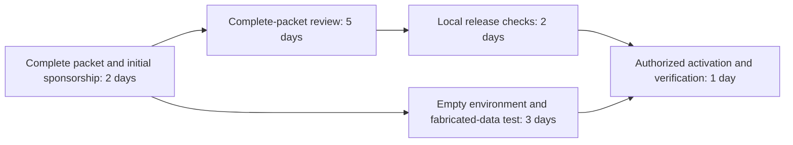

# Lookahead: The Student Who Could Have Started Two Weeks Earlier

**Detailed fictional onboarding case and simulation blueprint**\
**Prepared:** October 3, 2026\
**Expanded for clarity:** October 4, 2026
**Working product:** Lookahead\
**Hackathon connection:** Track 2 — AI-Powered Clinical Trials

> **Fictional demonstration.** Every institution, character, study, procedural requirement, processing time, dialogue, and numerical outcome in this scenario is invented. The timeline was constructed to illustrate a two-week improvement; it is not a measured product result, an account of a real person's onboarding, or a forecast for an actual lab.

## 1. The problem, in plain language

**The lab thought Alex's onboarding paperwork was ready because certificates had arrived. The reviewer needed proof that the right training was complete and that the requested access matched Alex's actual job. Those are different checks.**

Alex is a third-year data-science student joining an existing clinical research team for six weeks. The job is simple: read an approved extract of wearable and questionnaire data and flag missing records. Alex does not need participant names, contact details, or permission to change study records.

The lab submits two course certificates, a vague role description, and a reused request for full study-workspace access. The required human-subjects course is still partly incomplete. Nobody checks that exact requirement against the attached records before submission.

Three working days later, the fictional review office returns **Alex's personnel addition for correction**. It cannot confirm the required training or reconcile a narrow analysis job with broad access. The underlying trial remains approved; Alex's addition has not yet met this study's requirements.

A two-hour training task then becomes four working days of email, verification, PI confirmation, and resubmission. Once the complete packet is accepted and local clearance is finished, the lab discovers that the computer environment still needs three days of preparation.

Lookahead would have surfaced both problems on the first morning: finish and verify the outstanding requirement before submitting; describe the limited role accurately; prepare the empty environment while review proceeds. Under the stated assumptions, the student becomes ready on **October 19 instead of November 2—exactly two calendar weeks earlier**.

### The three mistakes a reader should remember

| What the team assumed | What was actually true in the fictional case | What checking earlier would change |
|---|---|---|
| “Alex sent certificates, so the training requirement is done.” | Two completed courses did not establish completion of the third required course. | Match each required course to its completion record before submission. |
| “Research assistant” and “full access” are sufficient descriptions. | Alex's narrow task did not require the broad access requested by the template. | State the actual duties and request the corresponding limited role. |
| “Everything involving the workspace must wait for clearance.” | Empty-environment setup was allowed earlier; production data activation had to wait. | Split the task and run permitted preparation during review. |

The first two mistakes are corrected together in **one** returned-packet cycle. They do not each generate a separate seven-day saving. The third mistake adds a separate three-day scheduling delay.

### What “rejected” means here

In casual conversation, Alex might say, “The IRB rejected my onboarding.” The precise scenario status is **“Personnel addition returned for revisions.”** The office needs a corrected submission before completing this personnel review. That distinction helps the student identify a fixable next action instead of interpreting the notice as rejection of the trial or of their ability to do research.

## 2. How to read this fictional example

The case illustrates a general coordination problem: receiving documents, verifying requirements, obtaining permission, and enabling access are distinct milestones. A team can complete one without completing the others.

The training-evidence mismatch, personnel-modification process, technical preparation queue, and six-week rotation are invented scenario inputs. They are not allegations about an actual student, institution, supervisor, or review office.

For a presentation, describe the demonstration accurately:

> “We built a fictional onboarding scenario to show how checking evidence and changing task order could reveal two weeks of avoidable delay under explicit assumptions.”

## 3. The fictional study and people

### Research setting

**Cedar Bay University** is conducting **REST-101**, an already-approved pilot clinical trial involving 40 adult volunteers. Participants are assigned to one of two sleep-coaching schedules and contribute wearable measurements and weekly questionnaires over eight weeks. These invented details provide an operational setting; the demonstration makes no claim about treatment effectiveness.

Alex joins the existing team to help with data-quality checks. Alex is not designing the trial, recruiting participants, obtaining consent, delivering the intervention, or making clinical decisions.

The first intended assignment is:

> Produce a supervised report identifying missing wearable files, inconsistent visit labels, and incomplete questionnaire records in the authorized study extract.

The extract contains participant codes and study measurements. Alex will not receive the identity-linking key. The fictional study nevertheless restricts access to individually authorized team members. Calling records “coded” does not itself establish that access is unrestricted.

### People and responsibilities

| Person | Fictional role | What they control |
|---|---|---|
| Alex | Third-year student, six-week rotation, 12 hours per week | Completing preparation, supplying evidence, attending orientation |
| Dr. Maya Chen | Principal investigator, or PI | Confirming responsibilities and authorizing the lab's submission |
| Jordan Ellis | Study coordinator and onboarding lead | Checking the packet, submitting the personnel change, tracking responses |
| Sam Rivera | Research computing administrator | Preparing the empty environment and activating the approved data-access role |
| Research review office | Personnel-modification intake and review | Reviewing the complete submission and issuing the recorded decision |
| Local data steward | Study data-release oversight | Confirming the decision, training, assigned role, and access scope |

The rotation begins **Monday, October 5, 2026** and ends at the start of **Monday, November 16**, giving six modeled workweeks. Alex can learn during onboarding; the simulation measures readiness for the assigned restricted-data task, not whether any useful work happens beforehand.

## 4. The invented rules behind the calculation

For this example, assume the fictional coordinator has confirmed these local requirements:

1. The personnel packet needs verified RCR, Privacy Awareness, and HS-02 completion records, a specific study-role description aligned with the requested access, an affiliation record, a data-handling acknowledgment, and PI confirmation. HS-02 is this fictional institution's Human Subjects Research — Student Data Analyst course.
2. This study requires a recorded personnel-modification decision before it releases data to Alex. Complete-packet review takes **five working days**, including normal intake.
3. An incomplete submission is returned after **three working days** of initial screening. Correcting the evidence and coordinating resubmission takes **four additional working days** in the baseline case.
4. After the decision, local release checks take **two working days**. Study-specific orientation and role documentation are completed within this stage in both versions.
5. Identity setup, MFA, package installation, and testing in a separate empty or fabricated-data environment take **three working days** of elapsed queue and setup time. They may begin before study-data authorization once initial sponsorship and request details are ready.
6. Final production-role activation and verification take **one working day**, after authorization, local release checks, and technical preparation are all complete.
7. The PI, coordinator, student, and computing administrator are available for the scheduled work. Resource conflicts would require recalculation.

**Calendar convention:** Working days are Monday through Friday, with no holiday closures in this illustrative institution. Dates mark start and completion boundaries: a two-working-day task starting Monday, October 5 finishes at the start of Wednesday, October 7. Actual institutional calendars may differ.

These are scenario parameters, not universal IRB requirements or promised processing times. UC San Diego's published FAQ, for example, lists amendment submission, appropriate training, role training, and updated team records as conditions for new key personnel to participate; it distinguishes those conditions from access to the IRB project record. A real deployment must use the applicable institution's rules. [UC San Diego IRB FAQs](https://irb.ucsd.edu/researchers/faqs.html)

A training-related return is a realistic type of administrative dependency: NIH's modification instructions state that missing or outdated required training in its system can cause a study-team modification to be returned. This supports the mechanism, not the fictional dates or policy. [NIH IRBO: Protocol Modifications](https://irbo.nih.gov/conducting-your-study/protocol-modifications/)

## 5. Version A: how an understandable mistake becomes a month of onboarding

### October 5: Alex thinks the documents are already enough

Alex starts the rotation expecting to help with the study's weekly data-quality report. The mentor says:

> “We want you to check which participant-days are missing wearable files and which weekly questionnaires haven't arrived. You will work with the coded analysis extract in our research environment.”

Alex sends two certificates with this message:

> “Here are my research-conduct and privacy certificates. I've also worked through most of the human-subjects course. Please let me know when I can enter the workspace.”

That email contains an important ambiguity. **“Most of the course” is not “course completed.”** In the invented course record, Alex has two remaining modules and the completion assessment, together expected to take about two hours. This is remaining work in a partly completed fictional course, not an estimate for completing an entire real training curriculum.

Jordan sees the two PDFs, adds them to the onboarding folder, and checks “Training certificates received.” Alex sees the checkmark and assumes the lab has verified everything required. Jordan assumes the attachments are the standard documents students usually send.

Nobody has behaved maliciously. The checklist has allowed three different things—receipt, relevance, and completion—to collapse into one green status.

### October 6: the packet acquires a second ambiguity

The team uses an old personnel-addition template. Its role field says:

> **Role:** Research assistant.\
> **Responsibilities:** Help with study data and other research tasks as needed.

The attached access request selects:

> **Requested role:** Study staff — full workspace read/write access.

In this fictional workspace, that role includes the participant contact/linkage area and editing privileges. Those are useful for some staff members, but Alex's assigned task needs only a read-only coded analysis extract.

The PI agrees Alex should join the team. The coordinator treats that agreement as sufficient to move the packet forward. Neither compares the generic form language with the particular access request.

### October 7: what the review office actually receives

| Packet item | Exact fictional contents | What it proves—and what it leaves unresolved |
|---|---|---|
| `Alex_RCR_Completion.pdf` | “Responsible Conduct of Research,” completed Sept 18 | Establishes that course's completion; does not establish HS-02 completion |
| `Alex_Privacy_Completion.pdf` | “Research Privacy Awareness,” completed Sept 22 | Establishes privacy-course completion; does not establish HS-02 completion |
| Human-subjects completion record | No completed record attached | Required HS-02 remains unsupported |
| Training field in the personnel form | “All required training complete: Yes” | An assertion inconsistent with the supplied evidence |
| Personnel role description | “Research assistant; help with study data and other tasks” | Does not specify Alex's limited responsibilities |
| Access request | “Study staff — full workspace read/write” | Requests a wider scope than the mentor's stated assignment needs |
| Affiliation and handling acknowledgment | Supplied and current | These parts of the fictional packet are complete |

The packet is submitted October 7. The team has a receipt. The problem is the packet's contents, rather than a failure to press Submit.

### Why the reviewer cannot clear this packet as written

Cedar Bay's invented local review process asks two practical questions about each new team member:

1. **Can the required preparation be verified?** The policy calls for HS-02, “Human Subjects Research — Student Data Analyst.” The two PDFs document other courses. The reviewer cannot turn those records into evidence of HS-02 completion simply because they are research-related certificates.
2. **Can the responsibilities and access be reconciled?** The application needs to establish what Alex will do and which study information the role requires. “Other tasks as needed” does not resolve whether Alex will contact participants, view the identity key, or edit records. The selected full-access role leaves that uncertainty material.

The fictional HS-02 requirement exists because Alex will handle restricted research information about participants. The invented curriculum covers responsibilities for permitted research use, handling participant information, and reporting a suspected disclosure. General research-conduct and privacy-awareness courses address related topics, but the fictional policy does not treat them as automatic substitutes.

The scope concern has a similarly concrete rationale: granting the generic role would expose information and privileges unrelated to Alex's assignment. The reviewer needs the PI to confirm a specific role and the packet to request a corresponding scope. This is a feature of this scenario's local process, not a claim that every IRB directly manages computer permissions.

### October 12: the fictional return notice

> **Study:** REST-101, personnel modification PM-014\
> **Status:** Returned for revisions — personnel addition incomplete\
> **Existing study status:** Approved; unchanged by this notice
>
> **1. Required training evidence:** The form states that all required training is complete. The attached records establish RCR and Privacy Awareness completion, but no record establishes HS-02 completion. Supply the applicable completion record, or provide an accepted-equivalency determination under the local training policy.
>
> **2. Role and access clarification:** Describe the proposed team member's actual duties. Confirm whether participant contact, identity-linking information, or record modification is required. Align the access request with the confirmed responsibilities.
>
> **Next action:** Correct these items, obtain PI confirmation of the revised role, and resubmit the personnel packet. Under this study's local rules, Alex's production data access remains pending until the personnel decision and release checks are complete.

In ordinary language, the reviewer is saying:

> **“We cannot verify the required training from these documents, and we cannot tell why this student needs the broad access requested. Give us the missing evidence and a clear, matching role description.”**

The reviewer is not asking the team to redesign the intervention, collect new efficacy evidence, or repeat the study's original approval. The unresolved item is the addition of one person under this fictional local process.

### The student's experience of the delay

Alex receives a short forwarded message: “IRB sent this back; we'll sort it out.” Without the full context, Alex does not know whether the study has been stopped, whether all training must be repeated, or whether they should keep waiting.

The confusion is operational. Alex needs a specific task—finish the remaining HS-02 work and supply the resulting record. Jordan needs a specific task—verify it and revise the role/access pair. The PI needs a specific confirmation. A broad “waiting for IRB” label hides those owners and actions.

### October 12–16: why two hours become four working days

| Date | What actually happens in the baseline | Why the packet still cannot move forward |
|---|---|---|
| Mon, Oct 12 | Jordan reads the notice, identifies HS-02 in the local matrix, and asks Alex about completion. Alex confirms the course is unfinished. | The exact deficiency is now understood, but evidence is still absent. |
| Tue, Oct 13 | Alex uses the next available block to finish the remaining modules and assessment, then sends the completion record. | Jordan still needs to verify the record and correct the role information. |
| Wed, Oct 14 | Jordan verifies the matching course and records the specific analysis duties. The access request changes to the limited analysis role. | The corrected personnel description needs PI confirmation. |
| Thu, Oct 15 | Dr. Chen confirms the revised duties and access scope in the available signoff slot. Jordan assembles the final response. | The team resubmits at its next scheduled processing point. |
| Fri, Oct 16 | Jordan resubmits the corrected packet at the start of the working day. | The complete-packet review can now proceed. |

October 12 to October 16 is four working days under the boundary convention. The table includes the completion event on October 16; it does not count five additional days.

The delay is the sum of real handoffs in the fictional schedule. Finishing a course does not automatically verify the evidence, edit the application, obtain confirmation, and resubmit it. Each of those actions needs an owner.

Both deficiencies are resolved in this single cycle. The model does not add another correction period for the access issue.

### October 16–23: the complete-packet review

The corrected submission now answers the two questions. Its role statement reads:

> “Alex will perform supervised data-quality checks on the approved coded analysis extract. Alex will identify missing files and inconsistent labels and submit a quality report to the mentor. Alex will not contact participants, obtain consent, access the identity-linking key, or modify source study records.”

Its access request reads:

> “Read-only access to the approved coded analysis extract in the lab-managed environment. No access to participant contact/linkage files or write access to source study records.”

The matching HS-02 completion record is attached and verified. The review office processes this complete packet in the assumed five working days, including its normal intake, and records acceptance on October 23.

The first incomplete submission's screening did not replace any part of this assumed five-day complete-packet service period. That is an explicit scheduling assumption behind the seven-day avoidable cycle, rather than a universal rule that every correction restarts an IRB clock.

### October 23–27: permission is established, but readiness is still incomplete

The local data steward confirms the recorded personnel decision, verified training, approved role, orientation record, and limited access request. These checks take the same two working days in both plans.

At October 27, the required authorization path is complete. Alex still has no working environment.

### October 27–30: why “approved” does not mean “able to start”

The old checklist reads:

> **After clearance:** arrange the account, workspace, packages, and data access.

Sam receives the first computing request October 27. Sam needs to prepare identity setup, MFA, the empty workspace, packages, and a test notebook. The queue and setup take three working days.

Jordan asks whether any of that could have been started sooner. Sam points to the supplied fictional Computing Policy §4.2:

> “A sponsored researcher may prepare a separate empty analysis environment and test it using fabricated records while study authorization is pending. Production study folders and the study-data role must remain unavailable until release conditions are confirmed.”

The team had turned an appropriate restriction on **data access** into an unnecessary restriction on **all preparation**.

### October 30–November 2: the final activation

Sam activates only the limited role that has been authorized. Alex and Sam confirm the coded extract is reachable, restricted areas remain unavailable, and the notebook runs in the correct environment. This final verification takes one working day.

**Alex becomes ready for the assigned task on November 2.** Four weeks of the six-week rotation have elapsed. Alex could learn and practice during that time, but had only two weeks left to do the actual authorized assignment.

## 6. What checking on day one would reveal

Lookahead needs the actual local requirements and workflow evidence. For the demonstration, all of the following inputs are fabricated:

| Input | Important information | Why the app needs it |
|---|---|---|
| Onboarding SOP v3 | Required documents, submission owner, confirmation steps | Defines the process rather than guessing it |
| Training matrix | RCR, Privacy Awareness, and HS-02 required for this role | Lets the app compare exact requirements with exact records |
| Two completed course records | RCR and Privacy Awareness course names and dates | Establishes only those completions |
| Personnel form draft | “All training complete: Yes”; generic duties | Reveals the unsupported status and ambiguous role |
| Access request and mentor task note | Full workspace requested; narrow analysis assignment intended | Makes the scope mismatch visible |
| Computing Policy §4.2 | Empty preparation may precede release; production access may not | Establishes which dependency can be changed |
| Rotation and availability plan | Six-week window and specific available work blocks | Determines whether an earlier correction is actually feasible |

### Check 1: match requirements to evidence, one by one

| Required evidence under fictional local policy | Evidence supplied at the start | Correct app status |
|---|---|---|
| RCR completion | Matching completed-course record | Satisfied after verification |
| Privacy Awareness completion | Matching completed-course record | Satisfied after verification |
| HS-02 completion | No completion record | Needs confirmation; not established |

The app should initially say:

> “The packet's 'all training complete' field is not supported by the records supplied. HS-02 has no matching completion record. Ask Alex or Jordan whether a completed or accepted equivalent record exists.”

This is the important evidence boundary: **no record supplied** does not, by itself, prove **training never completed**. Jordan's fictional follow-up establishes that Alex has about two hours left. The scenario then gains a concrete remedial task.

The early check is not “do more paperwork.” It is “complete this particular remaining work, generate this particular record, and have this particular person verify it before October 7.”

### Check 2: compare what the person will do with what the packet requests

| Field | Current draft | Clarified version |
|---|---|---|
| Duties | Help with study data and other tasks | Supervised missing-file, label, and questionnaire-completeness checks |
| Needed information | Not specified | Approved coded analysis extract |
| Participant contact or identity key | Unclear | Not part of the assignment |
| Source-record editing | Full read/write role requested | Not part of the assignment |
| Requested workspace role | Full study staff | Read-only analysis role scoped to the extract |

The finding is:

> “The access request is broader than the supplied task description supports. Confirm the intended duties with the PI and align both documents before submitting. The app proposes the limited role for confirmation; it does not authorize that role.”

This resolves a predictable reviewer question while the team is already preparing the packet. It shares the same preparation and correction windows as the training issue; its effect is not counted as a separate block of saved time.

### Check 3: split the overloaded access task

| Task inside the old 'Get access' item | Must wait for release in this scenario? | Correct prerequisite |
|---|---|---|
| Verify identity and arrange MFA | No | Initial sponsorship and accepted request |
| Create a separate empty environment | No | Initial sponsorship and accepted request |
| Install packages and test fabricated records | No | Empty environment available |
| Activate the production study-data role | Yes | Personnel decision, local release checks, and environment readiness |
| Verify actual scoped data access | Yes | Authorized activation |

The app now has two branches it can schedule accurately: a review/release branch and a technical-preparation branch. It does not move the production-data gate earlier by removing a requirement.

### Check 4: replace one confusing status with an answer

Instead of “Waiting for IRB,” the initial dashboard could read:

> **Current blocker:** The personnel packet does not yet establish HS-02 completion, and the role/access pair needs clarification.\
> **Next owner:** Alex completes the remaining work; Jordan verifies the record and updates the packet; Dr. Chen confirms the role.\
> **Useful parallel work:** Prepare the separately scoped empty environment once sponsorship and request details are ready.\
> **Later gate:** Production study data remains pending until the recorded decision and local release checks.

This is the kind of clarity the student lacked. It distinguishes an action the team can take now from a genuine external wait.

## 7. The personalized agents

### Research-administration reviewer

**Context:** Alex is a student joining an existing study for supervised data work.

**Example output:**

> “HS-02 evidence is unresolved. Do not model the packet as complete until Jordan verifies equivalent evidence or records completion. The role description should also specify that Alex will not recruit participants or access the identity key.”

The explanation should name the specific discrepancy: RCR and Privacy Awareness records are present, but HS-02 completion is not established. The reused full-access request also contradicts the limited assignment described by the mentor. These are the questions the fictional reviewer would ask of this packet.

The agent produces a requirement-to-evidence table, source references, missing items, and the person who can resolve them.

### Research computing and access reviewer

**Context:** Alex needs an analysis environment and a limited study-data role.

**Example output:**

> “Identity setup, MFA, package installation, and fabricated-data testing can proceed under Computing Policy §4.2. Production access remains dependent on the recorded release conditions.”

The agent separates preparation from activation and identifies the source supporting each dependency.

### Onboarding coordinator

**Context:** Alex has a six-week rotation, limited weekly hours, and known coordinator and PI work blocks.

**Example output:**

> “Reserve training and verification during the first two working days. Submit the complete packet October 7. Open the empty-environment request that day. Prepare the first-task checklist while review is pending.”

The agent proposes owners, handoffs, and useful work Alex can perform immediately. A schedule calculation determines the dates.

### Optional IRB-style ethics perspective

The broader product can include an ethics-review persona that asks whether access matches Alex's duties, whether the documented use is permitted, and whether unnecessary participant information is exposed.

For this onboarding case, its useful output is an evidence-linked concern or a review question. A simulated opinion cannot establish actual approval. The central demonstration should be the consequences of unresolved requirements and task sequencing.

## 8. Version B: the same people, with a clear plan from the beginning

### October 5: discover the problem while there is still time to fix it

The day-one rehearsal finds the unsupported training field and the mismatch between Alex's job and the access template. Jordan confirms that HS-02 is unfinished and that the proposed work is limited data-quality analysis.

Known available slots make the plan feasible:

| Available slot in the fictional calendar | Work scheduled with foresight | Approximate active effort |
|---|---|---:|
| Monday, Oct 5, student preparation block | Finish the remaining HS-02 modules/assessment and supply the resulting record | 2 hours |
| Tuesday, Oct 6, coordinator review slot | Verify evidence, write the specific duties, align the access request | 30 minutes |
| Tuesday, Oct 6, PI confirmation slot | Confirm the limited role and revised request | 15 minutes |
| Wednesday, Oct 7, submission point | Submit the complete packet and record its receipt | 15 minutes of coordinator effort |

These are available work blocks in the fixture, not appointments the AI can magically create. The baseline uses the same initial window for collecting files and a generic role confirmation, but fails to use it for checking the exact requirement and scope. If those slots were unavailable or the outstanding course work took longer, the app would need to move the forecast.

### October 6: the student gets a precise answer

Instead of “Wait until the IRB lets you in,” Jordan can tell Alex:

> “Your RCR and privacy records are verified. Your HS-02 record is now complete and verified too. Your assigned role is read-only analysis of the coded extract. The PI has confirmed that scope. We will submit tomorrow. Your real data access stays pending, but we can prepare the separate empty environment during review.”

Alex knows what has been finished, what remains external, and what work is available meanwhile.

### October 7: submit a packet the reviewer can understand

The complete submission contains the matching records, the precise role description, and the limited access request. It addresses the two concrete questions that caused the original return.

This does not promise approval of every corrected real submission. It means the configured reasons for a return are removed in this fictional comparison. The model assumes no further deficiencies appear and applies the same five-day complete-packet service duration.

The computing preparation request also begins October 7, once sponsorship and request details are ready. It clearly requests an empty environment for fabricated-data testing, with production study access still disabled.

### October 7–14: two independent branches progress

**Review branch:** The office reviews the complete personnel packet from October 7 to October 14.

**Preparation branch:** Sam handles identity setup, MFA, empty-environment preparation, packages, and testing from October 7 to October 12. Alex practices on fabricated records once that environment is ready.

The review is still pending when technical preparation finishes. That is an expected, valid state. The empty environment is ready; production study data is not yet accessible.

### October 14–16: perform the same release checks

The recorded personnel decision arrives October 14 under the assumptions. The data steward performs the same two-day role, evidence, orientation, and release checks.

The prepared plan saves no time by omitting these checks. It simply reaches them with a complete packet earlier and an already-prepared environment.

### October 16–19: activate the confirmed role

The review/release branch finishes October 16. The environment branch finished October 12. Because both are ready, the same one-day activation and scoped-access test can begin October 16.

**Alex becomes ready October 19, with four weeks left in the rotation.** The original plan reaches exactly the same readiness milestone November 2, with two weeks left.

### What foresight changed, concretely

The student did the remaining training sooner. The coordinator verified the right record sooner. The PI confirmed a specific role sooner. The reviewer received a complete, coherent packet sooner. The computing administrator prepared permitted infrastructure while review was happening.

The amount of required training, the assumed complete-packet review duration, the local checks, and the final verification remained the same. The avoided work was the late discovery and repeated handoff cycle; the overlapped work was technical preparation.

## 9. The exact two-week comparison

| Stage | Original sequence | Prepared sequence | Reason for the change |
|---|---|---|---|
| Initial preparation | Oct 5 → Oct 7 | Oct 5 → Oct 7 | Same window; exact requirements verified earlier |
| Incomplete-packet screening | Oct 7 → Oct 12 | Avoided in this scenario | Complete evidence supplied initially |
| Correction and resubmission | Oct 12 → Oct 16 | Avoided as a later cycle | Work coordinated within initial preparation |
| Complete-packet review | Oct 16 → Oct 23 | Oct 7 → Oct 14 | Same five-day duration |
| Local release checks | Oct 23 → Oct 27 | Oct 14 → Oct 16 | Same two-day duration |
| Empty-environment preparation | Oct 27 → Oct 30 | Oct 7 → Oct 12 | Same three days, now in parallel |
| Final activation and test | Oct 30 → Nov 2 | Oct 16 → Oct 19 | Same one-day duration |
| **Ready for assigned data task** | **Nov 2** | **Oct 19** | **14 calendar days earlier** |

### Arithmetic without double-counting

```text
Original elapsed working days:
  2 preparation
+ 3 incomplete-packet screening
+ 4 correction and resubmission
+ 5 complete-packet review
+ 2 local release checks
+ 3 empty-environment preparation
+ 1 final activation
= 20 working days

Prepared elapsed working days:
  2 complete preparation
+ max(5 review + 2 local checks, 3 environment preparation)
+ 1 final activation
= 2 + max(7, 3) + 1
= 10 working days

Difference = 10 working days
November 2 minus October 19 = 14 calendar days
```

The three environment-preparation days still happen. They stop extending the end date because they fit inside the seven-day review-and-release interval.

| Intervention | Working days recovered in this fixture |
|---|---:|
| Catch the packet issue before the first submission | 7 |
| Prepare the empty environment in parallel | 3 |
| **Combined gain** | **10** |

The complete-packet review takes five days in both paths. The gain comes from readiness and sequencing.

### Where the two weeks actually go

Think of the original plan as two avoidable loops around an otherwise unchanged process:

```text
LOOP 1 — Discovering the packet problem too late
Files received → assumed complete → submitted incomplete
→ 3 working days until return
→ 4 working days of correction and handoffs
→ complete submission finally ready

LOOP 2 — Discovering the technical task too late
Clearance completed → first environment request
→ 3 working days of preparation
→ final activation can finally begin
```

The day-one check moves the necessary course completion and role clarification into the existing preparation window, removing the seven-day late-discovery/correction loop. Splitting the access task places the three-day empty-environment branch inside time already spent on review and release checks.

The prepared plan's dependency structure is:



The environment branch finishes at working-day boundary 5. The review-and-release branch finishes at boundary 9. Activation waits for both, so readiness is boundary 10. The shorter branch creates no additional end-date delay.

## 10. Why two weeks matters to this student

The rotation has 30 modeled working days. Readiness at working-day boundary 20 leaves 10 working days for the assigned data task. Readiness at boundary 10 leaves 20.

At 12 scheduled research hours per week:

| Measure | Original | Prepared |
|---|---:|---:|
| Weeks remaining after readiness | 2 | 4 |
| Scheduled hours remaining after readiness | 24 | 48 |
| Additional opportunity for authorized data work | — | 24 hours |

The remaining opportunity for the primary assignment doubles in this fictional rotation. This does not establish that output doubles or that earlier time was wasted; Alex can learn methods and practice with fabricated data in both paths.

The extra time could permit an initial quality report, mentor feedback, revisions, and a documented handoff. The original plan might allow only an initial attempt and limited revision. These are plausible downstream possibilities, not modeled scientific results.

**Optional financial illustration:** At an invented rate of $25 per hour, the 24 additional hours available for the primary task represent $600 of scheduled student time. This is an allocation-of-time illustration, not a $600 payroll saving, recovered grant money, or verified economic benefit. The student may be paid and doing useful preparation in both versions.

## 11. Why use a simulation instead of just a checklist?

A checklist could identify missing training and suggest earlier preparation. That is valuable and is an appropriate baseline against which to evaluate the product.

The simulation adds a linked calculation: **when a requirement changes, which tasks move, which can proceed, and when does the student become ready?** It compares alternative plans with assumptions visible.

Each task should carry:

- A unique ID, description, and responsible person or office.
- A source establishing the requirement or permitted action.
- Evidence status: unknown, supplied, verified, or completed.
- Prerequisite task IDs.
- Elapsed working-day duration and its basis: supplied estimate, observed history, or demo assumption.
- Calendar availability and resource constraints.
- Whether it can occur before study-data authorization.
- The evidence required to confirm real completion.

For an ordinary task:

```text
earliest_start(task) = latest finish among its prerequisites
earliest_finish(task) = earliest_start(task) + working-day duration
```

A working implementation must also respect calendars and owner availability. This simplified fixture assumes availability and incorporates elapsed queues in the stated durations.

Final activation depends on both branches: authorization and environment readiness. Forecast dates remain separate from actual decision records.

Language models can interpret documents, propose dependency links, and explain discrepancies. Confirmed task data drives the scheduling calculation. This is a conditional what-if comparison; it does not require invented probabilities or a prediction of how real IRB members will vote.

## 12. Cases where the answer changes

The demo should not always return the same impressive number.

| Changed assumption | Original duration | Prepared duration | Gain | Meaning |
|---|---:|---:|---:|---|
| Main case | 20 working days | 10 working days | 10 days | Both interventions help |
| Packet was actually complete initially | 13 | 10 | 3 days | Only parallel preparation helps |
| Early environment preparation is prohibited | 20 | 13 | 7 days | Only submission preflight helps |
| Packet complete; early preparation prohibited | 13 | 13 | 0 days | These interventions add no timing benefit |
| Complete review takes 10 days in both paths | 25 | 15 | 10 days | Readiness moves later; avoidable sequence still differs |
| Review system closed until working-day boundary 15 | 26 | 23 | 3 days | Fixed reopening absorbs earlier-submission advantage |

In the outage variant, both complete packets are ready before the same reopening date. Both then need five days of review and two days of local checks. The baseline adds three days of late environment preparation; the improved plan has completed it already. Only those three days are recovered.

That variant illustrates an external system constraint. The calculation remains fictional, and changing a plan cannot remove a fixed shutdown.

If processing times are unknown, offer named scenarios such as “review takes 5 days” and “review takes 10 days.” Probability distributions require a separate evidentiary basis. Arbitrary ranges should not be labeled confidence intervals.

## 13. Website demonstration: five screens

### Screen 1 — My starting point

> **Alex · Student researcher · Onboarding**\
> Joining REST-101 for supervised data-quality work.\
> Rotation: Oct 5–Nov 16. Availability: 12 hours/week.\
> Desired milestone: first authorized data task.

The profile establishes the user's actual stage and makes the goal concrete.

### Screen 2 — Evidence and readiness

| Requirement | Evidence | Starting status |
|---|---|---|
| Training HS-02 | No matching record supplied | Needs verification |
| Role description | Draft attached | Needs coordinator confirmation |
| PI confirmation | Not yet recorded | Pending |
| Empty-environment sponsorship | Can be arranged during preparation | Available next action |
| Production authorization | No completed decision or release record | Pending |

Each finding links to its fictional source. A human can correct the extraction before running the scenario.

### Screen 3 — Simulate the current plan

Show the returned-packet branch and late technical preparation as configured scenario assumptions, not certain future events.

> **Scenario readiness: November 2**\
> 20 working days from onboarding start.\
> Inspect unresolved training evidence and technical preparation scheduled after release.

### Screen 4 — Compare the prepared plan

Enable two interventions: resolve the evidence before submission, and prepare the empty environment during review.

> **Scenario readiness: October 19**\
> 10 working days from onboarding start.\
> **14 calendar days earlier under these assumptions.**

Show the same five-day review bar in both plans so the source of the gain is immediately clear.

### Screen 5 — Export the next actions

| Action | Owner | Prepared-plan target | Completion evidence |
|---|---|---|---|
| Resolve HS-02 | Alex and Jordan | Before Oct 7 submission | Verified training record |
| Confirm role and scope | Jordan and Dr. Chen | Before Oct 7 submission | Confirmed role description |
| Submit complete packet | Jordan | Oct 7 | Submission receipt |
| Request empty-environment preparation | Jordan and Sam | Oct 7 | Accepted, appropriately scoped request |
| Finish fabricated-data test | Sam and Alex | Oct 12 | Recorded test result |
| Finish local release checks | Data steward | Oct 16 | Release and role records |
| Activate and test production role | Sam and Alex | Oct 19 | Successful scoped access test |

The export makes the scenario actionable. It does not itself submit amendments, contact colleagues, or grant permissions.

## 14. A fictional agent exchange

**Administration reviewer:** “The form says all training is complete. Your records establish RCR and Privacy Awareness completion, but neither establishes HS-02. The review office would need that missing evidence.”

**Alex:** “I thought sending my certificates meant I was done.”

**Onboarding coordinator:** “Let's verify that now. If you already completed HS-02, we need the right record. If it is unfinished, we need the remaining task. In this scenario, you have two hours left and an available preparation block today.”

**Alex:** “I thought the 'certificates received' checkmark meant somebody had checked the requirement.”

**Administration reviewer:** “That is the mismatch. Receipt confirms that files arrived. Verification confirms that the files establish the particular requirement. Those should have separate statuses.”

**Access reviewer:** “There is also a scope mismatch. Your task is read-only analysis of the coded extract, but the template requests full study-workspace access. Jordan and the PI need to confirm the duties and correct both documents.”

**Alex:** “Would that stop the entire trial?”

**Administration reviewer:** “The scenario models a return of your personnel addition for correction. The existing trial stays approved. The next action is to resolve these specific items and resubmit, rather than redesign the study.”

**Computing reviewer:** “The empty environment can also be prepared before production data access is allowed.”

**Alex:** “So I can test the notebook while the personnel submission is being reviewed?”

**Computing reviewer:** “Yes, using the fabricated-data environment permitted by this scenario's policy. Study data remains behind the release gate.”

**Scheduler:** “These changes move readiness from November 2 to October 19. Seven working days come from avoiding the return-and-resubmission cycle; three come from overlapping technical preparation.”

**Alex:** “That gives me four weeks for the assignment instead of two.”

This dialogue is invented. Generated explanations should remain distinguishable from actual institutional messages.

## 15. Pitch material

### Thirty-second pitch

> “Our starting point was a familiar research experience: you've sent your documents, but you still don't know when you can begin. Lookahead rehearses onboarding using your role, study requirements, and the tasks behind access. In our fictional demo, a student waits four weeks because of a returned packet and technical setup started too late. Catching the missing requirement and preparing the empty workspace during review makes them ready two weeks earlier, with the same review duration. They can see exactly which actions change the timeline.”

### Demonstration boundary

The fictional comparison explains a scheduling mechanism. It does not establish that a real institution made an error, that an actual student lacked training, or that the product has saved two weeks in practice.

### Product sentence

> **“Lookahead lets research teams rehearse their next steps, see what could delay them, and prepare the work that can happen now.”**

For Track 2, connect the example to an existing trial team: bringing an analyst, coordinator, or site staff member into an authorized role is part of study operations. This is one narrow operational workflow. Claims about trial launch, enrollment, amendments, monitoring, or clinical outcomes need their own models and evidence.

## 16. What a hackathon demo should establish

1. The system distinguishes a received document from evidence matching a requirement.
2. Findings point to supplied source passages.
3. Empty-environment preparation moves earlier only when the policy allows it.
4. The schedule reproduces 20 and 10 working days under the declared calendar.
5. Changing assumptions changes the gain to 3, 7, or 0 days where appropriate.
6. Production activation never precedes its prerequisites.
7. The output identifies a next action, owner, dependency, and completion evidence.

Those checks establish coherent demonstration behavior. Real-world value would require prospective onboarding cases, coordinator review of inferred requirements, and comparison against ordinary checklists or existing workflows. The two-week result here is illustrative.

## 17. Jargon for a new collaborator or AI

| Term | Meaning in this case |
|---|---|
| IRB | Institutional Review Board; its actual decisions are external to the simulation |
| PI | Principal investigator responsible for the study and role assignment |
| Personnel modification | The fictional institution's process for adding Alex to the existing team |
| Intake or screening | Initial examination for completeness and administrative issues |
| Deficiency notice | Request to supply or correct information; not automatically rejection of the research |
| Human-subjects training | Role-appropriate training under the applicable rules |
| HS-02 | Invented local code for this case's Human Subjects Research — Student Data Analyst course; it is not a universal regulatory course identifier |
| Returned for revisions | This fictional packet needs corrections before the personnel review can be completed; the existing study approval is unchanged |
| RCR | Responsible Conduct of Research; not automatically interchangeable with every human-subjects requirement |
| SOP | Standard operating procedure describing a repeatable process |
| Role or delegation record | Documentation of assigned responsibilities |
| Local release check | The invented study's confirmation before data access is enabled |
| Provisioning | Preparing an account, environment, or role; preparation and activation are distinct here |
| MFA | Multifactor authentication |
| Coded records | Records labeled with participant codes; access restrictions still depend on applicable conditions |
| Fabricated-data environment | Workspace with entirely invented records for practice |
| Dependency | A prerequisite relationship between tasks |
| Parallel work | Tasks progressing during the same interval without waiting for one another |
| Critical path | The dependency chain determining earliest completion under the current assumptions |
| Elapsed time | Time between milestones, including waits and handoffs |
| Active effort | Time actually spent doing a task; it can be much shorter than elapsed time |
| Counterfactual | Comparison with a different plan while holding other assumptions fixed |
| Deterministic scenario | Calculation using specified values without probabilities |
| Readiness milestone | The point when Alex is authorized, technically enabled, and oriented for the assignment |
| Evidence provenance | Where a requirement or status came from, including source and date |

## 18. Handoff notes

This document is a proposed narrative, a specified scheduling example, and a demonstration blueprint. It does not establish that the current frontend implements agents, scheduling, source extraction, or access checks.

The central opportunity is to turn vague states such as “waiting for approval” into a source-linked dependency model, then let the user change a plan and see the consequences. The key editable assumptions are training-evidence status, permission for early technical preparation, review duration, and any fixed institutional reopening date.

Related public guides:

- [Lookahead simulation workspace](docs/microfish-workspace.md)
- [Research tools and data flow](docs/research-workspace.md)

When evaluating this case, challenge the dependency assumptions, identify where a checklist would suffice, and assess whether the simulation adds useful insight. Preserve the fictional label and distinguish the constructed two-week outcome from measured performance.
